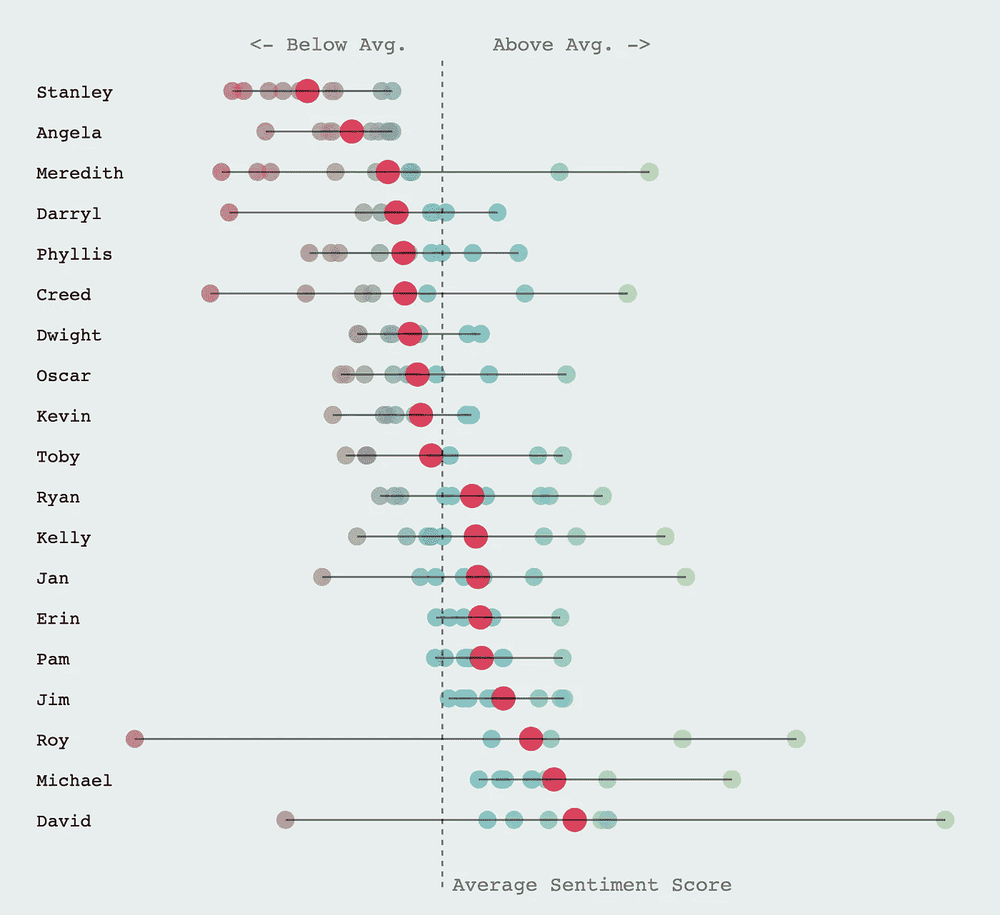
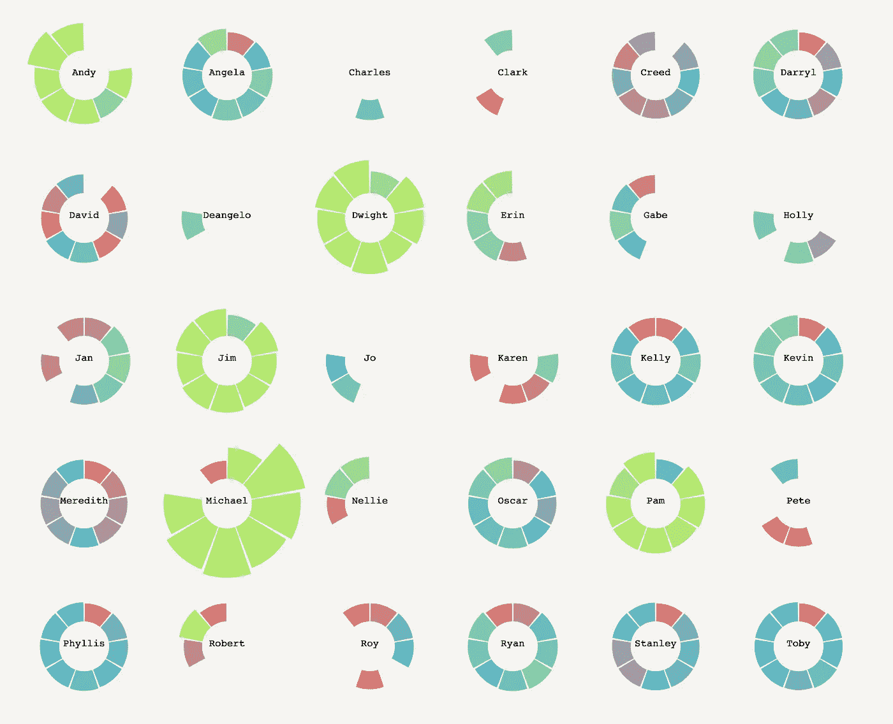
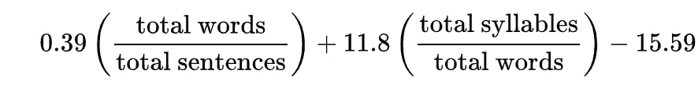

# 使用 D3 . js——数据处理，为“办公室”创建交互式数据可视化

> 原文：<https://towardsdatascience.com/creating-an-interactive-data-visualisation-for-the-office-using-d3-js-part-1-894df7f01730?source=collection_archive---------27----------------------->

## 为创建交互式可视化准备数据

[](https://cuthchow.github.io/the-office-visualisation/) [## 办公室:数据故事

### 编辑描述

cuthchow.github.io](https://cuthchow.github.io/the-office-visualisation/) 

我为这个项目创作的一个视觉效果是，一季一季地描绘剧中每个主要角色的情绪得分。



我一直认为，最酷的数据可视化是那些你可以与之互动和玩耍的数据，因为它们给你自己探索数据的自由，并从你自己的角度理解它。我还发现，我在网上看到的许多符合这一描述的可视化是在 D3.js 的帮助下创建的，D3 . js 是由 Mike Bostock 创建的 Javascript 库，其特定意图是为 web 创建高度可定制和交互式的可视化。

因此，我决定学习 D3.js，以便创造我自己的观想。由于我非常支持基于项目的学习，以便更快更深刻地理解一个主题，我决定将电视节目《办公室》中的所有台词可视化，这实际上结合了我最大的两个兴趣。我在这里的目标是记录整个过程，并分享我在这个过程中学到的一些东西，希望也能帮助任何试图学习 D3.js 的人。

# 数据处理

这第一篇文章将关注我在创建实际可视化之前所做的数据预处理。我做的所有预处理都是在 Jupyter 笔记本中使用 Python 和 Pandas 完成的，还有一些其他用于特定任务(如情感分析)的库。

我开始使用的数据集包含了《办公室》中每一句台词的信息，以及关于季节、剧集、场景、演讲者以及场景是否被删除的信息。

我从一开始就知道我想在我的观想中包含以下信息:

*   口语线长度
*   台词的感悟
*   文本的词汇复杂性

为了得到每一行的长度，我简单地取了 line_text 列，在每个空格处将字符串分成一个列表，并计算结果数组的长度。

```
import pandas as pddf = pd.read_csv('the-office-lines.csv')
df['word_count'] = df['line_text'].apply(lambda x: len(x.split(' ')))
```

为了获得每行的情感，我不得不利用自然处理库“NLTK”，它有几个预先训练好的模型，适合分析情感的任务。(对于未来的项目，我的目标是使用“The Office”语料库从头构建一个语言模型，以生成更准确的情感分数，但由于这个项目是关于数据可视化的，我满足于使用 NLTK 的内置模型。)NLTK 提供了 [VADER 情绪分析器](https://www.nltk.org/_modules/nltk/sentiment/vader.html)供我们使用，它提供了一个从-1 到 1 的复合情绪分数，其中-1 表示绝对负面，1 表示绝对正面。

```
from nltk.sentiment.vader import SentimentIntensityAnalyzer
sid = SentimentIntensityAnalyzer()df['sentiment'] = df['line_text'].apply(lambda x: sid.polarity_score(x)[0]#The 0th element of the polarity scores gives us the compound score, whereas the 1st, 2nd and 3rd element return the negative, neutral and positive scores respectively 
```

最后，我想分析每一句口语的词汇复杂性。谢天谢地，这种测试已经存在了。我选定的一个是 Flesch-Kincaid 可读性测试，它基本上返回可读性或等级分数，对应于大致的学校等级难度。分数是基于每个单词的平均音节数和每个句子的平均单词数，所以这是一个相当初级的工具。



弗莱施-金凯试验

由于它的简单性，它使得实现起来相当简单。然而，应该注意的是，这个测试是针对书面语言的，而电视节目的台词是针对口语的。

此外，我意识到对每一行都进行测试并不是最好的方法，因为测试在更大的文本上效果更好。因此，我为每个关键人物创建了一个单独的语料库，然后对每个单独的语料库应用测试，以确保返回的分数尽可能准确。

创建单独的搜索集:

```
df = df.groupby('speaker').count().reset_index()
chars = list(df[df['scene'] > 100].speaker)#chars is the list of characters with over 100 scenes, as I wanted to remove the characters with only a handful of appearances from the dataset char_corpi = dict()for char in chars: 
    corpus = []
    for row in df[df.speaker == char]['line_text']:
        corpus.append(row)
    corpus = ' '.join(corpus)
    char_corpi[char] = corpus#char_corpi is a dictionary of corpuses, where the key is each character, and the value is a string of all their lines in the show.
```

创建和应用 Flesch-Kincaid 测试:

```
import re def flesch_kincaid_grade(corpus):
    words = len(corpus.split(' '))
    sents = len(re.split('! |? |. ', corpus))
    check = lambda x: 1 if x in 'aeiouyAEIOUY' else 0
    sylls = sum(list(map(check, corpus)))
    score = 206.835 - 1.015 * (words/sents) - 84.6 * (sylls/words)
    return score kincaid_scores = []for char in char_corpi:
    score = flesch_kincaid_grade(char_corpi[char])
    kincaid_scores.append({'speaker': char, 'score': score})df = pd.toDataframe(kincaid_scores)
df.to_csv('kincaid_score.csv', index = False)## This is the new set of data which I will use directly in the visualisation
```

# 结论

这就是我为这个项目做的所有数据预处理。相当简单，对吗？