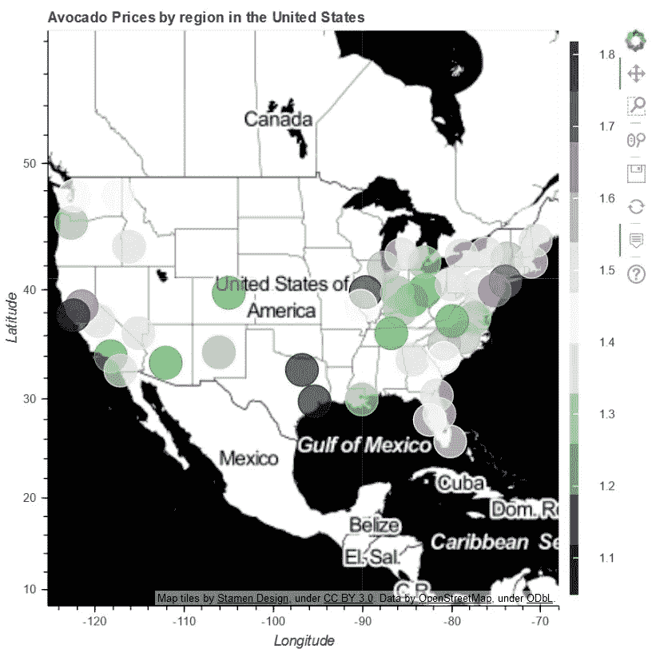
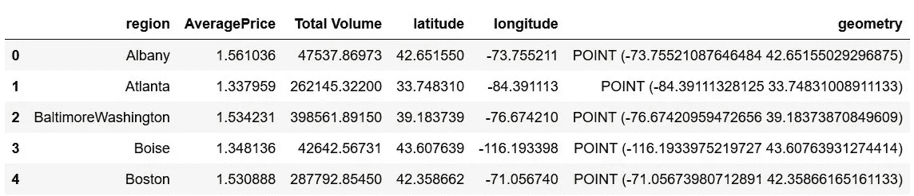
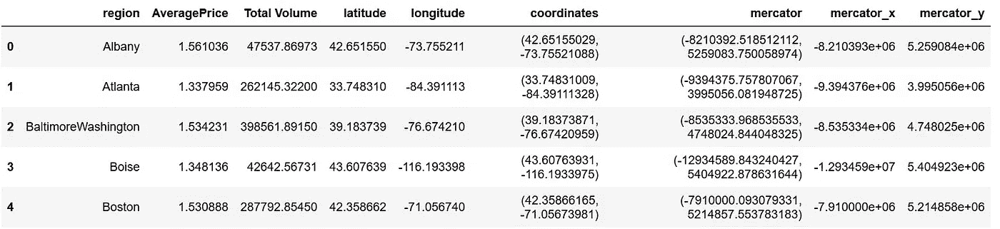
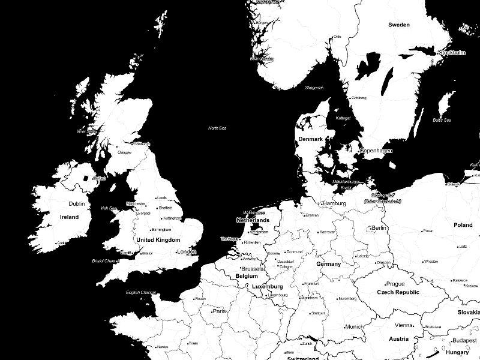

# 使用散景和熊猫在 Python 中创建交互式地图

> 原文：<https://towardsdatascience.com/creating-an-interactive-map-in-python-using-bokeh-and-pandas-f84414536a06?source=collection_archive---------17----------------------->

## 使用 Python 来(相对)容易地创建一个交互式热图，按位置显示鳄梨价格。



作者图片——跟随这篇博文，自己制作。互动版[这里](https://www.craigdoesdata.de/blog/avocadobokeh.html)。

*这篇文章可以看作是我之前处理鳄梨价格数据的文章的延伸(我能说什么呢，我爱鳄梨！)你可以在这里找到*[](/mapping-avocado-prices-in-python-with-geopandas-geopy-and-matplotlib-c7e0ef08bc26)**。推荐去看看！**

*作为数据分析师/数据科学家/其他数据操纵者，我们经常发现自己使用可视化来有效地向他人传达我们的发现(并让自己更好地理解它们)。如果使用得当，可视化有很多优势——它们可以总结数据、显示时间趋势、显示地理数据等等。*

*有时静态的可视化是完美的，但在其他情况下，创建一些交互的东西会更清晰，对最终用户更有用，或者更酷更有趣！*

*在本文中，我们将介绍创建显示美国鳄梨价格的交互式热图的过程，该热图可以在任何现代 web 浏览器中轻松查看和操作。我们将使用 Python 来完成，主要使用[散景](https://docs.bokeh.org/en/latest/index.html)和[熊猫](https://pandas.pydata.org/) [数据帧](https://pandas.pydata.org/pandas-docs/stable/reference/api/pandas.DataFrame.html)。*

*在看到[纳丁·阿梅西-博尔顿](https://github.com/nadinezab)的优秀项目[“预测国王郡的房价”](https://github.com/nadinezab/kc-house-prices-prediction)后，我受到启发开始使用散景，该项目非常有效地使用了散景。我建议把整本笔记本都看看——里面有一些非常有趣的东西。*

# *入门指南*

*首先，我们需要一些 Python [dict](https://www.w3schools.com/python/python_dictionaries.asp) 形式的地理数据、熊猫数据帧或熊猫 [GroupBy](https://pandas.pydata.org/pandas-docs/stable/reference/api/pandas.DataFrame.groupby.html) 对象。方便的是，我碰巧有一个旧的数据框架，我将在这篇文章中使用它。我在我的[上一篇文章](/mapping-avocado-prices-in-python-with-geopandas-geopy-and-matplotlib-c7e0ef08bc26)中生成了这个文件，并使用 [pd.to_csv()](https://pandas.pydata.org/pandas-docs/stable/reference/api/pandas.DataFrame.to_csv.html) 将其导出。如果您对我为达到这一点所做的数据争论感兴趣，请查看一下。*

*这篇文章的所有代码都可以在[这个 GitHub repo](https://github.com/thecraigd/BokehAvocado) 中找到，如果你想在不安装任何东西的情况下进行编码，那么使用[活页夹](https://mybinder.org/) [查看这里](https://mybinder.org/v2/gh/thecraigd/BokehAvocado/master)。如果你只是想边看边读，我推荐你使用 [Jupyter 笔记本浏览器](https://nbviewer.jupyter.org/)。*

# *为什么要用散景？*

*Bokeh 可以帮助你简单方便地制作好看且有用的交互式可视化效果，然后可以在所有现代浏览器中显示。这意味着你可以在一篇博客文章、一个内部仪表板或者任何你可以查看 HTML 的地方嵌入一些好的有用的东西。几乎每个人都有使用浏览器的经验，这对于让你的视觉呈现在观众面前非常有用。*

*我的目的的主要卖点是交互性。在我们的[示例](http://www.craigdoesdata.de/blog/avocadobokeh.html)中，我们今天使用的是地理地图，因此允许用户随意放大和缩小以查看我们的数据点的物理分布，以及当用户悬停在某个点上时选择突出显示哪些数据的能力，让我们创建了一个直观的可视化，我们的观众可以按照自己的节奏进行交互和操作。这反过来会让他们更容易将我们的发现[应用到](/how-to-work-with-stakeholders-as-a-data-scientist-13a1769c8152)身上，这对任何数据专业人士来说都是一个优势！*

*如果您有一个工作的 Python 设置，在您的系统上安装散景相对简单。我自己正在使用 Anaconda 生态系统，所以只需要一个简单的`conda install bokeh`就可以了。如果你喜欢 pip，那么`pip install bokeh`也可以。更多信息可以在他们的[快速入门指南](https://docs.bokeh.org/en/latest/docs/user_guide/quickstart.html#userguide-quickstart)中找到。*

# *它是如何工作的？*

*散景是建立在四个主要概念上的:地块、字形、引导线和注释以及范围。为了获得完整的信息，我强烈推荐阅读[文档](https://docs.bokeh.org/en/latest/index.html)(总是[阅读文档](https://danieldonbavand.com/documentationisimportant/)！)，但是我会在这里提供一个非常简短的说明。*

*   *剧情。这是您将在输出中看到的所有内容的容器。您将创建一个呈现给用户的图形。任何使用过 [Matplotlib](https://matplotlib.org/) 或 [Seaborn](https://seaborn.pydata.org/) 或 Python 中其他可视化库的人都会熟悉这个想法。*
*   *象形文字。这就是散景如何显示你的观想。这些可以简单到一条线或一个圆，也可以复杂到像一个多边形，图像 url(很适合在 viz 上使用你的 logo！)或者文字。*
*   *参考线和注释。引导线是像轴、网格线等帮助用户理解比例和进行比较的东西。注释是像标题、图例等东西，它们提供额外的信息来帮助用户理解可视化。*
*   *范围。这是数据的范围。你会注意到，如果你点击我的可视化，默认情况下，它会打开所有可见的数据点，以美国为中心(我所有的数据都来自那里)。如果你愿意，这可以在创建可视化时修改。*

# *事实真相*

*好了，言归正传。*

*首先，我们想要导入我们的库。Bokeh 与您可能熟悉的其他 Python 可视化库(如 [Matplotlib](https://matplotlib.org/) 或 [Seaborn](https://seaborn.pydata.org/) )略有不同，因为它被排列为许多不同的子模块，您可以从中导入您需要的函数。它没有一个可以导入来访问所有功能的包罗万象的包。*

*这确实使了解它变得有点困难，但是您可以遵循下面的代码。习惯了就不太恐怖了！*

```
*from bokeh.io import output_notebook, show, output_file
from bokeh.plotting import figure, ColumnDataSource
from bokeh.tile_providers import get_provider, Vendors
from bokeh.palettes import PRGn, RdYlGn
from bokeh.transform import linear_cmap,factor_cmap
from bokeh.layouts import row, column
from bokeh.models import GeoJSONDataSource, LinearColorMapper, ColorBar, NumeralTickFormatterimport numpy as np
import pandas as pd*
```

*好了，现在我们准备开始了。首先，我们需要一些数据。我们将使用我们的 CSV 文件，我们可以使用 [pd.read_csv()](https://pandas.pydata.org/pandas-docs/stable/reference/api/pandas.read_csv.html) 将它作为数据帧读入 pandas:*

```
*import pandas as pddf = pd.read_csv('avocado_df.csv', index_col=0)display(df.head())*
```

*这为我们提供了以下输出:*

**

*出于他们自己最了解的原因，散景图使用[墨卡托坐标](https://en.wikipedia.org/wiki/Universal_Transverse_Mercator_coordinate_system)。我们的位置以经度和纬度列出。这意味着我们需要将纬度和经度转换成墨卡托坐标。*

*参与编程和数据分析这样一项有趣而富有挑战性的活动的一大好处是，对于你遇到的大多数困难问题，其他一些聪明人可能以前也遇到过。为了取得进步和提高你的技能，你还需要发展[有效谷歌](https://knightlab.northwestern.edu/2014/03/13/googling-for-code-solutions-can-be-tricky-heres-how-to-get-started/)的技能，找到那些聪明人在你之前找到的答案！*

*在我们的例子中，我们的开拓者 [Nadine Amersi-Bolton](https://github.com/nadinezab) 已经解决了这个问题，并为我们创建了一个函数来完成这个转换。这非常好，所以我们将[更聪明地](https://www.lifehack.org/articles/work/dont-work-harder-work-smarter-with-these-12-tips.html)工作，而不是更努力地使用这个现有的解决方案。谢谢纳丁。*

```
*# Define function to switch from lat/long to mercator coordinates
def x_coord(x, y):

    lat = x
    lon = y

    r_major = 6378137.000
    x = r_major * np.radians(lon)
    scale = x/lon
    y = 180.0/np.pi * np.log(np.tan(np.pi/4.0 + 
        lat * (np.pi/180.0)/2.0)) * scale
    return (x, y)# Define coord as tuple (lat,long)
df['coordinates'] = list(zip(df['latitude'], df['longitude']))# Obtain list of mercator coordinates
mercators = [x_coord(x, y) for x, y in df['coordinates'] ]*
```

*现在我们只需要将这一列添加到我们的数据帧中，并将其分成两个单独的列(一个用于 x 坐标，一个用于 y 坐标)。我们可以用熊猫通过两个简单的步骤做到这一点。*

```
*# Create mercator column in our df
df['mercator'] = mercators# Split that column out into two separate columns - mercator_x and mercator_y
df[['mercator_x', 'mercator_y']] = df['mercator'].apply(pd.Series)*
```

*当我运行这个程序时，我发现散景非常不想与数据帧中的`geometry`列合作。这来自我们在之前的[可视化](/mapping-avocado-prices-in-python-with-geopandas-geopy-and-matplotlib-c7e0ef08bc26)中使用的[匀称的](https://pypi.org/project/Shapely/)文件，这里不需要。我们可以用 [df.drop()](https://pandas.pydata.org/pandas-docs/stable/reference/api/pandas.DataFrame.drop.html) 来摆脱它。*

```
*df = df.drop(columns=['geometry'] # Examine our modified DataFrame
df.head()*
```

*这给了我们:*

**

*看那些墨卡托 x 和墨卡托 y 柱！太棒了。*

# *准备我们的阴谋*

*现在我们有了开始策划的一切。在创建我们的数字之前，我们需要先做一些准备工作。这些包括:选择用于地图的图块；选择我们的调色板；指示散景使用哪个数据帧作为信息源；创建颜色映射器；并设置我们的工具提示。*

*别担心，我们会边走边检查的！*

*首先—选择我们的瓷砖提供商。有各种组织提供可以在散景中使用的地图拼图。这些可能是[谷歌地图](https://developers.google.com/android/reference/com/google/android/gms/maps/model/TileProvider)(很棒，但需要一个 API，所以我们不会在这里使用它)或 [CartoDB](https://carto.com/) (也很棒)或 [Stamen](http://maps.stamen.com/#toner/12/37.7706/-122.3782) 。这些大多使用 [OpenStreetMap](https://wiki.openstreetmap.org/wiki/Tile_servers) 数据，一般可靠性很高。我们将使用雄蕊碳粉，因为它看起来很棒，单色造型将允许我们的彩色数据点很好地显示出来。*

**

*使用[雄蕊调色剂](http://maps.stamen.com/m2i/#toner/)制作的西欧地图|由[雄蕊设计](http://stamen.com)制作的地图拼贴，在 [CC 下由 3.0](http://creativecommons.org/licenses/by/3.0) 制作。数据由 [OpenStreetMap](https://www.openstreetmap.org/) 提供，在 [ODbL](http://www.openstreetmap.org/copyright) 下。*

```
*# Select tile set to use
chosentile = get_provider(Vendors.STAMEN_TONER)*
```

*接下来，我们需要选择一个[调色板。](https://docs.bokeh.org/en/latest/docs/reference/palettes.html)当我们在处理鳄梨时，我选择了紫绿色的 PRGn。我们可以使用`PRGn[3]`到`PRGn[11]`选择 3 到 11 种色调。我们将使用最大化来获得我们视觉化的最大变化。*

```
*# Choose palette
palette = PRGn[11]*
```

*现在我们想通过使用 [ColumnDataSource](https://docs.bokeh.org/en/latest/docs/reference/models/sources.html?highlight=columndatasource#bokeh.models.sources.ColumnDataSource) 将散景指向我们的数据帧。*

```
*# Tell Bokeh to use df as the source of the data
source = ColumnDataSource(data=df)*
```

*接下来我们需要定义颜色映射器。在这种情况下，我们想让散景知道是我们的`'AveragePrice'`字段决定了数据点的颜色。*

```
*# Define color mapper - which column will define the colour of the data points
color_mapper = linear_cmap(field_name = 'AveragePrice', palette = palette, low = df['AveragePrice'].min(), high = df['AveragePrice'].max())*
```

*在我们构建图形之前，要做的最后一件准备工作是选择哪些字段应该用作[工具提示](https://docs.bokeh.org/en/latest/docs/reference/models/tools.html?highlight=tooltips#bokeh.models.tools.HoverTool.tooltips)——也就是说，当用户将鼠标悬停在地图上的数据点上时，应该显示哪些字段。在这种情况下，我们将选择`'AveragePrice'`字段和`'Region'`，因为它们可能是我们的观众最感兴趣的。*

```
*# Set tooltips - these appear when we hover over a data point in our map, very nifty and very useful
tooltips = [("Price","[@AveragePrice](http://twitter.com/AveragePrice)"), ("Region","[@region](http://twitter.com/region)")]*
```

# *创建图形*

*我们快到了！坚持住。*

*下一步是定义我们的数字。这个图形是我们所有元素的持有者。我们这样设置它:*

```
*# Create figure
p = figure(title = 'Avocado Prices by region in the United States', x_axis_type="mercator", y_axis_type="mercator", x_axis_label = 'Longitude', y_axis_label = 'Latitude', tooltips = tooltips)*
```

*您可以看到，我们已经为图形指定了标题，将轴类型设置为墨卡托，为两个轴都指定了标签，并告诉 Bokeh 在哪里可以找到关于 tootltips 的信息。所有这些都在一行代码中——不错！*

*现在我们需要添加图块，否则我们的数据点会漂浮在空白背景上。不是如此引人注目的观想！*

```
*# Add map tile
p.add_tile(chosentile)*
```

*下一步是创建数据点本身:*

```
*# Add points using mercator coordinates
p.circle(x = 'mercator_x', y = 'mercator_y', color = color_mapper, source=source, size=30, fill_alpha = 0.7)*
```

*在这种情况下，我们调整了`fill_alpha`，这减少了圆圈的不透明度，并允许用户在缩小时更容易理解重叠的数据点。我们还将圆的大小设置为 30。大小在每一级缩放中都保持不变，所以尝试一下，看看什么适合您的数据。*

*我们的下一步是创建一个颜色条——这将作为我们可视化旁边的一个图例，提供关于我们的数据点上使用的颜色的含义的重要信息。绿色是贵还是便宜？(贵！)通过给我们的用户这些信息，他们一眼就能明白观想在向他们展示什么。*

```
*#Defines color bar
color_bar = ColorBar(color_mapper=color_mapper['transform'], 
                     formatter = NumeralTickFormatter(format='0.0[0000]'), 
                     label_standoff = 13, width=8, location=(0,0))# Set color_bar location
p.add_layout(color_bar, 'right')*
```

*现在只需几个步骤来确保我们可以在 Jupyter 笔记本中看到可视化，并将文件保存为 HTML 文件，然后我们可以[将它嵌入到我们想要的任何地方](http://www.craigdoesdata.de/blog/avocadobokeh.html)。*

```
*# Display in notebook
output_notebook()# Save as HTML
output_file('avocado.html', title='Avocado Prices by region in the United States')*
```

*我们到了。我们准备赞美我们的劳动成果！只差一步了:*

```
*# Show map
show(p)*
```

*瞧啊。*

**

*辉煌的漫威！[放大，摆弄一下](http://www.craigdoesdata.de/blog/avocadobokeh.html)！*

*哒哒！现在，我们已经从一个包含一些位置数据的 CSV 文件变成了一个完全成熟的交互式地图，我们可以将它嵌入到我们的仪表盘、博客帖子或任何我们想嵌入的地方。*

*我希望这篇文章能给你灵感，让你自己用散景做出一些伟大的东西。*

*非常感谢您抽出时间和我一起探讨这个话题。一如既往，我非常欢迎您的反馈——您可以在 Twitter 上通过@[craigdoedata](https://twitter.com/craigdoesdata)联系我，让我知道我如何才能更有效地完成这项分析。*

*你可以在我的网站[www . craigdoedata . de](http://www.craigdoesdata.de)上看到我还在做什么。*

*再说一遍，整个 Jupyter 笔记本和相关文件都可以在我的 [Github 页面](https://github.com/thecraigd/BokehAvocado)和[活页夹](https://mybinder.org/v2/gh/thecraigd/BokehAvocado/master)上找到，我鼓励你使用它们。*

*下次见！*

**

*更像这样？访问[craigdoedata . de](https://www.craigdoesdata.de/)*