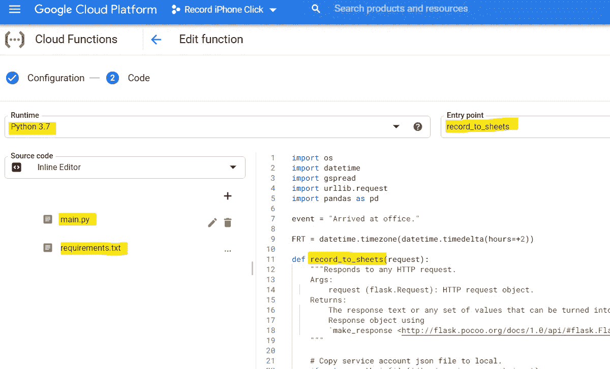
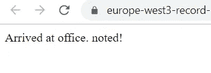

# 只用你的数据科学技能创建一个类似 iPhone 的应用程序:一键生活日志链接到 Google Sheets

> 原文：<https://towardsdatascience.com/creating-an-iphone-app-like-with-only-your-data-science-skills-one-tap-life-logger-ac691698d3b3?source=collection_archive---------45----------------------->

## 你用的都是 Python 和 GCP 云函数或者 Heroku。

作者图片

我没有把自己培养成一名移动应用程序开发人员，因此在我的 iPhone 上拥有自己的应用程序超出了我的梦想。但是，一些简单的功能，如我将在本文中演示的功能，可以在没有任何软件开发技能和流程的情况下实现，如 Swift 编程和 app store review。

在这里，我想创建一个简单的功能，比如当你点击一个图标时，它会记录你点击它的时间。

你点击的以下生活日志怎么样，其中没有一个是你想为此建立一个电子表格的？

*   *到达办公室时*:你一到办公室就查看邮件，所以你忘了写下你到达办公室的时间，对吗？(远程工作人员的情况并非如此)
*   *离职时*:你平时都在跑步，所以忘了写时间，对吧？(远程工作人员的情况并非如此)
*   *喂宝宝的时候*:你忘了写下来，因为你平时都是在收拾烂摊子，对吧？(每个人都是这样)
*   *当宝宝醒来*:战争开始了！我没时间做笔记！(每个人都是这样)

让我们停止把它存储在本地设备上，把它放到云中。这就是我们现在所做的一切。

德里克·欧文斯在 [Unsplash](https://unsplash.com?utm_source=medium&utm_medium=referral) 上拍摄的照片

我就是这样想出这个主意的:**当你在你的 iPhone(或任何其他智能手机)上点击图标时，它会自动记住时间，并记录在 Google Sheets 中**。

在这篇文章中，我将写下我是如何做到这一点的，不需要真正构建移动应用程序，甚至只需要数据科学技能！

# 目录

*   规划解决方案
*   API 解决方案演示 1——谷歌云功能
*   API 解决方案演示 2—Heroku
*   结尾注释

# 规划解决方案

现在这里是我如何规划背景架构。

我们想要的是 iPhone 主屏幕上的图标。轻触其中一个图标会触发某种东西，并以某种方式在谷歌表单中记录下来。不使用特殊的编程技巧，怎么做呢？？

没有 CS 技能，如何连接你的 iphone 图标和 Google Sheets？(图片由作者提供)

下面是我是如何作弊的:**图标不是 app，是一个特定 HTTP 请求的 Safari 快捷方式**。中间出现一个 API，接收 HTTP 调用，最后把记录推送到 Google Sheets。

点击图标-> HTTP 请求-> API 触发器->推送到 Google 工作表。(图片由作者提供)

这个技巧已经解决了大部分技术问题，但是仍然有一个问题:谁以及如何托管 API。

谁将主持 API？(图片由作者提供)

有许多可能的 API 解决方案，但是每一个都有优点和缺点。

每个 API 解决方案的优缺点

通过使用**个人服务器**，你不得不准备许多，但在配置上有更多的自由作为回报。保持机器一直运行以等待 HTTP 请求的维护成本很高，因此这次对于像我们这样的小应用程序来说是大材小用。

**PaaS(比如 Heroku)** 是一个可行的选择，可以让你的应用一直保持托管和服务状态。正如我们将在后面看到的那样，设置起来相当容易。实际上，我认为这是所有解决方案中最公平的一个；唯一值得注意的是，Heroku 免费帐户有每月使用限制——所有应用程序每月使用 1000 小时。这相当于 41.7 天，因此对于一个应用程序来说足够了，但当你已经有另一个应用程序在 Heroku 上运行时，这可能就很重要了。

**像 AWS 上的 Lambda 或 GCP 上的 Cloud Functions 这样的云端无服务器服务**是另一个可能的选择。虽然它是最容易部署的，因为几乎每个基础设施都是托管的，并且您只需要运行 Python 代码，但是每个无服务器服务在配置上都有其不可改变的限制:当您使用外部库(包括 Pandas！);而云函数每个函数只接收来自一个 URL 的 HTTP 请求，这意味着当我们有多个生活事件想要记录时，我们必须复制 Python 代码并反复编辑几行。

在本文中，我演示了使用云函数和 Heroku 的情况。从代码的角度来看，本地服务器案例与 Heroku 案例非常相似。

# API 解决方案演示 1——谷歌云功能

要让 Google Cloud 函数接收 HTTP 请求并将记录推送到 Google Sheets，请执行以下步骤:

## 步骤 1 —创建一个新的 GCP 项目

最好创建一个新项目，以便与您已经拥有的其他项目隔离开来。我新建了一个，名字叫“记录 iPhone 点击”。

## 第二步——首先配置 Google Sheets 来接收来自云功能的数据推送

首先设置 Google Sheets 端，因为我们需要云函数代码的认证信息。

在本页的描述之后，

1.  启用“Google Drive API”。
2.  启用“谷歌工作表 API”。
3.  转到“APIs &服务>凭据”并选择“创建凭据>服务帐户密钥”。
4.  填写表格
5.  点击“创建密钥”
6.  选择“JSON”并点击“创建”。JSON 文件的下载会自动进行。
7.  请注意 JSON 文件中“client_email”的地址。
8.  将 JSON 文件保存到云函数可以访问的地方。
9.  在 Google Sheets 中创建电子表格。在单元格 A1 中写入“事件”,在单元格 B1 中写入“时间”,作为最终日志记录的标题。
10.  在工作表文件中，按下右上角的“Share”按钮，将您在上面第 7 步中获得的 client_email 添加为授权用户。

这就是全部！

## 步骤 3—在云功能中配置新功能

转到“云函数”并创建函数。使用触发器类型作为“HTTP”。

新云功能的配置(作者截图)

## 步骤 4—将代码输入 main.py 和 requirements.txt

点击左下角的下一步，进入代码输入页面。

新云功能代码

这是我实际使用的代码。

main.py

requirements.txt

请记住，服务帐户 JSON 文件需要下载到本地文件夹中，当您想要在云功能中执行此操作时，您必须将文件保存在`/tmp/`子文件夹中。否则，云功能拒绝构建您的应用程序。

## 步骤 5 —部署功能

点击“部署”按钮，等待成功部署。可能需要几分钟。

## 第六步——找到网址并检查它是否有效

URL 可以在函数的详细信息中找到。

你可以在那里找到网址。

如果您测试单击它，您将看到类似下面的消息，这意味着代码已成功部署。如果您看到内部错误、服务器错误或任何其他错误，一定是出了问题。

成功消息。

在这里，您还应该在您创建的工作表中看到一条新记录。

工作表中新插入的记录。

## 第 7 步——将网址发送到你的 iPhone，并在主屏幕上创建一个 Safari 链接

在 iPhone 上打开您的 URL，并将快捷方式添加到主屏幕。

将您的链接添加到主屏幕

然后，您可以在 iPhone 主屏幕上看到新图标。

搞定了。

我们最终得到了什么

## 第八步——为你的其他生活日志制作 URL 链接，一次又一次地复制函数，设置事件名称，并将每个快捷方式添加到你的主屏幕。

这是这个选项最不方便的地方:云函数的代码只能链接到一个 HTTP 请求 URL。因此，如果你需要一个以上的生活日志(像“喂宝宝”、“宝宝醒来”、“到达办公室”等。)，你唯一能做的就是一次又一次地创建函数。

为每个事件设置单独的功能。

当您对 API 设置有更多的控制时，这个过程可以大大减少，就像使用 Heroku 的下一个选项一样！

# API 解决方案演示 2—Heroku

[在我的另一篇文章](/need-to-prepare-a-demo-site-for-your-analysis-on-python-think-of-heroku-flask-dash-f8680a859105)中，我已经讨论了很多关于 Heroku 的好处以及如何建立的问题。因此，我将只讨论提交到与 Heroku 同步的 GitHub 存储库的代码。设置完成后，Heroku 可以自动从 GitHub 下载你的应用并进行部署。

Heroku 与 GitHub 存储库同步，全天候提供最新的应用程序。(图片由作者提供)

## 步骤 1 —准备要与 Heroku 同步的 GitHub 存储库

这是我的 GitHub 库:

requirements.txt 和上面带云函数的 Demo 1 一模一样。

以下是另外两个文件中的内容:

Procfile

app.py

正如你在代码中看到的，在 Heroku 代码中，你需要编写一些额外的代码来通过 Flask 设置 app。另一方面，我们可以设置多个 URL，子目录链接到你想要设置的每个生活日志(像`*main domain/feed-baby*`)，而不需要为它们准备多个 app，不像上面的云功能案例。

## 步骤 2 —配置 Heroku 与 GitHub 存储库同步

这一步欠很多[我在这里的另一个帖子](/need-to-prepare-a-demo-site-for-your-analysis-on-python-think-of-heroku-flask-dash-f8680a859105)告诉你怎么做。只要你选择了我们刚刚建立的正确的 GitHub 库，没有什么不同。

## 第三步——找到网址并检查它是否有效

从 Heroku 设置中找到根 URL，为生活日志添加子目录，如`[https://<your subdomain of Heroku app>.herokuapp.com/](https://record-iphone-click.herokuapp.com/)arrive-at-office/`。检查你的浏览器和工作表的 API 是否正常工作。

检查你的浏览器

检查你的工作表

## 第四步——将网址发送到你的 iPhone，并在主屏幕上创建一个 Safari 链接

这一步和上面云函数的情况完全一样。

我们最终得到了什么

# 结尾注释

在这篇文章中，我展示了一个例子，结合数据科学家已经知道的技能，可以达到比我们通常预期的更进一步的应用。

iPhone(或任何智能手机)可以发出 HTTP 请求，当我们可以正确设置工作流时，通过 HTTP 请求>启动代码>给出结果，任何事情都可以完成。这篇文章演示了一个非常简单的例子，通过点击 iPhone 图标将生活日志记录到 Google Sheets，但是任何进一步的高级应用程序都可以生成，这取决于您的想象力！