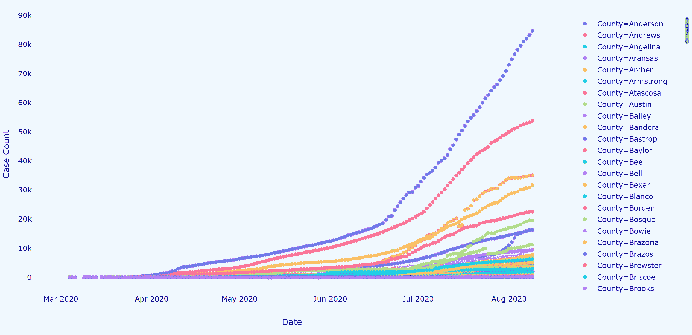
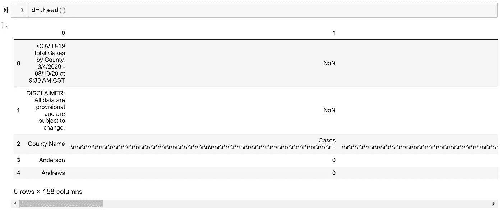
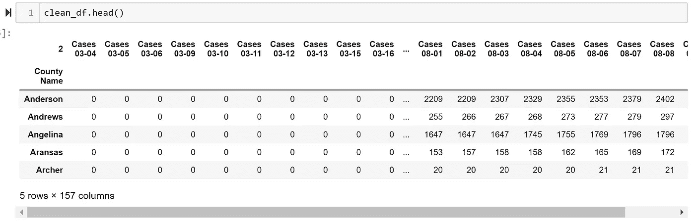
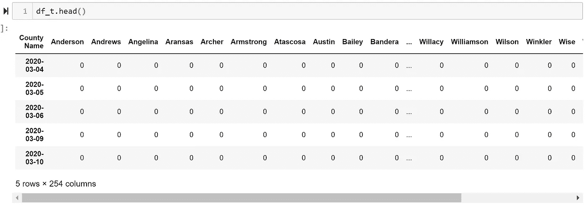
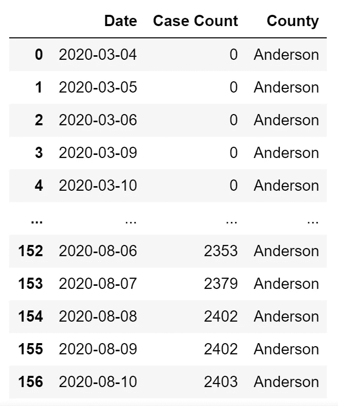
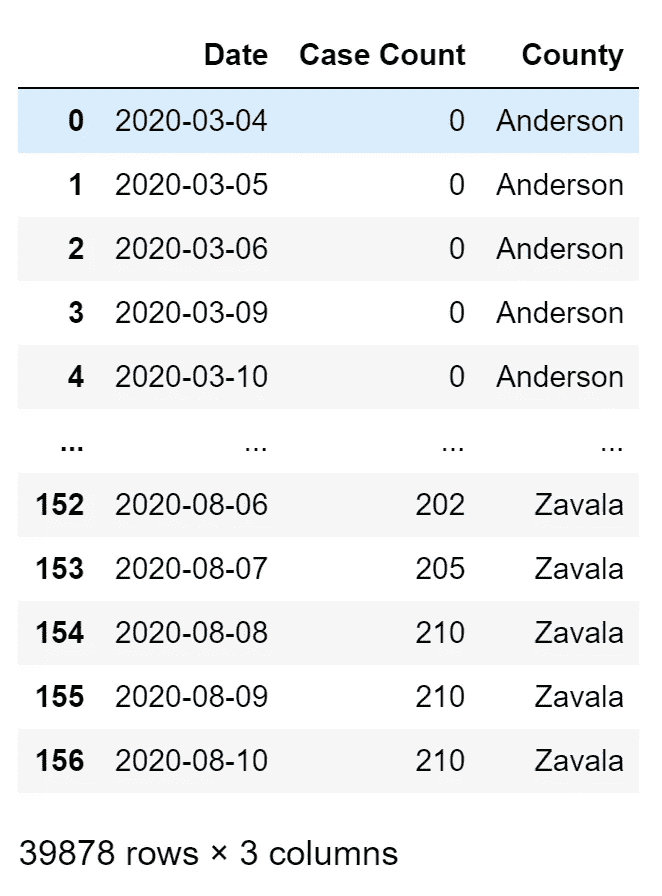
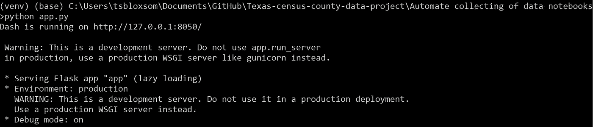
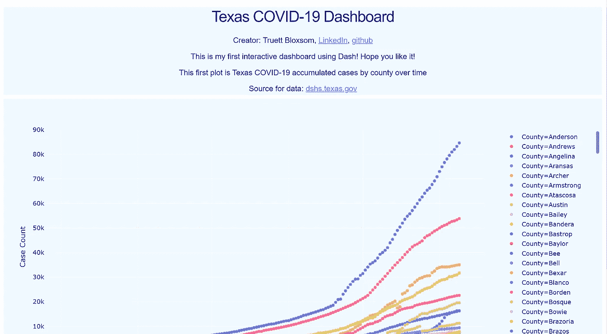

# 使用 Python 创建和自动化交互式仪表盘

> 原文：<https://towardsdatascience.com/creating-and-automating-an-interactive-dashboard-using-python-5d9dfa170206?source=collection_archive---------9----------------------->



Gif 由你真诚地

在本教程中，我将在 selenium、pandas、dash 和 plotly 的帮助下，使用 python 创建一个自动的、交互式的得克萨斯州新冠肺炎县案例统计仪表板。我假设读者对 python、pandas 和 selenium 有所了解。阅读完本教程后，这就是你创建令人惊叹的交互式仪表盘所需的全部内容！

这些步骤的概述以及您将学到的内容如下:

1.  使用 selenium 从 web 下载每日更新的数据
2.  使用 shutil、glob 和 os python 库更新数据目录
3.  用熊猫简单清理 excel 文件
4.  格式化要输入到 plotly 图形中的时间序列数据帧
5.  使用 dash 为您的仪表板创建本地网页

在我们开始之前，您需要下载将在本教程中使用的 python 库。这可以在您的终端上使用以下命令来完成:

```
pip install <package name># package names: selenium, pandas, webdriver_manager, shutil, glob, plotly,and dash
```

需要注意的一点是，我在步骤 1-4 中使用了 Jupyter 笔记本，然后在步骤 5 中使用了 Spyder。当我解释一个代码块做什么的时候，它通常就在文本的正上方。我在本教程中的所有代码都可以在我的 GitHub 中的 Automate collecting of data notebooks 文件下找到。

好，我们开始吧！

**第一步:使用 selenium 从网上下载每日更新的数据**

```
# import packages
from selenium import webdriver
from webdriver_manager.chrome import ChromeDriverManager
from selenium.webdriver.chrome.options import Options
import shutil
import glob
import os
from unicodedata import *
import time# open a chrome browser using selenium 
driver = webdriver.Chrome(ChromeDriverManager().install())# got to web page where excel file links are located
driver.get("[https://www.dshs.texas.gov/coronavirus/additionaldata/](https://www.dshs.texas.gov/coronavirus/additionaldata/)")# these options allow selenium to download files 
options = Options()
options.add_experimental_option("browser.download.folderList",2)
options.add_experimental_option("browser.download.manager.showWhenStarting", False)
options.add_experimental_option("browser.helperApps.neverAsk.saveToDisk", "application/octet-stream,application/vnd.ms-excel")
```

因此，第一个代码块非常简单明了，但是需要注意一些事情。我正在安装一个 selenium chrome web 驱动程序，这样我就不必在新的 chrome 驱动程序更新时重新下载了。这个驱动是用来在线下载我要的 excel 文件的。它会在你的电脑上打开一个新的谷歌 chrome 窗口，然后进入[网页](https://www.dshs.texas.gov/coronavirus/additionaldata/)，提供每天更新的德克萨斯新冠肺炎各县的案件数量。selenium 的标准选项不允许从 web 下载文件，因此需要修改这些选项以允许这样做。

```
# initialize an object to the location on the web page and click on it to download
link = driver.find_element_by_xpath('/html/body/form/div[4]/div/div[3]/div[2]/div/div/ul[1]/li[1]/a')
link.click()# Wait for 15 seconds to allow chrome to download file
time.sleep(15)
```

这段代码使用完整的 Xpath 单击 excel 文件的链接。这可以通过右键单击页面、检查页面、右键单击想要单击的链接并复制完整的 Xpath 来找到。然后驱动程序点击链接，等待 15 秒下载，这对于下一个代码块不出错是至关重要的。

**2。使用 shutil、glob 和 os python 库更新数据目录**

**在继续阅读之前**:如果你在家学习，你需要改变我从/Users/tsbloxsom/Downloads/*下载目录的路径。xlsx ' to '/Users/<your _ username>/Downloads/*。xlsx '

您还需要从我使用的目录中更改要存储数据和 python 笔记本的目录:'/Users/tsbloxsom/Documents/GitHub/Texas-census-county-data-project/Automate collection of data notebooks/*。xlsx' to '/Users/ <your_username>/bla/bla/*。xlsx '</your_username>

```
# locating most recent .xlsx downloaded file 
list_of_files = glob.glob('/Users/tsbloxsom/Downloads/*.xlsx') 
latest_file = max(list_of_files, key=os.path.getmtime)# replace "\" with "/" so file path can be located by python
latest_file = latest_file.replace("\\", "/")
latest_file# we need to locate the old .xlsx file(s) in the dir we want to store the new xlsx file in
list_of_files = glob.glob('/Users/tsbloxsom/Documents/GitHub/Texas-census-county-data-project/Automate collecting of data notebooks/*.xlsx') # need to delete old xlsx file(s) so if we download new xlsx file with same name we do not get an error while moving it
for file in list_of_files:
    print("deleting old xlsx file:", file)
    os.remove(file)# Move the new file from the download dir to the github dir 
shutil.move(latest_file,'/Users/tsbloxsom/Documents/GitHub/Texas-census-county-data-project/Automate collecting of data notebooks/')
```

这个代码块是大量自动化发生的地方。它使用 glob 和 os.path.getmtime 函数找到我刚刚下载的 excel 文件，删除我想要存储新 excel 文件的目录中的任何旧 excel 文件(可能是前一天的)，然后将新 excel 文件移动到 GitHub 目录中。os.path.getmtime()函数返回路径的最后修改时间，因此使用 max()函数，可以找到最近下载的 excel 文件。

**第三步:用熊猫简单清理 excel 文件**

现在我们已经在我们想要的目录中有了最新的新冠肺炎数据，在绘制之前我们需要做一些清理工作。

```
import pandas as pd
import repd.set_option('display.max_rows', 500)
pd.options.display.max_colwidth = 150# again we need to locate the .xlsx file 
list_of_files = glob.glob('/Users/tsbloxsom/Documents/GitHub/Texas-census-county-data-project/Automate collecting of data notebooks/*.xlsx') 
latest_file = max(list_of_files, key=os.path.getctime)
print(latest_file.split("\\")[-1])df = pd.read_excel("{}".format(latest_file),header=None)df.head()
```



真实的你的形象

因此，我们读取 excel 文件，并将其转换为熊猫数据框(df)…我们有一些清理工作要做。让我们处理文件的第一行和最后几行。

```
# print out latest COVID data datetime and notes
date = re.findall("- [0-9]+/[0-9]+/[0-9]+ .+", df.iloc[0, 0])
print("COVID cases latest update:", date[0][2:])
print(df.iloc[1, 0])
print(str(df.iloc[262:266, 0]).lstrip().rstrip())#drop non-data rows
df2 = df.drop([0, 1, 258, 260, 261, 262, 263, 264, 265, 266, 267])
```

首先，我想打印出前两行和最后几行数据的相关信息，然后我想从 df 中删除这些行。

```
# clean column names
df2.iloc[0,:] = df2.iloc[0,:].apply(lambda x: x.replace("\r", ""))
df2.iloc[0,:] = df2.iloc[0,:].apply(lambda x: x.replace("\n", ""))
df2.columns = df2.iloc[0]
clean_df = df2.drop(df2.index[0])
clean_df = clean_df.set_index("County Name")# convert clean_df to a .csv file
clean_df.to_csv("Texas county COVID cases data clean.csv")
```



真实的你的形象

在上面的代码块中，我清除了每个日期的行，其中许多日期在单元格中有新行、和回车、字符。然后，我将日期行作为列名，并删除原来的日期行。我们最终得到了一个清晰的 df，其中的行是德克萨斯州的每个县，每列代表每个日期的案例数。最后，我想为下一步将 df 转换成. csv 文件。

**第四步:将输入的时间序列数据帧格式化成 plotly 图形**

```
import plotly.express as pxlist_of_files = glob.glob('/Users/tsbloxsom/Documents/GitHub/Texas-census-county-data-project/Automate collecting of data notebooks/*.csv') 
latest_file = max(list_of_files, key=os.path.getmtime)
latest_file.split("\\")[-1]df = pd.read_csv(latest_file.split("\\")[-1])
```

我们再次使用 glob 和 os.path.getmtime 函数来查找最新的。csv 文件，即我们的“德州县 COVID 病例数据 clean.csv”。

```
# convert df into time series where rows are each date and clean up
df_t = df.T
df_t.columns = df_t.iloc[0]
df_t = df_t.iloc[1:]
df_t = df_t.iloc[:,:-2]# next lets convert the index to a date time, must clean up dates first
def clean_index(s):
    s = s.replace("*","")
    s = s[-5:]
    s = s + "-2020"
    #print(s)
    return sdf_t.index = df_t.index.map(clean_index)df_t.index = pd.to_datetime(df_t.index)
```



真实的你的形象

在上面的代码块中，我将数据帧转换为时间序列 df，其中行现在是日期，列是县。我还删除了几个列，其中包含病例总数和报告病例的县数。最后，我将日期列转换成一种可用的格式，这种格式可以转换成 pandas date_time 对象，对此我使用了函数 clean_index。但是我们还没有完成。

```
# initalize df with three columns: Date, Case Count, and County
anderson = df_t.T.iloc[0,:]ts = anderson.to_frame().reset_index()ts["County"] = "Anderson"
ts = ts.rename(columns = {"Anderson": "Case Count", "index": "Date"})
```

我们的 plotly 函数将接受 3 列作为输入:日期、案例数和县。所以我们需要把宽 df 转换成长 df。为此，我首先初始化一个包含三列的长 df:一个日期列、安德森县的案例数和一个包含县名的县列。看起来像这样:



真实的你的形象

```
# This while loop adds all counties to the above ts so we can input it into plotly
x = 1
while x < 254:
    new_ts = df_t.T.iloc[x,:]
    new_ts = new_ts.to_frame().reset_index()
    new_ts["County"] = new_ts.columns[1]
    new_ts = new_ts.rename(columns = {new_ts.columns[1]: "Case Count", "index": "Date"})
    ts = pd.concat([ts, new_ts])
    x += 1#save long form df for dash app
ts.to_csv("time_series_plotly.csv")
```

上面代码块的注释说明了一切，但我们现在只是循环遍历整个 wide df 并为每个县创建 new_ts long df，看起来像 Anderson 的 df。然后，我们将每个长 df 连接在一起，wallah 我们自己有了可以输入到 plotly 中的长 df，稍后我们的 dash 应用程序显示如下！



真实的你的形象

```
fig = px.scatter(ts, x='Date', y='Case Count', color='County')
fig.update_traces(mode='markers+lines')
#fig.update_traces(mode='lines')
fig.show()
```


真实的你的形象

我们最终可以使用简单的三行代码将数据绘制成散点图！我使用了“标记+线条”选项，我认为它看起来比线条更令人愉快，也更容易交互。我已经爱上了 plotly，因为与 seaborn 或 matplotlib 不同，它的图形是交互式的，而且编码非常简单。Plotly 也有出色的文档，可在此处找到[。](https://plotly.com/python/)

**第五步:使用 dash 为你的仪表板创建一个本地网页**

对于没有任何软件开发经验的人来说，这一步可能会变得棘手。大约一个月前我还没有，所以我会慢慢地走完这一步，尽可能保持简单。首先，我们希望在笔记本/数据目录中创建一个虚拟环境。要做到这一点，我们必须进入命令行或 Anaconda 提示符，并使用 cd 进入该目录。大概是这样的:

```
C:\Users\tsbloxsom>cd C:\Users\tsbloxsom\Documents\GitHub\Texas-census-county-data-project\Automate collecting of data notebooks
```

然后我们创建虚拟环境:

```
python3 -m venv venv
```

然后我们激活虚拟环境:

```
venv\Scripts\activate
```

现在让我们进入短跑项目。这里有一个[链接](https://dash.plotly.com/introduction)，供新手使用。Dash 是由 plotly 的人制作的，所以你可以得到很棒的文档和产品。我学会了如何在不到两个小时的时间内为时间序列仪表板制作这个应用程序，不是想吹牛，就是这么简单。下面是应用程序的代码。我使用了 dash 网站上[本](https://dash.plotly.com/installation)教程中的基础应用模板组合。因此，打开您最喜欢的代码编辑器，如 Spyder，将下面的代码作为 app.py 保存在与您的新 venv 文件夹相同的目录中。csv 文件。

```
import dash
import dash_core_components as dcc
import dash_html_components as html
import plotly.express as px
import pandas as pdexternal_stylesheets = ['[https://codepen.io/chriddyp/pen/bWLwgP.css'](https://codepen.io/chriddyp/pen/bWLwgP.css')]app = dash.Dash(__name__, external_stylesheets=external_stylesheets)colors = {
    'background': '#F0F8FF',
    'text': '#00008B'
}# assume you have a "long-form" data frame
# see [https://plotly.com/python/px-arguments/](https://plotly.com/python/px-arguments/) for more options
df = pd.read_csv("time_series_plotly.csv")fig = px.scatter(df, x='Date', y='Case Count', color='County')fig.update_layout(
    plot_bgcolor=colors['background'],
    paper_bgcolor=colors['background'],
    font_color=colors['text']
)markdown_text = '''
### Texas COVID-19 DashboardCreator: Truett Bloxsom, [LinkedIn]([https://www.linkedin.com/in/truett-bloxsom/](https://www.linkedin.com/in/truett-bloxsom/)), [github]([https://github.com/tsbloxsom](https://github.com/tsbloxsom))This is my first interactive dashboard using Dash! Hope you like it!This first plot is Texas COVID-19 accumulated cases by county over timeSource for data: [dshs.texas.gov]([https://www.dshs.texas.gov/coronavirus/additionaldata/](https://www.dshs.texas.gov/coronavirus/additionaldata/))'''app.layout = html.Div([
    dcc.Markdown(children=markdown_text,
        style={
            'backgroundColor': colors['background'],
            'textAlign': 'center',
            'color': colors['text']
        }),

    dcc.Graph(
        id='example-graph',
        figure=fig
    )
])if __name__ == '__main__':
    app.run_server(debug=True)
```

现在回到激活的环境，下载 dash、plotly 和 pandas:

```
pip install <package_name>
```

然后，您可以通过运行以下命令运行您的应用程序:

```
python3 app.py
```

它应该是这样的:



现在只需复制 http 链接，粘贴到 chrome 和 boom 中即可！它应该是这样的:



我更进一步，跟随 Elsa Scola 关于如何免费部署 dash 应用程序的教程。如果你只是想玩我的交互式仪表盘，你可以[这里](http://tsbloxsom.pythonanywhere.com/)！

感谢您关注我的教程，并随时通过 [linkedin](https://www.linkedin.com/in/truett-bloxsom/) 联系我。我总是试图获得反馈并加强我的数据科学技能，所以如果有什么我可以改进编码方式或更详细地解释一些东西，请在评论中告诉我。