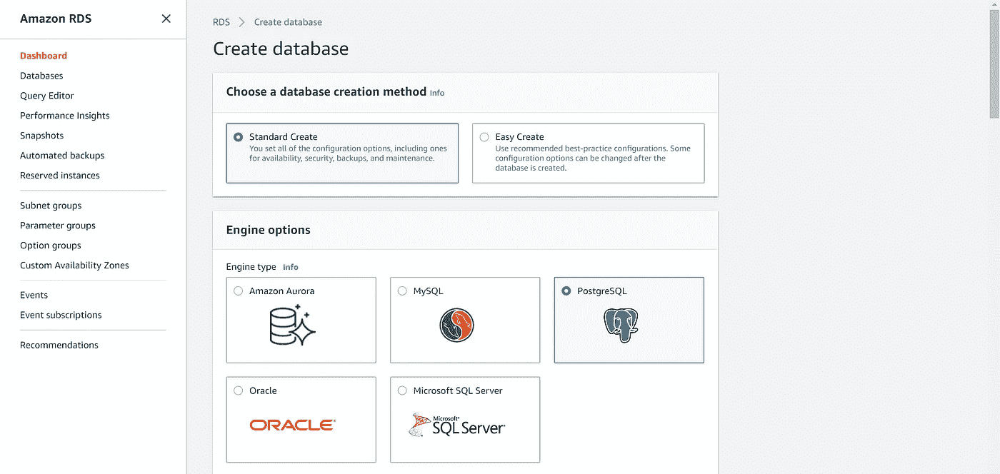
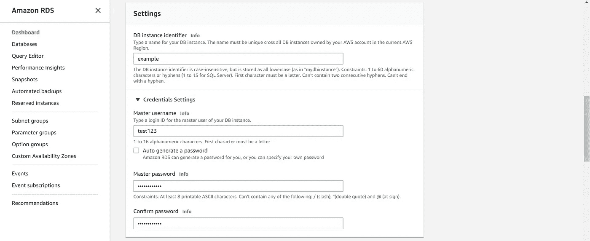
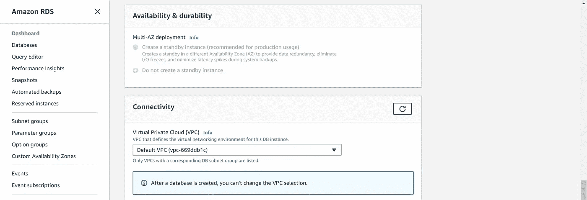
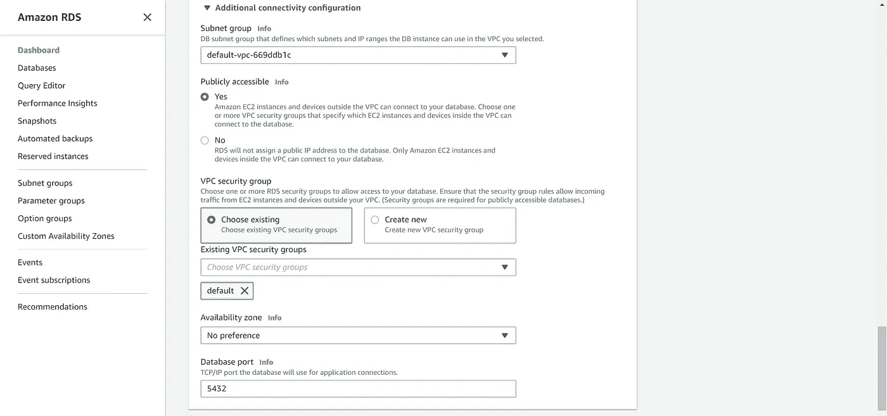
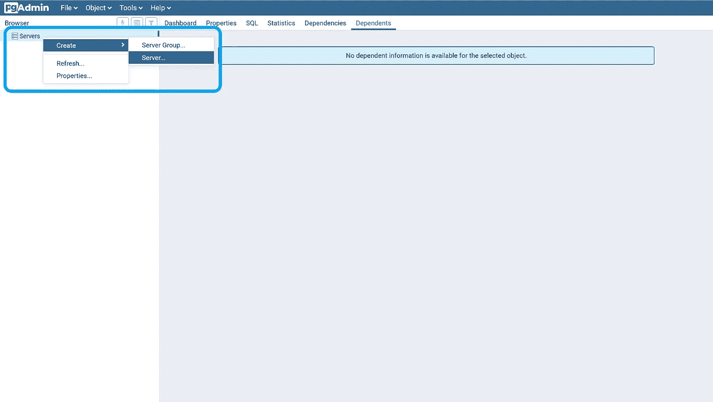
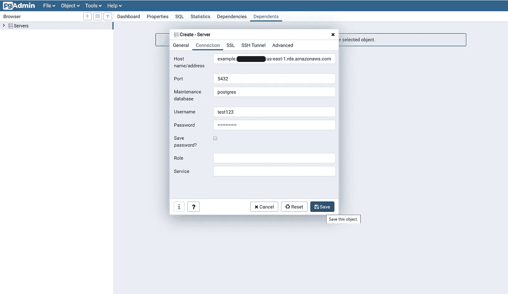
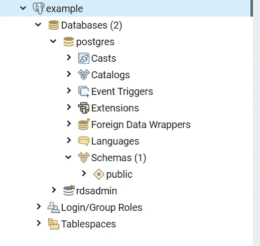
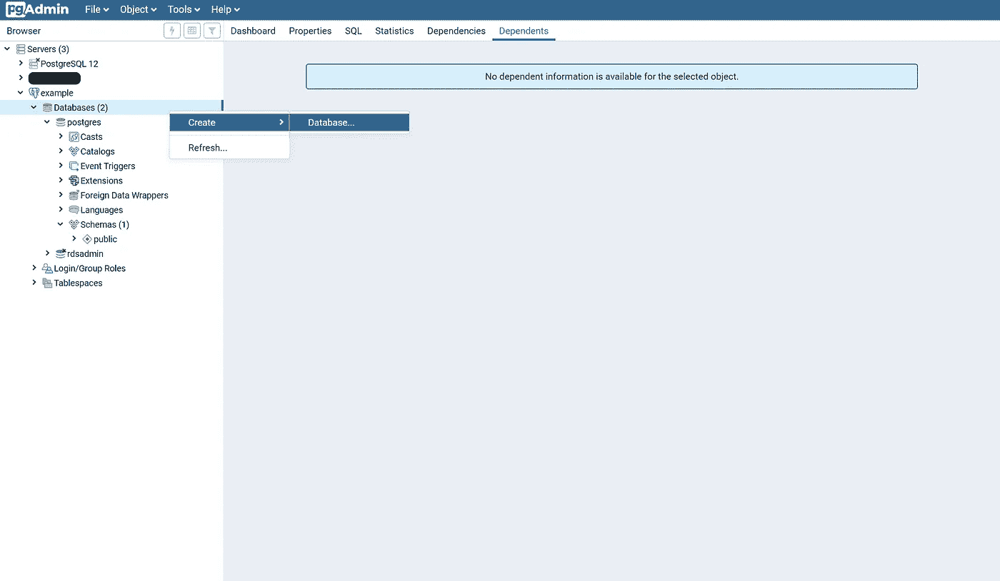

# 用 Amazon 的关系数据库服务(RDS)创建和连接 PostgreSQL 数据库

> 原文：<https://towardsdatascience.com/creating-and-connecting-a-postgresql-database-with-amazons-relational-database-service-rds-dcc9db0cd37f?source=collection_archive---------12----------------------->

[梁杰森](https://unsplash.com/@ninjason?utm_source=medium&utm_medium=referral)在 [Unsplash](https://unsplash.com?utm_source=medium&utm_medium=referral) 上的照片

开始使用云中的数据库并不困难。事实上，多亏了亚马逊网络服务(AWS ),事情从来没有这么简单过。

关系数据库服务(RDS)是亚马逊全面的 web 产品套件的一部分，截至今天，RDS 支持 6 种数据库引擎:Amazon Aurora、PostgreSQL、MySQL、MariaDB、Oracle 数据库和 SQL Server。

这里，我们将关注使用 Amazon 的 RDS 和 pgAdmin 创建并连接到 PostgreSQL 数据库实例。

**前期步骤:**这是检查和确定你有两件东西的地方:1) **亚马逊 AWS 账户**；如果你还没有账户，亚马逊已经简化了在这里创建一个账户**。2)**pg admin**；如果您的计算机上没有下载 pgAdmin，可以在此 *处 [*解决。*](https://www.pgadmin.org/download/)***

*一旦你有了这两样东西，就正式开始了。我们开始吧！*

## *步骤 1- [登录](https://signin.aws.amazon.com/signin?redirect_uri=https%3A%2F%2Fconsole.aws.amazon.com%2Fconsole%2Fhome%3Fnc2%3Dh_ct%26src%3Dheader-signin%26state%3DhashArgs%2523%26isauthcode%3Dtrue&client_id=arn%3Aaws%3Aiam%3A%3A015428540659%3Auser%2Fhomepage&forceMobileApp=0)到 AWS 控制台，找到 RDS 服务。选择 RDS 服务会将您带到 Amazon RDS 仪表板。从仪表板中，选择“创建数据库”在继续配置设置之前，您需要确定选择了“标准创建”和“PostgreSQL”。这个可以直接看下面。*

**

## *步骤 2-使用下拉菜单，选择 PostgreSQL 的最新版本。在我们的例子中，它是“PostgreSQL 11.5-R1”*

**

## *步骤 3——对于这一步，给数据库实例一个名称，并创建一个用户名和密码。你可能会比下面看到的更具体。*

**

## *步骤 4-确保选择了“数据库实例大小”和“存储”默认设置。*

**

## *第 5 步-再次确保“可用性和持久性”和“连接性”默认设置被选中。*

**

## *步骤 6-在“可公开访问”下的“附加连接配置”中，选择“是”。这是走向正确的重要一步。*

**

## *步骤 7-确保选择了“数据库认证”和“附加配置”的默认设置。验证完成后，我们就可以创建数据库了。*

**

***重要提示:**创建一个数据库实例并供使用通常至少需要几分钟。*

*在 Amazon RDS 仪表板的“Databases”中，您应该知道您的数据库实例的名称以及正在使用的引擎(PostgreSQL)。*

## *步骤 8——现在是时候解决最后一个问题了，确保实例可以使用。在“连接性和安全性”中，有一个标题为“安全性”的部分单击列出的默认 VPC 安全组。*

**

## *第 9 步-点击默认 VPC，我们将进入以下屏幕。在这里，使用“操作”下拉菜单，选择“编辑入站规则”*

**

## *步骤 10-编辑入站规则时，选择“Anywhere”并保存编辑。*

**

## *步骤 11-完成出站规则的步骤 9 和 10。*

**

## *第 12 步-返回亚马逊 RDS 仪表板。在使用 pgAdmin 连接数据库实例之前，再次确认该实例可供使用。*

**

## *第 13 步——很好，现在是时候打开 pgAdmin 并连接 RDS 数据库实例了。打开 pgAdmin 后，您应该会看到左侧显示“服务器”的侧边栏。右键单击“服务器”创建一个新的服务器。*

**

## *步骤 14-给服务器一个名称。出于演示的目的，我选择将服务器命名为“example”*

**

## ***第 15 步-** 接下来，在“连接”选项卡中填写一些信息。通过在 RDS 仪表板中单击您的数据库实例，可以找到主机名/地址。您可以在“连接性&安全性”中的“端点”下找到它我推荐复制粘贴到 pgAdmin 里。最后，输入您在 RDS 中为数据库实例创建的用户名和密码。一旦你输入了每一项，就到了保存的时候了。*

**

*服务器现在应该列在左侧栏中，如下图所示。*

**

## ***第 16 步——现在，让我们继续在服务器中创建一个数据库。右键单击“数据库”，选择“创建”，然后选择“数据库…”***

**

## ***第 17 步——给数据库命名，完成后保存。***

**

*是的，就这么简单。我们现在看到数据库列在左侧栏中。*

**

## ***主要成就👏***

*使用 Amazon 的 RDS 创建一个 PostgreSQL 数据库实例。*

*使用 pgAdmin 连接到数据库实例。*

*使用 pgAdmin 创建服务器和数据库。*

*我很乐意连接！找到我最好的地方是在 LinkedIn 上。:)*