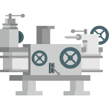
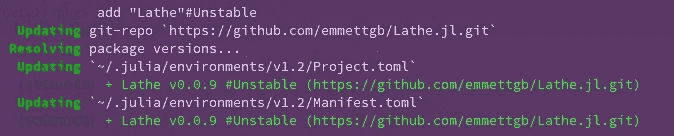
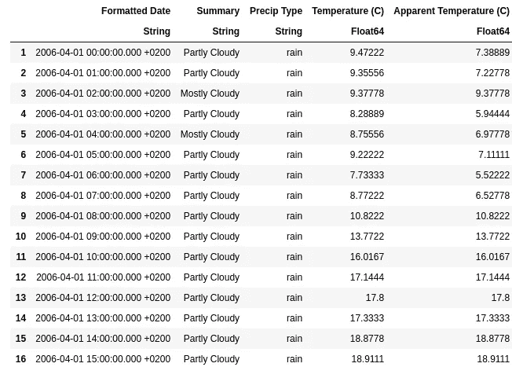
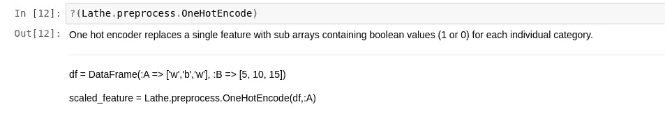
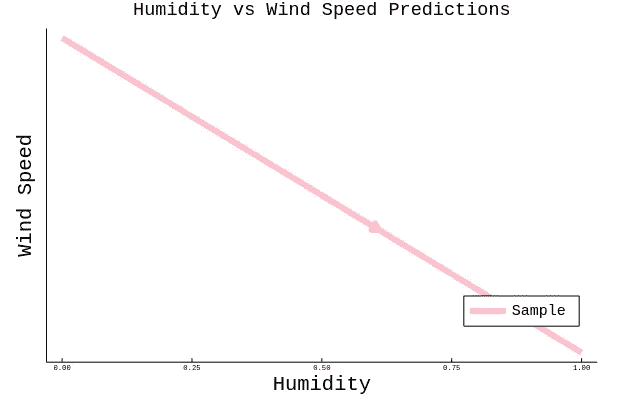

# 在 Julia 中创建和拟合回归模型

> 原文：<https://towardsdatascience.com/creating-and-fitting-a-regression-model-in-julia-4b5c947eabdc?source=collection_archive---------29----------------------->

## 在 Julia 中根据风速和湿度创建和拟合车床模型。



0.0.9 刚刚被合并到主分支中，随之而来的是一系列令人兴奋的新特性。Julia 的机器学习现在比以往任何时候都容易。Julia 中的机器学习目前面临的唯一问题是缺乏 Python 大小的生态系统，以及缺乏文档。幸运的是，对于车床用户来说，有许多功能和工具可供我们使用，甚至更好:

> 车床有很好的文档！

我在网上找到了另一个 CSV 数据集。要将这个 CSV 加载到 Julia 中，我们将需要三个依赖项中的第一个，CSV.jl。所以记住这一点，第一步是跳转到 Pkg REPL，首先输入朱莉娅 step，然后按]。从这个 REPL 中，我们可以添加三个依赖项:

```
julia> ]
pkg> add "Lathe"#Unstable
pkg> add "DataFrames"
pkg> add "CSV"
```



现在我们的系统上已经有了 CSV.jl，我们可以使用将它引入到 Julia 中，并使用 CSV.read()方法读入我们的数据:

```
using CSV
df = CSV.read("weatherHistory.csv")
```



对于连续和分类特征，这个数据集有许多选项，这将首先允许我展示车床预处理的最新方法，

> 一个热编码

我决定做的第一件事是将数据分成两个数据帧，一个将用于我们的模型，另一个将用于展示一个热编码器。我这样做是通过首先做

```
show(df, allcols = true)
```

其次，我构建了两个具有相应特性的新数据帧类型:

```
using DataFrames
hotdf = DataFrame(:Humidity => df[:Humidity], :Type => df[Symbol("Precip Type")])
df = DataFrame(:Humidity => df[:Humidity],:WindSpeed => df[Symbol("Wind Speed (km/h)")])
```

仅仅为了这个例子，我将假装我不知道如何使用车床，以便炫耀车床中的代码内文档。首先，我们当然需要使用以下命令加载车床:

```
using Lathe
```

然后我们可以用茱莉亚的？()包本身的方法:

```
?(Lathe)
|====== Lathe - Easily ML =====|= = = = = v. 0.0.9 = = = = = ||==============================|**__**Lathe.stats|**__**Lathe.validate|**__**Lathe.preprocess|**__**Lathe.models|**__**Use ?(Lathe.package) for information![uuid]38d8eb38-e7b1-11e9-0012-376b6c802672[deps]DataFrames.jlRandom.jl
```

由此，我们看到了一个模块树，其中显示了三个模块:

*   车床.统计
*   车床.验证
*   车床.预处理
*   车床.型号

对于 one hot encoder，我们当然要研究 Lathe.preprocess。(Lathe.package)了解更多信息，所以让我们试试吧！


现在我们可以在模块树中看到 OneHotEncode()函数，让我们对它做同样的操作:

```
?(Lathe.preprocess.OneHotEncode)
```



由此我们得到一个简短的描述，参数，甚至用法。看起来这个函数需要一个数据帧，以及一个表示我们想要编码的列的符号。这当然与你的预期有关:


抛开手边的方法，让我们回到我们的原始数据框架，用我们的两个特征，湿度和风速。因为数据集在这个特定的列上没有缺失值，并且我不打算缩放任何特性，所以我决定要做的第一件事是继续并训练 TestSplit:

```
using Lathe.preprocess: TrainTestSplit
train, test = TrainTestSplit(df)
```

这将返回两个新的数据帧，train 将占数据的 75%，而 test 将占剩余的 25%。我们可以通过在 df 后面添加一个浮动百分比来对此进行调整:

```
train, test = TrainTestSplit(df, .5)
```

> 这将平均分割数据。

就我个人而言，我喜欢将我所有的数据分配给变量，这些变量在考虑做模型之前就可以很容易地改变。在 Julia 中，你可以这样做:

```
x = :Humidity
y = :WindSpeed
trainX = train[x]
trainy = train[y]
testX = test[x]
testy = test[y]
```

接下来，我们只需要导入我们的模型，我们的预测函数，然后我们就可以构建和拟合了！

```
using Lathe.models: predict, LinearRegression
model = LinearRegression(trainX, trainy)
yhat = predict(model, testX)
```

> 这是结果:



真的是太简单了！你怎么会对此感到不安呢？我很期待车床在未来的发展方向，以及这个模块会对 Julia 产生怎样的影响。到目前为止，Lathe 可能是您可以使用的最简单的 ML 包，我认为大部分学习曲线源于使用 DataFrames.jl，而不是 Lathe。总的来说，我对车床的下一个版本，0.1.0 以及更高版本感到非常兴奋！