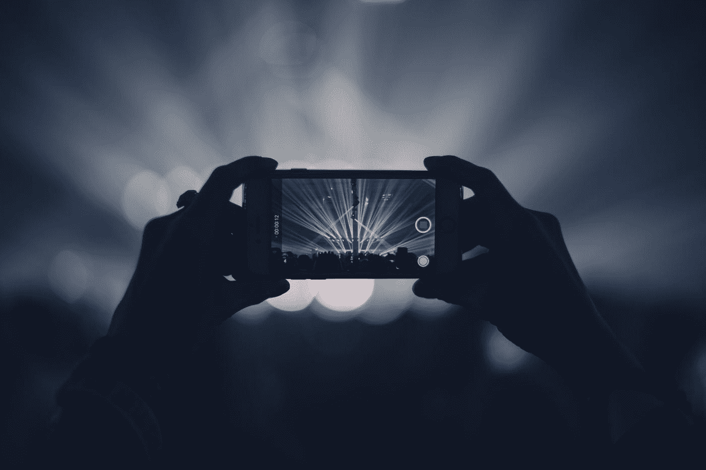
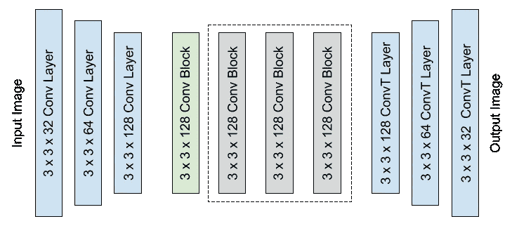
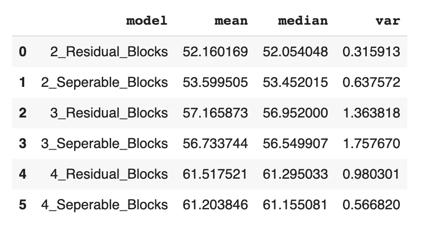

# 使用深度神经网络创建艺术直播视频滤镜

> 原文：<https://towardsdatascience.com/creating-artistic-live-video-filters-with-deep-neural-networks-36f8f5a9ac69?source=collection_archive---------54----------------------->

## 将 CoreML 用于 iPhone 的复杂视频滤镜和效果

在 [Unsplash](https://unsplash.com?utm_source=medium&utm_medium=referral) 上 [veeterzy](https://unsplash.com/@veeterzy?utm_source=medium&utm_medium=referral) 拍摄的照片

在[之前的一个项目](/learning-tensorflow-2-with-style-eab12fd94365)中，我致力于复制快速神经风格转移，通过深度神经网络将一幅图像的艺术风格应用于另一幅图像，从而转换一幅图像。虽然在 python 笔记本中转换图像效果很好，但对于普通用户来说并不容易。我想在 iOS 设备上部署这个模型，类似于几年前流行的 Prisma 应用程序。除此之外，我还想测试生成模型的极限，并在直播视频上转换帧。这个项目的目标是在实时视频上运行一个生成模型，探索在当前技术界限下的可能性。有几件事情使这成为可能——1)缩放输入，2)利用设备的 GPU，3)简化模型。因为这是建立在以前的项目之上的，所以熟悉一下以前的帖子会有所帮助。

# 缩放输入

今天许多手机可以拍摄令人惊叹的 4k 视频，包括我开发的 iPhone XS。虽然设备中的 A12 芯片功能强大，但要在这种大小的每一帧上使用深度神经网络，速度太慢了。通常视频帧被缩小以用于设备上的图像识别，并且该模型在帧的子集上运行。例如，对象识别应用程序可以在 224 x 244 帧上每秒运行一次模型，而不是在 4096 x 2160 帧上每秒运行 30 次。这适用于对象检测用例，因为对象在帧之间不会改变太多。

这显然不适用于视频帧的风格化。每秒只有一个风格化的帧闪烁对用户来说没有吸引力。然而，这里有一些要点。首先，缩小框架尺寸是完全合理的。视频通常以 360p 的分辨率流式传输，并放大到设备的 1080p 屏幕。第二，也许没有必要以每秒 30 帧的速度运行模型，较慢的帧速率就足够了。

在模型分辨率和帧速率之间有一个权衡，因为 GPU 在一秒钟内可以进行的计算数量有限。您可能会看到一些视频聊天平台在使用卷积实现视频效果(即改变背景)时，帧率较低或缓冲更多。为了了解不同的帧速率和输入形状是什么样子，我用原始的神经网络和 OpenCV 在电脑上制作了几个风格化的视频。我选定的目标帧速率为 15 fps，输入为 480 x 853。我发现这些仍然是视觉上吸引人的，也是基准测试中可识别的数字。

# 利用 GPU

我使用 tfcoreml 和 coremltools 将 Tensorflow 模型转换为 coreml 模型。完整方法的要点可以在下面找到。这里有几个考虑因素。首先，我转向了批量规范化，而不是实例规范化。这是因为 CoreML 没有现成的实例标准化层，这简化了实现，因为在干扰时间，每批中只有一个帧。还可以在 tfcoreml 中使用自定义方法来转换实例规范化层。

接下来，TensorFlow 和 CoreML 之间的张量形状不同。TensorFlow 模型有一个 out in (B，W，H，CH)，而 CoreML 支持图像的(B，CH，W，H)。在将模型转换为 CoreML 模型后，我编辑了模型规格，以使转置层适应形状。只有在将模型输出形状更改为格式(B，CH，W，H)之后，我才将输出类型更改为图像。这必须在模型规格中手动完成；在撰写本文时，tfcoreml 支持图像作为输入参数，但不支持输出。

此外，由于我缩小了图像的尺寸，以便通过网络传递它们，因此我能够使用 coremltools 添加一个放大层，将图像放大到合理的 1920 x 1080 帧大小。一种替代方法是在获得网络结果后调整像素缓冲区的大小，但这将涉及 CPU 的工作或 GPU 上的额外排队。CoreML 的 resize 层具有双线性缩放，并提供了令人满意的放大，几乎没有特征或像素伪像。由于这个调整大小层不是基于卷积，它也增加了模型推断时间的最小时间。

我使用 GPU 的最后一个方法是显示帧。由于我向帧添加了自定义处理，所以我不能将它们直接发送到标准的 AVCaptureVideoPreviewLayer。我使用 Metal Kit 中的 MTKView 来展示框架，它利用了 GPU。虽然金属着色器是一个简单的传递函数(输入作为输出返回)，但绘图证明是高性能的，并且视图中的队列在丢帧的情况下也很有帮助。

# 简化模型架构

原始模型架构有五个剩余卷积层。虽然在标准 GPU 上性能很高，但这对 A12 处理器来说太深了，至少对于典型的帧速率来说是这样。神经网络学习各种纹理的一个主要组成部分是五个残余块。如果纹理很简单，后面的剩余层可能看起来更接近身份过滤器。如果纹理更复杂，*所有的*层可能有有意义的过滤器。我试着为一个更高性能的网络修剪掉一些这样的块，代价是不能学习一些高度复杂的纹理。此外，我试验了可分离的卷积层，而不是传统的全连接层，就像在其他轻量级架构(如 MobileNets)中使用的那样。

A12 测试中使用的架构。灰色卷积残差块(2–4)是通过移除或使用块中的可分离卷积层进行实验的。

我在一台计算机 GPU 上测试了几种不同的架构，以缩小最具性能的网络，同时将纹理降级降至最低。虽然我只使用了 3 x 3 大小的内核，但我保持了原始架构的缩小和放大在很大程度上的一致性。一些改变(将剩余块减少到 1，将过滤器的数量减少到 64)具有快速的推断时间，但是在质量上有很大的下降。在 GPU 测试之后，我在一台配有 A12 芯片的 iPhone XS 上测试了这些模型。

各种模型架构的结果(毫秒)。

这些是 100 次迭代的基准测试的结果(以毫秒为单位)，输入帧大小为 480 x 853。第一帧被省略，因为它是模型“启动”的异常值。从这些结果中得出的一个有趣的结论是，可分离的卷积块并没有提高网络的性能。为了提高效率，可分离的卷积层通常难以实现。我读过各种案例，其中可分离层在不同环境中的表现不尽如人意，这里也可能是这种情况，这值得进一步研究。

我使用了 3 个完整的(不可分离的)剩余块来获得以下结果。这种模式在各种风格和案例上都非常有效。15 fps 是每帧 66 毫秒，这种实现可能是该设备的上限，因为会出现几次丢帧或延迟。

# 结果和考虑

下面是一些应用了不同风格和纹理的例子。这些结果为移动设备上的视频显示了比当前流行的仅使用着色器或单个滤镜的效果复杂得多的效果。

草图纹理样式

“缪斯”风格

“尖叫”风格

“雨公主”风格

马赛克风格

从这个实验中得到的一个教训是，修整过的神经结构并不能概括所有的风格，因为分解图像的层数较少。这在复杂的样式中最为明显，这些样式更多地变换了图像中的对象。用神经网络进行转换是一个很难解决的问题，所以这并不奇怪。马赛克风格是这个问题的一个很好的例子。与其他实现包含的更复杂的特征[相比，我的实现在图像中重复类似的镶嵌，后者在后处理中使用完整的网络。另一方面，更简单的风格，如“尖叫”和普通的草图纹理表现得相当好，与整个建筑的预期相似。](https://www.youtube.com/watch?v=iq_lMdB80jY)

另一个缺点是缺乏广义超参数。通过修剪后的网络，我发现没有一组可靠的超参数适用于大多数风格。再一次，马赛克风格在这里有改进的空间，因为内容组件被牺牲了，希望有更复杂的风格特征。

随着未来硬件的进步，能够使用更大的神经网络是不可避免的。随着更复杂的网络，更复杂的风格，纹理，甚至对象转换都是可能的。目前，这表明可以开发各种过滤器和效果，用于社交媒体等实时视频内容。

## 相关著作

*实时视频神经风格转移，*凯特·鲍姆利，丹尼尔·迪亚蒙，约翰·西格蒙——[https://towards data science . com/Real-Time-Video-Neural-Style-Transfer-9f6f 84590832](/real-time-video-neural-style-transfer-9f6f84590832)