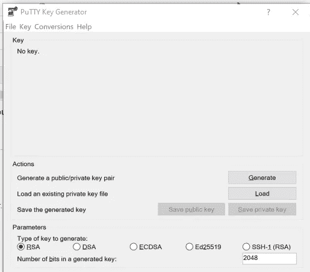
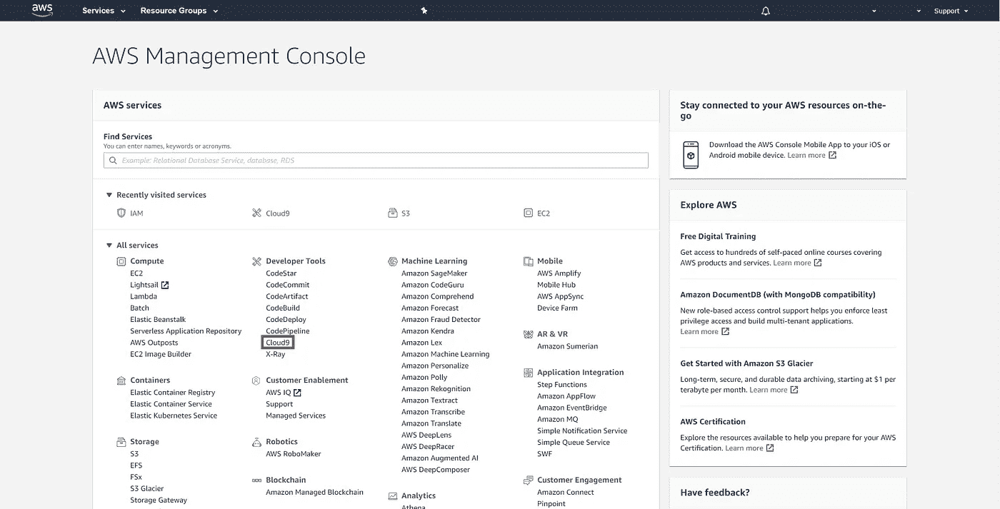

# 创建 AWS EC2 并将其与 AWS Cloud9 IDE 和 AWS S3 连接

> 原文：<https://towardsdatascience.com/creating-aws-ec2-and-connecting-it-with-aws-cloud9-ide-and-aws-s3-a6313aa82ec?source=collection_archive---------9----------------------->

## 创建亚马逊弹性计算云 **(EC2)、将其与**亚马逊简单存储服务(S3)链接并连接到 AWS Cloud9 集成开发环境(IDE)的分步教程


由[克里斯蒂安·威迪格](https://unsplash.com/@christianw?utm_source=medium&utm_medium=referral)在 [Unsplash](https://unsplash.com?utm_source=medium&utm_medium=referral) 上拍摄的照片

# 亚马逊网络服务(AWS)。

有时，您可能会因为您的桌面功能而无法完成任务。例如，作为一名数据科学家，大部分时间几乎不可能将一个巨大的数据集加载到您的个人桌面上。即使您能够加载这些数据，训练您的模型也可能需要很长时间。一个可能的解决方案是使用**亚马逊 Web 服务** ( [**AWS**](https://aws.amazon.com/) )。你可以从[这里](https://aws.amazon.com/what-is-aws/)阅读更多关于 AWS 的内容。

使用**亚马逊弹性计算云** ( [**亚马逊 EC2**](https://aws.amazon.com/ec2/#:~:text=Amazon%20Elastic%20Compute%20Cloud%20(Amazon,cloud%20computing%20easier%20for%20developers.) )将有助于解决前面提到的问题。它是可扩展的，并且消除了预先投资硬件的需要。你可以从这里阅读更多关于亚马逊 EC2 的信息。

还有**亚马逊简单存储服务** ( [**亚马逊 S3**](https://aws.amazon.com/s3/) )可以用来随时存储和检索任意数量的数据。你可以从[这里](https://docs.aws.amazon.com/AmazonS3/latest/dev/Welcome.html)阅读更多关于亚马逊 S3 的信息。

为了使与亚马逊 EC2 的通信更容易，可以使用 [**AWS Cloud9**](https://aws.amazon.com/cloud9/#:~:text=AWS%20Cloud9%20is%20a%20cloud,code%20with%20just%20a%20browser.&text=With%20Cloud9%2C%20you%20can%20quickly,other's%20inputs%20in%20real%20time.) 。它是一个基于云的集成开发环境( **IDE** )，让你可以使用浏览器编写、运行和调试你的代码。你可以从[这里](https://docs.aws.amazon.com/cloud9/latest/user-guide/welcome.html)阅读更多关于 AWS Cloud9 的内容。

在本文中，我们将:

1.  [获取访问密钥和秘密密钥](#3534)
2.  [构建一个 AWS EC2 实例。](#6ad6)
3.  [使用 PuTTY 连接到该实例。](#eedd)
4.  [连接到 S3 自动气象站。](#b9d4)
5.  [连接 AWS Cloud9。](#5011)

# 1.获取访问密钥和秘密密钥

[访问密钥和秘密密钥](https://docs.aws.amazon.com/general/latest/gr/aws-sec-cred-types.html#access-keys-and-secret-access-keys)用于验证您向 AWS 发出的请求。

从[这里](https://portal.aws.amazon.com/billing/signup#/start)创建 AWS 账户后，从[这里](https://console.aws.amazon.com/)登录 AWS 管理控制台。


登录后显示的 AWS 管理控制台-作者图片

首先，我们需要创建一个访问密钥和秘密密钥。在**安全、身份、&合规**挑选 [**IAM**](https://aws.amazon.com/iam/#:~:text=AWS%20Identity%20and%20Access%20Management%20(IAM)%20enables%20you%20to%20manage,offered%20at%20no%20additional%20charge.) (身份和访问管理)**。**


Pick IAM 按作者分类的图像

按下**用户**然后选择你的**用户名**。如果找不到您的用户名，*按* ***添加用户。***


按下**用户** —图片作者

按下您的**用户名**后，在**安全凭证**选项卡内按下**创建访问键**。然后下载。csv 文件。你会在里面找到你的访问密钥&秘密密钥。把它们存放在安全的地方，因为你以后会需要它们。


按下**创建访问密钥**然后下载。csv —作者图片

# 2.构建一个 AWS EC2 实例

回到 [AWS 管理控制台](https://console.aws.amazon.com/)，从 compute pick EC2。


选择 EC2 —按作者分类的图像

按下**启动实例**。


按下**启动实例** —图片由作者提供

从显示的选项中选择适合你的。在这个教程中，我将选择 Ubuntu Server 20.04 LTS 版本**。按下**选择****


搜索或向下滚动到 Ubuntu Server 20.04 LTS，然后按选择—作者图片

选择您需要的实例。对于本教程，我将选择 **t2.micro** 。有关 Amazon EC2 实例类型的更多信息，您可以按这里的。


选择所需的实例类型-按作者分类的图像

从上面的标签中选择 **4。添加存储器**。如果需要，您可以增加大小。


如果需要，增加大小—图片由作者提供

选择 **6。配置安全组**。将**分配一个安全组**改为**选择一个现有的安全组**。选择您想要的群组。您的管理员应该已经创建了该策略，或者您也可以创建它。如果不选择安全组，您的计算机将是公共的，任何人都可以访问。如果需要，您可以随意使用任何其他配置。最后，按下**查看并发射**然后**发射**。


选择一个安全组，然后按**查看并启动** —图片由作者提供

将**选择现有的密钥对**改为**创建新的密钥对**。然后为该密钥对添加一个名称，并按下**下载密钥对**。这将下载一个 **pem** 文件。然后按下**启动实例**。最后，**按下视图实例**。


创建新的密钥对，然后下载 pem 文件。启动实例，然后按查看实例-按作者分类的图像

你会发现你的机器没有名字。将其重命名为您想要的名称，然后点击选择它。复制**公共 DNS(IPv4)** ，因为我们将在下一步中需要它。


重命名您的机器，然后选择它，并复制公共 DNS 由作者的形象

# 3.使用 PuTTY 连接到此实例

下一步你需要安装[油灰](https://www.putty.org/)。PuTTY 是一个终端仿真软件，可以在 Windows、Unix 和 Linux 上运行。

打开**推杆**。选择加载。转到保存 **pem** 文件的路径(之前在步骤 2 中保存)。确保将**类型的文件**设置为**所有文件(*。*)** 查看 pem 文件。双击 pem 文件。

您应该会得到一条消息，表明您成功导入了外键。按确定，然后保存私钥。



油灰键生成器。媒体负载—作者提供的图像

关闭**油灰**并打开**油灰**。

在**主机名**中写上 **ubuntu@ <粘贴公共 DNS(IPv4) >**

展开 **SSH** 然后按下 **AUTH** 。点击**浏览**并转到你之前保存的 **PPK** 然后双击它。

回到**会话**，然后在“**保存的会话**中添加一个名称，然后按**保存**。这样，您就将配置保存到了 PuTTY 中。下次要连接机器时，只需按下 **load** 即可。

最后按下**打开**


PuTTY —作者提供的图像

现在你通过终端连接到机器上，可以写任何你想要的 linux 命令。


PuTTY 连接的终端—图片由作者提供

您应该从以下两个命令开始更新环境。

```
sudo apt-get update
sudo apt-get -y upgrade
```

# 4.将 AWS EC2 连接到 AWS S3。

要通过机器与 AWS S3 交互，您可以通过以下命令安装 **awscli**

```
sudo apt-get install -y awscli
aws configure
```

" **aws configure** "将要求您输入之前在 IAM 中生成的**访问密钥**和**秘密密钥**(来自步骤 1)。对于其他 2 个提示，按回车键即可(无需填写)。

从 aws 复制一些东西到你的机器就像在 linux 中使用 [**cp** 命令](https://www.geeksforgeeks.org/cp-command-linux-examples/)。示例:

```
aws s3 cp source destination
```

**源**和**目的**可以是机器上的本地路径，也可以是 s3 上的路径。

对于 s3 路径，只需要在开头加上 **s3://** 即可。

将文件从 **S3** 复制到**本地机器**的示例:

```
aws s3 cp s3://FolderName/fileName.txt ./fileName.txt
```

保持 PuTTY 与实例的连接，并为下一步运行终端。

# 5.将 AWS EC2 连接到 AWS Cloud9

从 AWS 管理控制台，在开发者工具内选择 Cloud9。



Pick Cloud9 —按作者分类的图片

按**创建环境**。为该环境添加任何名称，然后按下**下一个**。


按创建环境-按作者分类的图像

在**配置设置**中，将**环境类型**更改为**连接并运行在远程服务器(SSH)** 。在**用户**中，写入 **ubuntu** 。添加实例的**公共 DNS IPv4** 。然后按下**复制密钥到剪贴板**。


更改环境类型并填充数据-按作者分类的图像

在连接到机器的 PuTTY 终端中，写入以下命令，将**键**保存到机器中:

```
echo <**Paste the Copied Key**> >> ~/.ssh/authorized_keys
sudo apt-get install -y nodejs
```

**Cloud9** 需要 **nodejs** 这就是我们安装它的原因。

在**配置设置**中按下**下一步**，然后**创建环境**。


Cloud9 加载屏幕—作者图片

右键点击 **C9 安装**和**复制链接地址**。

按下**下一个**并勾选所有选项。


右键点击“ **C9 安装**”和**复制链接地址** —图片作者

进入 **PuTTY 终端**并运行以下命令:

```
wget <**Paste the copied link address**>
chmod a+x c9-install.sh
sudo apt-get -y install python
sudo apt-get install build-essential
./c9-install.sh
```

现在你可以关闭**油灰**并从**云 9** 继续。


Cloud9 欢迎屏幕—作者图片

现在，您已经准备好在这个 IDE 上开始开发了。你可以使用 **Cloud9** 通过拖放将文件或数据从你的本地机器上传到 **EC2** 。您也可以**运行** / **调试**代码或使用下面的**终端**与机器交互。


Cloud9 IDE —作者图片

**注意:**如果实例的 IP 地址改变了(当你**停止**一个实例，然后**重启**它的运行时发生)，你只需要复制新的 **IPv4 地址**。

在 **Cloud9** 中，点击左上角的 **Cloud9 图标**。

点击“**转到您的仪表板**”。按下所需的环境，然后从右上角选择**编辑**。然后向下滚动到**主机**，只需更改 **IPv4 地址**。


选择环境，然后按编辑-按作者分类的图像

# 结论

本教程提供了启动和连接 **AWS EC2** 到 **AWS Cloud9** 的分步指南，以及将数据从 **AWS S3** 移入或移出。这应该有助于设置一个基本的数据科学环境。

我推荐 [AWS 文档](https://docs.aws.amazon.com/)来获得更多关于亚马逊提供的所有服务的信息。