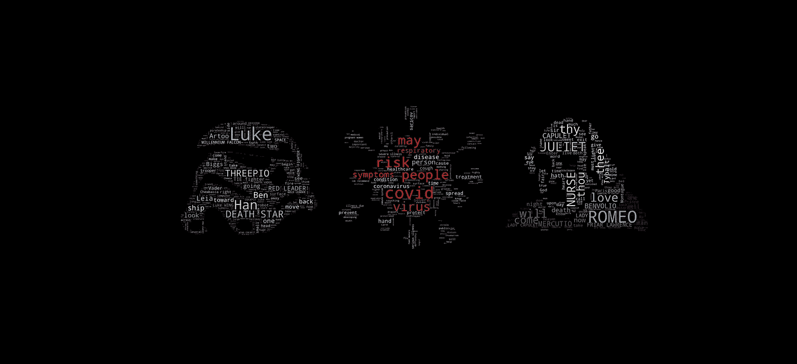
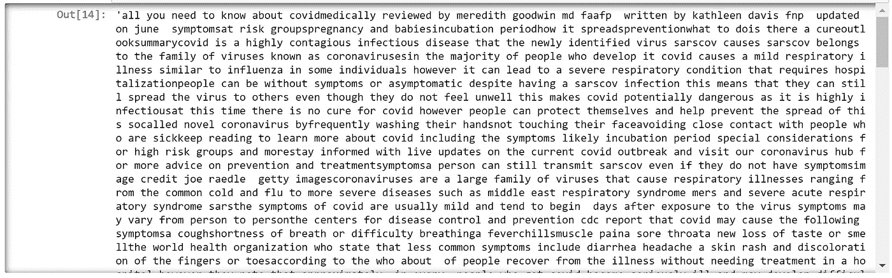
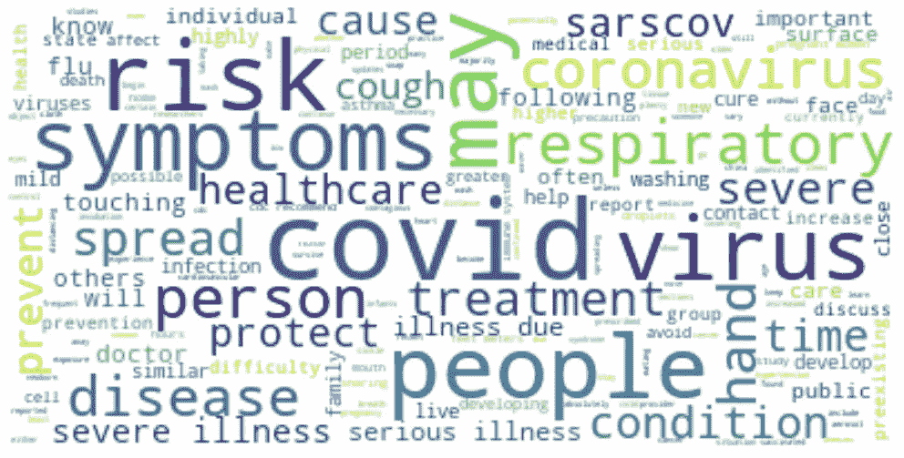
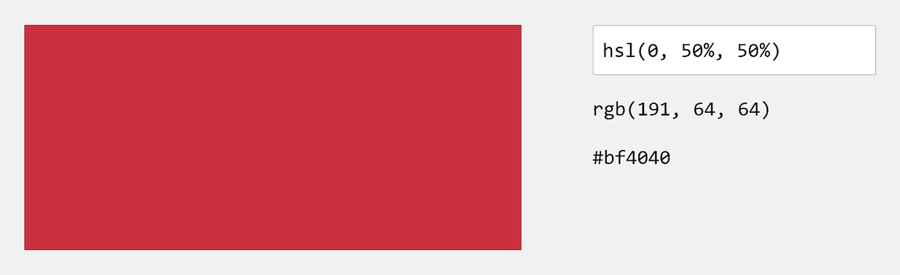
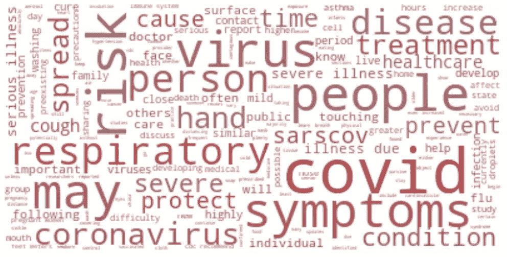
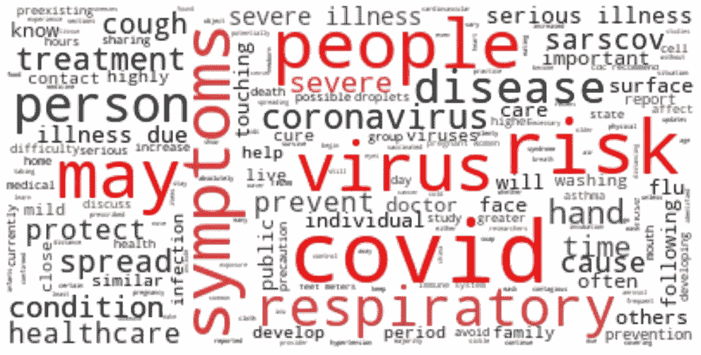
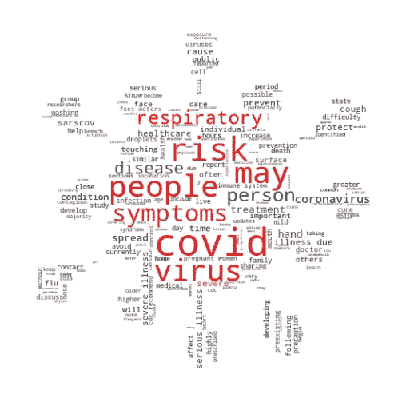
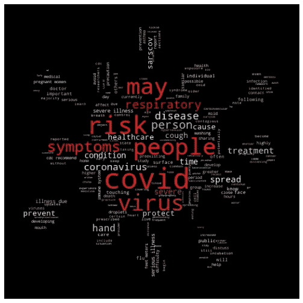
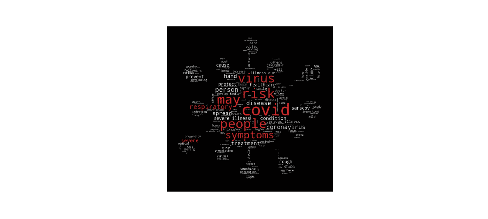

# 创建漂亮且信息丰富的文本表示:单词云

> 原文：<https://towardsdatascience.com/creating-beautiful-informative-representations-of-text-wordclouds-84911f6d05b5?source=collection_archive---------50----------------------->

## 一个简单的 Python 教程

单词云经常被误认为是笨重和过时的。事实上，它们可以是优雅和创造性的文本交流方法，既可以作为探索性分析，也可以作为演示。此外，它们很容易用 Python 创建——所以让我们开始吧！

让我们复制粘贴这篇[新冠肺炎](https://www.medicalnewstoday.com/articles/covid-19#summary)文章的内容，并将其粘贴到一个名为`covid_article.txt`的文本文件中。这个文本文件的内容将被存储到一个名为`content`的变量中。

为了确保一个单词与另一个单词相同，我们需要去掉标点符号和大写字母，这样“hello”就与“hello”相同，而“Hello”与“Hello！”相同。我们还需要确保字符都是字母——我们可以通过列表理解(或者正则表达式)来实现这一点。

显然有一些小问题需要解决，但一般来说这只是一串单词，我们现在继续。我们需要导入`wordcloud`模块(使用`pip install wordcloud`安装)和`matplotlib`库来显示图像。

我们可以使用 wordcloud 用简单的参数构建一个 WordCloud。使用了三个参数——`max_font_size`，表示一个字的最大大小；`max_words`，显示的最大字数；还有`background_color`，设置背景的颜色。Matplotlib 可以用来设置图形大小，显示文字云，不显示轴。

不要担心分辨率低，我们稍后会解决这个问题。

它看起来不是很好，但它有很多我们期望看到的信息，每个单词的大小取决于它在文本中出现的次数。请注意，默认情况下，所谓的“停用词”，或者像“a”、“I”或“and”这样的常用词被排除在词云之外。您可以编写额外的过滤器来删除其他单词。

让我们试着改变颜色。我们需要创建一个函数`color_func()`，它返回一个 HSL 颜色，这是另一种表示颜色的方法(仅次于 RGB)。这个函数返回介于灰色和红色之间的随机颜色。

你可以在这里熟悉 HSL(色相、饱和度、明度)[。供参考，这是`hsl(0,50,50)`的数值。](https://www.w3schools.com/colors/colors_hsl.asp)

要应用 color 函数，请使用以下代码将 wordcloud 转换为数组，并应用重新着色函数。

或者，我们可以重新定义`color_func`函数来接受一个`word`参数，并检查它是否在最常见的单词列表中，`top_words`。在这种情况下，`top_words`是文本中出现超过二十次的所有单词的集合。如果单词是顶部单词，则返回一个随机的红色值。否则，该单词将显示为灰黑色。

让我们把这个词做成病毒形状的云。首先，我们需要找到病毒的图片——你可以在任何搜索引擎上找到它。理想情况下，图像将有一个白色背景来创建一个“面具”。

来源: [IconExperience](https://www.iconexperience.com/o_collection/icons/?icon=virus) 。图片免费分享。

掩码需要通过 PIL (Python Imaging Library)读取，并通过 NumPy 转换成数组。我们需要进口这些。

一旦`mask`被创建，就可以在`WordCloud`中使用，包括参数`mask=mask`。这个例子也使用了上面例子中的着色函数。

不错！Wordcloud 为我们做了适应面具的大部分工作。对于我们的特定图像，较大的单词被推到中间，较小的单词被推到外面，这提供了一个很好的层次风格的可视化。

或者，我们可以将背景改为`‘black’`，将文本颜色改为灰白色，以获得另一种可视化效果。

一些额外的想法/建议:

*   增加字数可以帮助更好地勾勒出面具的轮廓。
*   这些单词云的输出通常是粒状的。要导出高质量图像，请使用`plt.savefig(“filepath/name.png”, dpi=600)`，其中 DPI 为“每英寸点数”。600 DPI 很好地平衡了质量和处理时间。

高分辨率图像！

*   了解到较大的区域通常由较大的单词填充，尝试在 photoshop/PowerPoint 中创建自己的蒙版来表达层次。
*   使用着色功能，您可以突出显示重要的单词，并探索其他提供的`**kwargs`，如`font_size`、`position`和`orientation`。例如，可以根据单词的大小或其在图像中的位置成比例地对单词进行着色(例如，根据单词在图像中的位置对单词进行着色)。

感谢阅读！

 [## 您一直在寻找的 5 个以上简单的一行程序来提升您的 Python 可视化水平

### 最小的努力，最大的收获

towardsdatascience.com](/5-simple-one-liners-youve-been-looking-for-to-level-up-your-python-visualization-42ebc1deafbc) 

除非另有说明，图片由作者创作。