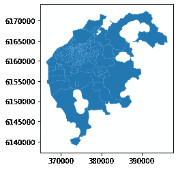
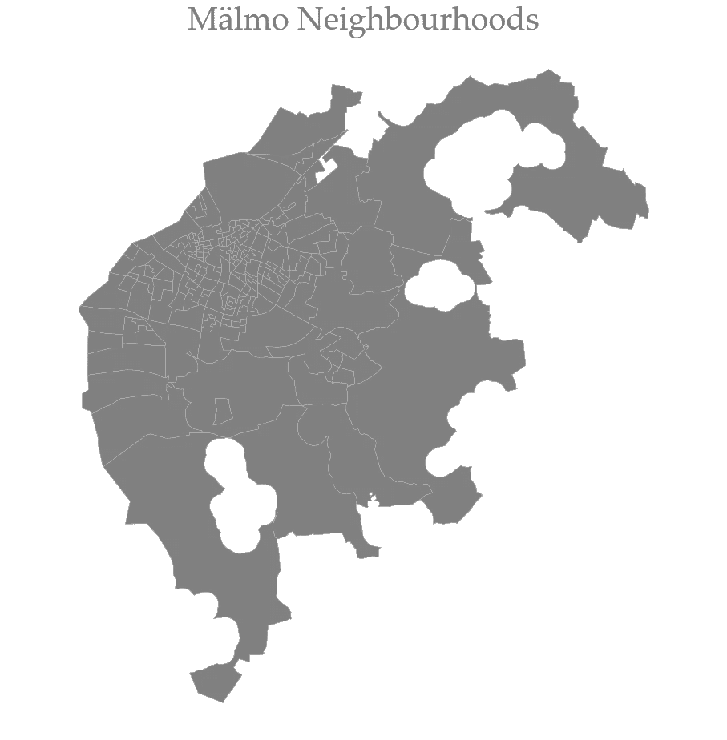
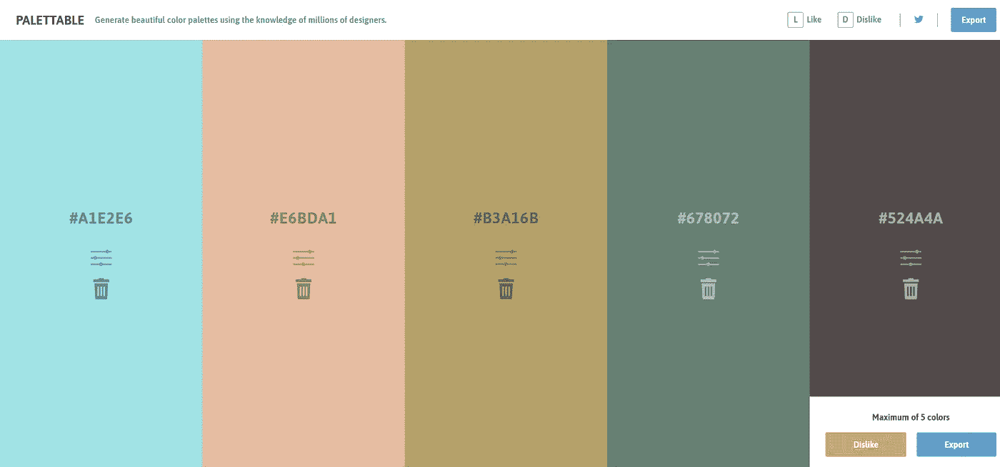
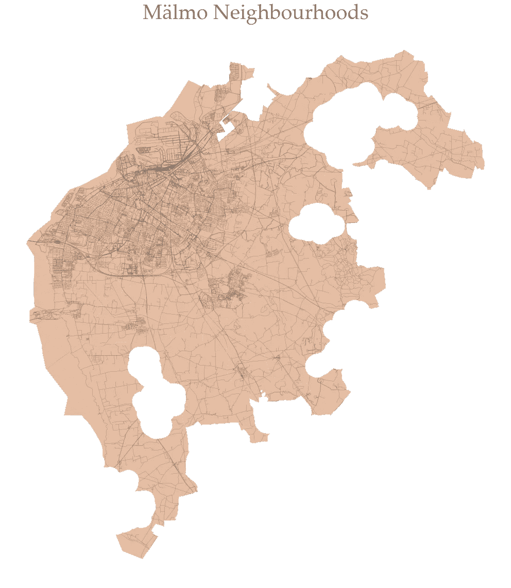
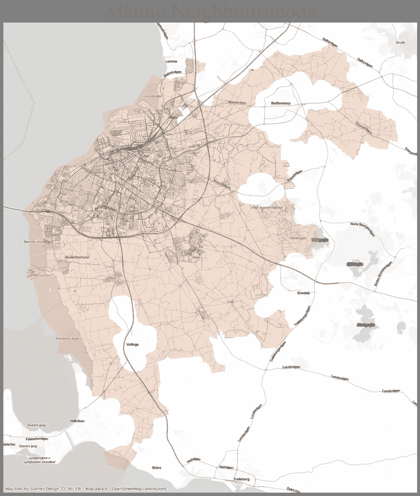

# 使用 Python 创建超越默认设置的美丽地图

> 原文：<https://towardsdatascience.com/creating-beautiful-maps-with-python-beyond-the-defaults-c92593ccf2cc?source=collection_archive---------17----------------------->

## 超越默认地图定制的初学者指南


照片由[珍·西奥多](https://unsplash.com/@jentheodore?utm_source=medium&utm_medium=referral)在 [Unsplash](https://unsplash.com?utm_source=medium&utm_medium=referral) 拍摄

用 Geopandas 制作地图非常容易，但我必须承认，它的默认设置不如其他数据可视化软件。在本教程中，我们将研究改变和创建美丽地图的方法。有许多不同的方式来定制您的地图。我们介绍了一些具体的方法，您可以通过参数、选择颜色以及在地图中添加背景图和底图来增强地图制作。

> 让我们用少而简单的代码制作出光滑美观的地图。

## 数据和默认地图

让我们读取数据，并用默认值将其可视化。我们使用 Geopandas `read_file()` 函数读取数据。用 Geopandas 绘制地理数据也很简单，只需调用`plot())` 函数。

```
gdf = gpd.read_file(“data/malmo-pop.shp”)
gdf.plot()
```



看那张地图。尽管长得丑，我们还是要欣赏这种轻松。我们可以用参数来增强和定制地图。绝不接受默认值。

## 自定义地图参数

上面的地图有几个缺点，我们可以很容易地通过获取和定制参数来解决。在这一节中，我们回顾一些可以帮助我们制作更加美观的地图的基本元素。让我们添加一些基本元素和自定义地图。

```
fig, ax = plt.subplots(figsize=(16,16)) # 1gdf.plot(ax=ax, color=”grey”, edgecolor=”white”, linewidth=0.2) # 2plt.title(‘Mälmo Neighbourhoods’, fontsize=40, fontname=”Palatino 
Linotype”, color=”grey”) # 3ax.axis(“off”) # 4plt.axis('equal') # 5plt.show() # 6
```



到目前为止我们做了什么？。我们为地图添加了一个标题(#3)，并删除了纬度和经度的轴标签(# 4)。在(#5)中，我们还通过确保比例保持固定来确保地图尽可能地代表现实— `plt.axis("equal")`。我们也增加了地图的大小(# 1)。

地图的实际颜色作为参数传递给`plot()`函数。我们将地图默认的蓝色改为灰色，并使线条边缘变小为白色。

我们在定制地图方面走得更远了。上面的地图比之前默认的地图更令人愉快。在下一节，我们将了解如何有效地使用颜色。

## 有效地使用颜色

虽然颜色的选择是个人的，但有许多工具可以通过设计指南帮助你有效地选择颜色。一个这样的工具是[平板](https://www.palettable.io/)。这些是可口可乐的一些指导颜色选择。



我将在地图上添加街道线，这样我们就可以为地图选择不同的颜色。

```
streets = gpd.read_file(“data/malmo-streets.shp”)colors = [“#A1E2E6”, “#E6BDA1”, “#B3A16B”, “#678072”, “#524A4A”]
palplot(colors, size=4)
```

我们可以使用这些颜色来传递函数参数。

```
fig, ax = plt.subplots(figsize=(20,20))
streets.plot(ax=ax, color = colors[4], linewidth= 0.2)
gdf.plot(ax=ax, color=colors[1], edgecolor=”white”, linewidth=0.3)plt.title(‘Mälmo Neighbourhoods’, fontsize=40, fontname=”Palatino Linotype”, color=”grey”)
ax.axis(“off”)
#plt.axis(‘equal’)
plt.show()
```

使用您选择的颜色，您可以增强地图的视觉美感。在这个例子中，我们修改了地图的背景颜色，并给街道线赋予了十六进制颜色#678072。



上图显示了颜色的有效使用，以及如何使用十六进制代码选择颜色。为了给我们的地图添加上下文，我们可以添加底图。

## 添加底图

早先添加背景底图相当复杂，但是随着[上下文库](https://github.com/darribas/contextily)的引入，我们可以很容易地将不同的底图添加到我们的地图中。让我们这样做吧。

```
fig, ax = plt.subplots(figsize=(16, 18))gdf.to_crs(epsg=3857).plot(ax=ax, color=colors[1], edgecolor=”white”, linewidth=0.3, alpha=0.5) # 2 - Projected plot streets.to_crs(epsg=3857).plot(ax=ax, color = colors[4], linewidth= 0.2)ctx.add_basemap(ax, url=ctx.providers.Stamen.TonerLite) # 3plt.title(‘Mälmo Neighbourhoods’, fontsize=40, fontname=”Palatino Linotype”, color=”grey”)
ax.axis(“off”)
#plt.axis(‘equal’)
plt.show()
```

我们只是将数据投影到网络墨卡托，然后绘制它(# 2)，并添加一个底图，在这种情况下，Stamen Toner Lite 设计。这是带底图的地图。根据您的选择，您可以选择许多不同的底图。



上面的地图有一个上下文底图，与 Geopandas 提供的默认地图相比，视觉效果更好。不要接受默认设置，尝试实验和设计你的地图。有了 Matplotlib 的一些知识，您可以用 Python 创建一个美观的地图。

## 结论

在本教程中，我们介绍了如何在使用 Geopandas 制作地图时超越默认设置。我们已经看到了如何使用参数调整和定制绘图。我们也分享了如何在你的地图中加入色彩设计。最后，我们很容易地添加了底图，为地图提供了上下文。

本教程的代码可以在这个 Github 仓库中获得。

[](https://github.com/shakasom/esda/blob/master/Plotting.ipynb) [## shakasom/esda

### permalink dissolve GitHub 是 4000 多万开发人员的家园，他们一起工作来托管和审查代码，管理…

github.com](https://github.com/shakasom/esda/blob/master/Plotting.ipynb)