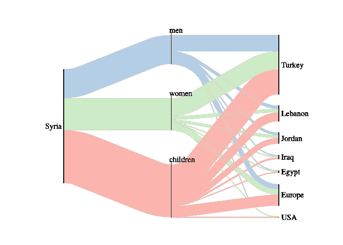
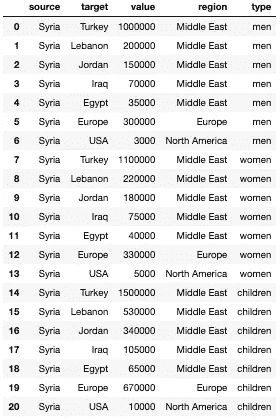
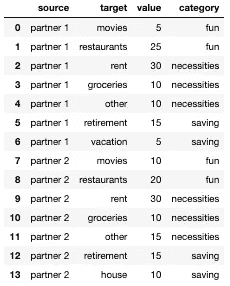
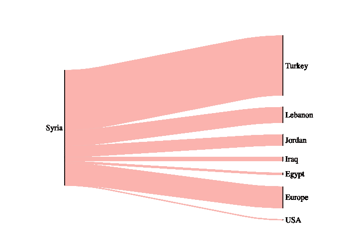
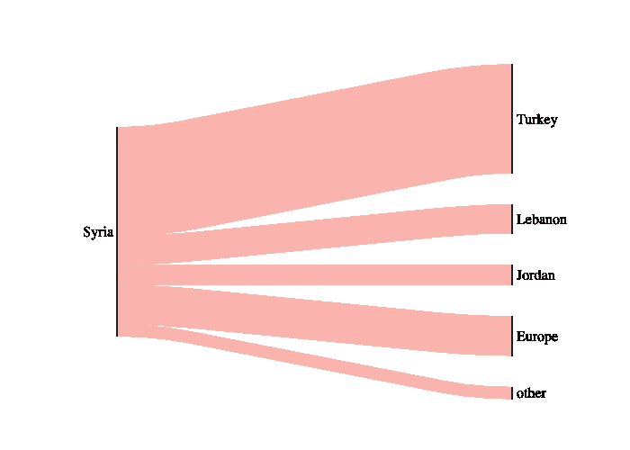
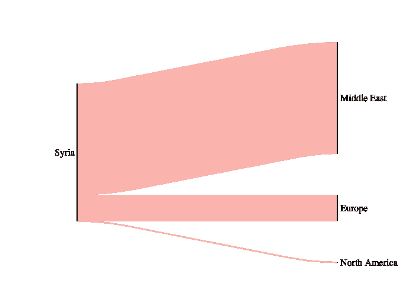
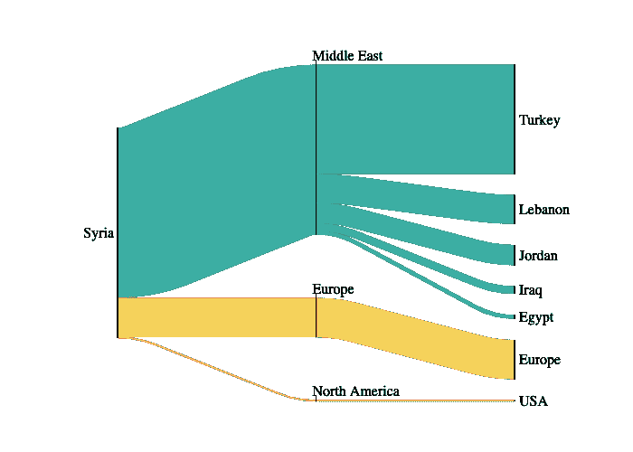
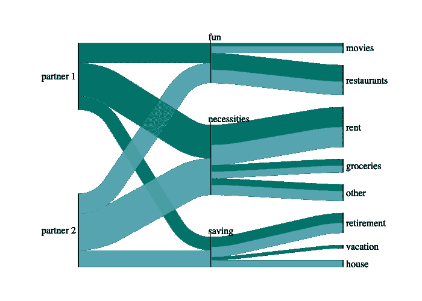
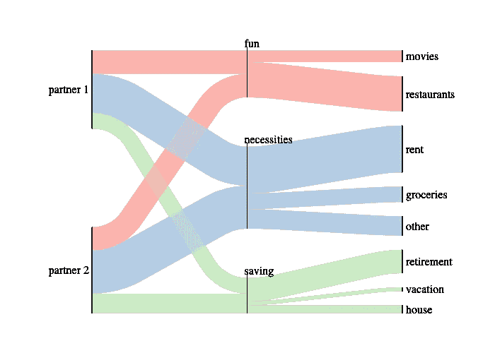

# 用 floWeaver 创建漂亮的桑基图

> 原文：<https://towardsdatascience.com/creating-beautiful-sankey-diagrams-with-floweaver-dc1f02fe76bc?source=collection_archive---------5----------------------->

## 用 Python 升级您的 Sankey 游戏

不久前，我写了“[桑基图](/the-what-why-and-how-of-sankey-diagrams-430cbd4980b5?source=friends_link&sk=9c367ca35aa2e63ca5166a7ef7426ae8)的什么、为什么和如何”在探索 Matplotlib 的 Sankey 库的过程中，我发现了一个可爱的替代品:floWeaver。如果您正在寻找一个不同风格的 Sankey 风格的图来记录流程，这个博客就是为您准备的。



叙利亚难民及其目的地的桑基图(注:性别/年龄数据系捏造)。

老实说，我希望 floWeaver 比 matplotlib sankey 更容易使用。我最终发现它是不同的，而不是更容易/更难。我确实认为默认设置的图表更吸引我，在默认设置中，您必须有一个愿景，并在 matplotlib sankey 中更有意识地进行设计选择。

# 当 floWeaver 运行良好时

以下是一些您可能选择 floWeaver 而不是 matplotlib sankey 的情况:

*   您希望跟踪跨节点的流(例如，标记原始输入源，即使它经过了几个步骤)
*   您没有连接到箭头和方向端点(例如，指向上或指向下的流)
*   你可以接受好看的默认值，不需要对字体大小之类的东西进行太多的控制

# 安装 floWeaver

在 [floWeaver GitHub](https://github.com/ricklupton/floweaver) 上找到你需要知道的一切。或者这里是给`conda`用户的概要:

安装 floWeaver 本身:

```
conda install -c conda-forge floweaver
```

安装 ipysankeywidget 以在 Jupyter 笔记本中显示 sankey 图:

```
conda install -c conda-forge ipysankeywidget
```

启用 ipywidgets。这可能已经启用，但确认一下也无妨:

```
jupyter nbextension enable --py widgetsnbextension --sys-prefix
```

# 数据格式

看起来`floWeaver`需要列/特性“源”、“目标”和“值”。从这里，您可以添加其他特性，使用您想要的任何列名。这些源和目标将成为您的终端节点的一个选项。如果你真的想绘制一个其他的特征作为你的末端节点，那也可以，但是你的末端节点的一个选项仍然应该在“目标”列中(如果我的推断是正确的)

以下是我将在下面使用的示例的数据表:


叙利亚难民数据表



扩大的叙利亚难民数据表(捏造的数据)



家庭财务数据表

# 使用 floWeaver

首先，在 Rick Lubton 和团队的教程、文档和例子中找到这个和更多。我强烈建议您使用它们( [docs](https://floweaver.readthedocs.io/en/latest/) ， [GitHub repo](https://github.com/ricklupton/floweaver) )来进一步调查。

## 制作桑基图



简单难民数据集的桑基图。

1.  从导入和导入数据集开始。这里我们使用上面显示的简单难民数据集。

```
import pandas as pd
from floweaver import *refugees = pd.read_csv('refugees.csv')
```

2.设置您的节点、顺序、包和分区

节点是桑基图的聚集点。你的流动将要流入和流出的固定“位置”。在本例中，左侧是叙利亚，右侧是七个目的地。您可以根据需要命名节点组。每个“进程组”将显示为一组垂直排列的节点。注意 ProcessGroup 接受一个列表作为它的参数，但是在节点名称是否重复方面是灵活的。

```
nodes = {
    'start': ProcessGroup(['Syria']), # one (Syria) at the start 
    'end': ProcessGroup(list(refugees['target'])), # 7 at the end
}
```

顺序是您希望节点进程组出现的顺序(从左到右)。请注意，这是一个进程组/节点名称列表:

```
ordering = [[‘start’], [‘end’]]
```

束是您想要显示的一组连接。这使您可以选择删除任何不必要的连接。包应该是 floWeaver 的列表。捆绑包含连接信息的对象。

```
bundles = [Bundle('start', 'end')]
```

即使您已经定义了节点，我们也需要设置分区，以指示我们希望它们被分割的确切方式。使用`.unique()`让我们不必单独列出每个目的地。

```
nodes['start'].partition = Partition.Simple('source', ['Syria'])
nodes['end'].partition = Partition.Simple('target', 
                                        refugees['target'].unique())
```

3.创建并显示您的桑基图

使用上面的节点、排序和捆绑包创建 Sankey:

```
sdd = SankeyDefinition(nodes, bundles, ordering)
```

要显示桑基，将 floWeaver 的`weave(*sankey_definition, dataset, measures=’value’, link_width=None, link_color=None, palette=None*)`与`.to_widget()`结合使用，以显示在 Jupyter 笔记本中。如果要保存图像，请在`.to_widget()`后添加`.auto_save_png(*filename*)`。

```
weave(sdd, refugees).to_widget().auto_save_png('syria1.png')
```

## 将较小的功能捆绑到一个组合类别中

正如你在上面看到的，我们有一些非常小的流量。除了修改 end nodes 分区之外，您可以使用与上面相同的代码将它们捆绑在一起。不是列出同一级别上的所有节点，而是为您想要进行的任何分组创建一个(名称，节点列表)元组。

```
nodes[‘end’].partition = Partition.Simple(‘target’, 
                            [‘Turkey’, 
                             ‘Lebanon’, 
                             ‘Jordan’, 
                             ‘Europe’,
                             (‘Other’, [‘Iraq’, ‘Egypt’, ‘USA’])])
```

您需要重新创建 Sankey 定义并重新编制 Sankey:

```
sdd = SankeyDefinition(nodes, bundles, ordering)
weave(sdd, refugees).to_widget().auto_save_png('syria_other.png')
```



叙利亚难民与伊拉克、埃及和美国捆绑成“其他”的桑基图

## 突出显示不同的(非目标)特征

为了突出显示一个非目标特性，再次调整分区。在这里，我们按地区划分。

```
# set end partition to region
nodes[‘end’].partition = Partition.Simple(‘region’, 
                                       refugees[‘region’].unique())# create SankeyDefintion, display and save image
sdd = SankeyDefinition(nodes, bundles, ordering)
weave(sdd, refugees).to_widget().auto_save_png('syria_region.png')
```



按地区分列的锡兰难民目的地桑基图。

## 添加路点(中间步骤)

突出流程中不同特征或步骤的另一种方式是通过路点(额外的节点集)。



按地区和目的地分列的叙利亚难民目的地桑基图。

要添加此路点，我们需要

1.  为我们的航点(区域)创建一个新的分区
2.  将航路点添加到我们的节点字典中，提供给`Waypoint`新的区域划分
3.  将航点添加到我们的订购列表中(中间)
4.  通过添加 waypoints=[ *node_name* 作为参数，将航点添加到我们的包中。

```
# create region partition
region = Partition.Simple('region', refugees['region'].unique())# set the "nodes"
nodes = {
    'start': ProcessGroup(['Syria']),
    'middle': Waypoint(region),
    'end': ProcessGroup(list(refugees['target'].unique())), 
}# set the order of the nodes left to right
ordering = [['start'], ['middle'], ['end']]# set the "bundle" of connections
bundles = [Bundle('start', 'end', waypoints=['middle'])]# partition the groups for display
nodes['start'].partition = Partition.Simple('source', ['Syria'])
nodes['end'].partition = Partition.Simple('target', 
                                        refugees['target'].unique())# set color palette
palette = {'North America': '#ED533B', 'Middle East': '#3CAEA3', 
           'Europe': '#F6D55C'}# create sankey with flow_partition
sdd = SankeyDefinition(nodes, bundles, ordering, 
                       flow_partition=region)# display sankey (with color palette) and save as png
weave(sdd, refugees, palette=palette).to_widget().auto_save_png('syria_waypt.png')
```


## 调整显示功能

要调整颜色，创建一个调色板字典，在 SankeyDefinition 中添加您想要着色的分区作为“flow_partition”，并将您的调色板添加到`weave()`。注意:这段代码使用了上面的节点、包、排序和数据集。

```
# set color palette
palette = {'North America': '#ED533B', 'Middle East': '#3CAEA3', 
           'Europe': '#F6D55C'}# create sankey with flow_partition for color
sdd = SankeyDefinition(nodes, bundles, ordering, 
                       flow_partition=region)# display sankey (with color palette) and save as png
weave(sdd, refugees, palette=palette) \
     .to_widget().auto_save_png('syria_waypt.png')
```


要调整 Sankey 输出的大小，创建一个大小字典并将其添加为`.to_widget()`的参数

```
# image size
size = dict(width=570, height=300)# create sankey diagram
weave(sdd, refugees).to_widget(**size).auto_save_png('syria_sm.png')
```

这是最后一个例子，一起展示。



假设家庭资金流动的桑基图

```
# set the nodes
nodes = {
    'start': ProcessGroup(list(household['source'])),
    'category': Waypoint(Partition.Simple('category', 
                         household['category'].unique())),
    'end': ProcessGroup(list(household['target'])),
}# set the order of the nodes left to right
ordering = [['start'], 
            ['category'],
            ['end']]# set the "bundle" of connections you want to show
bundles = [Bundle('start', 'end', waypoints=['category'])]# add the partitions
partner = Partition.Simple('source', household['source'].unique())
nodes['start'].partition = partner
nodes['end'].partition = Partition.Simple('target', 
                         household['target'].unique())# add the color palette
palette = {'partner 1': '#027368', 'partner 2': '#58A4B0'}# create the sankey diagram
sdd = SankeyDefinition(nodes, bundles, ordering, 
                       flow_partition=partner)# display the sankey diagram
weave(sdd, household, palette=palette).to_widget().auto_save_png('./images/household.png')
```

你可以在上面看到，颜色划分并不总是产生我想要的结果，但是在这一点上，我不确定如何调整它。对我来说，根据航路点给流着色看起来最可爱，但不一定能实现桑基图的目标——别忘了把它放在最前面！



更美观的家用桑基图，但不是很好地显示了乐趣、必需品和拯救每个伙伴的贡献。

和往常一样，请查看 [GitHub repo](https://github.com/allisonhonold/floweaver_blog) 中的完整代码。编码快乐！


叙利亚日落。照片由[蒂莫西·卡西斯](https://unsplash.com/@tkassis?utm_source=medium&utm_medium=referral)在 [Unsplash](https://unsplash.com?utm_source=medium&utm_medium=referral) 上拍摄