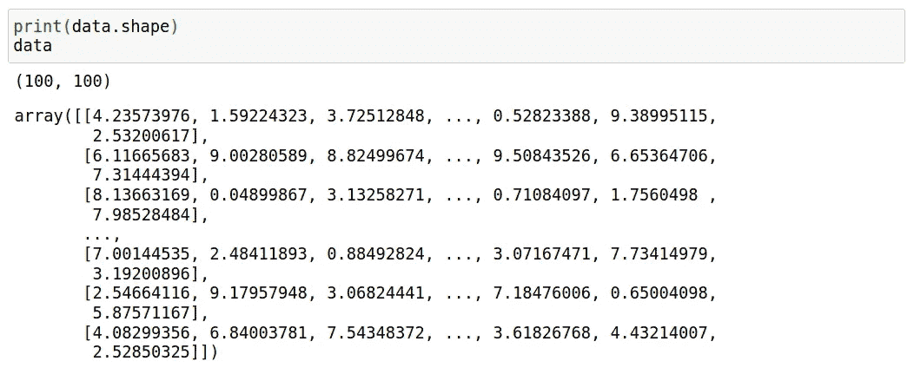
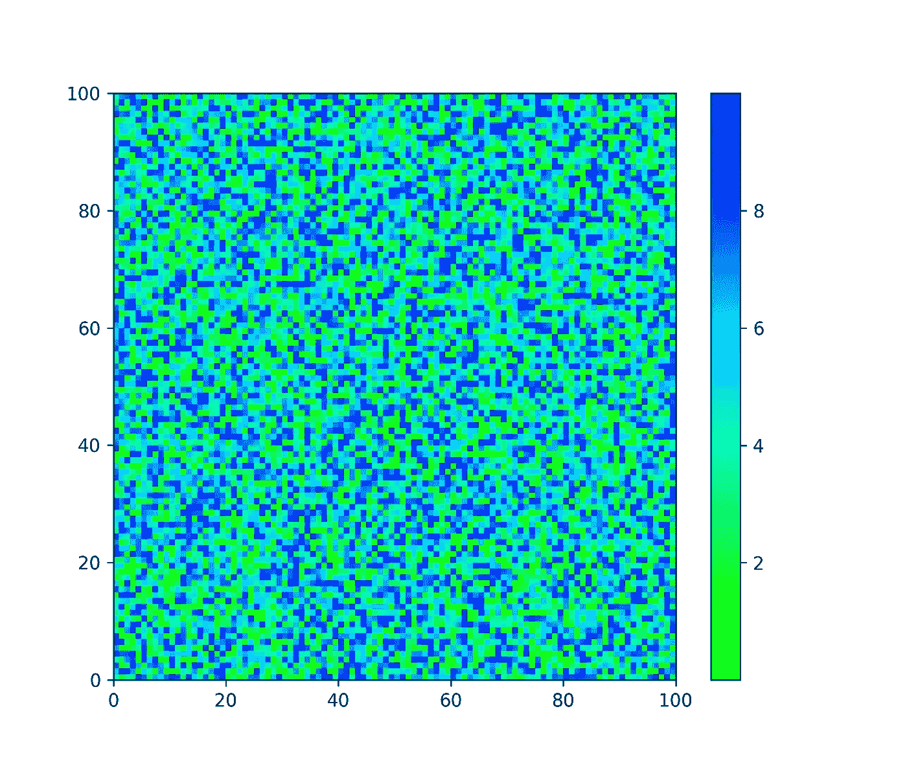

# 在 Matplotlib 中选择和创建色彩映射表

> 原文：<https://towardsdatascience.com/creating-colormaps-in-matplotlib-4d4de78a04b8?source=collection_archive---------7----------------------->


Elena Mozhvilo 在 [Unsplash](https://unsplash.com?utm_source=medium&utm_medium=referral) 上的照片

## MATPLOTLIB 简介

## 从颜色列表中创建和定制自己的色彩映射表的指南

答几乎所有使用 Python 编程语言的程序员都知道 Matplotlib。这是最常用的库之一。它是一个多平台库，可以运行许多操作系统，由 John Hunter 于 2002 年创建。

现在人们开始开发比 Matplotlib 更简单更现代风格的新包，像 Seaborn，Plotly，甚至熊猫都用 Matplotlib 的 API 包装器。但是，我认为 Matplotlib 仍然在许多程序员的心中。

如果你需要学习使用 Matplotlib 的入门知识，你可以看看这个链接。

[](https://medium.com/@bahrulsg/data-visualization-with-matplotlib-for-absolute-beginner-part-i-655275855ec8) [## 用 Matplotlib 实现数据可视化——绝对初学者第一部分

### 这是使用 Matplotlib 和 Jupyter Notebook(一个强大的 Python 模块)可视化我们的数据的教程。

medium.comI](https://medium.com/@bahrulsg/data-visualization-with-matplotlib-for-absolute-beginner-part-i-655275855ec8) 

# Matplotlib 中的色彩映射表

在可视化 3D 绘图时，我们需要色图来区分 3D 参数并做出一些直觉。科学上讲，人脑是根据看到的不同颜色来感知各种直觉的。

Matplotlib 提供了一些您可以使用的漂亮的色彩映射表，例如顺序色彩映射表、发散色彩映射表、循环色彩映射表和定性色彩映射表。出于实用的目的，我没有更详细地解释它们之间的区别。如果我向您展示 Matplotlib 中每个分类色彩映射表的示例，我想这将会很简单。

以下是一些连续色彩映射表的示例(并非全部)。


由 [Matplotlib](https://matplotlib.org/3.3.1/tutorials/colors/colormaps.html) 提供的连续色彩映射表。

Matplotlib 会给你**绿色的**作为默认的颜色图。然后，接下来是 Matplotlib 中发散、循环、定性和杂项色彩映射表的示例。


Matplotlib 中的色彩映射表。

# 你自己的彩色地图

你对所有提供的颜色图都不感兴趣吗？还是需要其他花哨的彩图？如果是的话，你需要看完这篇文章。我将指导你定制和创建你自己的色彩映射表。

但是在定制它之前，我会给你看一个使用色彩映射表的例子。我使用' **RdYlBu_r** '色彩映射表来可视化我的数据。


Matplotlib 中 RdYlBu_r 色彩映射表的示例(图片由作者提供)

让我们修改你自己的色彩映射表。

首先，我们需要使用下面的代码创建可视化的模拟数据

```
# import some libraries /  modules
import numpy as np
import matplotlib.pyplot as plt# create mock data
data = np.random.random([100, 100]) * 10
```

数据变量是一个数组，由 100 x 100 个从 0 到 10 的随机数组成。你可以通过写这段代码来检查它。



要可视化的模拟数据(图片由作者提供)

之后，我们将使用下面的简单代码显示带有默认颜色图的模拟数据。

```
plt.figure(figsize=(7, 6)) 
plt.pcolormesh(data)
plt.colorbar()
```

代码将向您显示这样的图形。


Colormesh 使用默认色彩映射表可视化模拟数据(图片由作者提供)

正如我之前提到的，如果你没有定义你使用的色彩映射表，你将得到默认的色彩映射表，命名为' **viridis** '。

接下来，我将用这段代码将彩色地图从'**绿色**改为'**地狱**彩色地图

```
plt.pcolormesh(data, **cmap='inferno'**)
```

你会得到这样的结果


Colormesh 使用“inferno”色图可视化模拟数据

# 修改色彩映射表

现在，要修改色彩映射表，您需要在 Matplotlib 中导入以下子库。

```
from matplotlib import cm 
from matplotlib.colors import ListedColormap,LinearSegmentedColormap
```

要修改颜色图中颜色类别的数量，您可以使用以下代码

```
new_inferno = cm.get_cmap('inferno', 5)# visualize with the new_inferno colormaps
plt.pcolormesh(data, **cmap = new_inferno**)
plt.colorbar()
```

并且会得到这样一个结果


修改后的地狱只有 5 种颜色。

下一步是修改色图中的范围颜色。我会给你一个“hsv”色图的例子。你需要用这个图来了解颜色的范围。


hsv 彩色地图(图片由作者提供)

如果我们只想使用绿色(大约 0.3)到蓝色(0.7)，我们可以使用下面的代码。

```
# modified hsv in 256 color class
hsv_modified = cm.get_cmap('hsv', 256)# create new hsv colormaps in range of 0.3 (green) to 0.7 (blue)
newcmp = ListedColormap(hsv_modified(np.linspace(0.3, 0.7, 256)))# show figure
plt.figure(figsize=(7, 6))
plt.pcolormesh(data, **cmap = newcmp**)
plt.colorbar()
```

它会给你一个这样的数字



修改“hsv”色彩映射表的范围颜色(图片由作者提供)

## 创建您自己的色彩映射表

要创建自己的色彩映射表，至少有两种方法。首先，您可以在 Matplotlib 中组合两个连续的色彩映射表。第二，你可以在 RGB 中选择和组合你喜欢的颜色来创建彩色地图。

我们将向您演示如何将两个连续的色彩映射表合并为一个新的色彩映射表。我们想把“橙色”和“蓝色”结合起来。


结合蓝色和橙色的色彩映射表创建一个新的(作者图片)

你可以仔细阅读这段代码。

```
# define top and bottom colormaps 
top = cm.get_cmap('Oranges_r', 128) # r means reversed version
bottom = cm.get_cmap('Blues', 128)# combine it all
newcolors = np.vstack((top(np.linspace(0, 1, 128)),
                       bottom(np.linspace(0, 1, 128))))# create a new colormaps with a name of OrangeBlue
orange_blue = ListedColormap(newcolors, name='OrangeBlue')
```

如果您使用‘orange blue’色彩映射表来可视化模拟数据，您将得到如下图。


橙色蓝色地图(图片由作者提供)

下一步是从你喜欢的两种不同的颜色创建一个色图。在这种情况下，我将尝试从黄色和红色创建它，如下图所示


将被组合的两种颜色(图片由作者提供)

首先，你需要创建黄色色图

```
# create yellow colormapsN = 256yellow = np.ones((N, 4))yellow[:, 0] = np.linspace(255/256, 1, N) # R = 255
yellow[:, 1] = np.linspace(232/256, 1, N) # G = 232
yellow[:, 2] = np.linspace(11/256, 1, N)  # B = 11yellow_cmp = ListedColormap(yellow)
```

和红色地图

```
red = np.ones((N, 4))red[:, 0] = np.linspace(255/256, 1, N)
red[:, 1] = np.linspace(0/256, 1, N)
red[:, 2] = np.linspace(65/256, 1, N)red_cmp = ListedColormap(red)
```

下图显示了您创建的黄色和红色色彩映射表的可视化效果


**左**:红色 _cmp 和**右**:黄色 _cmp(图片由作者提供)

之后，您可以使用前面的方法组合它。

```
newcolors2 = np.vstack((yellow_cmp(np.linspace(0, 1, 128)),
                       red_cmp(np.linspace(1, 0, 128))))double = ListedColormap(newcolors2, name='double')plt.figure(figsize=(7, 6))plt.pcolormesh(data, cmap=double)
plt.colorbar()
```

你会得到这样一个数字


你自己的彩色地图:D

您还可以使用此代码调整色彩映射表的方向、延伸和焊盘距离。

```
plt.figure(figsize=(6, 7))plt.pcolormesh(data, cmap = double)
plt.colorbar(orientation = 'horizontal', label = 'My Favourite Colormaps', extend = 'both', pad = 0.1)
```

你会看到一个这样的图形


修改的色彩映射表

## 结论

为你的色彩图选择正确的颜色是很重要的，因为这是人类思维的表现。颜色表达思想、信息和情感。Matplotlib 提供了许多颜色图，但是有些人在选择颜色图时有不同的倾向。如果他们想建立自己的品牌，他们需要创建自己的色彩映射表。我希望这个故事可以帮助你在 Matplotlib 中创建和修改你自己的色彩映射表。

## 如果你喜欢这篇文章，这里有一些你可能喜欢的其他文章:

[](/5-powerful-tricks-to-visualize-your-data-with-matplotlib-16bc33747e05) [## 使用 Matplotlib 可视化数据的 5 个强大技巧

### 如何使用 LaTeX 字体，创建缩放效果，发件箱图例，连续错误，以及调整框填充边距

towardsdatascience.com](/5-powerful-tricks-to-visualize-your-data-with-matplotlib-16bc33747e05) [](/matplotlib-styles-for-scientific-plotting-d023f74515b4) [## 用于科学绘图的 Matplotlib 样式

### 为您的科学数据可视化定制 Matplotlib

towardsdatascience.com](/matplotlib-styles-for-scientific-plotting-d023f74515b4) [](/visualizations-with-matplotlib-part-1-c9651008b6b8) [## 使用 Matplotlib 实现 Python 数据可视化—第 1 部分

### 完成了从基础到高级的 Python 绘图的 Matplotlib 教程，包含 90 多个示例

towardsdatascience.com](/visualizations-with-matplotlib-part-1-c9651008b6b8) [](/customizing-multiple-subplots-in-matplotlib-a3e1c2e099bc) [## 在 Matplotlib 中自定义多个子情节

### 使用 subplot、add_subplot 和 GridSpec 在 Matplotlib 中创建复杂 subplot 的指南

towardsdatascience.com](/customizing-multiple-subplots-in-matplotlib-a3e1c2e099bc) [](/introduction-to-big-data-a-simple-code-to-read-1-25-billion-rows-c02f3f166ec9) [## Vaex 大数据简介—读取 12.5 亿行的简单代码

### 用 Python 高效读取和可视化 12.5 亿行星系模拟数据

towardsdatascience.com](/introduction-to-big-data-a-simple-code-to-read-1-25-billion-rows-c02f3f166ec9) 

仅此而已。感谢您阅读这个故事。喜欢就评论分享。我还建议您关注我的帐户，以便在我发布新故事时收到通知。