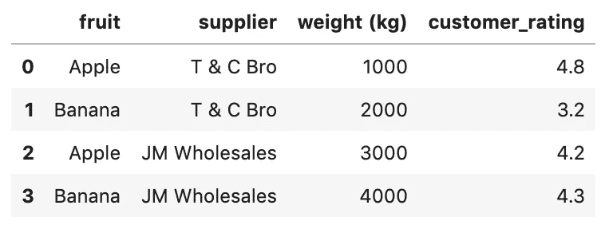
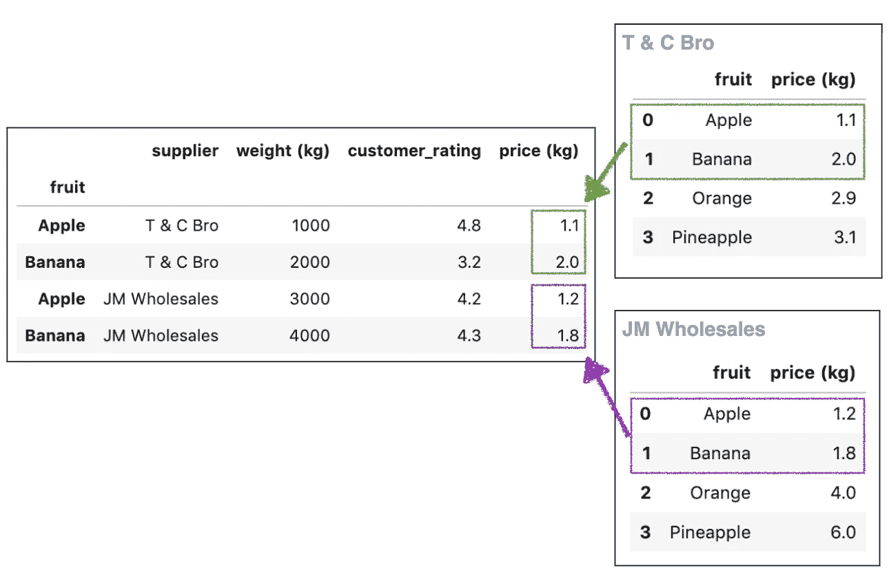
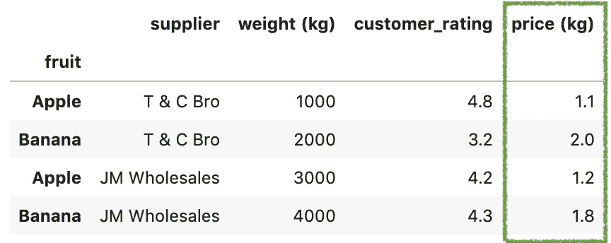
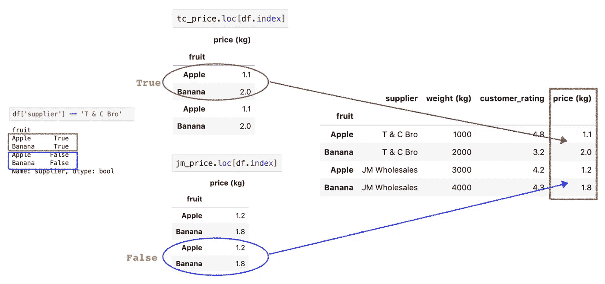
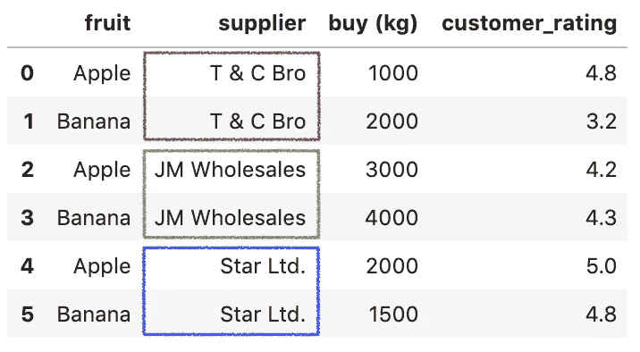
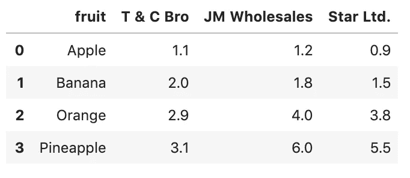
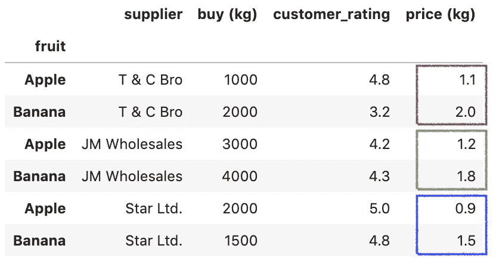

# 用 Numpy select()和 where()方法在 Pandas 上创建条件列

> 原文：<https://towardsdatascience.com/creating-conditional-columns-on-pandas-with-numpy-select-and-where-methods-8ee6e2dbd5d5?source=collection_archive---------3----------------------->

## 一些最有用的熊猫把戏


帕斯卡尔·贝纳登在 [Unsplash](https://unsplash.com/s/photos/pandas-data?utm_source=unsplash&utm_medium=referral&utm_content=creditCopyText) 上拍摄的照片

Pandas 是一个令人惊叹的库，它包含大量用于操作数据的内置函数。虽然内置函数能够执行有效的数据分析，但是合并其他库中的方法为 Pandas 增加了价值。

在本文中，我们将看看如何用 Numpy `select()`和`where()`方法在 Pandas 上创建条件列

请查看我的 [Github repo](https://github.com/BindiChen/machine-learning/blob/master/data-analysis/015-pandas-numpy-select-where/pandas-and-numpy-select-where.ipynb) 获取源代码

# 从两个选项中创建条件列

假设我们有一个关于水果店的数据集。

```
df = pd.DataFrame({
    'fruit': ['Apple', 'Banana', 'Apple', 'Banana'],
    'supplier': ['T & C Bro', 'T & C Bro', 'JM Wholesales', 'JM Wholesales'],
    'weight (kg)': [1000,2000,3000,4000],
    'customer_rating': [4.8,3.2, 4.2, 4.3]
})
```



水果店数据集(作者制作)

我们可以看到，商店从两个供应商处购买了水果“ **T & C Bro** ”和“ **JM 批发**”。它们的价目表分别保存如下:

```
# T & C Bro
**tc_price** = pd.DataFrame({
    'fruit': ['Apple', 'Banana', 'Orange', 'Pineapple'],
    'price (kg)': [1.1, 2, 2.9, 3.1]
})# JM Wholesales
**jm_price** = pd.DataFrame({
    'fruit': ['Apple', 'Banana', 'Orange', 'Pineapple'],
    'price (kg)': [1.2, 1.8, 4, 6]
})
```

我们希望从供应商的价目表中检索价格，将它们组合起来，并将结果添加到新列中。预期的输出是:



作者制作的图像

这个计算中棘手的部分是，我们需要有条件地检索 ***价格(公斤)*** (基于**供应商**和**水果**)，然后将其组合回水果店数据集。

对于这个例子，一个改变游戏规则的解决方案是结合 Numpy `where()`函数。一行代码就可以解决检索和合并。

## 第一步:将`fruit`列设置为索引

```
df = df.**set_index('fruit')**tc_price = tc_price.**set_index('fruit')**jm_price = jm_price.**set_index('fruit')**
```

通过调用`set_index('fruit')`将 ***果*** 列设置为所有数据集的索引。这很重要，所以我们可以稍后使用`loc[df.index]`来选择用于值映射的列。

## 步骤 2:将 Numpy `where()`与 Pandas 数据框架合并

Numpy `where(**condition**, **x**, **y**)`方法[1]根据`condition`返回从`x`或`y`中选择的元素。最重要的是，这个方法可以接受类似数组的输入，并返回类似数组的输出。

```
df['price (kg)'] = **np.where**(
    **df['supplier'] == 'T & C Bro'**, 
    tc_price**.loc[df.index]['price (kg)']**, 
    jm_price**.loc[df.index]['price (kg)']**
)
```

通过执行上述语句，您应该得到如下输出:



作者制作的图像

有点困惑？以下是一些细节:

*   `df['supplier'] == 'T & C Bro'`返回一个布尔数组
*   `df.index`返回`['Apple', 'Banana', 'Apple', 'Banana']`(由 ***步骤 1*** 设定的指标)。并且`tc_price.loc[df.index]`和`jm_price.loc[df.index]`都基于标签`df.index`返回相同长度的数据帧。



`np.where()`如何工作

# 从两个以上的选项中创建条件列

我们已经学习了如何从两个数据集创建一个条件列。如果超过 2 个数据集呢，例如，水果店数据集中有 3 个不同的供应商。



有 3 个供应商的水果店数据集(作者制作)

对于 2 个以上的数据集/选择，我们可以使用 Numpy `select()`方法。让我们借助一个例子来看看它是如何工作的。

## 步骤 1:将价格列表组合在一起，并将`fruit`列设置为索引

第一步是将所有价格列表合并到一个数据集中。



之后，设置 ***果*** 列为索引。

```
df_3 = df_3.**set_index('fruit')**df_price = df_price.**set_index('fruit')**
```

## 步骤 2:将 Numpy `select()`与 Pandas 数据框架合并

Numpy `select(**condlist**, **choicelist**)`方法根据`condlist`中的条件返回一个从`choicelist`中的元素提取的数组。

```
args = df_price.loc[df_3.index]**conds = [
    df_3['supplier'] == 'T & C Bro', 
    df_3['supplier'] == 'JM Wholesales', 
    df_3['supplier'] == 'Star Ltd.',
]****choices = [
    args['T & C Bro'], 
    args['JM Wholesales'], 
    args['Star Ltd.'],
]**df_3['price (kg)'] = np.select(**conds**, **choices**)
```

基本上，

*   如果条件`df_3['supplier'] == 'T & C Bro'`满足，则从`args['T & C Bro']`获取输出元素。
*   如果条件`df_3['supplier'] == 'JM Wholesale'`被满足，它从`args['JM Wholesale']`获取输出元素。
*   如果条件`df_3['supplier'] == 'Star Ltd.'`满足，它从`args['Star Ltd.']`获取输出元素。

通过执行上述语句，您应该得到如下输出:



`np.select()`的输出

# 好了

感谢阅读。

请在我的 Github 上的[笔记本中查看源代码。](https://github.com/BindiChen/machine-learning/blob/master/data-analysis/015-pandas-numpy-select-where/pandas-and-numpy-select-where.ipynb)

如果你对机器学习的实用方面感兴趣，请继续关注。

## 你可能会对我的其他一些熊猫文章感兴趣:

*   [何时使用熊猫变换()函数](/when-to-use-pandas-transform-function-df8861aa0dcf)
*   [熊猫数据透视表实用介绍 _table()函数](/a-practical-introduction-to-pandas-pivot-table-function-3e1002dcd4eb)
*   [使用熊猫方法链接提高代码可读性](https://medium.com/@bindiatwork/using-pandas-method-chaining-to-improve-code-readability-d8517c5626ac)
*   [在 Pandas 数据框架中处理日期时间](/working-with-datetime-in-pandas-dataframe-663f7af6c587)
*   [熊猫阅读 _csv()你应该知道的招数](https://medium.com/@bindiatwork/all-the-pandas-read-csv-you-should-know-to-speed-up-your-data-analysis-1e16fe1039f3)
*   [用 Pandas read_csv()解析日期列应该知道的 4 个技巧](/4-tricks-you-should-know-to-parse-date-columns-with-pandas-read-csv-27355bb2ad0e)

更多可以从我的 [Github](https://github.com/BindiChen/machine-learning) 中找到

# 参考

*   [1] [Numpy 文档— where()](https://numpy.org/doc/stable/reference/generated/numpy.where.html)
*   [2] [Numpy 文档— select()](https://numpy.org/doc/stable/reference/generated/numpy.select.html)