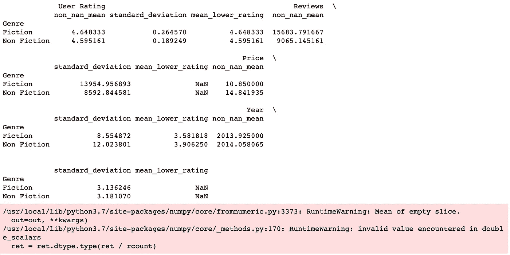

# 创建用于熊猫分组的自定义聚合

> 原文：<https://towardsdatascience.com/creating-custom-aggregations-to-use-with-pandas-groupby-e3f5ef8cb43e?source=collection_archive---------6----------------------->

## 我开始使用带有自定义聚合的 groupby，我想与您分享我所学到的东西。


照片来自[黛比·莫勒](https://unsplash.com/@djmle29n)在 [Unsplash](https://unsplash.com/) 上

Pandas `groupby`是一个函数，你可以在数据帧上使用它来分割对象，应用一个函数，并组合结果。当您想要将大量数据分组并为每个组计算不同的操作时，此函数非常有用。如果您将聚合函数与您的`groupby`一起使用，则每次函数运行时，该聚合将为每个组返回一个值。形成组后，可以对分组的数据运行一个或多个聚合。

我今天使用的数据集是 Kaggle 上的[亚马逊 50 大畅销书](https://www.kaggle.com/sootersaalu/amazon-top-50-bestselling-books-2009-2019)。这个数据集有一些我们可以使用的很好的数字列和类别。导入数据集后，我们可以快速查看一个使用`head(1)`抓取第一行并用`.T`转置数据的例子。这里我们可以看到流派是`groupby,`的一个很好的分类栏，我们可以汇总用户评级、评论、价格和年份。

```
df = pd.read_csv("bestsellers_with_categories.csv")
print(df.head(1).T)>>> 0
>>> Name         10-Day Green Smoothie Cleanse
>>> Author                            JJ Smith
>>> User Rating                            4.7
>>> Reviews                              17350
>>> Price                                    8
>>> Year                                  2016
>>> Genre                          Non Fiction
```

现在我们已经快速浏览了这些列，我们可以使用`groupby`对 Genre 的数据进行分组。在应用`groupby`之前，我们可以在这个数据集中看到两个体裁类别，非小说和小说，这意味着我们将有两组数据要处理。如果我们想考虑作者或书名，我们可以和小组一起玩，但我们现在将坚持流派。

```
df.Genre.unique()>>> array(['Non Fiction', 'Fiction'], dtype=object)group_cols = ['Genre']
ex = df.groupby(group_cols)
```

# 为系列数据创建自定义聚合

在设置我们的组之后，我们可以开始创建自定义聚合。我曾在类似这样的函数中使用自定义聚合，在不同条件下执行计算或聚合之前过滤掉特定的值。当我测试聚合函数时，我喜欢从一个小系列开始来验证输出，如下图所示。

```
ser = pd.Series([1,10,4,2,10,10])
```

一旦我们有了一系列要测试的数据，我们就可以开始创建聚合函数了。下面我创建了三个聚合函数。第一个和第二个函数是`non_nan_mean`和`standard_deviation`，它们验证序列不为空，移除任何 NA 值，并执行平均值或标准偏差计算。最后一个聚合是一个`mean_lower_rating`，它消除任何大于 5 的上限值，并计算下限值的平均值。

```
def non_nan_mean(x):
    if x.empty:
        return None
    else: 
        x = x.dropna()
        return np.mean(x)def standard_deviation(x):
    if x.empty:
        return None 
    else: 
        x = x.dropna()
        return np.nanstd(x)

def mean_lower_rating(x):
    upper = []
    for val in x:
        if val > 5:
            continue 
        else: 
            upper.append(val)
    return np.mean(upper)
```

一旦你定义了你的聚合函数，根据你的需要，你可以应用你的序列来测试。我打印出我的值来查看，如下所示。

```
print(non_nan_mean(ser))
print(standard_deviation(ser))
print(mean_lower_rating(ser))>>> 6.166666666666667
>>> 3.9334745737353156
>>> 2.3333333333333335
```

# 通过 Groupby 应用聚合

在理解了您正在使用的数据集并使用少量数据测试了聚合函数之后，您可以应用使用前面提到的`agg`函数创建的聚合函数。这个函数作用于 dataframes，它允许我们聚合指定轴上的数据。应用这些聚合的一个简单方法是创建一个列表，并将该列表作为参数传递。此方法会将您的聚合应用到组数据框架中的所有数字列，如下面的示例一所示。在这个例子中，你可以看到我正在调用`ex`，这是前面的分组输出。

## 示例 1:

```
aggs = [non_nan_mean, standard_deviation,mean_lower_rating]
ex2 = ex.agg(aggs)
print(ex2)
```



Jupyter notebook 中生成的字典聚合的输出。

从输出中可以看出，`mean_lower_rating`聚合在特定的列上表现不佳，这是由为特定列设计的函数(即用户评级)造成的。考虑到这一点，我们可以看看将聚合参数传递到`agg`函数的不同方式，这将清理输出。

将参数传递给`agg`的另一种方法是开发一个字典。字典将列名映射到要运行的聚合函数。这种方法的一个例子见例二。

## 示例 2:

```
aggs_by_col = {'Reviews': [non_nan_mean], 
               'Price': [non_nan_mean,standard_deviation],
               'User Rating': [mean_lower_rating]}
ex1 = ex.agg(aggs_by_col)
print(ex1)
```


Jupyter notebook 中生成的字典聚合的输出。

如前所述，如果您不想使用`mean_lower_rating`聚合将所有聚合应用于所有列，则首选此方法。定义聚合应用于哪些列的过程对于大型数据集非常有益，因为它清理了输出，只提供了您想要查看的数据。这种应用聚合的方法允许我只为用户评级指定`mean_lower_rating`聚合，并将其他聚合指定到它们各自的列。

# 最后的想法

将 Pandas `groupby`与`agg`函数一起使用将允许您将数据分组到不同的类别中，并将您的数字列聚合到每个聚合函数的一个值中。如果您有创建自定义聚合函数的用例，您可以编写这些函数来接收一系列数据，然后使用列表或字典将它们传递给`agg`。如果希望所有的聚合都应用于所有的数字列，可以传递一个列表；如果要指定哪些聚合应用于哪些列，可以传递一个字典。如果您愿意，还可以使用 lambda 函数来创建聚合，这一点我在本文中没有涉及。

# 附加阅读

*   [熊猫。DataFrame.groupby](https://pandas.pydata.org/pandas-docs/stable/reference/api/pandas.DataFrame.groupby.html) 文档
*   [pandas . core . group by . data frame group by . aggregate](https://pandas.pydata.org/pandas-docs/stable/reference/api/pandas.core.groupby.DataFrameGroupBy.aggregate.html)文档
*   [分组依据:分解-应用-合并](https://pandas.pydata.org/pandas-docs/stable/user_guide/groupby.html)文档
*   熊猫。DataFrame.agg 文档

如果你想阅读更多，看看我下面的其他文章吧！

[](/top-8-skills-for-every-data-scientist-79e6b1faf3e1) [## 每位数据科学家的 8 大技能

### 当我参加大学讲座时，最常被问到的问题是“我需要具备什么技能？”

towardsdatascience.com](/top-8-skills-for-every-data-scientist-79e6b1faf3e1) [](/stop-wasting-your-time-and-consult-a-subject-matter-expert-f6ee9bffd0fe) [## 停止浪费你的时间，咨询一个主题专家

### 在从事数据科学项目时，请一位主题专家来审查您的工作可能会有所帮助。

towardsdatascience.com](/stop-wasting-your-time-and-consult-a-subject-matter-expert-f6ee9bffd0fe) [](/keys-to-success-when-adopting-a-pre-existing-data-science-project-9f1225fb0275) [## 采用现有数据科学项目的成功关键

### 代码本来可能不是你的，但现在是你的了。那么接下来呢？

towardsdatascience.com](/keys-to-success-when-adopting-a-pre-existing-data-science-project-9f1225fb0275) [](/dont-be-too-proud-to-ask-for-help-76f21d16f318) [## 不要太骄傲而不愿寻求帮助

### 如果你被一个 bug 卡住了或者感到不知所措，你可以寻求你需要的帮助。

towardsdatascience.com](/dont-be-too-proud-to-ask-for-help-76f21d16f318) [](/top-3-articles-for-data-visualization-956a08a54b04) [## 数据可视化的前 3 篇文章

### 如果您想更好地构建数据可视化，这些文章很有帮助。

towardsdatascience.com](/top-3-articles-for-data-visualization-956a08a54b04)