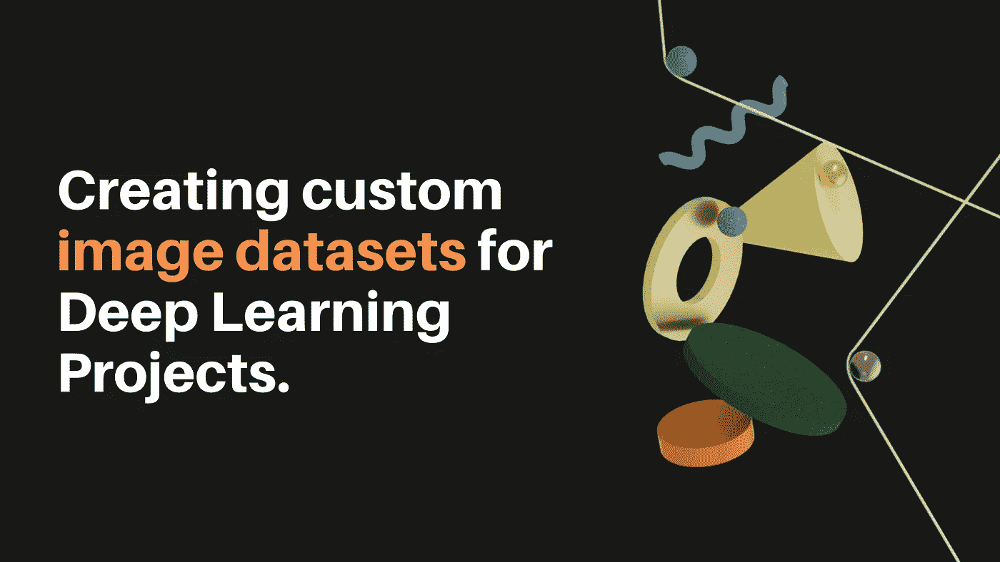
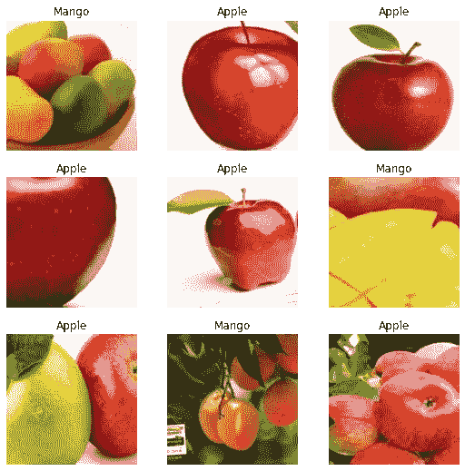

# 为深度学习项目创建自定义图像数据集

> 原文：<https://towardsdatascience.com/creating-custom-image-datasets-for-deep-learning-projects-6e5db76158d4?source=collection_archive---------23----------------------->

## 下载图像数据集的一些有用的浏览器扩展



作者图片

这个周末，我为我学龄前的孩子制作了一个简单的水果分类器。这是一个简单的图像分类应用程序，可以预测图像中的水果。我把它作为一个游戏呈现给我的儿子，看谁先预测到这个名字——计算机还是人类:)。这是一个应用程序的预览。

水果分类器应用程序(作者视频)

对于这个应用程序，我需要下载许多水果的图像来训练图像分类器。在这个过程中，我发现了一些浏览器扩展，这使得批量下载图像变得非常容易，我已经编译并在本文中展示了它们。

然而，在开始使用扩展之前，有两件重要的事情需要记住:

> **版权问题**
> 
> 不要下载任何违反版权条款的图片。有时，没有所有者的许可，你不能复制版权图像。本文中下载的图片仅用于教育目的。
> 
> **下载设置**
> 
> 确保您的下载设置中没有选择“**在下载前询问每个文件的保存位置**”，否则，下载器会询问您是否允许下载每个文件。不可取。下面的片段演示了访问该选项的过程。

下载设置(按作者分类的视频)

这篇文章是寻找好数据集的完整系列文章的一部分。以下是该系列中包含的所有文章:

**第 1 部分** : [为数据分析任务获取数据集——高级谷歌搜索](/getting-datasets-for-data-analysis-tasks-advanced-google-search-b1c01f9cc324)

**第 2 部分** : [为数据分析任务寻找数据集的有用站点](/useful-sites-for-finding-datasets-for-data-analysis-tasks-1edb8f26c34d)

**第三部分** : [为深度学习项目创建定制图像数据集](/creating-custom-image-datasets-for-deep-learning-projects-6e5db76158d4)

**第四部分** : [毫不费力地将 HTML 表格导入谷歌表单](/import-html-tables-into-google-sheets-effortlessly-f471eae58ac9)

**第 5 部分** : [使用 Camelot，从 pdf 中提取表格数据变得很容易。](/extracting-tabular-data-from-pdfs-made-easy-with-camelot-80c13967cc88)

**第六部分** : [从 XML 文件中提取信息到熊猫数据框架](/extracting-information-from-xml-files-into-a-pandas-dataframe-11f32883ce45)

**第 7 部分** : [磨练您探索性数据分析技能的 5 个真实世界数据集](/5-real-world-datasets-for-exploratory-data-analysis-21b7cc5afe7e)

现在让我们来看看一些方便下载图像的有用工具:

# 1.Fatkun 批量下载图像

Fatkun 批量下载图像是一个强大和方便的浏览器扩展，从网上下载图像。它的一些功能包括:

*   可以根据分辨率或链接过滤图像
*   创建自定义规则来下载所需的图像，以及
*   能够批量重命名和批量下载图像

[**🔗链接下载**扩展](https://chrome.google.com/webstore/detail/fatkun-batch-download-ima/nnjjahlikiabnchcpehcpkdeckfgnohf/related?hl=en)

## 使用

现在让我们下载苹果水果的图像，因为我们想要创建一个水果分类检测器。因为展示比写过程更容易，所以我包含了一个简短的视频来一步一步地展示下载过程。

Fatkun 批量下载图像演示(视频由作者提供)

# 2.Imageye —图像下载器

Imageye 是另一个浏览器扩展，允许你下载网页上的所有图片。Imageye 还为您提供了以下功能:

*   基于像素宽度和高度过滤图像。您也可以根据图像的 URL 过滤图像。
*   像 Fatkun 一样，你可以一次批量下载所有图片，或者手动选择你想要下载的图片。

## 🔗[下载扩展的链接](https://chrome.google.com/webstore/detail/imageye-image-downloader/agionbommeaifngbhincahgmoflcikhm?hl=en)

## 使用

Imageye —图像下载程序演示(视频由作者提供)

# 3.下载所有图像

这个 Chrome 扩展从一个网页上下载所有的图片，并把它们打包成一个 zip 文件。它不能根据图片的大小来过滤图片，但对于从 Unsplash 等网站批量下载图片来说却是极好的，因为 Unsplash 只提供图片。它分析当前浏览器页面以识别图像，然后将它们下载到一个 zip 文件中。单击右上角的扩展图标开始下载图像。它会给你一个估计需要多长时间才能完成。

[🔗](https://chrome.google.com/webstore/detail/fatkun-batch-download-ima/nnjjahlikiabnchcpehcpkdeckfgnohf/related?hl=en) [**链接下载扩展**](https://chrome.google.com/webstore/detail/download-all-images/ifipmflagepipjokmbdecpmjbibjnakm/related?hl=enUsage)

## 使用

下载所有图像扩展演示(视频由作者提供)

# 4.ImageAssistant 批量图像下载程序

[ImageAssistant 批量图像下载](http://www.pullywood.com/ImageAssistant/) r 是一个图像提取器，用于从网页中嗅探、分析和批量下载图像。它非常灵活，并提供了许多定制图像下载的方法。例如，您可以提取网页上的图片或预取图像链接，甚至批量提取图像的 URL。此外，图像过滤器还提供了通过图像扩展类型或分辨率大小过滤图像类型显示的选项。

## [🔗](https://chrome.google.com/webstore/detail/fatkun-batch-download-ima/nnjjahlikiabnchcpehcpkdeckfgnohf/related?hl=en) [链接下载扩展](https://chrome.google.com/webstore/detail/imageassistant-batch-imag/dbjbempljhcmhlfpfacalomonjpalpko?hl=en)

## 使用

ImageAssistant 批量图像下载程序演示(视频由作者提供)

# 5.快速方法

最后一种方法不使用任何浏览器扩展。这个方法是我从 Zacchary Mueller 的[**Practical-Deep-Learning-for-Coders-2.0**](https://github.com/muellerzr/Practical-Deep-Learning-for-Coders-2.0)资源中获得的，他在 Github 上分享了这个资源。这个代码已经由*弗朗西斯科·英厄姆和杰瑞米·霍华德的工作给出，而后者又受到* [*阿德里安·罗斯布鲁克*](https://www.pyimagesearch.com/2017/12/04/how-to-create-a-deep-learning-dataset-using-google-images/) 的启发。

该方法要求你安装[**fastai**](https://docs.fast.ai/)**—**一个深度学习库，因为它利用了它的一些固有功能。要理解幕后发生的事情，您需要一些库的知识，尤其是数据块 API。解释这超出了本文的范围，但是我将快速浏览下载图像所需的步骤:

*   进入[谷歌图片](http://images.google.com/)搜索你感兴趣的图片。向下滚动，直到找到您想要下载的图像。假设我们对寻找苹果和芒果的图像感兴趣。
*   在 Chrome/Firefox 中打开 Javascript“控制台”，粘贴以下代码行，然后执行。这将获得所有图像的 URL，并将其保存在一个 CSV 文件中。对每个类别重复该过程。现在你会有两个 CSV 文件，即 apple.csv 和 mango.csv。

```
urls=Array.from(document.querySelectorAll('.rg_i')).map(el=> el.hasAttribute('data-src')?el.getAttribute('data-src'):el.getAttribute('data-iurl')); 

window.open('data:text/csv;charset=utf-8,' + escape(urls.join('\n')));
```

*   接下来，为您要下载的每一类图像创建一个文件夹。

```
folders = ['Apple','Mango']
files = ['apple.csv','mango.csv')
```

*   最后，下载图片

```
classes = ['Apple','Mango']
path = Path('fruits')path.mkdir(parents=True, exist_ok=True)for i, n in enumerate(classes):
   print(n)
   path_f = Path(files[i])
   download_images(path/n, path_f, max_pics=50)
```

*   验证图像是否正确

```
imgs = L()
for n in classes:
   print(n)
   path_n = path/n
   imgs += verify_images(path_n.ls())
```

显示图像

```
fruits = DataBlock(blocks=(ImageBlock, CategoryBlock),
       get_items=get_image_files,
       splitter=RandomSplitter(0.2),
       get_y=parent_label,
       item_tfms=RandomResizedCrop(460),
       batch_tfms=[*aug_transforms(size=224,max_warp=0),Normalize.from_stats(*imagenet_stats)])   
dls = fruits.dataloaders(path,  bs=32)
dls.show_batch(max_n=9)
```



下载的图像(作者提供的图像)

下面是一段展示整个过程的视频:

演示(作者提供的视频)

# 结论

在本文中，我们看到了收集图像数据以创建深度学习模型的各种方法。您可以选择浏览器扩展，也可以通过编码来获得相同的结果。无论您选择哪种方法，请注意限制和版权问题。此外，不要忘记使用这些工具为您的下一个项目收集数据。同时，这里是本系列中的一些其他文章，您可能会觉得有用