# 用 matplotlib 创建自定义绘图函数

> 原文：<https://towardsdatascience.com/creating-custom-plotting-functions-with-matplotlib-1f4b8eba6aa1?source=collection_archive---------5----------------------->

## 一个简短的教程，学习如何创建模块化函数，包括使用 matplotlib 绘图

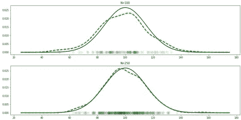

TLDR:使用以下语法定义您自己的函数，这些函数涉及绘制到特定的轴上:

```
def custom_plot(x, y, ax=None, **plt_kwargs):
    if ax is None:
        ax = plt.gca()
    ax.plot(x, y, **plt_kwargs) ## example plot here
    return(ax)def multiple_custom_plots(x, y, ax=None, plt_kwargs={}, sct_kwargs={}):
    if ax is None:
        ax = plt.gca()
    ax.plot(x, y, **plt_kwargs) #example plot1
    ax.scatter(x, y, **sct_kwargs) #example plot2
    return(ax)
```

你可以在[这个链接](https://github.com/maticalderini/tutorial_matplotlibCustomPlots)找到原始代码库。

# 介绍

在之前的一篇文章中，我向你展示了如何更好地组织你的数据。我们看到了如何使用支线剧情整齐地显示不同的情节，如何添加自由浮动轴，以及如何使用 GridSpec 轻松地创建轴的平铺组织。

因为这篇文章的重点是总体图的一般结构和表示，所以绘图本身非常简单，因为它们只使用了一个预定义的 matplotlib 函数，比如带有默认参数的`.plot`或`.hist`。通常，在您在前一篇文章中学习的漂亮的平铺结构中，您将需要绘制自己的特定绘图，该绘图结合了来自不同类型的基本绘图函数的信息以及对其他一些数据生成或数据处理函数的调用。例如，在顶部绘制随机样本的分布及其相应的理论密度函数。

在这里，我将向您展示如何创建您自己的自定义绘图函数，可以通过在您组织的绘图中调用这些函数来轻松使用这些函数，如下所示:

```
fig, axes = plt.subplots(number_of_subplots)
for ax in axes:
    my_custom_plotting_function(ax=ax, function_kwargs)
```

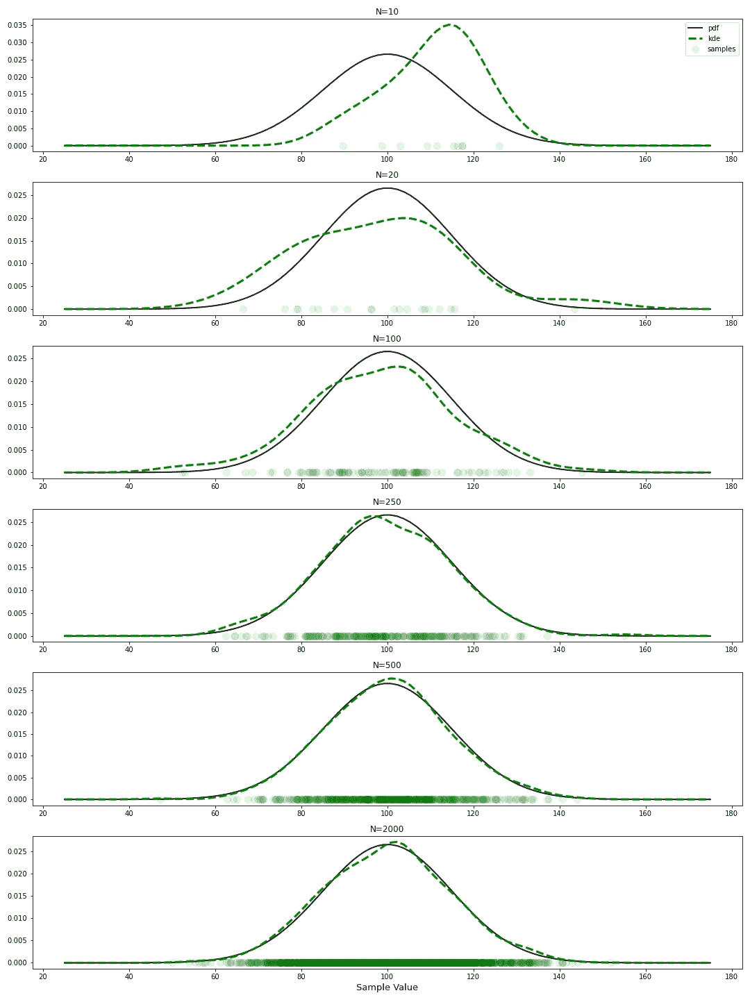

加上支线剧情的良好组织，这将有助于您最大限度地利用 matplotlib 上的静态绘图(预示着动力学绘图后续教程…也许……)并利用来自不同地块的信息来分享您的数据的综合情况。

# 基本语法

# 传递轴

在图形中拥有一系列自定义图的第一步是能够将单个自定义图连接到单个轴。第一步是能够将我们想要绘制的轴传递给我们的自定义函数。这可以像这样简单地完成:

```
def custom_plot(x, y, ax=None, **plt_kwargs):
    if ax is None:
        ax = plt.gca()
    ax.plot(x, y, **plt_kwargs) ## example plot here
    return(ax)
```

我在那里做了什么？这里第一个相关的部分是`ax`的论证。如果你以前用过 seaborn，你可能已经知道如何使用它了。本质上，`ax`将获取您想要绘制的轴对象。这可以是一个子图轴或一个简单的自由浮动的嵌入轴。这个想法是，情节的组织部分将在这个功能之外处理，可能由另一个功能处理。

为什么`ax`会默认为`None`？这可以用下面的句子来更好地回答:

```
if ax is None:
        ax = plt.gca()
```

我们看到，如果在`ax`中没有提供 axes 对象，它默认为`None`并触发这个`if`条件。在这种情况下，由于没有给定轴，默认情况下，该函数将查找当前图形中使用的最后一个轴，或者如果没有可用的轴，则使用函数`.gca`(代表*获取当前轴*)创建一个轴，并将其用作绘图轴。在函数的最后，我们还返回这个 ax，以防我们想用它进行其他定制(在某些情况下不是必需的，但很实用)。

让我们测试一下，首先在不指定轴的情况下绘图，然后提供一个特定的轴:

```
# Without providing axes (default to None -> gca())
plt.figure(figsize=(10, 5))
custom_plot([1, 2], [10, 20])
plt.title('Our custom plot with no axes provided (defaults to .gca())')
plt.xlabel('x')
plt.ylabel('y')
plt.show()
```

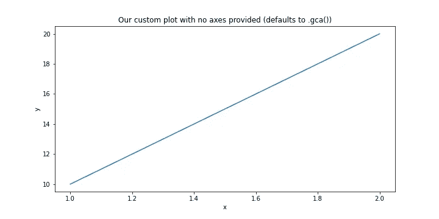

```
# Providing the axes
fig, axes = plt.subplots(2, figsize=(10, 5))# Plotting with our function
custom_plot([2, 3], [4, 15], ax=axes[0])
axes[0].set(xlabel='x', ylabel='y', title='This is our custom plot on the specified axes')# Example plot to fill the second subplot (nothing to do with our function)
axes[1].hist(np.random.normal(size=100))
axes[1].set_title('This plot has nothing to do with our function. Just a histogram of some random numbers')plt.tight_layout() #This to avoid overlap of labels and titles across plots
plt.show()
```

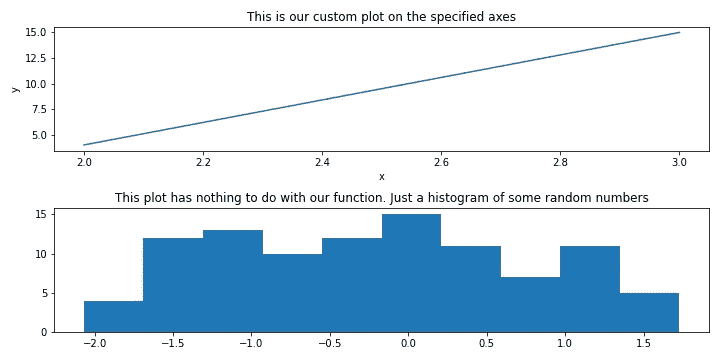

# 传递图的关键字参数

到目前为止还不错；我们可以创建一个函数来绘制数据，并可以将它连接到我们的绘图的特定轴(如果没有提供轴，它甚至会自己处理)。那么`**plt_kwargs`呢？

如果您不习惯在函数中使用`**kwargs`(如在关键字参数中)(参数的实际名称并不重要，您可以将其命名为`**kwargs`、`**plt_kwargs`、`**literally_anything_else`，只要您加上双星号“**”)，那么首先创建并使用一个没有`**kwargs`的新函数会更容易解释。

顺便说一句，如果你以前真的没有见过这种类型的星号符号，那么在 python 中使用单星号`*`和双星号`**`在很多情况下都非常有用，无论是在函数内部还是外部，绝对值得在 google 上搜索一下(甚至可以写一篇关于它的博文....可能...).无论如何，回到我们没有`**kwargs`的`custom_plot`的例子:

```
def no_kwargs_plot(x, y, ax=None):
    if ax is None:
        ax = plt.gca()
    ax.plot(x, y) ## example plot here
    return(ax)plt.figure(figsize=(10, 5))
no_kwargs_plot([1, 2], [10, 20])
plt.show()
```

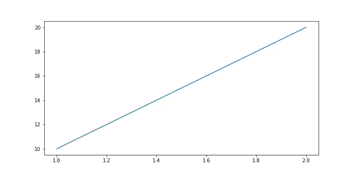

没有错误，没有问题…但是，如果你想让线条变粗呢？通常在`.plot()`中，我们会简单地将参数`linewidth`设置为一个更厚的值。我们可以将`linewidth`添加到`no_kwargs_plot`的输入列表中，然后像这样将其传递给`.plot()`:

```
def no_kwargs_plot(x, y, ax=None, linewidth=1):
    if ax is None:
        ax = plt.gca()
    ax.plot(x, y, linewidth) ## example plot here
```

那会解决问题。但是所有其他可能的论点呢？剧情()。必须将它们连同它们的默认值一起写在我们的函数中，这将会很长，并且不太实际:

```
def no_kwargs_plot(x, y, ax=None, linewidth=1, other=1,...):
    if ax is None:
        ax = plt.gca()
    ax.plot(x, y, linewidth, other,....) ## example plot here
```

这就是使用`**`符号(`**kwargs`)有用的地方。当用于自由键值元素时，比如我们函数中的孤立输入(在我们的例子中，这些输入与预定义的参数 x、y 和 ax 无关)`**name`会将所有这些元素打包到一个字典中，并将它们存储在变量`name`中。

例如，如果我们将绘图函数用作`custom_plot(x=xdata, y=ydata, ax=axes[0], linewidth=2, c='g')`，那么得到的`plt_kwargs`字典将是`{'linewidth':2, 'c':'g'}`。如果这还不太清楚，看看下面的示例代码，输出(> >)和下面的模式:

```
def print_kwargs_only(x, y, ax=None, **plt_kwargs):
    print(plt_kwargs) #to print the dictionary with all the orphan kwargsprint_kwargs_only(x=[1, 2], y=[10, 20], not_xyax=1,   random_orphan_kwarg='so lonely', linewidth=2, c='g')>> {'not_xyax': 1, 'random_orphan_kwarg': 'so lonely', 'linewidth': 2, 'c': 'g'}
```

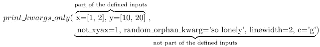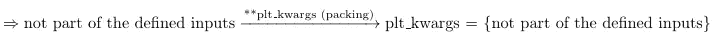

因此，使用`**`解决了将所有可能的绘图输入放入我们的函数中的问题，而不需要显式地预定义它们，并让它们准备好在字典中使用。但是，这本补充关键字参数词典是如何使用的呢？

之前，我提到过`**`在自由元素上使用时表现得像一个打包函数。当你在一个字典上使用`**`时(不管它是否被`**`打包过)，实际上`**`会做与之前相反的动作:它会将字典解包成不同的自由元素。在`custom_function`中，当我们在`.plot()`、*即* `ax.plot(x, y, **plt_kwargs)`中编写`**plt_kwargs`时，我们实际上是在要求 python 获取字典`plt_kwargs`并将它的所有键值对分别解包到`.plot()`函数中作为单独的输入。

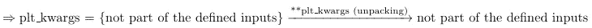

这样，在不知道将使用多少和哪些绘图定制的情况下，我们可以将它们全部传递给将进行绘图的函数部分。

我们可以再次使用我们最初的`custom_plot`函数看到这一点(您可能注意到，这次我使用了该函数返回的轴来展示如何使用它):

```
plt.figure(figsize=(10, 5))
out_ax = custom_plot([1, 2], [10, 20], linewidth=5, c='g')
out_ax.set(xlabel='xlabel', ylabel='ylabel', title='Testing out the usefulness of **kwargs')
plt.show()
```

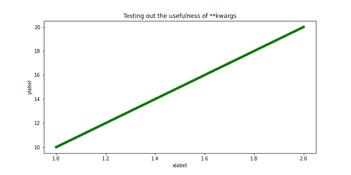

# 基本语法的扩展

这就是基本的语法。有了这些，你应该已经能够开始创作一些更有趣的情节了。

不过在使用 ham 之前，我们需要注意一个你在使用`**kwargs`时可能会遇到的潜在问题。也就是说，如果您在`custom_plot`函数中进行多个绘图会怎么样？例如，如果你正在绘制两条线，其中一条应该是虚线，而另一条是实线。`**kwargs`怎么知道哪个论点进入了哪个情节？

答案是“`**kwargs`包装机”不能再工作了，需要更换，但是“`**kwargs`拆包机”可以正常工作。我这么说是什么意思？让我们定义一个名为`multiple_custom_plots`的新函数来阐明它:

```
def multiple_custom_plots(x, y, ax=None, plt_kwargs={}, sct_kwargs={}):
    if ax is None:
        ax = plt.gca()
    ax.plot(x, y, **plt_kwargs)
    ax.scatter(x, y, **sct_kwargs)
    return(ax)
```

这里有什么不同，我们应该如何使用它？首先，看看可能的输入列表。现在，我们没有了`**kwargs`，而是有了两个新的参数，一个用于我们的一个情节。此外，默认情况下，这些参数是空字典。

如果你听了我之前关于`**kwargs`的解释，希望你已经很清楚了。想法是，因为我们不能要求函数自动将所有孤立输入打包到一个字典中(我们现在需要两个独立的字典)，我们将不得不自己提供预打包的每个绘图参数字典。

稍后用双星号使用它们与最初的`custom_plot`没有什么不同，因为在字典上使用`**`仍然意味着我们希望它的值被解包。我们使用空字典作为缺省值，因为如果您没有提供定制字典，我们在试图用`**`解包它们(或缺少它们)时会遇到问题。如果没有提供任何内容，空字典本质上是用来将任何内容解包到函数中的。

让我们看看如何使用它:

```
plot_params = {'linewidth': 2, 'c': 'g', 'linestyle':'--'}
scatter_params = {'c':'red', 'marker':'+', 's':100}
xdata = [1, 2]
ydata = [10, 20]plt.figure(figsize=(10, 5))
multiple_custom_plots(xdata, ydata, plt_kwargs=plot_params, sct_kwargs=scatter_params)
plt.show()
```

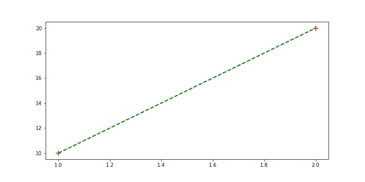

# 快速应用

因此，当要创建自定义函数来进行绘图时，上一节应该足以让您在一段时间内享受到静态绘图的乐趣。在下一节中，我将简单地给你一个使用自定义函数的绘图示例，希望能启发你去做一些自己的绘图。

# 随机样本的样本容量和核密度估计

假设您想了解给定随机变量的样本大小如何影响对其潜在概率分布的估计。

假设我们有一个连续的随机变量 X，正态分布，均值为μ(μ)，标准差为σ(σ)(*即 X*∞N(*μ*， *σ* ))。我们想知道 scipy 的核密度估计量(kde)如何受到我们随机样本大小的影响(我们从正态分布中随机抽样的次数),方法是将其与潜在的真实概率密度分布(pdf)的估计量进行比较。

我们将通过绘制不同 n 值的样本本身、它们的 kde 和它们的潜在 pdf 来做到这一点。

```
def sample_plot(mu=0, sigma=1, N=100, sct_kwargs={}, pdf_kwargs={}, kde_kwargs={}, ax=None):
    # generate sample
    sample = np.random.normal(loc=mu, scale=sigma, size=N)

    # generate pdf
    xrange = mu + 5*sigma*np.linspace(-1, 1, 100)
    pdf = stats.norm.pdf(xrange, loc=mu, scale=sigma)

    # generate kde
    estimation = stats.gaussian_kde(sample)
    kde = estimation(xrange)

    #Plotting
    if ax is None:
        ax = plt.gca()   
    ax.scatter(sample, np.zeros_like(sample), **sct_kwargs)
    ax.plot(xrange, pdf, **pdf_kwargs)
    ax.plot(xrange, kde, **kde_kwargs)
    return(xrange)
```

让我们一步一步地解构这个函数:

首先是投入。这里，我们将从高斯随机数生成器创建自己的数据，而不是请求数据数组。所以我们需要询问相关的统计参数μ和σ(分别为高斯分布的均值和标准差)。我们还需要问要取的样本数 N。实际上，我们将在后面迭代 N 的不同值，以查看样本大小对估计的影响。这个想法是将样本绘制成散点，将 pdf 和 kde 绘制成常规线图。因此，我们将为它们各自的绘图参数(线宽、标记大小等)提供一个字典作为输入。).最后，我们将询问我们想要在其上绘制这三样东西的图形的轴。

该函数的第一部分将简单地从所提供的统计参数中生成大小为 N 的随机高斯样本。

代码的第二部分将创建对应于由μ和σ给出的正态分布的 pdf 的线图的 x-y 对。我们将 pdf 的范围限制为 5 个标准偏差，因为任何一边的任何其他值都将非常小。

代码的第三部分首先计算样本的 kde，然后将其应用到与 pdf 相同的 x 轴上的值范围。

最后，在代码的第四部分，我们简单地将 x 轴(高度为 0)上的所有采样值绘制成散点图，并将 pdf 和 kde 绘制成线图。这三个都有各自的绘图关键字参数。

```
# Sample parameters
sample_sizes = (10, 20, 100, 250, 500, 2_000)
mean = 100
std = 15# Plotting parameters
scatter_params = {'alpha':0.1, 'c':'g', 's':100, 'label':'samples'}
pdf_params = {"linewidth":2, 'c':'k', 'label':'pdf'}
kde_params = {"linewidth":3, 'ls':'--', 'c':'g', 'label':'kde'}# Plotting
fig, axes = plt.subplots(6, figsize=(15, 20))
for ax, n in zip(axes, sample_sizes):
    sample_plot(mu=mean, sigma=std, N=n, ax=ax,
                sct_kwargs=scatter_params, pdf_kwargs=pdf_params, kde_kwargs=kde_params)
    ax.set_title(f'N={n}')axes[0].legend()
axes[-1].set_xlabel('Sample Value', fontsize=13)
plt.tight_layout()
plt.savefig('finalplot')
plt.show()
```

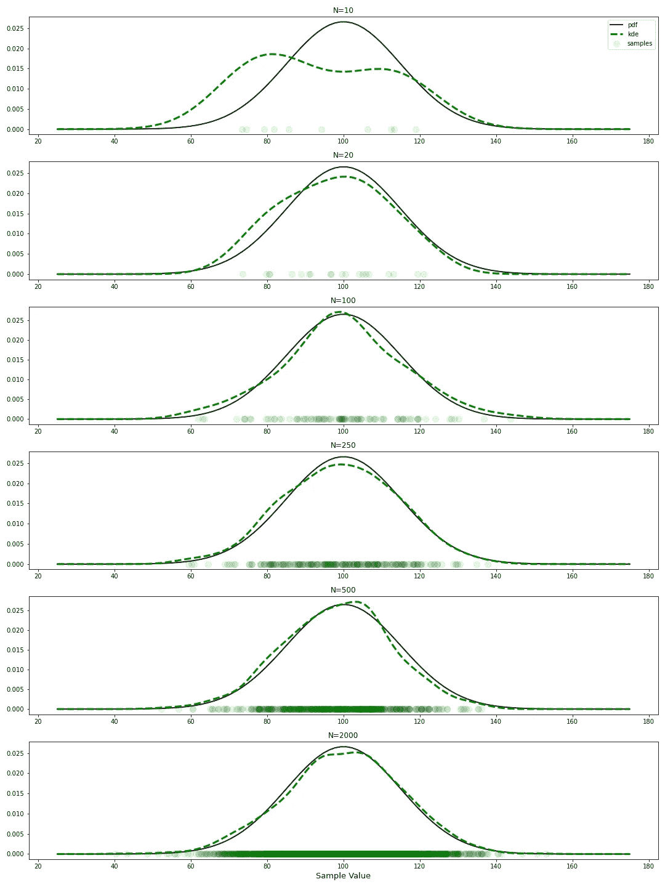

就是这样！希望您已经学会了如何通过正确传递相应的轴和关键字参数来为函数添加绘图功能。这将有助于您拥有越来越模块化的代码来快速浏览和可视化您的数据。

*原载于 2020 年 4 月 28 日*[*https://matic derini . github . io*](https://maticalderini.github.io/blog/tutorial/2020/04/27/customPlots.html)*。*