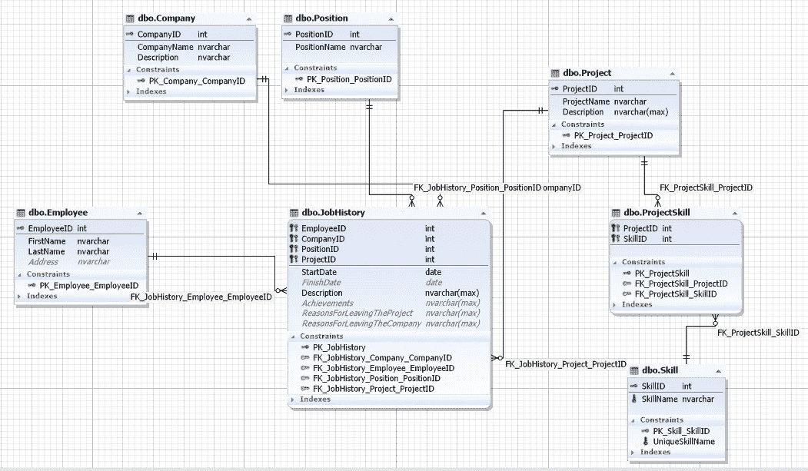
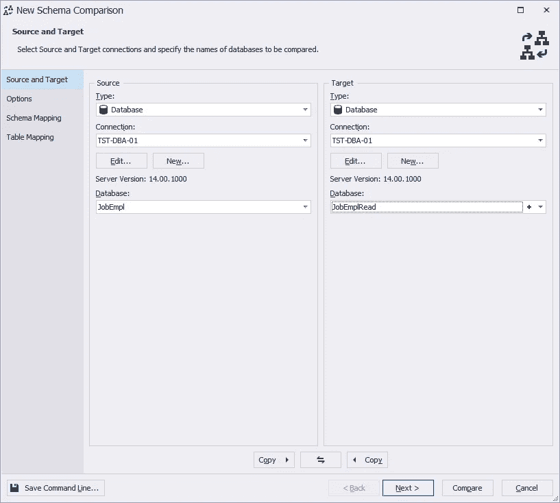
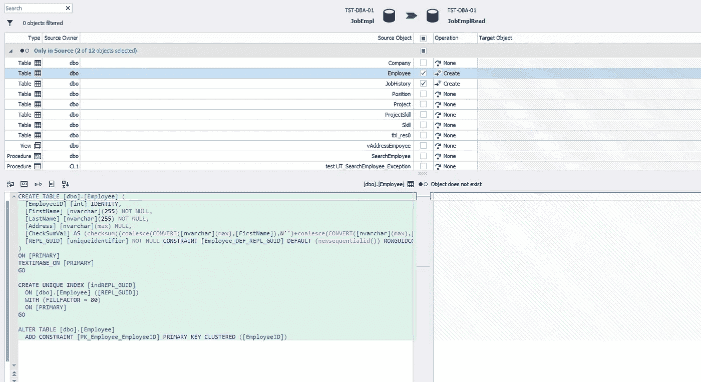
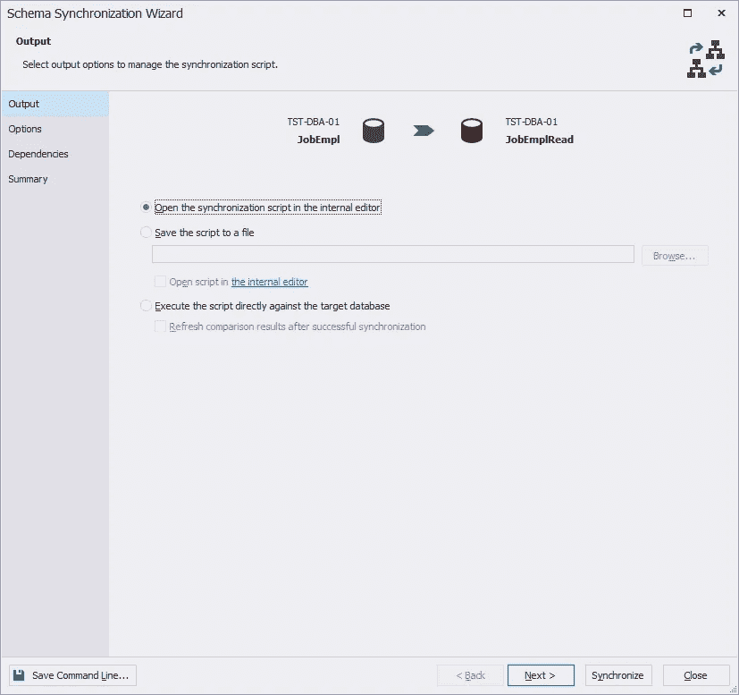
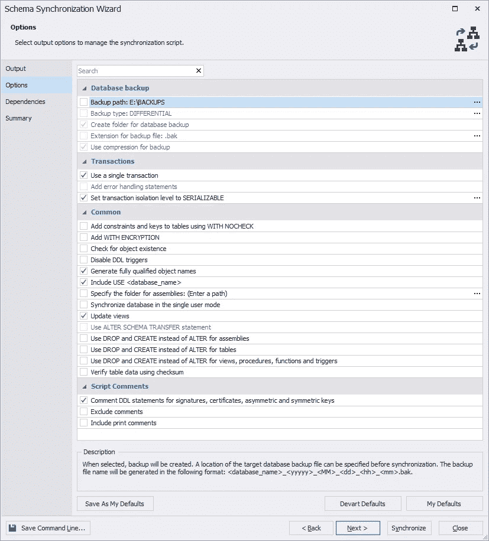
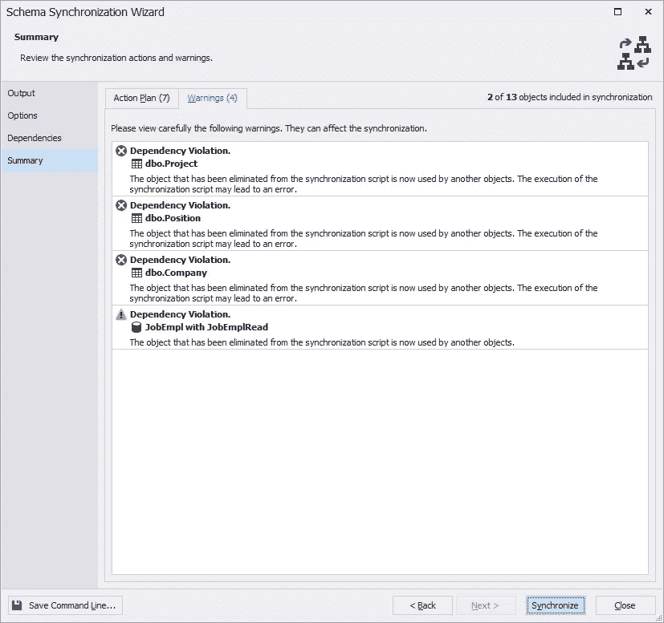
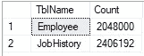
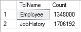

# 为只读数据库创建自定义 SQL Server 复制

> 原文：<https://towardsdatascience.com/creating-custom-sql-server-replication-for-read-only-databases-e25953d7ff82?source=collection_archive---------29----------------------->

## *我们来讨论一下使用 T-SQL 的 SQL Server 复制。并考虑从源到目的地单向复制表的一般算法。*


图片来自 [Piqsels](https://www.piqsels.com/en/public-domain-photo-zknng) (CC0)

通常需要创建 SQL Server 数据库的只读副本。例如，为了将分析任务和操作任务分开，可能需要这样做。第一种情况会导致数据库的高负载，为了降低负载，会创建主数据库的副本来执行分析性只读查询。

通常，这些只读副本可以使用内置的 DBMS 工具创建:

1.  [原木运输](https://docs.microsoft.com/en-us/sql/database-engine/log-shipping/configure-log-shipping-sql-server?view=sql-server-ver15)
2.  [SQL Server 复制](https://docs.microsoft.com/en-us/sql/relational-databases/replication/sql-server-replication?view=sql-server-ver15)
3.  [AlwaysOn 可用性组](https://docs.microsoft.com/en-us/sql/database-engine/availability-groups/windows/overview-of-always-on-availability-groups-sql-server?view=sql-server-ver15)。

但是，如果您不需要整个数据库，而只需要其中的几个表，该怎么办呢？在这种情况下，您可以自己创建复制。只要数据采样是主要目标，单向的数据库复制(主到从)就足够了。几种方法包括 SSIS 和。NET 可以用来执行这种复制。

在本文中，我们将使用 JobEmpl recruiting service 数据库来演示如何使用 T-SQL 创建主-从方向的数据库复制。

# 使用 T-SQL 创建 SQL Server 单向复制

首先，让我们描述一下这个复制的主要原理和算法。在每次迭代中，我们需要比较源数据库和目标数据库中所选表的数据。这意味着我们需要输入一个唯一的代理键来比较这些表。为了加快比较过程，我们还需要为那个键创建一个索引。还需要为每个复制表添加一个计算字段，为每一行计算校验和。

选择固定的数据部分也很重要，例如，一次选择一定数量的行(每次迭代)。

因此，我们需要执行以下步骤:

1.  在源表上，创建一个 REPL_GUID 列和一个唯一的 REPL_GUID 索引，以强制源表和目标表之间的一对一关系。您还应该创建一个计算校验和列，该列将计算每一行的[校验和](https://docs.microsoft.com/en-us/sql/t-sql/functions/checksum-transact-sql?view=sql-server-ver15)值。
2.  创建一个名为 Target 的新目标数据库。
3.  跨源和目标数据库同步复制表的模式，并删除对不存在的对象的所有引用。
4.  禁用目标数据库的外键。
5.  运行复制并监视源数据库和目标数据库之间有多少行不同。

现在让我们使用为招聘员工而创建的 JobEmpl 数据库来详细回顾每个步骤。



**图 1 求职者数据库模式**

我们只需要复制*雇员*和*工作历史*表。

然后，可以在以下脚本的帮助下执行上述算法的第一步。

从脚本中，您可以看到它必须在源 JobEmpl 数据库上运行，并且您应该相应地在 [@src](http://twitter.com/src) 和 [@sch](http://twitter.com/sch) 变量中指定源数据库和模式。构建动态 sql 需要 [@sql](http://twitter.com/sql) 变量，同时需要 [@name](http://twitter.com/name) 保存复制表的名称。

首先，我们将复制的表名收集到临时#tbl 表中。接下来，我们用光标遍历每个表名，并将表名提取到@name 变量中。之后，对于每个表，形成一个非 IDENTITY 类型的列列表，并将结果插入到带有“+”符号的@listcols 变量中。

值得一提的是，首先使用 CAST 函数将每个表名转换为 NVACHAR(MAX)类型，然后使用 COALESCE 函数([<columnname>，N ' ')。这样做是为了从每一行的所有列值中形成一个字符串。</columnname>

接下来，创建计算校验和字段、REPL_GUID 字段及其唯一的 indREPL_GUID 索引。

在我们的例子中，我们得到了下面的脚本。

稍后，您可以借助以下脚本从数据库中删除创建的表和索引。

复制的表也在这里，其中每个表的 indREPL_GUID 索引以及 REPL_GUID 和 CheckSumVal 列都被删除了。

在我们的例子中，创建了下面的 T-SQL 代码。

现在让我们根据上面提到的算法的第二步创建一个新的 JobEmplRead 数据库来接收数据。然后，我们同步复制表的模式。要执行同步，请使用 DbForge 模式比较工具:选择 JobEmpl 作为数据源，jobEmplRead 作为数据目标。



**图 2 模式同步的数据库选择**

然后按下*比较*按钮。完成比较的元数据创建过程后，选择所需的表并开始配置数据库同步过程。



**图 3 选择表进行模式同步**

接下来，我们选择默认值—脚本生成。



**图 4 选择脚本生成作为同步输出**

现在，让我们清除备份创建选项。



**图 5 取消选择备份创建选项**

接下来，我们取消选中所有依赖项，因为我们不需要创建其他对象。我们稍后将在生成的模式同步脚本中手动删除外键。


**图 6 取消选择所有依赖关系**

现在按下*同步*按钮，忽略*摘要*选项卡上的警告。



图 7 警告

在生成的脚本中删除以下外键:

*   FK _ 工作历史 _ 公司 _ 公司 ID
*   FK _ 工作历史 _ 职位 _ 职位标识
*   FK _ 作业历史记录 _ 项目 _ 项目标识

我们需要这样做，因为我们没有转移*公司*、*职位*和*项目*表。结果，我们得到了一个移动复制模式表的脚本。

在 JobEmplRead 数据库中运行此脚本。

因此，我们已经完成了算法的第 3 步:在 JobEmpl 和 JobEmplRead 数据库中同步表模式，并删除了对不存在的对象的所有引用。

让我们使用下面的脚本进行监控。

这里我们有完整的外部连接语句创建和表列表的返回，以及不同的行数，包括不存在的和缺少的行。

在我们的例子中，我们得到以下结果。



**图 8 复制表中不同的行数**

下面的脚本是为了比较而生成的。

值得注意的是，为了减少阻塞，事务隔离级别是脏读。

让我们将算法的第 4 步和第 5 步合并到下面的脚本中。

首先，JobEmplRead 数据库中复制表的所有外键都被禁用。然后，使用 MERGE 语句，数据被部分复制。在我们的例子中，每次迭代有 100 000 行。该脚本包含一次迭代，并执行以下 T-SQL 代码。

这个脚本应该按照预先指定的时间间隔自动运行。例如，它可以每分钟运行一次，甚至更频繁，具体取决于分析需求。

在几次迭代之后，不同行的数量必须更少。



**图 9 特殊行数量的变化**

请记住，要在禁用的表中启用外键，您应该运行以下脚本。

在我们的例子中，将生成并执行以下脚本。

```
ALTER TABLE [JobHistory] CHECK CONSTRAINT [FK_JobHistory_Employee_EmployeeID];
```

请记住，在复制所有数据之前，不能在复制运行时在复制的表上启用外键。

# 结论

我们已经讨论了实现从源到目的地单向复制表的过程的方法之一。

这种方法和脚本可以应用于任何数据库。但是当然，这些脚本必须根据复制表的具体情况进行修改。例如，如果表中有计算字段，可能需要进行修改。

[SQL Complete](https://www.devart.com/dbforge/sql/sqlcomplete/) 是帮助我构建这些脚本的主要工具。该工具还允许代码格式化以及重命名对象及其所有引用。

【https://blog.devart.com】原载于 2020 年 3 月 19 日[](https://blog.devart.com/how-to-create-custom-sql-server-replication-for-read-only-databases.html)**。**