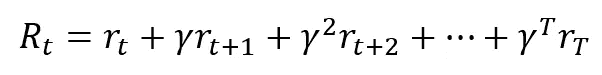
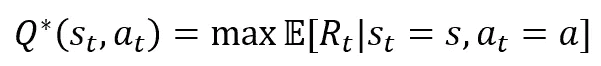
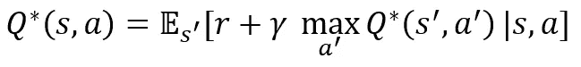
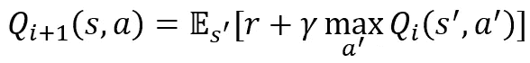
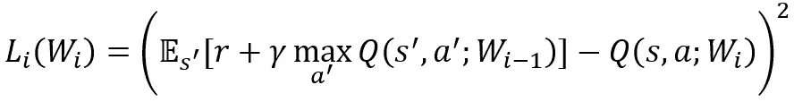
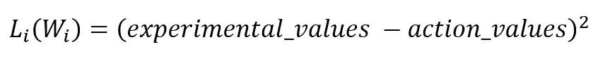

# 从零开始创建深度神经网络，强化学习导论

> 原文：<https://towardsdatascience.com/creating-deep-neural-networks-from-scratch-an-introduction-to-reinforcement-learning-6bba874019db?source=collection_archive---------20----------------------->

## 第二部分:强化学习和反向传播


一只正在学习捡东西的狗【图片由 [Unsplash](https://unsplash.com?utm_source=medium&utm_medium=referral) 上的 [Humphrey Muleba](https://unsplash.com/@good_citizen?utm_source=medium&utm_medium=referral) 拍摄】

> 本文是三部分系列的第二部分，将详细介绍 OpenAI gym 上 Cartpole-v1 问题的解决方案——仅使用 python 库中的 numpy。
> 
> [的第一部分](https://medium.com/@abhavkedia/creating-deep-neural-networks-from-scratch-an-introduction-to-reinforcement-learning-part-i-549ef7b149d2)奠定了基础，创建了计划的大纲并构建了前馈功能，以将环境状态传播到其行动值。这一部分将集中讨论强化学习中累积奖励和行动价值背后的理论，以及反向传播机制的建立。这些是我们代理学习过程的基础。

到上一篇文章结束时，我们有了一个简单的程序循环:在每个时间步上，代理观察环境的状态，并通过它的神经网络(随机初始化)来获得每个动作的预测值。然后，它(以概率 1-ε)选择具有最大预测回报的行动。然后在下一个时间步重复这个过程。

然而，此时代理不知道在采取特定动作之后发生了什么，因为没有反馈。例如，当我们训练一只宠物时，根据它们的行为是可取的还是不可取的，我们创建[正面或负面强化](https://thehappypuppysite.com/reinforcement-in-dog-training/)的反馈回路是很重要的。一只狗记得在过去捡球为它赢得了一次款待(一个有价值的奖励)，并且在下一次类似的情况出现时更有可能优先捡球。同样，我们在程序中实现内存也很重要，这样代理可以跟踪奖励和采取行动后的结果状态。

# **体验回放**

我们将通过在代理的记忆中添加体验，并在一个称为体验重放的过程中使用它们来改进代理来做到这一点。照此修改主程序循环，

```
# The main program loop
for i_episode in range(NUM_EPISODES):
    observation = env.reset()
    # Iterating through time steps within an episode
    for t in range(MAX_TIMESTEPS):
        env.render()
        action = model.select_action(observation)
 **prev_obs = observation**        observation, reward, done, info = env.step(action)
        # Keep a store of the agent's experiences
 **model.remember(done, action, observation, prev_obs)**
 **model.experience_replay(20)**        # epsilon decay
        ...
```

我们还将向 RLAgent 添加相关代码，首先是在 *init* 函数中，

```
self.memory = deque([],1000000)
```

还有*记住，*的宣言

```
def remember(self, done, action, observation, prev_obs):
        self.memory.append([done, action, observation, prev_obs])
```

请注意，这个内存实现使用了 dequee，这是一个简单的数据结构，允许我们“附加”内存并跟踪最新的 *n* 条目，其中 n 是 dequee 的大小。Deque 是一个集合，所以我们还需要添加它的 import 语句，

```
from collections import deque
```

最后，我们添加了 *experience_replay* 方法，这将帮助代理从经验中学习以改进其游戏性，

```
1 def **experience_replay**(self, update_size=20):
2    if (len(self.**memory**) < update_size):
3        return
4    else: 
5    batch_indices = np.random.choice(len(self.**memory**), update_size)
6    for index in batch_indices:
7       done, action_selected, new_obs, prev_obs = self.**memory**[index]
8       action_values = self.**forward**(prev_obs, remember_for_backprop=True)
9       next_action_values = self.**forward**(new_obs, remember_for_backprop=False)
10      experimental_values = np.copy(action_values)
11      if done:
12         *experimental_values[action_selected] = -1*
13      else:
14         *experimental_values[action_selected] = 1 + self.****gamma*****np.max(next_action_values)*
15      self.**backward**(action_values, experimental_values)
16      self.**epsilon** = self.**epsilon** if self.**epsilon** < 0.01 else self.**epsilon***0.995
17   for layer in self.**layers**:
18      layer.lr = layer.lr if layer.lr < 0.0001 else layer.lr*0.995
```

在这个方法中有很多东西需要解开，但是让我们一步一步地来看。

首先，有一个简单的检查，看看我们是否有足够的经验开始学习。如果没有，我们就等着看。

接下来，我们从所有存储的内存中随机取样，得到 *update_size* 内存的索引。对于这些索引中的每一个，我们检索(第 7 行)与之相关的内存数据。

然后我们计算三样东西——

1.  *用 *prev_obs* 变量计算的 action_values* ，
2.  *用 *obs* 变量计算的 next_action_values* ，用于在下一次计算中计算实验值
3.  *实验值*(在**累积奖励和值函数**部分说明)

一旦计算出这些值，我们就将实验值和行动值预测反馈给一个*自我。* ***后向*** 函数将计算这些值之间的差异，并使用它来对权重矩阵进行更改。 ***向后*** 功能将在后面关于**反向传播**的章节中进行检查和实现。

最后，我们更新系统的*ε*(探索率)和*学习率*变量。*学习速率*是反向传播算法使用的一个属性，它决定了学习过程中步长的大小。注意，我们已经将 epsilon 更新从它在主循环中的原始位置移到了这个方法中。

# 动作和实验值

上面粘贴的代码块在第 8–14 行有 3 个计算。我们现在将逐一介绍这些内容。

第一个， *action_values，*是代理在给定状态下每个动作的当前估计值(prev _ OBS)——与第一部分的 *select_action* 函数中计算和使用的值相同。

第二个计算是 *next_action_values。*这是来自下一个状态(new_obs)的两个动作的一组预测值，即在代理在创建该记忆的情节期间采取动作之后获得的状态。

*next_action_values* 只是一个临时变量，用于随后的计算——用于*实验值。*这是我们的代理从这次特殊“经历”中学到的**目标值**，有两种形式:

1.  [第 11-12 行]如果在下一次观察中杆子已经翻倒，则该集结束，并且在此状态之后所有未来奖励的总和为(-1)。
2.  [第 13-14 行]如果极点在下一次观察中没有翻倒，那么预期的未来奖励是观察到的即时奖励加上一个折扣的总和，该折扣是该状态的预期未来奖励的 *gamma —* 倍。

请注意，这两种形式的实验值仅适用于该集期间选择的动作。其他动作(在横竿问题中只有一个)没有更新，因为我们没有任何关于来自给定状态的那些动作的新的实验知识。

*实验值*数量至关重要。它捕捉新的经验信息，即代理已经了解在给定状态下采取行动的价值。

# 累积报酬和价值函数

本节将后退一步，形式化一些强化学习理论，这些理论隐含在我们到目前为止编写的代码中。首先，请注意，到目前为止，我们已经讨论了特定状态下的行为价值，但是这到底意味着什么呢？这个值是如何获得的？为什么变量 *experimental_values* 是这样计算的？

本节的其余部分将讨论一些强化学习理论。他们自由引用并大量借鉴了 2015 年发表的一篇伟大论文，这篇论文展示了深度 Q-Networks 的力量，并使用一个通用的架构来玩 Atari 2600 游戏。如果您对此不感兴趣，请随意跳到**反向传播**部分，我们将继续实施。

我们首先将特定时间步长 *t* 的“累积奖励”或“回报”定义为一个时间步长后直到剧集结束的所有未来奖励的总和。形式上，



其中，rₜ是每个时间点收到的直接奖励，γ是折现因子。我们还定义了一个称为**最优行动值函数** *Q*(s，a)* —



这是所有政策中国家-行动对(sₜ,aₜ)的“预期”累积回报的最大值，其中政策定义了在给定的国家必须采取什么行动。它代表给定状态下行动的“真实”价值，即从特定状态 *s、*选择行动 *a、*开始，然后在完全了解环境的情况下进行最优博弈的最大预期回报。期望符号抓住了环境通常可能是随机的这一事实。

上面的最佳动作值函数服从一个称为贝尔曼方程的重要恒等式，



这个恒等式的意思是，如果我们在状态 *s* 中采取行动 *a* 后，从结果状态*s’*中知道所有行动的最优行动值，那么最优行动值函数 *Q*(s，a)* 是在这个行动后观察到的即时回报的预期和(贴现的)可以从状态*s’*采取的所有行动*a’*的最大最优行动值。期望符号捕捉了这样的事实，即*s’*(因此也是 *r* ) 可能在概率上由初始状态 *s* 和动作 *a* 确定。

大多数强化学习代理通过使用贝尔曼方程作为迭代更新来学习，在我们的例子中是—



当 *i* 趋向于*无穷大*时，收敛到最优作用值函数 Q*(s，a)的一个量。尽管它与上面代码块中的第 14 行相似，但我们所做的和这个等式所代表的是有区别的。这种迭代更新建议我们保存一个所有可能的状态动作对的表，并递增地更新该表中的每个值。这实际上是不可能的，因为我们有连续的状态空间！相反，我们使用基于神经网络的函数逼近器 *Q(s，a；W)* 来估计动作值函数*，*其中 *W* 表示我们网络中的权重。这个函数逼近器被称为 Q 网络——在我们的例子中是深度 Q 网络或 DQN。我们确实一直在建设一个 DQN！

代替更新所有状态-动作对，更实际的是迭代地最小化**损失函数**的期望，定义为:



这里有两点需要注意，

1.  给定代理记忆中的所有(s，a，r，s’)组合，我们使用*随机梯度下降*来计算每步中单个样本(我们在第 7 行检索的记忆数据)的损失，而不是计算并最小化该值的总预期损失。
2.  上式中权重 W 的下标(i - 1)和(I)表示我们保存了权重的快照，用于下一次更新。这确实是理想和完整的实现，我们很可能会在第三部分谈到它，但是现在，我们不会实现这个细节。我们只使用一组权重来计算预测值和目标值(即上面代码块中的 *experimental_values* )。实际上，在没有用于计算目标值的固定网络的情况下，对上述损失函数运行随机梯度下降最终会最小化经验损失**和目标值方差**之和，这不是我们想要的(我们只想最小化经验损失)。你可以在这里阅读更多关于这个细节【第 9 页】。对于我们的简单用例，幸运的是，这种差异不会破坏我们的解决方案。

有了这些知识，我们现在可以回过头来回答行动价值的意义这个问题。

在训练中的给定时间点，特定状态的**动作值**(由正向函数计算)就是模型对当时最佳动作值函数的估计。换句话说，它是对代理人期望从一个给定的州获得的每个行为的总折扣奖励的估计。在 cartpole 问题的特定情况下，这是代理期望从特定状态保持存活的时间步数的折扣和。另一方面,**实验值**是网络在每次迭代中试图接近的目标值。

根据上面提到的几点，损失函数的最后一个等式根据经验可以归结为—



使用*实验值*和*动作值*，正如我们在前面章节*中*经验 _ 回放*功能的定义中所定义的。*

这是我们将在每次迭代中寻求最小化的数量(对于给定的样本)。*实验值*和*动作值*之间的差值将形成更新我们网络权重的基础，在*反向*功能中实现。

# 反向传播

强化学习理论帮助我们在最后一节将损失函数定义为实验值和行动值之间的平方差。现在我们有了这些值，优化问题与通过反向传播最小化任何其他神经网络中的误差函数是一样的。

我们现在将实现*rl agent . experience _ replay*代码的最后一部分，即*向后*函数:

```
def **backward**(self, calculated_values, experimental_values): 
  delta = (calculated_values — experimental_values)
  for layer in reversed(self.**layers**):
  delta = layer.**backward**(delta)
```

该函数首先计算计算值(预测值 *action_values* )与在某个状态下采取某个动作的实验值之差。然后，该误差通过从最后一个隐藏层到输入层的每一层向后“传播”,并且基于该误差更新权重。直观地说，每一层都被告知其输出的估计值与在输出层中生成实验值所需的预期输出相差多少。

此函数调用 NNLayer.backward 函数:

```
1 def **backward**(self, gradient_from_above):
2    adjusted_mul = gradient_from_above
3    # this is pointwise
4    if self.**activation_function** != None:
5        adjusted_mul = np.multiply( relu_derivative(self.**backward_store_out**),gradient_from_above)
6        D_i = np.dot( np.transpose(np.reshape(self.**backward_store_in**, (1,len(self.**backward_store_in**)))), np.reshape(adjusted_mul, (1,len(adjusted_mul))))
7        delta_i = np.dot(adjusted_mul, np.transpose(self.**weights**))[:-1]
        self.**update_weights**(D_i)
        return delta_i
```

首先，(第 4-5 行)如果该层的输出有一个相关的激活函数，我们将激活函数的导数(在我们的例子中是 ReLU 函数)与从上一层接收的误差逐点相乘。得到的值— *adjusted_mul —* 用于每层中的两个进一步的计算:

1.  *D_i* 【第 6 行】:这是损失函数相对于该层权重的实际导数。然后将该值传递给 NNLayer。 *update_weights* 方法进行实际更新。没有处理矩阵的所有绒毛，这是在这一层接收的(列矩阵)输入和上面计算的(row_matrix) *adjusted_mul* 值之间的简单点积。
2.  *delta_i* 【第 7 行】:这是该层输入的计算“误差”(即前一层的输出)。这被向后传递到前一层，以实现其自己的导数和增量计算。

在这篇指导性的[博客](http://www.briandolhansky.com/blog/2013/9/27/artificial-neural-networks-backpropagation-part-4)中给出了反向传播算法的推导和一步一步实现的完整处理，但我们不会在此详述。虽然我的实现与那篇博客中给出的略有不同，但检查我描述的函数是否正确地实现了反向传播可能是一个很好的练习。

该算法剩下的两部分是 *relu_derivative* 和 *NNLayer* 。*更新 _ 权重*功能。让我们现在过一遍。

ReLU 函数的导数非常简单—如果值大于 0，ReLU 函数返回输入值，否则返回 0。所以这个函数的导数对于 x>0 就是恒等式(即 1)函数，否则就是 0。这是矩阵输入的实现—

```
def **relu_derivative**(mat):
  return (mat>0)*1
```

最后， *NNLayer.update_weights* 函数:

```
def **update_weights**(self, gradient):
        self.**weights** = self.**weights** - self.**lr***gradient
```

太好了，这个简单的实现应该足以让一个收敛算法工作并训练我们的代理！这两部分所有代码的工作实现可以在我的 [Github](https://github.com/abhavk/dqn_from_scratch) 上找到。

# 训练有素的特工

当我们运行这个程序时(记得在每个时间步长调用 *env.render()* ！)*，*几百集下来，我们就有了一个相当训练有素的经纪人。一旦代理人在连续 100 集内达到 195 以上的平均奖励，任务就被认为解决了。这通常需要 100-300 个时间步来实现，但是，由于不恰当的初始化，在某些运行中可能需要更长的时间。关于收敛保证和性能的更详细的分析将在下一篇文章中完成，但这里有一个来自该代理的完整运行示例，

训练有素的钢管舞特工！

太好了！看起来我们的代理人能够很好地平衡杆子。将此与我们在上一篇文章中开始的随机代理进行比较。

虽然我们构建的代码足以训练这个代理，但它还可以进行优化，以实现更快的收敛和更高的稳定性。这将是下一个帖子的重点。

咻！我们在这方面做了很多工作。这里有一个总结:

1.  实现了一个“体验重放”机制，其中代理将所有(状态、动作、奖励、下一个状态)存储在内存中，并从中随机抽取样本进行权重更新。
2.  研究了强化学习理论及其与 cartpole 问题的相关性，并推导出一种更新权重的机制，以最终学习最佳状态-动作值。
3.  实现了反向传播算法来实际训练网络。

这里还有一些任务需要完成，我们将在本系列的下一篇也是最后一篇文章中继续讨论。

1.  将 *update_weights* 方法替换为基于 [Adam](/adam-latest-trends-in-deep-learning-optimization-6be9a291375c) 的优化器，该优化器跟踪所有参数的个体学习率。这将有助于算法更快地收敛。
2.  重构全局常量和特定于模型的常量，以获得更好的可配置性。
3.  分析该方法在几种不同超参数配置下的性能。
4.  实施用于计算目标值的快照网络，该网络会定期更新为网络的当前 Q 值。

下次再见！

*链接* [***第一部分***](/creating-deep-neural-networks-from-scratch-an-introduction-to-reinforcement-learning-part-i-549ef7b149d2)*&*[***第三部分***](/creating-deep-neural-networks-from-scratch-an-introduction-to-reinforcement-learning-95bcb493a0c9) *。*

# 参考

1.  [用深度强化学习玩雅达利](https://www.cs.toronto.edu/~vmnih/docs/dqn.pdf)，Deep mind Technologies【Mnih et。阿尔，2015】。
2.  通过深度强化学习进行人类水平的控制【Mnih et。阿尔，2015】。
3.  [http://www . briandolhansky . com/blog/2013/9/27/人工神经网络-反向传播-第四部分](http://www.briandolhansky.com/blog/2013/9/27/artificial-neural-networks-backpropagation-part-4)
4.  深度 Q 学习的理论分析。阿尔，2019]