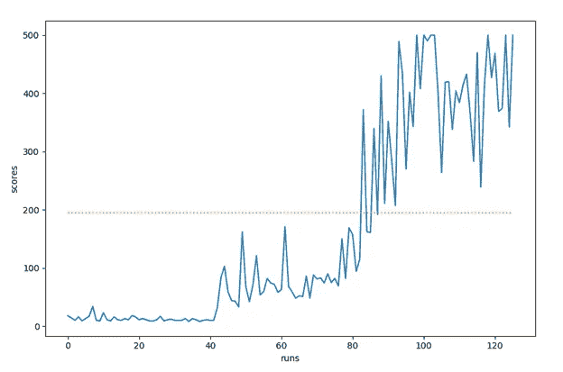
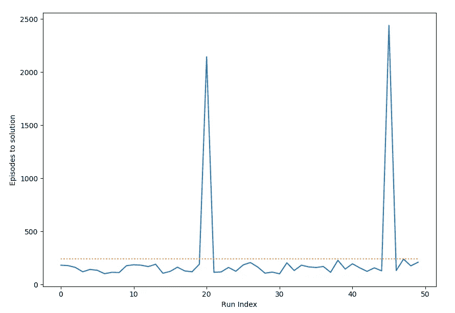
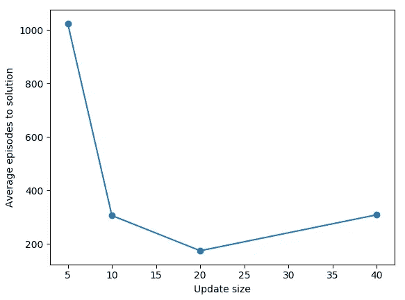
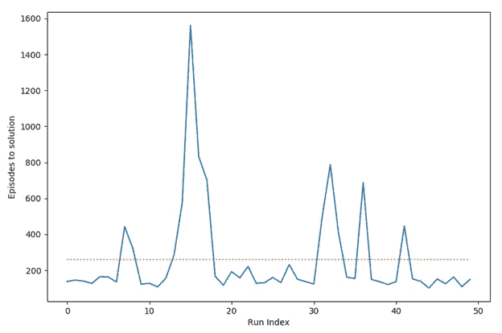
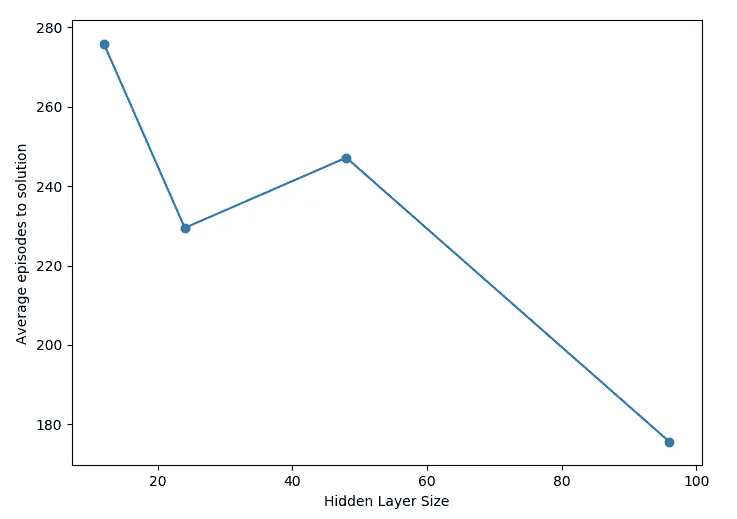

# 从零开始创建深度神经网络，强化学习导论

> 原文：<https://towardsdatascience.com/creating-deep-neural-networks-from-scratch-an-introduction-to-reinforcement-learning-95bcb493a0c9?source=collection_archive---------37----------------------->

## 第三部分:反思和改进


由 [Unsplash](https://unsplash.com?utm_source=medium&utm_medium=referral) 上的 [bantersnaps](https://unsplash.com/@bantersnaps?utm_source=medium&utm_medium=referral) 拍摄的照片

> 这是一系列文章中的第三篇也是最后一篇，旨在全面介绍 OpenAI gym 上的[侧翻问题](https://gym.openai.com/envs/CartPole-v1/)的解决方案，该解决方案是在没有使用 Pytorch 或 Tensorflow 等标准机器学习框架的情况下从零开始构建的。完整的代码可以在[这里](https://github.com/abhavk/dqn_from_scratch)找到。
> [第一部](/creating-deep-neural-networks-from-scratch-an-introduction-to-reinforcement-learning-part-i-549ef7b149d2)奠定了基础。在其中，我们讨论了神经网络体系结构，并实现了前向传播来计算代理动作的值。
> 
> [第二部分](/creating-deep-neural-networks-from-scratch-an-introduction-to-reinforcement-learning-6bba874019db)深入研究了强化学习理论的细节，形式化了 Q 值和 DQN 的概念。我们还在第二部分中实现了反向传播。
> 
> 第三部分将包含一些不同配置的代理性能的可视化和反映。这最后一部分还将完成实现并添加增强功能，如 Adam 优化器。在这里，我们不太关注超参数选择背后的严格性，而是更多地探索可以为模型改进而调整的配置。

在上一节的最后，我们完成了 Cartpole 代理的实现。时间来看看结果和代理的表现随着时间的推移！

# 跟踪代理的改进

让我们进行一次完整的训练，从随机初始化开始跟随代理，直到它学会平衡极点的艺术。这次训练用了 141 集来实现它的目标(连续 100 集的平均分数为 195)。

首先，这是分数的图表—



现在让我们看看代理在培训过程中的 3 个不同阶段的表现。代理的前 5 次运行非常糟糕，

最初几轮

在培训的中途，我们可以看到代理取得了进步，尽管仍有改进的空间。这是第 75 和 76 集，

训练中途

最后，在训练接近尾声时，代理人能够几乎完美地平衡杆子。这是第 138 轮，

最终受训代理人

我们可以看到代理到最后还是挺不错的！

# 目标网络

在[第二部分](/creating-deep-neural-networks-from-scratch-an-introduction-to-reinforcement-learning-6bba874019db)关于**累积奖励和行动值**的部分，我们讨论了如何使用 DQN 的完整实施的简化版本，通过使用相同的权重来计算预测的行动值和目标值。相反，我们需要在计算目标动作值(*实验 _ 值*在 RLAgent 中)时有一个固定的权重网络。*经验 _ 回放*方法)。让我们开始实施吧。首先，我们在 NNLayer *中添加了 *stored_weights* 参数的初始化。初始化*函数，

```
def __init__(self, input_size, output_size, activation=None, lr = 0.001):
        self.input_size = input_size
        self.output_size = output_size
        self.weights = np.random.uniform(low=-0.5, high=0.5, size=(input_size, output_size))
        **self.stored_weights = np.copy(self.weights)**
        self.activation_function = activation
        self.lr = lr
```

记住参数*remember _ for _ back prop*= False 中传入的 *experimental_values* 的计算(通过 *next_action_values* 计算)。这个参数实际上可以被重新使用来告诉网络使用存储的权重而不是当前的网络权重。编辑 NNLayer。*前进*功能:

```
# Compute the forward pass for this layer
    def forward(self, inputs, remember_for_backprop=True):
        # inputs has shape batch_size x layer_input_size 
        input_with_bias = np.append(inputs,1)
        unactivated = None
        **if remember_for_backprop:
            unactivated = np.dot(input_with_bias, self.weights)
        else: 
            unactivated = np.dot(input_with_bias, self.stored_weights)**
        # store variables for backward pass
        output = unactivated
        ...
```

最后，在每次体验重放后，我们将把*存储的权重*更新为新的网络权重。将粗体行添加到 *experience_replay* 方法的最后一位:

```
...
       for layer in self.layers:
 **layer.update_stored_weights()**           layer.lr = layer.lr if layer.lr < 0.0001 else layer.lr*0.99
```

最后，添加 NNLayer。*更新 _ 存储 _ 权重*方法:

```
def update_stored_weights(self):
   self.**stored_weights** = np.copy(self.**weights**)
```

很好，这个相对简单的修正意味着我们的目标网络计算不依赖于我们当前的权重。

# 解决方案的平均发作次数

很好，现在我们已经完成了一次典型的跑步，是时候看看代理在多次不同的训练中学习得有多快了。为了做到这一点，我们从头开始初始化一个新的代理，运行多次，看看需要多少集才能达到平均奖励阈值。

这是 50 次运行的数据。



每次运行的解决方案集

除了两次运行长时间陷入局部极小值并花费了超过 2000 个时间步骤来解决之外，几乎所有其他运行都花费了不到 200 集来收敛。在 50 次运行中要解决的平均事件数是 240.84。这包括两次异常运行。

# 不同的批量



超过 20 次运行的平均发作到解决方案

该图显示了改变批次大小如何影响平均发作次数(每个批次大小超过 20 次)。我测试了 4 个不同的值——5、10、20 和 40。就要解决的平均情节数而言，表现最好的是批量大小为 20，平均有大约 173 个情节要解决。然而，考虑到我们对批量大小为 10 的算法进行了一半的更新，我们仍然能够平均只解决 304 集。这比 double 低 15%左右。在批量大小为 40 的情况下，尽管大多数时候该算法收敛得非常快(超过 50%的解决方案处于最低可能的 100 集标记)，但是该算法在某些集内非常不稳定，并且直到远远超过 3000 集时才收敛。

接下来，我们将使用批量大小10 进行其余的增强。

# Adam 优化器

到目前为止，在计算了梯度之后，我们的 NNLayer。 *update_weights* 函数使用随时间不断降低的学习率更新层权重，直到达到最小阈值。

对于权重矩阵中的每个参数，我们当前的权重更新具有相同的学习率。我们现在将使用[亚当优化技术](https://machinelearningmastery.com/adam-optimization-algorithm-for-deep-learning/)，看看是否能改善结果。Adam 的工作方式是跟踪网络中每个参数的个人学习率，使用关于该参数的梯度的一阶和二阶矩的估计值。这通常会导致更快的收敛。

参考[这篇文章](/adam-latest-trends-in-deep-learning-optimization-6be9a291375c)来了解下面代码的细节。如果您想直接了解超参数配置，可以跳过本节关于 Adam 实现的其余部分。

我们开始吧。我们将更改 NNLayer 中的 *update_weights* 方法，如下所示:

```
def **update_weights**(self, gradient):        
        m_temp = np.copy(self.m)
        v_temp = np.copy(self.v) 

        m_temp = self.**beta_1***m_temp + (1-self.**beta_1**)*gradient
        v_temp = self.**beta_2***v_temp + (1-self.**beta_2**)*(gradient*gradient)
        m_vec_hat = m_temp/(1-np.power(self.**beta_1**, self.**time**+0.1))
        v_vec_hat = v_temp/(1-np.power(self.**beta_2**, self.**time**+0.1))
        self.**weights** = self.**weights** - np.divide(self.**lr***m_vec_hat, np.sqrt(v_vec_hat)+self.**adam_epsilon**)

        self.m = np.copy(m_temp)
        self.v = np.copy(v_temp)
```

beta_1、beta_2 和 adam_epsilon 参数是在 adam 优化器的实现中使用的常数。它们几乎从未改变。矩阵 m 和 v 以及时间参数是在训练过程中更新的变量。它们都在层的 init 方法中初始化:

```
def **__init__**(self, input_size, output_size, activation=None, lr = 0.001):
        ...
        self.**lr** = lr
        self.**m** = np.zeros((input_size, output_size))
        self.**v** = np.zeros((input_size, output_size))
        self.**beta_1** = 0.9
        self.**beta_2** = 0.999
        self.**time** = 1
        self.**adam_epsilon** = 0.00000001
```

我们还用 Adam 的*时间*参数的增加来代替层学习速率的减少。Adam 使用*时间*自动降低学习率。像这样更新 experience_replay 方法的最后 3 行:

```
...
   for layer in self.layers:
      **layer.update_time()
 **     layer.update_stored_weights()
```

update_time()实现只是每次将时间参数增加 1。

将我们的实现与代码开头链接的文章进行比较，以验证它确实是准确的！

太好了，现在是实现的时候了，看看它是否真的表现得更好！以下是 50 次运行(批量为 10 次)后解决方案的集数图表:



用 Adam optimizer 解决情节

虽然这仍然有一些不稳定性，但与我们的旧优化器相比，它的性能提高了大约 17%(261 对 304)。

虽然这不是结论性的，试验的数量也很少，但它表明 Adam 在某些情况下是一种有效的技术。对 Adam 性能的全面分析，以及何时使用这种优化技术与其他优化技术的对比，可以在[原始论文](https://arxiv.org/abs/1412.6980)中找到。

# **隐藏层尺寸**

隐藏层的大小也有所不同。以下是 4 种不同隐藏层大小(12、24、48 和 96)的平均集数。在[第一部分](/creating-deep-neural-networks-from-scratch-an-introduction-to-reinforcement-learning-part-i-549ef7b149d2)中的神经网络图描述的每个实验中有两个隐藏层，



为隐藏层解决不同大小的剧集

该图呈下降趋势，图层大小为 96 时表现最佳。同样，少量的运行并不能提供确凿的证据，但它表明更多的参数通常会提高代理的性能。当然，代价是训练更大的网络所需的时间和内存通常更大。

# 隐藏层数

到目前为止，我们所有的实验都有两个隐藏层。相反，尝试使用 1 层和 3 层，在 20 次运行中得到以下结果，每次运行有 96 个隐藏单元—

1.  1 层收敛的平均步骤— 198.6
2.  收敛到两层的平均步数— 163.75
3.  3 层的平均收敛步骤— (>1000)集。在这里，网络需要很长时间才能收敛。此外，更深层次的神经网络会遇到其他问题，比如需要小心处理的[消失梯度问题](https://en.wikipedia.org/wiki/Vanishing_gradient_problem)。

不幸的是，硬件的限制使我无法对更深层次的神经网络进行更彻底的分析。

# 摘要

在这一部分中，我们总结并完成了算法的实现，以训练我们的 cartpole 代理。包括目标网络实现和 Adam 的更新代码可在[这里](https://github.com/abhavk/dqn_from_scratch)找到。由于普遍性低，我故意没有对这个特殊问题的各种超参数配置进行全面分析，但这里有一篇[的信息论文](https://arxiv.org/pdf/1709.06560.pdf)，它非常详细地研究了改变 dqn 配置的影响。

综上所述，这部分我们做了以下工作。

1.  从随机初始化到接近完美平衡的最终状态，分析并可视化了代理改进的样本运行。
2.  添加了目标网络，完成了实施。
3.  增加了一个 Adam 优化器来代替原来的一揽子学习率。
4.  探索了一些不同的超参数配置，如批量大小、隐藏层大小和隐藏层数。

# 进一步阅读

如果您已经完成了这一步，那么您现在已经完成了横竿问题的实现！您可能希望:

1.  进一步调整这个程序，找出最佳的超参数配置。你能在 50 次运行中把平均集数降到 110 以下吗？
2.  继续讨论在[露天健身房](https://gym.openai.com/)环境中的其他问题。 [MountainCar](https://gym.openai.com/envs/MountainCarContinuous-v0/) 是很好的下一步！
3.  看看强化学习和人工通用智能的前沿。OpenAI 在他们的博客上记录了所有的进展。

感谢您的阅读！！！

# 参考

1.  [重要的深度强化学习](https://arxiv.org/abs/1709.06560)【彼得·亨德森等】
2.  [Adam——深度强化学习的最新趋势](/adam-latest-trends-in-deep-learning-optimization-6be9a291375c)。
3.  [Adam 优化技术简介](https://machinelearningmastery.com/adam-optimization-algorithm-for-deep-learning/)。