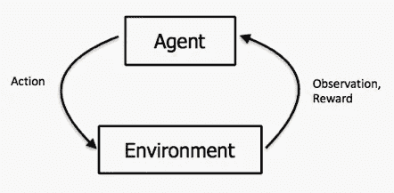
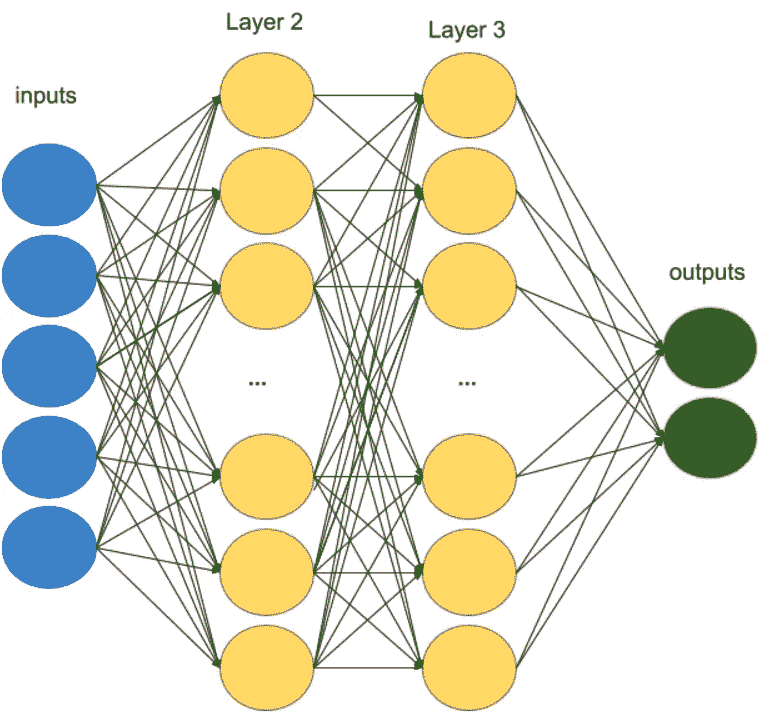

# 从零开始创建深度神经网络，强化学习导论

> 原文：<https://towardsdatascience.com/creating-deep-neural-networks-from-scratch-an-introduction-to-reinforcement-learning-part-i-549ef7b149d2?source=collection_archive---------12----------------------->

## 第一部分:体育馆环境与 DNN 建筑


宠物强化学习！[图片鸣谢: [*斯蒂芬妮·吉布奥特*](https://www.akc.org/expert-advice/training/lure-reward-training-dogs/)

> 本文是三部分系列文章的第一部分，将详细介绍 OpenAI gym 上 Cartpole-v1 问题的解决方案——仅使用 python 库中的 numpy。这个解决方案远非最佳解决方案(你可以在健身房网站上找到)，而是专注于从基本原则出发。
> 运行本文代码的先决条件是 python (3.x ),并安装了 gym 和 numpy 模块。

当我第一次开始在 OpenAI 健身房寻找强化学习时，我无法找到任何关于如何开始自己构建解决方案的好资源。有非常强大的库(如 Tensorflow 和 Pytorch ),允许您构建极其复杂的神经网络，并轻松解决 cartpole 问题，但我想从头开始创建神经网络，因为我相信理解现代机器学习技术的核心构建块是有价值的。我写的是我希望在我努力工作的时候能够找到的东西。所以让我们开始吧。

一、什么是 OpenAI 健身房？在他们的[网站](https://gym.openai.com/)上有一个很好的简短介绍，“Gym 是一个开发和比较强化学习算法的工具包。”“ [gym](https://github.com/openai/gym) 库是一个测试问题——环境——的集合，你可以用它来制定你的强化学习算法。这些环境有一个共享的接口，允许你编写通用算法。”这意味着，围绕构建和渲染模拟真实世界场景的模型的工程已经为我们完成，所以我们可以专注于教代理玩好游戏。

上面的描述也提到了强化学习。那是什么？这里有一个维基百科的总结——“**强化学习**是[机器学习](https://en.wikipedia.org/wiki/Machine_learning)的一个领域，涉及软件代理应该如何在一个环境中采取[行动](https://en.wikipedia.org/wiki/Action_selection)以最大化一些累积回报的概念。”

给你一个类比，想想一只狗是如何被训练的——有利的行为被积极地强化(以款待的形式)，而负面的行为被消极地强化。在某种程度上，即使是我们人类，也是复杂的强化学习代理，试图通过选择我们认为在未来会“有益于”我们(以更大回报的形式)的行动来最大化实现我们目标的机会。这张图展示了强化学习的循环，



强化学习周期[Image credit:[Mohit Mayank](https://itnext.io/reinforcement-learning-with-q-tables-5f11168862c8)

上图显示了一个*代理*(我们将构建的程序)将*环境*的状态和*奖励*作为输入，从之前的*动作*中选择一个后续动作并将其反馈给环境，然后再次观察环境。

很好，现在我们已经了解了强化学习中的基本概念，让我们回到我们试图解决的问题——cart pole。首先，具体看一下关于[侧翻问题](https://gym.openai.com/envs/CartPole-v0/)的文档。文档很好地概述了我们正在努力实现的目标。简而言之，我们控制着滑块的底部，顶部有一根垂直平衡的杆子。我们的目标是尽可能长时间地防止杆子脱落。如果极点(就其角度而言)下降到某个点以下，环境将被重置。下面是一个随机代理人在处理横竿问题。

扁担上的随机代理

如你所见，不是很好！但这是意料之中的，因为这个代理会忽略环境的当前状态，并在每个时间步选择一个随机动作。让我们看看我们是否能做得更好。

# 履行

是写代码的时候了！我们将从导入将要使用的库开始。我们将需要 gym 用于上面讨论的开放人工智能环境，以及 numpy 用于一些数学和矩阵操作。

```
import gym
import numpy as np
```

接下来，我们需要导入 gym 为侧翻问题提供的环境。这是如何做到的:

```
env=gym.make('CartPole-v1')
```

我们还可以通过打印来观察这个特殊环境空间的一些特征:

```
print(env.action_space) # Discrete(2)
print(env.observation_space) # Box(4,)
```

在[文档](https://gym.openai.com/docs/)中有更多关于环境及其工作方式的信息，但是上面的值捕捉了定义这个环境的基本元素——可以执行的动作，以及在每个时间步的观察。

动作空间是离散的，包含 2 个值:0 和 1。这些对应于代理能够执行的两个动作，即向左或向右推动滑块。

另一方面，观察空间是连续的，并且有四个组成部分(不要与数据结构框(4)相混淆，对于我们的目的，它仅仅意味着包含四个值的数组)。四个值是什么意思？它们是代表当时环境状态的数字——即大车的位置、大车的速度、杆子的角度、杆子的转速。[[https://github . com/open ai/gym/issues/238 # issue comment-231129955](https://github.com/openai/gym/issues/238#issuecomment-231129955)]

这里要理解的一个基本事情是，观察和动作空间中的数字的含义只是为了完整性而解释的，我们的目标不是解释(动作空间或观察空间的)值，而是让代理学习这些值在上下文中的含义。让我们回到我们的程序，添加代码来运行一个基本的循环。

```
# Global variablesNUM_EPISODES = 10
MAX_TIMESTEPS = 1000# The main program loopfor i_episode in range(NUM_EPISODES):
    observation = env.reset()
    # Iterating through time steps within an episode    for t in range(MAX_TIMESTEPS):
        env.render()
        action = env.action_space.sample()
        observation, reward, done, info = env.step(action)
        if done:
            # If the pole has tipped over, end this episode            break
```

上面的代码为剧集声明了一个主程序循环，并遍历了一集内的时间步长。在内部循环中，程序采取行动，观察结果，然后检查情节是否已经结束(要么是杆子倒下了，要么是滑块脱离了边缘)。如果有，环境被重置，内部循环重新开始。

选择动作的行是从可用的动作中随机抽样的；事实上，它的行为与前面显示的随机代理完全一样。让我们修改一下，定义一个自定义方法来选择给定观察的动作。

现在，我们将定义一个代理(希望如此！)将学会在给定的状态下更聪明地选择行动。我们将在一个类中模拟这个代理:

```
**class RLAgent:
**    env = None def **__init__**(self, env):
        self.***env*** = env

    def **select_action**(self, observation):
        return env.action_space.sample()
```

我们还需要向全局变量添加一个 RLAgent 实例，并更改操作选择，以便从实例化的类中调用该函数。注意，目前 select_action 函数做的事情和以前一样，但是我们以后会改变这一点。

# 神经网络

我们现在将创建我们的神经网络的元素。关于[神经网络](https://en.wikipedia.org/wiki/Artificial_neural_network)的快速入门:“人工神经网络(ANN)是一个被称为[人工神经元](https://en.wikipedia.org/wiki/Artificial_neuron)的连接单元或节点的集合，它松散地模拟了生物大脑中的[神经元](https://en.wikipedia.org/wiki/Neuron)。每个连接，就像生物大脑中的[突触](https://en.wikipedia.org/wiki/Synapse)，可以向其他神经元传递信号。人工神经元接收信号，然后进行处理，并向与之相连的神经元发出信号。”

这就是我们的未来，



神经网络

上图显示了一个神经网络，它有一个输入层、两个“隐藏”层(第 2 层和第 3 层)和一个输出层。该模型提供从观察空间到输入层的输入，这些输入被“前馈”到后续层，直到输出层，其中输出层中的值被用于选择动作。

例如，层 3 中的每个节点都是通过激活函数传递的层 2 的线性组合(加权和)。用于计算第 3 层的权重在矩阵中随机初始化，并通过称为 [*【随机梯度下降】*](/stochastic-gradient-descent-clearly-explained-53d239905d31) 的过程逐渐调整，以更好地预测输出。激活函数是一个简单的非线性函数，它允许分类器学习基础观察空间中的非线性规则。

在我们的 CartPole 问题中，有 5 个输入(观察空间的元素+一个偏差项)和 2 个输出(我们可以推车的两个方向)。

神经网络层将被封装在一个 NNLayer 类中，

```
**class NNLayer:**
    # class representing a neural net layer
    def **__init__**(self, input_size, output_size, activation=None, lr       = 0.001):
        self.***input_size*** = input_size
        self.***output_size*** = output_size
        self.**weights** = np.random.uniform(low=-0.5, high=0.5, size=(input_size, output_size))
        self.***activation_function*** = activation
        self.***lr*** = lr
```

这个类包含三个主要内容:

1.  图层的尺寸(输入和输出尺寸)。
2.  连接输入图层和输出图层的权重。
3.  输出的激活函数(默认激活为无，也称为线性)。

我们现在将这个类的用法添加到我们的 RLAgent 中。首先，我们将编辑选择动作函数，

```
def **select_action**(self, observation):
        values = self.forward(observation)
        if (np.random.random() > self.epsilon):
            return np.argmax(values)
        else:
            return np.random.randint(self.env.action_space.n)
```

这个函数不是每次都随机选择一个值，而是将关于环境状态的信息传递给我们的神经网络，并计算每个行为的“预期回报”(values 是一个接受(1,nᵢₙ)数组并返回(1,nₒᵤₜ)数组的函数)。然后，它会选择能带来最大预期回报的行动。注意，该函数仍然选择概率为ε的随机值。ε，也称为“探索率”，是强化学习中一个重要概念的实现:探索和利用之间的权衡。探索有助于模型不陷入局部最小值，通过不时探索明显次优的行动，可能揭示更大的回报。另一方面，利用允许代理使用其对当前状态的了解来选择最有利可图的动作。在大多数 RL 代理中，epsilon 在开始时很高(接近 1.0)，并且随着时间的推移逐渐降低到 0，因为代理在给定状态下对动作的学习值变得更有信心。

select_action 函数还调用 self.forward (RLAgent。Forward)，下面是这个函数的代码，

```
def **forward**(self, observation, remember_for_backprop=True):
        vals = np.copy(observation)
        index = 0
        for layer in self.layers:
            vals = layer.forward(vals, remember_for_backprop)
            index = index + 1
        return vals
```

上面的 RLAgent.forward 函数有一个简单的循环。它将输入(我们试图决定行动过程的观察)传递给网络，并获得每个行动的一组值。它在内部调用 NNLayer.forward 函数，收集每一层的输出并将其传递给下一层。为了完成 select action 函数的实现，下面是最后一部分 NNLayer.forward 函数。remember_for_backprop 参数是一个布尔值，它指定是否需要存储某些计算值，以防止权重更新期间的重复计算(这将在*反向传播*一节中详细解释)。

```
# Compute the forward pass for this layer
def **forward**(self, inputs, remember_for_backprop=True):
        input_with_bias = np.append(np.ones((len(inputs),1)),inputs, axis=1)
        unactivated = np.dot(input_with_bias, self.weights)
        output = unactivated
        if self.***activation_function*** != None:
            output = self.***activation_function***(output)
        if remember_for_backprop:
            # store variables for backward pass     
            self.***backward_store_in*** = input_with_bias
            self.***backward_store_out*** = np.copy(unactivated)

        return output
```

这个功能—

1.  将偏差项追加到输入中。
2.  计算该层的输入和权重矩阵的乘积。
3.  获取步骤 2 的输出，如果已经为该层定义了一个激活函数(在我们的例子中是 ReLU)，则通过该函数发送这个输出。

让我们在 RLAgent 的 init 函数中添加这些层的实例化，

```
def **__init__**(self, env):
   self.***env*** = env
   self.***hidden_size*** = 24
   self.***input_size*** = env.observation_space.shape[0]
   self.***output_size*** = env.action_space.n
   self.***num_hidden_layers*** = 2
   self.***epsilon*** = 1.0 self.***layers*** = [NNLayer(self.input_size + 1, self.hidden_size,       activation=relu)]
   for i in range(self.num_hidden_layers-1):
       self.***layers***.append(NNLayer(self.hidden_size+1, self.hidden_size, activation=relu))
   self.***layers***.append(NNLayer(self.hidden_size+1, self.output_size))
```

你可以看到上面我们总共有 2 个隐藏层和 1 个输出层。此外，在除了输出层之外的所有层中，我们都使用了一个激活函数，叫做**Re**ctived**L**linear**U**nit(ReLU)。这个函数是一个非常简单的函数，它给我们的神经网络引入了足够的非线性。这是它的实现，

```
def **relu**(mat):
    return np.multiply(mat,(mat>0))
```

此函数接收一个矩阵，并返回另一个具有相同值的矩阵，其中原始矩阵大于 0，所有其他值都为 0。最后，让我们将代理的初始化和 epsilon decay 添加到主程序循环中。这是新的主程序的样子:

```
# Global variables
NUM_EPISODES = 10
MAX_TIMESTEPS = 1000
model = RLAgent(env)# The main program loop
for i_episode in range(NUM_EPISODES):
    observation = env.reset()
    # Iterating through time steps within an episode
    for t in range(MAX_TIMESTEPS):
        env.render()
        action = model.select_action(observation)
        observation, reward, done, info = env.step(action)
        # epsilon decay
        model.epsilon = model.epsilon if model.epsilon < 0.01 else model.epsilon*0.995
        if done:
            # If the pole has tipped over, end this episode
            print('Episode {} ended after {} timesteps, current exploration is {}'.format(i_episode, t+1,model.epsilon))
            break
```

这个模型目前做什么？它随机初始化神经网络的权重，并基于这些权重计算任何给定状态下的动作值。然而，我们需要一种方法来改进网络中的权重值，以便代理能够在任何给定的状态下采取最佳行动。如前所述，这是通过随机梯度下降实现的，并通过称为**反向传播**的技术实施。我将在下一篇文章中详细介绍反向传播以及强化学习的相关理论。

总而言之，这就是我们迄今为止所取得的成就:

1.  编写了与 OpenAI gym 中的 CartPole 的环境空间进行交互的主要程序组件。
2.  将强化学习代理及其组件神经网络层封装在各自的类中。
3.  为我们的深度学习强化学习代理编码和初始化神经网络架构。
4.  实施“前馈”计算，通过神经网络传播对环境的观察，以计算行动值。

在下一篇文章中，我们将致力于实现以下目标:

1.  检查并形式化一个“累积奖励”的概念，即一个代理人在特定的状态下对掷球问题的期望。
2.  理解代理应如何更新神经网络中的权重，以更接近其想法，即在特定状态下采取特定行动预期的正确累积回报。
3.  实现反向传播——实现上面 2 中提到的目标的算法。

下次见！