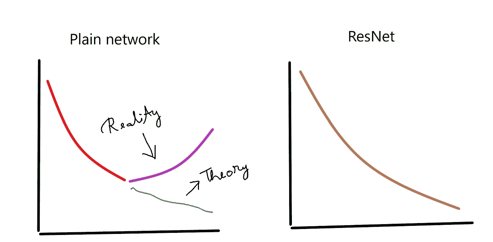
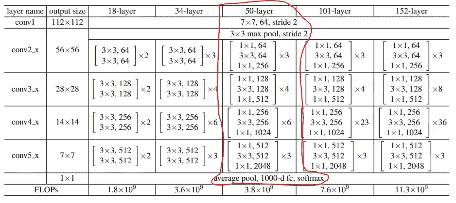

# 使用 Tensorflow 从头开始创建更深的瓶颈 ResNet

> 原文：<https://towardsdatascience.com/creating-deeper-bottleneck-resnet-from-scratch-using-tensorflow-93e11ff7eb02?source=collection_archive---------13----------------------->

## 我们将看到如何使用 Tensorflow 2.0 从头开始实现 ResNet50


图一。剩余块和跳过连接(来源:图片由作者创建)

可以看出，通常较深的神经网络比浅的神经网络性能更好。但是，深度神经网络面临一个共同的问题，称为“消失/爆炸梯度问题”。为了克服这个问题，提出了 ResNet 网络。

原文链接—[https://arxiv.org/abs/1512.03385](https://arxiv.org/abs/1512.03385)

# 剩余块:

ResNets 包含**剩余块**。如图 1 所示，存在激活‘a*l’*，随后是具有 ReLU 非线性的线性层，‘a*l+1*’。接着是另一个线性层，带有另一个非线性，“a *l+2* ”。这是正常或普通神经网络的样子。ResNet 增加了**跳过连接**。在 ResNet 中，来自‘a*l*的信息被快进并复制到‘a*l+1*之后的线性层之后，ReLU 非线性之前。现在具有跳跃连接的整个块被称为残余块。图 2 显示了 ResNet 原始论文中看到的残余块。跳跃连接有助于跳过几乎两层，将其信息传递到神经网络的更深处。


图二。ResNet 论文中显示的残余块(来源:ResNet 论文原文)

使用残余块可以训练更深层次的神经网络。因此，ResNet 论文的作者将这些残差块一个接一个地堆叠起来，形成一个深度残差神经网络，如图 3 所示。


图 3。34 层平面网络与 34 层残差网络的图像片段(来源:原始 ResNet 论文)

可以看出，当使用诸如 SGD 的优化算法来训练深度平面网络时，理论上训练误差应该随着神经网络中层数的增加而不断减小，但实际情况并非如此。在减少到某一层之后，训练误差又开始增加。但是使用残余块可以克服这个问题，并且即使当层数显著增加时，训练误差也保持减小。这可以在图 4 中看到。



图 4。普通网络与 ResNet 的训练误差。X 轴表示层数的增加，y 轴表示训练误差(来源:图片由作者提供)

# 更深的瓶颈 ResNet 架构:


图 5。普通残余块 vs 更深的瓶颈残余块(来源:原 ResNet 论文)

图 5 显示了普通剩余块与更深瓶颈剩余块之间的差异。在公共残差块中，有两个具有 3×3 滤波器的卷积层。在瓶颈架构中，有 3 个卷积层，而不是 2 个。这三层是 1x1、3x3 和 1x1 卷积，其中 1x1 层负责减少然后增加(恢复)维度，而 3x3 层则成为具有较小输入/输出维度的瓶颈。


图 6。瓶颈残余块—身份块(来源:图片由作者创建)

如图 6 所示，瓶颈残差块有一个 1x1 的 Conv 层，然后是批规范化和 ReLU 激活，接着是一个 3x3 的 Conv 层，然后是批规范化和 ReLU，最后是一个 1x1 的 Conv 层和一个批规范化。这连接到跳过连接输入，然后应用最终 ReLU 激活。这是第一个瓶颈层版本(身份块)。“f”代表每个 Conv 层中滤光器的数量。


图 7。瓶颈剩余块—投影版本(来源:图片由作者创建)

瓶颈层的第二个版本(投影)与第一个版本非常相似，除了它有一个额外的 1x1 Conv 层，然后是在跳过连接上出现的批量归一化。跳过连接上的额外 Conv 层确保残差块左侧的滤波器数量与残差块右侧的滤波器数量相同。这允许将输入与残差块相加，而没有任何误差。此外，如果我们需要将**步**添加到左侧 Conv 层以减小图像的大小，我们可以通过在跳过连接中在 Conv 层上添加类似数量的步来确保来自前一层的输入也具有相同的大小。

# **使用 Tensorflow 创建 ResNet50】**



图 8。我们将创建一个 50 层的 ResNet。图像显示了网络中使用的所有块(来源:原始 ResNet 文件)

*   在 ResNet 论文中，提到了在每个卷积块之后和激活函数之前使用批量归一化。
*   该网络始于 Conv 层，其具有 7×7 的核形状和 64 个核(滤波器)，步长为 2。随后是批量规范化和 ReLU 激活。
*   接下来是最大 3x3 的池层和步幅 2。
*   其后是 ResNet(剩余/瓶颈)块。有 4 个 ResNet 块，每个块中的内核数量和内核大小如图 8 所示。
*   最后，有一个平均池层，一个完全连接的层，然后是 Softmax 激活。

**算法:**

1.  从 Tensorflow 导入所有必要的层
2.  为 conv-巴奇诺姆-雷卢块写一个函数
3.  为身份瓶颈块编写一个函数
4.  为投影瓶颈块编写一个函数
5.  为 ResNet 块编写一个函数
6.  一起使用所有函数来创建模型

**导入 TensorFlow 和所有必需的库。**

```
*#import the libraries*

**from** **tensorflow.keras.layers** **import** Input, Conv2D, BatchNormalization
**from** **tensorflow.keras.layers** **import** MaxPool2D, GlobalAvgPool2D
**from** **tensorflow.keras.layers** **import** Add, ReLU, Dense
**from** **tensorflow.keras** **import** Model
```

**创建 conv-巴奇诺姆-雷鲁块的函数**

这是基本的构建模块。它包含一个卷积层，随后是 BatchNormalization，接着是 ReLU 激活功能。

```
*#Conv-BatchNorm-ReLU block*

**def** conv_batchnorm_relu(x, filters, kernel_size, strides=1):

    x = Conv2D(filters=filters, kernel_size=kernel_size, strides=strides, padding = 'same')(x)
    x = BatchNormalization()(x)
    x = ReLU()(x)

    **return** x
```

**功能创建身份瓶颈块**

正如我们前面所看到的，一个身份块包含 3 个卷积层，每一层之后是批量标准化和 ReLU 激活，除了最后一层，它首先添加到跳过连接，然后才应用 ReLU 激活。

此外，前两个卷积层的滤波器数量相同，但最后一个卷积层的滤波器数量是原来的 4 倍。

如图 8 所示，“conv2_x”的前两个卷积模块有 64 个滤波器，最后一个卷积模块有 64*4=256 个滤波器。对所有的标识块重复同样的操作。

```
*#Identity block*

**def** identity_block(tensor, filters):

    x = conv_batchnorm_relu(tensor, filters=filters, kernel_size=1, strides=1)
    x = conv_batchnorm_relu(x, filters=filters, kernel_size=3, strides=1)
    x = Conv2D(filters=4*filters, kernel_size=1, strides=1)(x)
    x = BatchNormalization()(x)

    x = Add()([tensor,x])    *#skip connection*
    x = ReLU()(x)

    **return** x
```

**创建投影块的功能**

投影块的左侧与标识块相似，只是步数不同。

投影块的右侧包含 1×1 卷积层，其滤波器数量是左侧第一层的 4 倍，跨距数量相同。这确保了原始输入和跳过连接具有相同数量的滤波器和相同的步距，否则矩阵加法将会出错。

```
*#Projection block*

**def** projection_block(tensor, filters, strides):

    *#left stream*
    x = conv_batchnorm_relu(tensor, filters=filters, kernel_size=1, strides=strides)
    x = conv_batchnorm_relu(x, filters=filters, kernel_size=3, strides=1)
    x = Conv2D(filters=4*filters, kernel_size=1, strides=1)(x)
    x = BatchNormalization()(x)

    *#right stream*
    shortcut = Conv2D(filters=4*filters, kernel_size=1, strides=strides)(tensor)
    shortcut = BatchNormalization()(shortcut)

    x = Add()([shortcut,x])    *#skip connection*
    x = ReLU()(x)

    **return** x
```

**创建 ResNet 块的函数**

如图 8 所示，每个模块“conv2_x”、“conv3_x”等都重复多次。“conv2_x”重复 3 次，“conv3_x”重复 4 次，“conv4_x”重复 6 次，“conv5_x”重复 3 次。

在每种情况下，第一个块是投影块，其余的是单位块。所以对于‘con v2 _ x’，第一个块是投影块，另外两个重复是单位块。

第一块是投影的原因是为了确保来自跳过连接的输入和该块的实际输出的步长和滤波器数量是相同的。在投影块中，第一卷积层的跨距=2。这意味着，如果输入的是一个图像，该层之后的图像的大小将会减小。但是跳过连接中的输入仍然具有先前的图像大小。添加两个不同大小的图像是不可能的。所以 skip 连接也有一个 stride=2 的卷积层。这确保了图像尺寸现在是相同的。

在下面的重复中，步幅被设置为 1，因此图像大小保持不变，并且不需要投影块。因此，除了每个 ResNet 块的第一次重复之外，所有其他重复都使用相同的块。

```
*#Resnet block*

**def** resnet_block(x, filters, reps, strides):

    x = projection_block(x, filters, strides)
    **for** _ **in** range(reps-1):
        x = identity_block(x,filters)

    **return** x
```

**创建模型**

既然所有的块都准备好了，那么现在可以按照图 8 创建模型了。

```
*#Model*

input = Input(shape=(224,224,3))

x = conv_batchnorm_relu(input, filters=64, kernel_size=7, strides=2)
x = MaxPool2D(pool_size = 3, strides =2)(x)
x = resnet_block(x, filters=64, reps =3, strides=1)
x = resnet_block(x, filters=128, reps =4, strides=2)
x = resnet_block(x, filters=256, reps =6, strides=2)
x = resnet_block(x, filters=512, reps =3, strides=2)
x = GlobalAvgPool2D()(x)

output = Dense(1000, activation ='softmax')(x)

model = Model(inputs=input, outputs=output)
model.summary()
```

输出片段:


**绘制模型**

```
**from** **tensorflow.python.keras.utils.vis_utils** **import** model_to_dot
**from** **IPython.display** **import** SVG
**import** **pydot**
**import** **graphviz**

SVG(model_to_dot(model, show_shapes=**True**, show_layer_names=**True**, rankdir='TB',expand_nested=**False**, dpi=60, subgraph=**False**).create(prog='dot',format='svg'))
```

输出片段:


使用 Tensorflow 从头开始创建 ResNet 50 的完整代码:

```
***#import the libraries***

**from** **tensorflow.keras.layers** **import** Input, Conv2D, BatchNormalization
**from** **tensorflow.keras.layers** **import** MaxPool2D, GlobalAvgPool2D
**from** **tensorflow.keras.layers** **import** Add, ReLU, Dense
**from** **tensorflow.keras** **import** Model***#Conv-BatchNorm-ReLU block*****def** conv_batchnorm_relu(x, filters, kernel_size, strides=1):
    x = Conv2D(filters=filters, kernel_size=kernel_size, strides=strides, padding = 'same')(x)
    x = BatchNormalization()(x)
    x = ReLU()(x)
    **return** x***#Identity block*****def** identity_block(tensor, filters):
    x = conv_batchnorm_relu(tensor, filters=filters, kernel_size=1, strides=1)
    x = conv_batchnorm_relu(x, filters=filters, kernel_size=3, strides=1)
    x = Conv2D(filters=4*filters, kernel_size=1, strides=1)(x)
    x = BatchNormalization()(x)
    x = Add()([tensor,x])    *#skip connection*
    x = ReLU()(x)
    **return** x
***#Projection block*** 

**def** projection_block(tensor, filters, strides): 

     *#left stream*     
     x = conv_batchnorm_relu(tensor, filters=filters, kernel_size=1, strides=strides)     
     x = conv_batchnorm_relu(x, filters=filters, kernel_size=3, strides=1)     
     x = Conv2D(filters=4*filters, kernel_size=1, strides=1)(x)     
     x = BatchNormalization()(x) 

     *#right stream*     
     shortcut = Conv2D(filters=4*filters, kernel_size=1, strides=strides)(tensor)     
     shortcut = BatchNormalization()(shortcut)          
     x = Add()([shortcut,x])    *#skip connection*     
     x = ReLU()(x)          
     **return** x***#Resnet block***

**def** resnet_block(x, filters, reps, strides):

    x = projection_block(x, filters, strides)
    **for** _ **in** range(reps-1):
        x = identity_block(x,filters)
    **return** x***#Model***

input = Input(shape=(224,224,3))

x = conv_batchnorm_relu(input, filters=64, kernel_size=7, strides=2)
x = MaxPool2D(pool_size = 3, strides =2)(x)
x = resnet_block(x, filters=64, reps =3, strides=1)
x = resnet_block(x, filters=128, reps =4, strides=2)
x = resnet_block(x, filters=256, reps =6, strides=2)
x = resnet_block(x, filters=512, reps =3, strides=2)
x = GlobalAvgPool2D()(x)

output = Dense(1000, activation ='softmax')(x)

model = Model(inputs=input, outputs=output)
model.summary()
```

**参考文献:**

1.  何、、任、，深度残差学习用于图像识别，2015， [arXiv:1512.03385](https://arxiv.org/abs/1512.03385)**【cs .简历]**