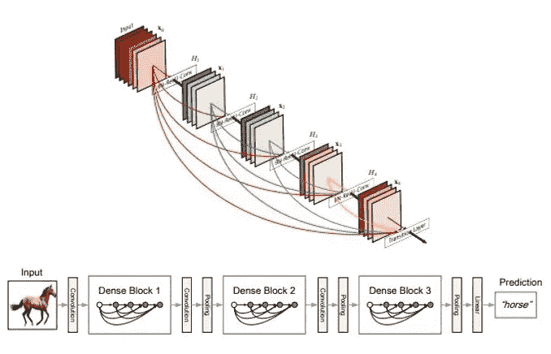
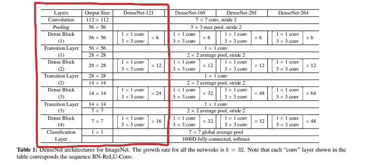
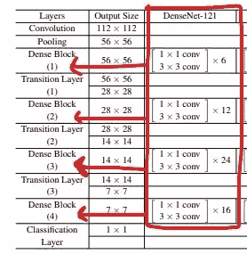
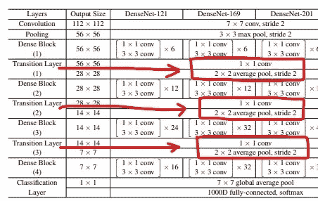
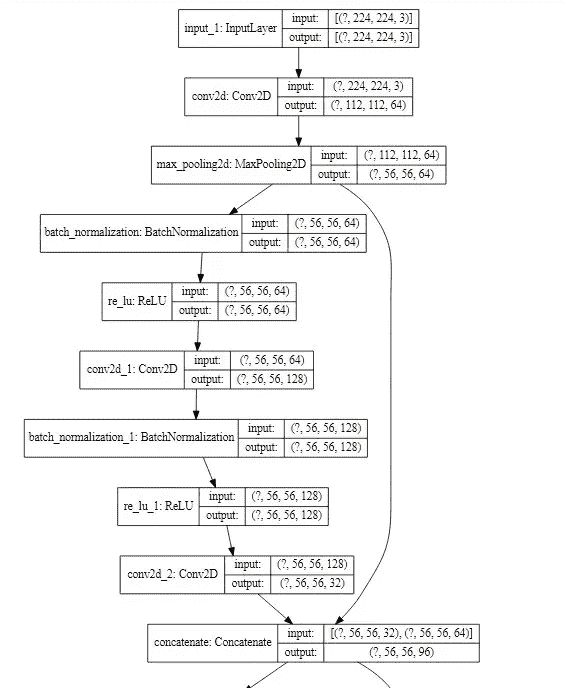

# 使用 TensorFlow 创建 DenseNet 121

> 原文：<https://towardsdatascience.com/creating-densenet-121-with-tensorflow-edbc08a956d8?source=collection_archive---------4----------------------->

## 在本文中，我们将了解如何使用 Tensorflow 从头开始创建 DenseNet 121 架构。



图 1:DenseNet 中的各种块和层(来源:dense net 原始文件)

DenseNet 论文链接:[https://arxiv.org/pdf/1608.06993.pdf](https://arxiv.org/pdf/1608.06993.pdf)

DenseNet(密集卷积网络)是一种架构，专注于通过使用层间更短的连接，使深度学习网络更深入，但同时使它们更有效地训练。DenseNet 是一个卷积神经网络，其中每一层都连接到网络中更深层的所有其他层，即第一层连接到第二层、第三层、第四层等等，第二层连接到第三层、第四层、第五层等等。这样做是为了实现网络层之间的最大信息流。为了保持前馈性质，每一层从所有前面的层获得输入，并将它自己的特征映射传递给它后面的所有层。与 Resnets 不同，它不是通过求和来组合特征，而是通过连接它们来组合特征。因此“第 I”层具有“I”个输入，并且由所有其前面的卷积块的特征图组成。它自己的特征地图被传递给所有下一个“I-i”层。这在网络中引入了'(I(I+1))/2 '连接，而不是像传统深度学习架构中那样仅仅是' I '连接。因此，它比传统的卷积神经网络需要更少的参数，因为不需要学习不重要的特征映射。

DenseNet 由两个重要的模块组成，而不是基本的卷积层和池层。它们是致密块体和过渡层。

接下来，我们看看所有这些块和层是什么样子，以及如何用 python 实现它们。



图 DenseNet121 框架(来源:原始 DenseNet 论文，由作者编辑)

DenseNet 从一个基本的卷积和池层开始。然后是一个密集块后面跟着一个过渡层，另一个密集块后面跟着一个过渡层，另一个密集块后面跟着一个过渡层，最后是一个密集块后面跟着一个分类层。

第一卷积块有 64 个大小为 7×7 的滤波器，跨距为 2。接下来是最大池层，最大池为 3×3，跨距为 2。这两行可以用 python 中的以下代码来表示。

```
input = Input (input_shape)
x = Conv2D(64, 7, strides = 2, padding = 'same')(input)
x = MaxPool2D(3, strides = 2, padding = 'same')(x)
```

**定义卷积块** —输入后的每个卷积块有如下顺序:BatchNormalization，后面是 ReLU activation，然后是实际的 Conv2D 层。为了实现这一点，我们可以编写下面的函数。

```
*#batch norm + relu + conv*
**def** bn_rl_conv(x,filters,kernel=1,strides=1):

    x = BatchNormalization()(x)
    x = ReLU()(x)
    x = Conv2D(filters, kernel, strides=strides,padding = 'same')(x)
    **return** x
```



图 3。密集块(来源:DenseNet 纸-由作者编辑)

**定义密集块** —如图 3 所示，每个密集块都有两个卷积，内核大小分别为 1x1 和 3x3。在密集块 1 中，重复 6 次，在密集块 2 中重复 12 次，在密集块 3 中重复 24 次，最后在密集块 4 中重复 16 次。

在密集块中，每个 1x1 卷积具有 4 倍数量的过滤器。所以我们使用 4 *滤镜，但是 3 * 3 滤镜只出现一次。此外，我们必须连接输入和输出张量。

使用“for 循环”，每个模块分别重复 6、12、24、16 次。

```
**def** dense_block(x, repetition):

   **for** _ **in** range(repetition):
        y = bn_rl_conv(x, 4*filters)
        y = bn_rl_conv(y, filters, 3)
        x = concatenate([y,x])
   **return** x
```



图 4:过渡层(来源:DenseNet 论文-作者编辑)

**定义过渡层** —在过渡层，我们要将通道数量减少到现有通道的一半。有一个 1x1 卷积层和一个 2x2 平均池层，步长为 2。在函数 bn_rl_conv 中已经设置了 1x1 的内核大小，所以我们不需要明确地再次定义它。

在过渡层中，我们必须将通道减少到现有通道的一半。我们有输入张量 x，我们想知道有多少个通道，我们需要得到其中的一半。因此，我们可以使用 Keras backend (K)获取张量 x，并返回一个维度为 x 的元组。我们只需要该形状的最后一个数字，即过滤器的数量。所以我们加[-1]。最后，我们可以将这个数量的滤波器除以 2，得到想要的结果。

```
**def** transition_layer(x):

    x = bn_rl_conv(x, K.int_shape(x)[-1] //2 )
    x = AvgPool2D(2, strides = 2, padding = 'same')(x)
    **return** x
```

我们已经完成了密集数据块和过渡层的定义。现在我们需要将密集的块和过渡层堆叠在一起。所以我们写了一个 for 循环来运行 6，12，24，16 次重复。因此循环运行 4 次，每次使用 6、12、24 或 16 中的一个值。这完成了 4 个密集块和过渡层。

```
**for** repetition **in** [6,12,24,16]:

    d = dense_block(x, repetition)
    x = transition_layer(d)
```

最后是 GlobalAveragePooling，接下来是最终的输出层。我们在上面的代码块中看到，密集块是用‘d’定义的，在最后一层，密集块 4 之后，没有过渡层 4，而是直接进入分类层。因此，“d”是应用 GlobalAveragePooling 的连接，而不是“x”上的连接。另一种方法是从上面的代码中删除“for”循环，然后一层接一层地堆叠这些层，而没有最后的过渡层。

```
x = GlobalAveragePooling2D()(d)
output = Dense(n_classes, activation = 'softmax')(x)
```

现在我们已经把所有的模块放在一起了，让我们把它们合并起来，看看整个 DenseNet 架构。

**完成 DenseNet 121 架构:**

```
**import** **tensorflow** **as** **tf**
**from** **tensorflow.keras.layers** **import** Input, Conv2D, BatchNormalization, Dense
**from** **tensorflow.keras.layers** **import** AvgPool2D, GlobalAveragePooling2D, MaxPool2D
**from** **tensorflow.keras.models** **import** Model
**from** **tensorflow.keras.layers** **import** ReLU, concatenate
**import** **tensorflow.keras.backend** **as** **K***# Creating Densenet121***def** densenet(input_shape, n_classes, filters = 32):

    *#batch norm + relu + conv*
    **def** bn_rl_conv(x,filters,kernel=1,strides=1):

        x = BatchNormalization()(x)
        x = ReLU()(x)
        x = Conv2D(filters, kernel, strides=strides,padding = 'same')(x)
        **return** x

    **def** dense_block(x, repetition):

        **for** _ **in** range(repetition):
            y = bn_rl_conv(x, 4*filters)
            y = bn_rl_conv(y, filters, 3)
            x = concatenate([y,x])
        **return** x

    **def** transition_layer(x):

        x = bn_rl_conv(x, K.int_shape(x)[-1] //2 )
        x = AvgPool2D(2, strides = 2, padding = 'same')(x)
        **return** x

    input = Input (input_shape)
    x = Conv2D(64, 7, strides = 2, padding = 'same')(input)
    x = MaxPool2D(3, strides = 2, padding = 'same')(x)

    **for** repetition **in** [6,12,24,16]:

        d = dense_block(x, repetition)
        x = transition_layer(d) x = GlobalAveragePooling2D()(d)
    output = Dense(n_classes, activation = 'softmax')(x)

    model = Model(input, output)
    **return** modelinput_shape = 224, 224, 3
n_classes = 3model = densenet(input_shape,n_classes)
model.summary()
```

输出:(假设最后 3 节课—模型总结的最后几行)


要查看**架构图**，可以使用下面的代码。

```
**from** **tensorflow.python.keras.utils.vis_utils** **import** model_to_dot
**from** **IPython.display** **import** SVG
**import** **pydot**
**import** **graphviz**

SVG(model_to_dot(
    model, show_shapes=**True**, show_layer_names=**True**, rankdir='TB',
    expand_nested=**False**, dpi=60, subgraph=**False**
).create(prog='dot',format='svg'))
```

输出—图表的前几块



这就是我们实现 DenseNet 121 架构的方式。

**参考文献:**

1.  1.黄高和刘庄以及劳伦斯·范德马腾和基利安·q·温伯格，密集连接的卷积网络，arXiv 1608.06993 (2016 年)