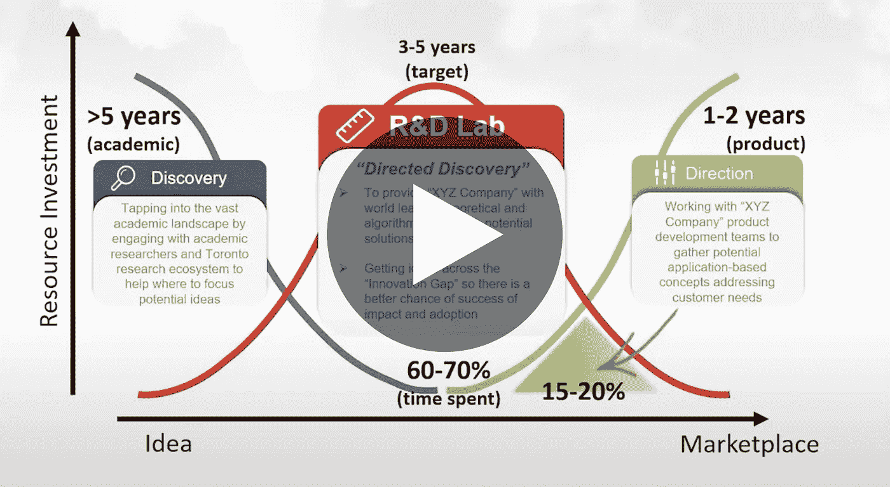

# 创建有效的行业-学术人工智能合作伙伴关系

> 原文：<https://towardsdatascience.com/creating-effective-industry-academic-ai-partnerships-87967aacc8f1?source=collection_archive---------60----------------------->

## [活动讲座](https://towardsdatascience.com/event-talks/home)

## 达林·格雷厄姆| TMLS2019

https://torontomachinelearning.com/

## 关于演讲者

Darin 在领导创新计划方面拥有 20 多年的经验，这些创新计划将创意推向市场。他在领导 R&D 项目和帮助加拿大、美国、新西兰和英国建立创新生态系统方面拥有丰富的国际经验。

作为合作的倡导者，他与各种独特的团体密切合作，让行业与学术和研究机构合作，以增强基于技术的应用成果，特别是与人工智能(AI)相关的成果，通过增加知识和帮助开发人力资本来促进经济增长。

Darin 刚刚担任了一个新角色，负责 LG 电子的 R&D 战略和运营人工智能活动，在多伦多建立了他们的新实验室。最近，作为创始运营团队的一员，Darin 帮助领导了 Vector Institute 的创建和形成，这是加拿大首屈一指的人工智能研究机构。

他还帮助建立和启动了三星在多伦多的人工智能实验室。他曾在多个组织担任主要领导职务，包括 ORION(安大略省研究和创新光纤网络)、NZi3(新西兰 ICT 创新研究所)和 CITO(安大略省通信和信息技术，安大略省卓越中心)。

Darin 在多伦多大学获得了航空航天工程博士学位，他的论文重点是自主机器人控制系统的高级神经网络；多伦多大学航空航天工程硕士，滑铁卢大学计算机科学和应用数学学士。

[创建有效的产业-学术人工智能合作伙伴关系](https://www.youtube.com/watch?v=I0OmmCQ5iGM)