# 用 OpenAI 的语言模型生成假新闻

> 原文：<https://towardsdatascience.com/creating-fake-news-with-openais-language-models-368e01a698a3?source=collection_archive---------58----------------------->

## GPT 和 NLP 时代的种族和政治

# **简介**

在我们之前的[文章](/language-models-and-fake-news-the-democratization-of-propaganda-11b1267b3054)中，我们讨论了最近发布的 OpenAI 的 GPT-3 及其在误传时代可能的影响。我们讨论了 GPT 系列的发展、架构和历史，并评估了在[原始](https://arxiv.org/pdf/2005.14165.pdf) [出版物](https://d4mucfpksywv.cloudfront.net/better-language-models/language_models_are_unsupervised_multitask_learners.pdf)中呈现的一些功能和结果。

然而，由于这些是研究小组选择的文献实例，它们不具备使它们与当今紧迫主题相关的必要背景。虽然 GPT-3 尚未向公众发布，但被作者称为“太危险而不能发布”的 GPT-2 已于 2019 年初推出。因此，它为我们的问题陈述充当了这种模型的能力的一个伟大的估计者。


GPT-2 模型重量配置。([阿拉玛等人。艾尔](http://jalammar.github.io/illustrated-transformer/)

在我们的[上一篇文章](/language-models-and-fake-news-the-democratization-of-propaganda-11b1267b3054)中，我们已经介绍了 GPT 系列模型的变压器型架构。最重要的是，该模型以 4 种不同的预设重量配置发布，参数从 1.17 亿延伸到 15 亿。可以想象，模型复杂度的增加伴随着各种 NLP 任务性能的提高。

GPT-2 在 WebText 数据集上接受训练，该数据集由用户在 Reddit 平台上发布的 4500 万个出站链接的文本内容组成。网络文本中访问量排名前 15 位的域名是:谷歌、存档、博客、GitHub、纽约时报、Wordpress、华盛顿邮报、维基、BBC、卫报、易贝、Pastebin、CNN、雅虎！，以及《赫芬顿邮报》。

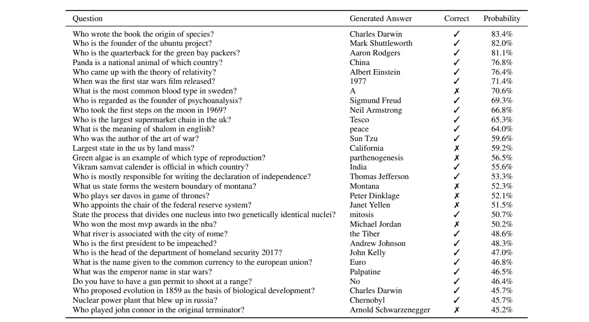

来自 GPT-2 原始出版物的问答示例。

该模型在生成今日最新头条的人类可接受内容方面表现如何？该型号在低重量配置下表现如何？我们能证实基于变压器模型的批评者提出的担忧吗？

让我们来看看 GPT-2 在生成媒体中最近一些相关主题的传真输出方面表现如何。

# **实施**

由于从零开始训练 GPT-2 模型的复杂性，我们将采用 GPT 图书馆的 Lopez-Franco 的操场实现来检查使用条件样本生成的输出差异。你会在 [GradientCrescent Github](https://github.com/EXJUSTICE/GradientCrescent) 上找到改编后的代码。

具体来说，我们将比较两种不同的 GPT-2 配置，小型*模型(1.17 亿个参数)和大型*模型(7.75 亿个参数)，通过检查**和**在一些相关当代主题上产生的一些输出。请注意，GPT-2 有一个公开的*超大*模型(有高达 15 亿个参数)，但由于它的大小，我们选择忽略它。**

笔记本是高度抽象的，条件样本生成的关键方法位于*interactive _ conditional _ samples . py*:

```
!python3 src/interactive_conditional_samples.py — model_name=’117M’ — nsamples=2 — top_k=40 — temperature=.80
```

*   `model_name = '117M'`:型号选择。有 117 米、345 米、774 米和 1558 米型号可供选择。。
*   `seed = None`:随机值发生器，用来在将来产生相同的结果。
*   `nsamples = 1`:指定输出样本的数量。
*   `length = None`:每个样本要打印的令牌数(字数)。
*   `batch_size= 1`:你想同时处理多少个输入。
*   `temperature = 1`:在 0 和 1 之间浮动。在 softmax 层之前进行采样之前，对输出逻辑进行缩放。更高的温度导致更多的随机完井。
*   `top_k = 0`:控制分集的整数值。截断被认为具有最高值的逻辑集合。1 表示每一步只考虑一个单词(标记)，导致确定性完成。40 表示每一步考虑 40 个单词。0(默认值)是一个特殊设置，表示没有限制。

这个脚本是用 Tensorflow Core 编写的，它接受用户输入文本，将它们编码成标记化的表示形式，然后将它们输入到模型中，在指定的约束条件下生成输出。

```
with tf.Session(graph=tf.Graph()) as sess:
 context = tf.placeholder(tf.int32, [batch_size, None])
 np.random.seed(seed)
 tf.set_random_seed(seed)
 output = sample.sample_sequence(
   hparams=hparams, length=length,
   context=context,
   batch_size=batch_size,
   temperature=temperature, top_k=top_k, top_p=top_p
  )saver = tf.train.Saver()
 ckpt = tf.train.latest_checkpoint(os.path.join(models_dir, model_name))
 saver.restore(sess, ckpt)while True:
 raw_text = input(“Model prompt >>> “)
 while not raw_text:
   print(‘Prompt should not be empty!’)
   raw_text = input(“Model prompt >>> “)
 context_tokens = enc.encode(raw_text)
 generated = 0
 for _ in range(nsamples // batch_size):
   out = sess.run(output, feed_dict={
   context: [context_tokens for _ in range(batch_size)]
   })[:, len(context_tokens):]
   for i in range(batch_size):
     generated += 1
     text = enc.decode(out[i])
     print(“=” * 40 + “ SAMPLE “ + str(generated) + “ “ + “=” * 40)
     print(text)
 print(“=” * 80)
```

由于该模型是在一年多前定型的，因此最近的主题(如最近的新冠肺炎疫情)不会出现在数据集中。对所有生成的样本进行了系统的交叉引用，得出的结论是，这些句子没有一个是逐字逐句从某篇文章中复制来的。**所有样本的内容都是合成的，而不是记忆的。**

我们来看一些话题。

# **论特朗普总统**

775 米

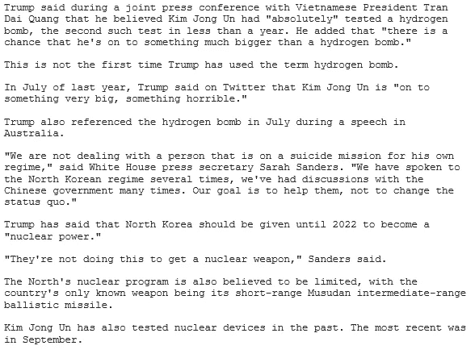

117 米

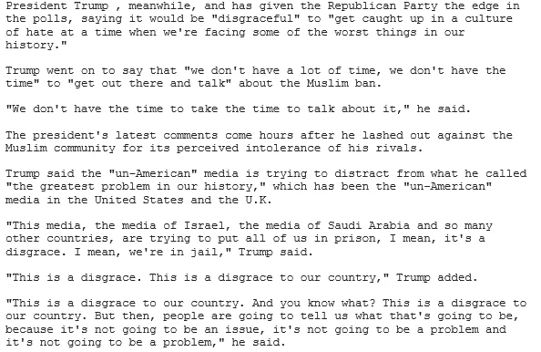

虽然在这两个例子中，整体的流程和语法看起来很自然，但是两个模型都显示出不一致，这些问题在较小的模型中更加明显。

> 特朗普表示，“非美国”媒体正试图转移他所谓的“我们历史上最大的问题”，即美国和英国的“非美国”媒体。
> 
> “这家媒体，以色列的媒体，沙特阿拉伯和其他许多国家的媒体，试图把我们所有人都关进监狱，我的意思是，这是一种耻辱。我的意思是，我们在监狱里，”特朗普说。

*   美国传统中东盟友的所有媒体都试图“把他们关进监狱”是不太可能的。不幸的是，由于总统倾向于重复自己的话，区分真实和虚构变得更加困难。然而，大量的重复引起了怀疑。

大模型的文本要连贯得多，除了一句话:

> 特朗普曾表示，朝鲜应该在 2022 年之前成为“核大国”。

*   这将与美国对朝鲜的外交政策背道而驰。虽然这句话确实有道理，但它没有抓住朝鲜和全球对其核计划的看法之间的隐含关系。

# 关于奥巴马总统

775 米

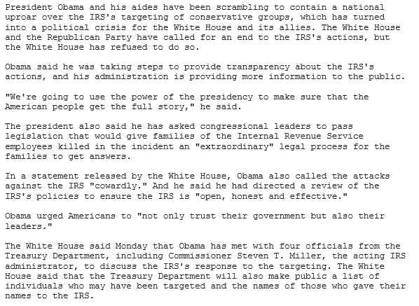

117 米

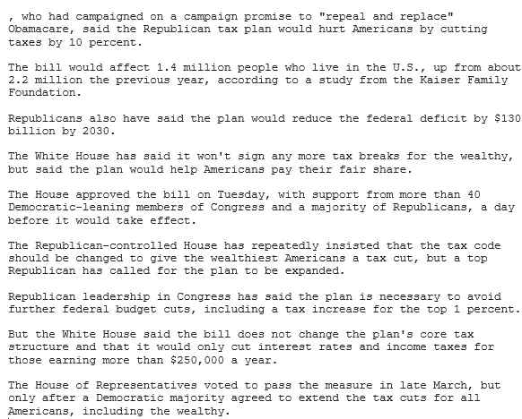

虽然较大模型的输出对于人类输出来说似乎还过得去(除非有人被国税局杀害的指控)，但较小模型的输出虽然语法正确，但表现出多个主题不一致:

> 曾在竞选中承诺“废除并取代”奥巴马医改的奥巴马表示，共和党的税收计划将通过减税 10%来伤害美国人。

*   减税通常被认为不会伤害美国人。

> 根据凯撒家庭基金会(Kaiser Family Foundation)的一项研究，该法案将影响 140 万居住在美国的人，高于前一年的 220 万。

*   受该计划影响的人数减少了，而不是增加了，所以从开始的*一词是不正确的。*

> 共和党人还表示，该计划将在 2030 年前减少 1300 亿美元的联邦赤字

*   减税不太可能减少联邦赤字。

> 但白宫表示，该法案不会改变该计划的核心税收结构，只会降低年收入超过 25 万美元的人的利率和所得税。

*   白宫减税的收入门槛作为一个可行的税收计划肯定很难实现。

# 论警察暴行

775 米

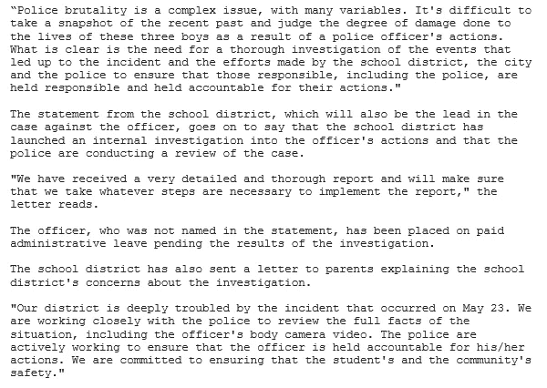

117 米

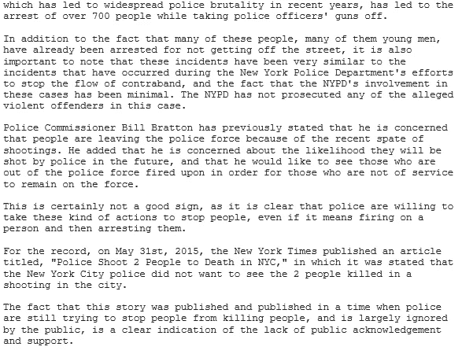

这两种配置之间的差异在这里更加明显，较小模型的输出几乎是无意义的。

> 这导致了近年来广泛的警察暴力行为，导致了 700 多人在收缴警察枪支时被捕。

*   警察暴力不太可能导致“警察的枪被拿掉”。可能是模型学习了*从某人*手中拿枪的概念，在这里犯了一个语法错误。

> 警察局长比尔·布拉顿(Bill Bratton)此前表示，他担心人们会因为最近一连串的枪击事件而离开警察队伍。他补充说，他担心他们将来可能会被警察开枪打死，他希望看到那些不在警察队伍中的人被开枪打死，以便那些不在服务中的人留在警察队伍中。

*   警察局长布拉顿的声明在这里是完全荒谬的。警察怎么会希望看到已经在枪击中丧生的人，或者担心前警察将来会被警察枪杀？

> 但当案件最终被提交到大陪审团时，大陪审团尚未决定是否起诉该男子，该案件目前正由 NYPD 调查。
> 
> 纽约警察局一再声明，它从未见过以这种方式实施的“毒品相关或暴力犯罪”案件。

*   很可能 NYPD 在这个案子被带到大陪审团之前就已经在调查了。此外，没有详细说明犯罪的*方式。*

# **上黑人的命也是命**

775 米

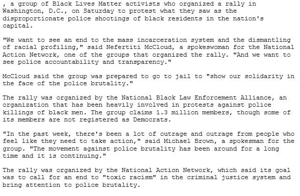

117 米

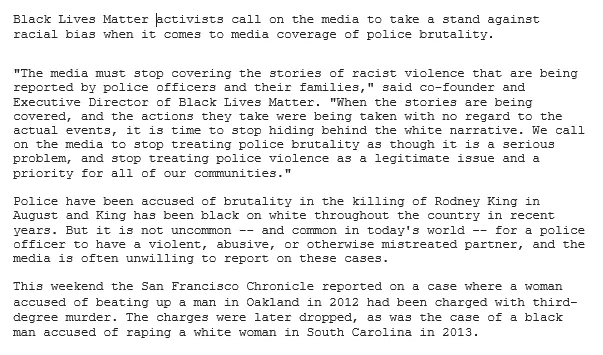

大模型的输出对于人类输出来说还过得去，除了集会组织者反复提到的。相比之下，较小的模型显示不一致。

> 警方被指控在 8 月份杀害罗德尼·金的事件中行为残忍，而金近年来在全国范围内一直颠倒黑白。但在当今世界，一名警官有一个暴力、虐待或以其他方式虐待的伴侣并不罕见，媒体通常不愿意报道这些案件。

*   罗德尼·金被杀的悲剧案件是警察暴行的一个很好的例子，但是“黑白颠倒”这句话没有语法意义。此外，最后一段提出了两个看似不相关的案例，这并没有增加论点，似乎不合适。

# **关于系统性种族主义**

775 米

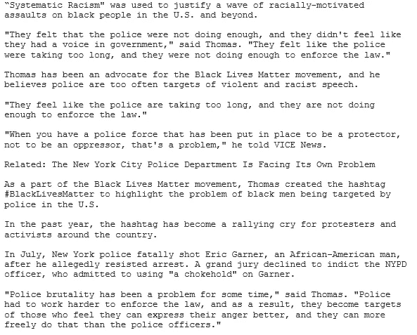

117 米

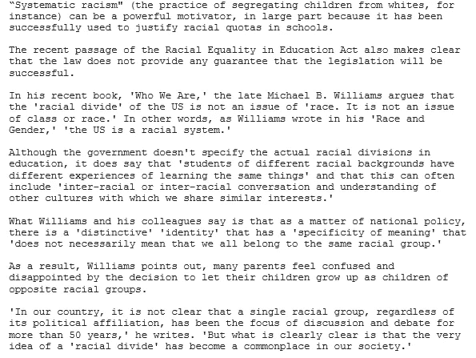

两个模型都显示出一些不一致。对于更大的模型，托马斯的评论是重复的，并且是不一致的。

> 托马斯一直是黑人的命也是命运动的倡导者，他认为警察经常成为暴力和种族主义言论的目标。
> 
> “他们觉得警方花的时间太长了，而且他们在执法方面做得不够。”

*   警察不太可能认为他们反应迟钝，做得不够。相反，少数民族被指定为种族主义的目标更有意义，这一点没有得到正确的推断。

较小的模型表现出明显更多的不一致性，标点符号也很差。

> 已故的迈克尔·b·威廉姆斯(Michael B. Williams)在他的新书《我们是谁》(Who We Are)中认为，美国的“种族鸿沟”不是一个“种族”问题。这不是阶级或种族的问题。换句话说，正如威廉姆斯在他的《种族与性别》中所写的，“美国是一个种族体系。

*   虽然可以推断出作者论点的主旨，但种族的重复是多余的。此外，在声称种族划分与种族概念无关后，宣布美国是“一个种族系统”是没有意义的。

# 结论

很明显，随着 GPT-2 模型复杂性的增加，我们观察到产生涵盖当今媒体头条主题的人工生成内容的能力增加。

相比之下，据报道最大的 GPT-3 模型拥有超过 1750 亿个参数，其性能与其复杂性相匹配。这种模型的扩散的影响，特别是当结合对特定情绪或色调的数据进行微调时，将产生**模型，这些模型不仅能够生成特定主题的内容，还能够生成特定论点的内容**。这将产生潜在的破坏性后果，因为它能够通过为期望的论点提供现实的来源来改变话语的背景。

幸运的是，这些模型的复杂性和资源密集性将限制其使用，目前只有资源极其丰富的组织，如国家级行为者。最终，**解决“假新闻”危险的方法不在于简单地试图限制语言模型的扩散，而在于提高我们作为一个社会的信息素养和批判性思维的技能。**

这就结束了我们对变压器类型模型的讨论。下一次，我们回到强化学习，并在 Pytorch 中实现价值学习，以进一步解决我们的代理在 Doom 中的表现。

我们希望你喜欢这篇文章，并希望你查看 GradientCrescent 上的许多其他文章，涵盖人工智能的应用和理论方面。为了保持对 [GradientCrescent](https://medium.com/@adrianitsaxu) 的最新更新，请考虑关注该出版物并关注我们的 [Github](https://github.com/EXJUSTICE/GradientCrescent) 资源库。

# 参考

[](https://openai.com/blog/better-language-models/) [## 更好的语言模型及其含义

### 我们已经训练了一个大规模的无监督语言模型，它可以生成连贯的文本段落，实现…

openai.com](https://openai.com/blog/better-language-models/) [](https://openai.com/blog/language-unsupervised/) [## 用无监督学习提高语言理解

### 我们通过一个可扩展的、与任务无关的系统，在一系列不同的语言任务上获得了最先进的结果…

openai.com](https://openai.com/blog/language-unsupervised/) [](https://openai.com/blog/fine-tuning-gpt-2/) [## 根据人类偏好微调 GPT-2

### 我们已经对 774M 参数 GPT-2 语言模型进行了微调，在各种任务中使用了人类反馈，成功地匹配了…

openai.com](https://openai.com/blog/fine-tuning-gpt-2/)