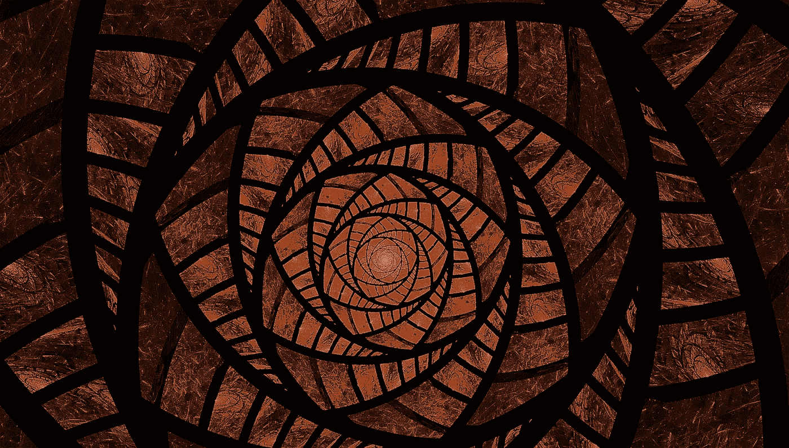
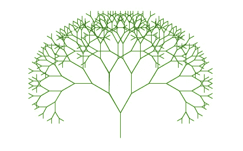
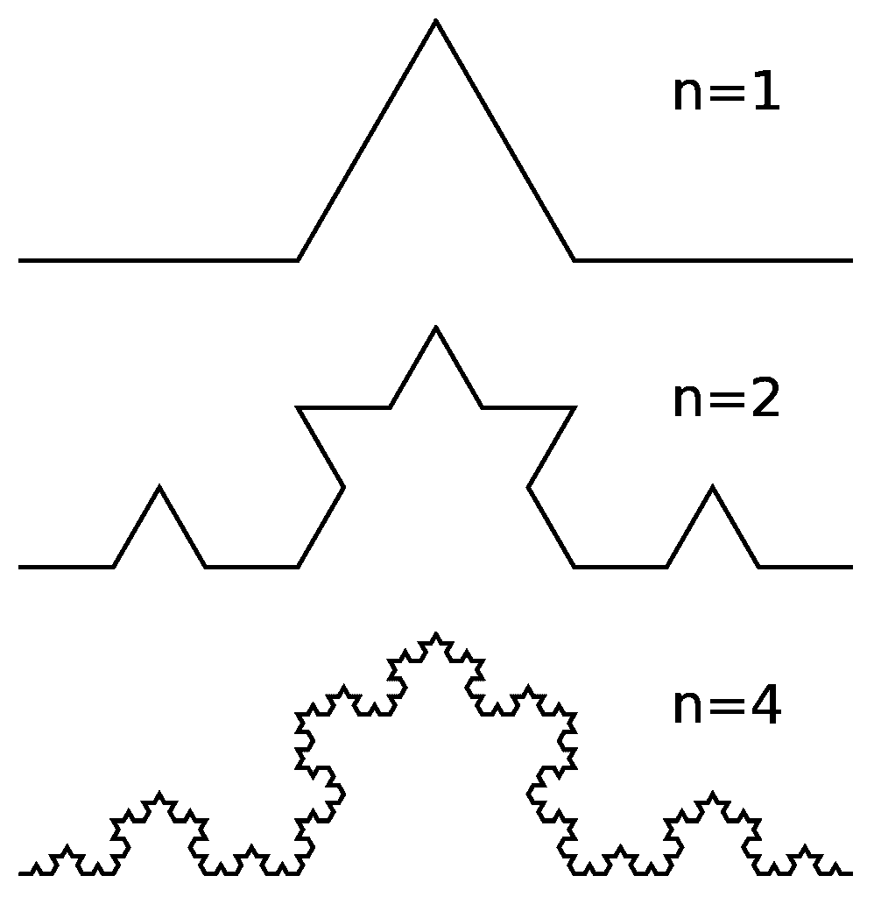
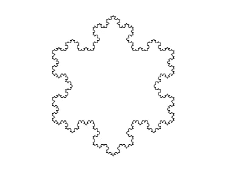

# 用 Python 创建分形

> 原文：<https://towardsdatascience.com/creating-fractals-with-python-d2b663786da6?source=collection_archive---------2----------------------->

## 在这个帖子里自己试试吧！



分形艺术— [来源](https://pixabay.com/illustrations/fractal-red-brown-glass-fantasy-2133856/)

首先，什么是几何分形？几何分形是一种在不同尺度上具有重复结构的几何形状:无论你是否靠近图像，你都会看到相同的图案。或者，正如[伯努瓦·曼德尔布罗](https://en.wikipedia.org/wiki/Benoit_Mandelbrot)所定义的，“一个粗糙或支离破碎的几何形状，它可以被分割成多个部分，每个部分(至少近似地)是整体的缩小版”。

现在，我们如何在 Python 中构建一个分形？假设我们在不同的尺度上重复一个结构，我们将需要应用一个[递归解决方案](https://en.wikipedia.org/wiki/Recursion_(computer_science))。此外，我们将使用 [turtle](https://docs.python.org/3/library/turtle.html) 来绘制分形。在这篇文章中，我们将同时绘制分形树和科赫雪花。

# 绘制分形树

为了创建一棵树，我们将每个分支分成两个子分支(左和右),并缩短新的子分支，直到达到我们自己定义的最小分支长度:

```
import turtleMINIMUM_BRANCH_LENGTH = 5def build_tree(t, branch_length, shorten_by, angle):
  passtree = turtle.Turtle()
tree.hideturtle()
tree.setheading(90)
tree.color('green')build_tree(tree, 50, 5, 30)
turtle.mainloop()
```

到目前为止，我们只是定义了基础。我们导入了 turtle 并创建了 turtle 的一个实例。Turtle()，它将是在画布上移动并绘制我们的树的对象。然后我们用 [setheading()](https://docs.python.org/3/library/turtle.html#turtle.setheading) 让它面朝上。我们还定义了递归函数的签名，如下所示:

*   t:我们的海龟实例。
*   branch_length:分支的当前长度，以像素为单位。
*   shorten_by:决定子分支比父分支短多少像素。
*   角度:子分支从父分支出现的角度。

此外，我们已经定义了 MINIMUM_BRANCH_LENGTH(以像素为单位)，它设置了创建更多子分支的最小阈值。

现在让我们构建递归函数的主体:

```
import turtleMINIMUM_BRANCH_LENGTH = 5def build_tree(t, branch_length, shorten_by, angle):
  if branch_length > MINIMUM_BRANCH_LENGTH:
    t.forward(branch_length)
    new_length = branch_length - shorten_by t.left(angle)
    build_tree(t, new_length, shorten_by, angle) t.right(angle * 2)
    build_tree(t, new_length, shorten_by, angle) t.left(angle)
    t.backward(branch_length)tree = turtle.Turtle()
tree.hideturtle()
tree.setheading(90)
tree.color('green')build_tree(tree, 50, 5, 30)
turtle.mainloop()
```

如您所见，如果 branch_length 小于 MINIMUM_BRANCH_LENGTH，我们就达到了基本情况。否则，我们绘制分支并继续创建子分支，方法是计算它们的长度，向左和向右旋转“角度”度，并用新值再次调用 build_tree。最后，我们向后移动到我们分支的根。

如果您执行该代码，应该会得到以下结果:



我们的分形树

最后，您可以随意使用这里的代码(和参数)!

# 画科赫雪花

在这篇文章的第二部分，我们将绘制一个更复杂的结构:[科赫雪花](https://en.wikipedia.org/wiki/Koch_snowflake)。

首先，我们需要创建一个递归函数来创建[科赫曲线](http://larryriddle.agnesscott.org/ifs/kcurve/kcurve.htm)，然后我们将连接其中的 3 条曲线来创建一个雪花。让我们从定义递归函数的参数开始:

*   t:我们的海龟实例。
*   iterations:表示列表下方图像中 n 的值(注意，n=0 表示一条平坦的线，这是我们递归函数的基本情况)。
*   长度:我们当前(子)雪花中每条边的长度。
*   shortening_factor:确定创建新子雪花时边长除以的因子。
*   角度:确定新边出现的角度。



科赫曲线构建— [来源](https://en.wikipedia.org/wiki/File:Koch_curve_construction.svg)

一旦我们定义了我们的递归函数的基本结构，我们可能会达到以下几点:

```
import turtledef koch_curve(t, iterations, length, shortening_factor, angle):
  passt = turtle.Turtle()
t.hideturtle()for i in range(3):
  koch_curve(t, 4, 200, 3, 60)
  t.right(120)turtle.mainloop()
```

此时，我们只需实现递归函数。如果我们已经达到我们的基本情况，我们将只是画一条线。否则，我们将更新我们的参数(特别是迭代次数和长度)并调用我们的递归函数 4 次。在这些函数调用之间，我们会先向左，然后向右，最后再向左。让我们看看完整的实现是怎样的:

```
import turtledef koch_curve(t, iterations, length, shortening_factor, angle): if iterations == 0:
    t.forward(length)
  else:
    iterations = iterations - 1
    length = length / shortening_factor koch_curve(t, iterations, length, shortening_factor, angle)
    t.left(angle)
    koch_curve(t, iterations, length, shortening_factor, angle)
    t.right(angle * 2)
    koch_curve(t, iterations, length, shortening_factor, angle)
    t.left(angle)
    koch_curve(t, iterations, length, shortening_factor, angle)t = turtle.Turtle()
t.hideturtle()for i in range(3):
  koch_curve(t, 4, 200, 3, 60)
  t.right(120)turtle.mainloop()
```

如果您执行上面的代码，您应该会获得以下结果:



我们的科赫雪花

同样，您可以随意使用这里的代码(和参数)!