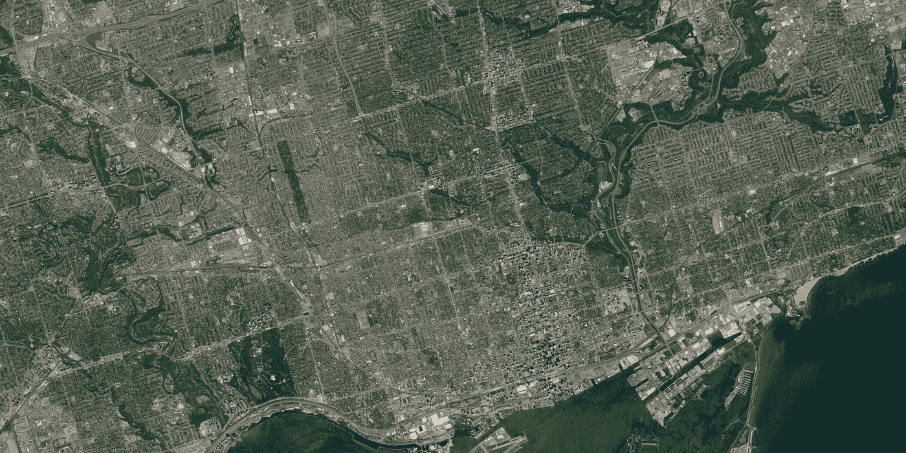
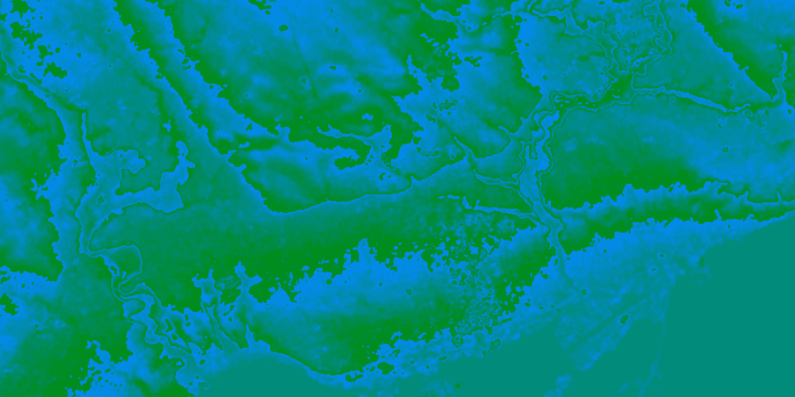
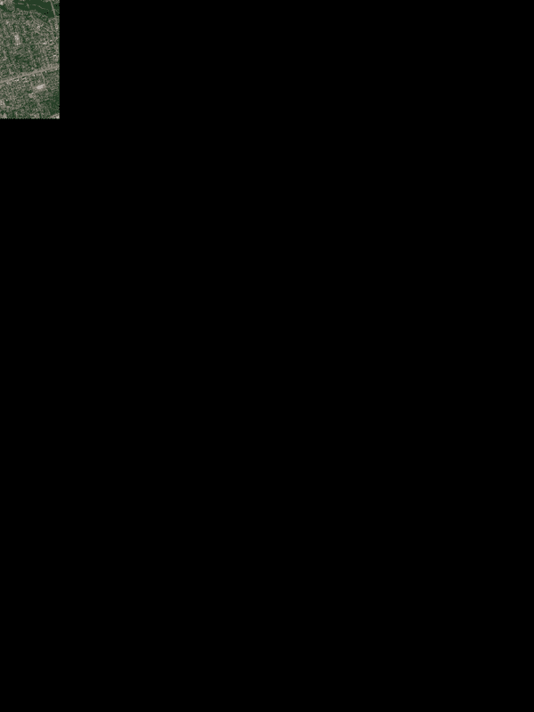
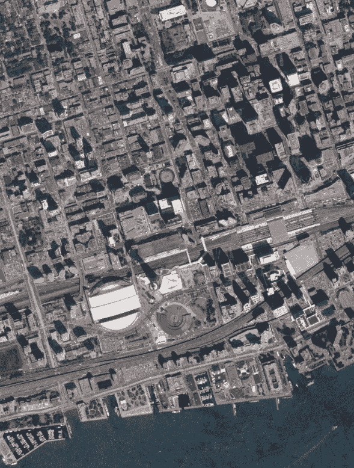
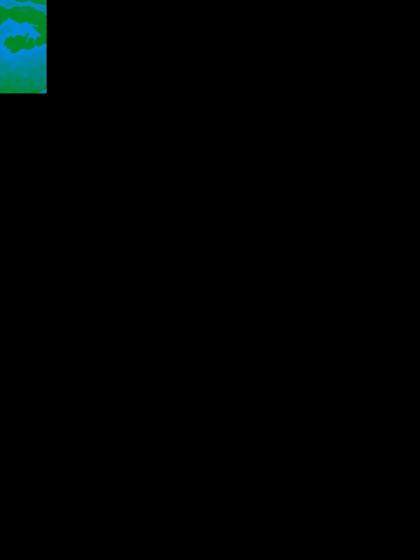

# 用 Mapbox 和 Python 制作高分辨率卫星影像

> 原文：<https://towardsdatascience.com/creating-high-resolution-satellite-images-with-mapbox-and-python-750b3ac83dd7?source=collection_archive---------17----------------------->

## 超高分辨率卫星和高程图像



对于我的一些个人项目，我想获得地球上特定点的超高分辨率卫星和高程图像。当我试图用谷歌搜索一些现有数据时，没有足够灵活的东西。我最终偶然发现了 Mapbox API，它允许我使用 URL 请求来获取任何位置和缩放级别的图像。除此之外，它还可以选择返回编码为 PNG 图像的高分辨率高程数据(参见上面的第二幅图像)。

# 获取地图框 API 密钥

第一步是访问[https://docs.mapbox.com/api/](https://docs.mapbox.com/api/)注册并获得 API 密钥。这里我就不赘述了，因为这非常简单，但我们想要的只是看起来像这样的密钥:


一旦我们有了密钥，它将允许我们解析 Mapbox API，并获得一些漂亮的图像 tilesets 回来！请记住，有很多免费的访问，所以您不需要担心 API 的限制，除非您将它部署给更广泛的受众。

## 关于 Tilesets 的一个注记

我遇到的最大问题之一是理解 tilesets。基本上，我假设我可以在 API 中使用纬度/经度值，但是全局成像的工作方式是每个缩放级别有一组“tilesets”。缩放级别是从 0 到 15，其中 0 表示整个世界的图片，15 表示您可以看到自己的房子。瓦片集被索引为矩阵(x/y ),该矩阵基本上表示切片的地球图像。在缩放 0 时，在 x=y=1 时只有一个图块，因为它只是一个大图像。想象一下，我们放大到级别 1，实际上需要 4 张图片来覆盖地图。这意味着我们有四种组合(0，0)，(0，1)，(1，0)，(1，1)。正如你可以想象的那样，变焦越深，需要的瓷砖就越多。

我将向您展示为给定的 lat/lng 组合获得一组瓷砖所需的代码，因此您不必担心它！经典的 python 有一个包来包所有的东西。

# 安装 Python 包和文件夹设置

按照传统，我们必须安装非标准软件包。为了弄清楚 lat/lng 到 tileset 之间的转换，我们使用了 **mercantile** 软件包(相当肯定是墨卡托和 tile 的组合)。我们还将安装 **pillow** ，这是一个广泛用于 python 的图像处理库。

```
pip install mercantile
pip install pillow
```

我们还将建立一些目录来存储卫星和高程图像的临时图像。

```
mkdir ./satellite_images
mkdir ./elevation_images
mkdir ./composite_images
```

合成图像目录是我们的最终图像将去的地方。

# 从 Lat/Lng 转换为 Tilesets

首先要做的是确定我们要扫描的位置。我住在多伦多附近，所以我想看看超高分辨率的海滨是什么样子！我设置了坐标(只要谷歌一下位置，在地图上点击右键，选择“这里有什么？”以获得坐标)

```
lat_lng = [43.640918, -79.371478]
```

接下来，我需要决定我想要查看的扫描范围。我用一个纬度/液化天然气三角洲因子来表示它，并应用它来找到我感兴趣的区域的左上角和右下角的选择。

```
delta=0.05
tl = [lat_lng[0]+delta, lat_lng[1]-delta]
br = [lat_lng[0]-delta, lat_lng[1]+delta]
z = 15 **# Set the resolution (max at 15)**
```

# 提取图像

下一步是从特定的 API URLs 中提取图像数据。Mapbox 有两个我们感兴趣的端点。一个提供高细节卫星图像，另一个提供编码高程映射。端点需要相同的输入，因此我总结如下:

## Mapbox API URLs

[****mapbox . terrain-RGB****/**](https://api.mapbox.com/v4/mapbox.terrain-rgb/)**{ z }/{ x }/{ y }*[*@ 2x*](http://twitter.com/2x)*。pngraw？access _ token = {您的密钥}**

*[****mapbox . satellite****](https://api.mapbox.com/v4/mapbox.satellite)**/{ z }/{ x }/{ y }*[*@ 2x*](http://twitter.com/2x)*。pngraw？access _ token = {您的密钥}***

*   **[***map box . terrain-RGB***](https://api.mapbox.com/v4/mapbox.terrain-rgb/)***:***这是高程数据的端点**
*   **[***地图框。***](https://api.mapbox.com/v4/mapbox.terrain-rgb/) [***卫星***](https://api.mapbox.com/v4/mapbox.satellite)***:***这是卫星数据的终点**
*   ****{z}:** 这是我们想要选择的缩放级别(0-15)**
*   ****{x}:** 我们在给定缩放级别下请求的 x 平铺**
*   ****{y}:** 我们在给定缩放级别下请求的 y 平铺**
*   ****{您的密钥}:** 您向 Mapbox API 注册时请求的 API 密钥(看起来像***PK . kjsalfjaeii 9789 F7 ah****……)***
*   ****@2x.pngraw:** 这表示我们希望图像是双倍分辨率(512x512)的原始 PNG 文件**

**如果你进入你的浏览器，用一组有效的输入导航到 URL，你应该看到一个漂亮的图像返回。这就是我们要用 python 实现的自动化。**

**首先，我们需要使用前几节中定义的 x/y/z 来收集图像数组。**

```
**import requests **# The requests package allows use to call URLS**
import shutil   **# shutil will be used to copy the image to the local****# Loop over the tile ranges**
for i,x in enumerate(range(x_tile_range[0],x_tile_range[1]+1)):
  for j,y in enumerate(range(y_tile_range[0],y_tile_range[1]+1)) **# Call the URL to get the image back**
   r = requests.get('https://api.mapbox.com/v4/mapbox.terrain-
      rgb/'+str(z)+'/'+str(x)+'/'+str(y)+'[@2x](http://twitter.com/2x).pngraw?
      access_token=pk.eyJ1I....', stream=True) **# Next we will write the raw content to an image**
   with open(‘./elevation_images/’ + str(i) + ‘.’ + str(j) + ‘.png’,
      ‘wb’) as f:
       r.raw.decode_content = True
       shutil.copyfileobj(r.raw, f)   **# Do the same for the satellite data
**   r =requests.get('https://api.mapbox.com/v4/mapbox.satellite/'+
      str(z)+'/'+str(x)+'/'+str(y)+'[@2x](http://twitter.com/2x).pngraw?
      access_token=pk.eyJ1I....', stream=True) with open(‘./satellite_images/’ + str(i) + ‘.’ + str(j) + ‘.png’,
      ‘wb’) as f:
       r.raw.decode_content = True
       shutil.copyfileobj(r.raw, f)**
```

**在这一点上，我们有一组图像在它们的文件夹中，并以***【x.y.png】***的格式命名，这将使我们在稍后合成最终图像时更容易循环。**

# **合成最终图像**

**我们的小项目快结束了。我们现在想做的是将所有较小的图像合成一个分辨率极高的大图像。为此，我们将使用 Pillow (python 包)创建一个新的 png。**

**首先，我们制作一个新的空白图像，设置成我们想要的最终尺寸。然后，我们将只是粘贴在有意义的偏移较小的图像。下面是一张 GIF 图片，直观地展示了代码的作用。**

****

**显示各个图像如何构成的动画。**

```
****# Import the image, math and os libraries** import PIL
import mathfrom os import listdir
from os.path import isfile, join**# Loop over the elevation and satellite image set**
for img_name in [‘elevation’,’satellite’]: **# Make a list of the image names  ** 
   image_files = [‘./’+img_name+’_images/’ + f for f in
      listdir(‘./’+img_name+’_images/’)] **# Open the image set using pillow**    images = [PIL.Image.open(x) for x in image_files] **# Calculate the number of image tiles in each direction**
   edge_length_x = x_tile_range[1] — x_tile_range[0]
   edge_length_y = y_tile_range[1] — y_tile_range[0]
   edge_length_x = max(1,edge_length_x)
   edge_length_y = max(1,edge_length_y) **# Find the final composed image dimensions**  
   width, height = images[0].size
   total_width = width*edge_length_x
   total_height = height*edge_length_y **# Create a new blank image we will fill in**
   composite = PIL.Image.new(‘RGB’, (total_width, total_height)) **# Loop over the x and y ranges**
   y_offset = 0
   for i in range(0,edge_length_x):
     x_offset = 0
     for j in range(0,edge_length_y): **# Open up the image file and paste it into the composed
           image at the given offset position**
        tmp_img = PIL.Image.open(‘./’+img_name+’_images/’ + str(i) +
           ‘.’ + str(j) + ‘.png’)
        composite.paste(tmp_img, (y_offset,x_offset))
        x_offset += width **# Update the width** y_offset += height **# Update the height****# Save the final image**
composite.save(‘./composite_images/’+img_name+’.png’)**
```

**瞧。你现在应该有两张非常非常大并且分辨率惊人的图像。为了给你一个规模的感觉，看看下面的图片，显示了从上面放大的 GIF 版本。**

****

**上图的放大图显示了我们惊人的分辨率(图片大约 50Mb)。**

**男人看起来脆脆的！下面是高程数据的 GIF 图。**

****

**高程数据合成的动画。**

**在这一点上，你可以做你需要的最终图像。这整件事有两个好处。**

1.  **这些图像分辨率极高**
2.  **你可以很容易地选择任何你感兴趣的矩形地图**

**对于我自己的项目，我真的想要解码的高程数据。Mapbox 实际上告诉你如何解码像素，以获得低至 0.1 米的高程，但我只是在下面放了一个 python 脚本。**

# **解码高程数据**

```
****# Load the elevation image and convert it to RGBA**
elevation_raw = PIL.Image.open(‘./composite_images/elevation.png’)
rgb_elevation = elevation_raw.convert(‘RGBA’)**# Loop over the image and save the data in a list**
elevation_data = []
for h in range(rgb_elevation.height):
   for w in range(rgb_elevation.width): **# Extract the pixel values**
      R, G, B, A = rgb_elevation.getpixel((w, h)) **# Use Mapbox conversion from pixel to meters**
      height = -10000 + ((R * 256 * 256 + G * 256 + B) * 0.1) **# Append to our elevation data list**
      elevation_data.append(height)**# Save to a json file**
import json
with open(‘./elevation.json’, ‘w’) as outfile:
   json.dump(elevation_data, outfile)**
```

**全部完成！现在你可以用它对原始图像进行分析或切片。(还可以做等高线，3D 可视化或者一堆东西！)**

# **参考和链接**

**[](https://www.kaggle.com/kapastor/high-resolution-mapping-with-mapbox-and-three-js) [## 使用 Mapbox 和 Three.js 进行高分辨率制图

### 使用 Kaggle 笔记本探索和运行机器学习代码|使用来自非数据源的数据

www.kaggle.com](https://www.kaggle.com/kapastor/high-resolution-mapping-with-mapbox-and-three-js)**