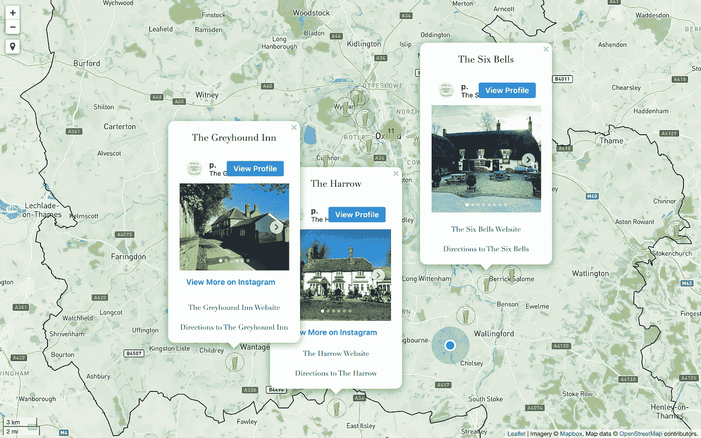
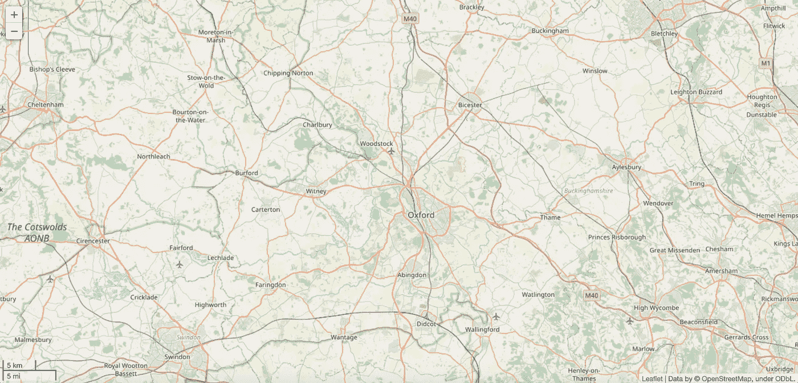
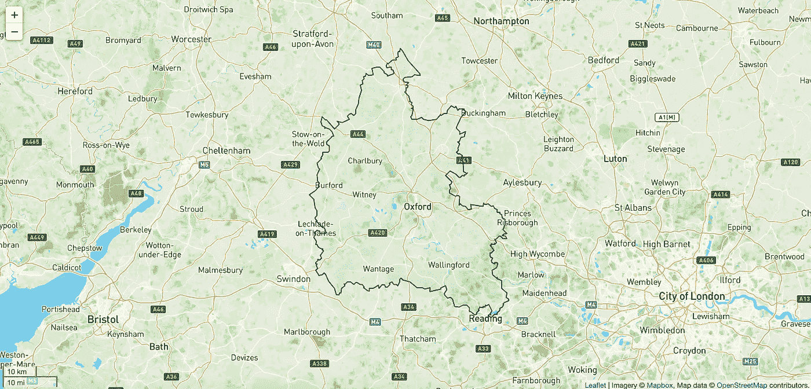
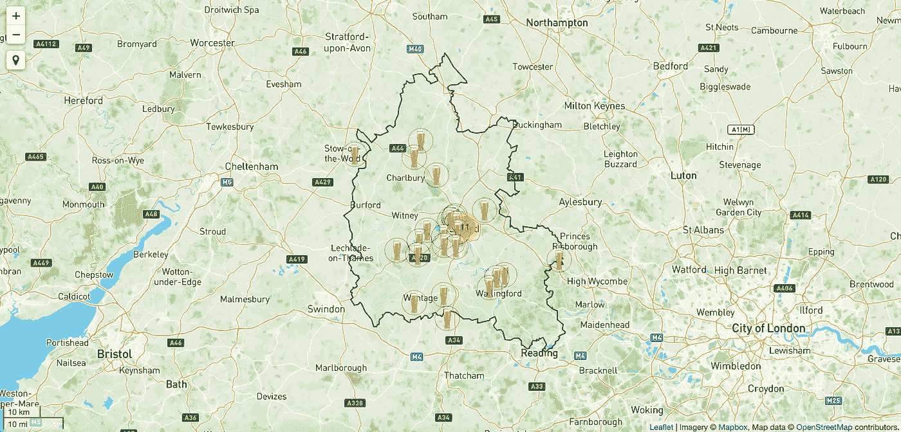
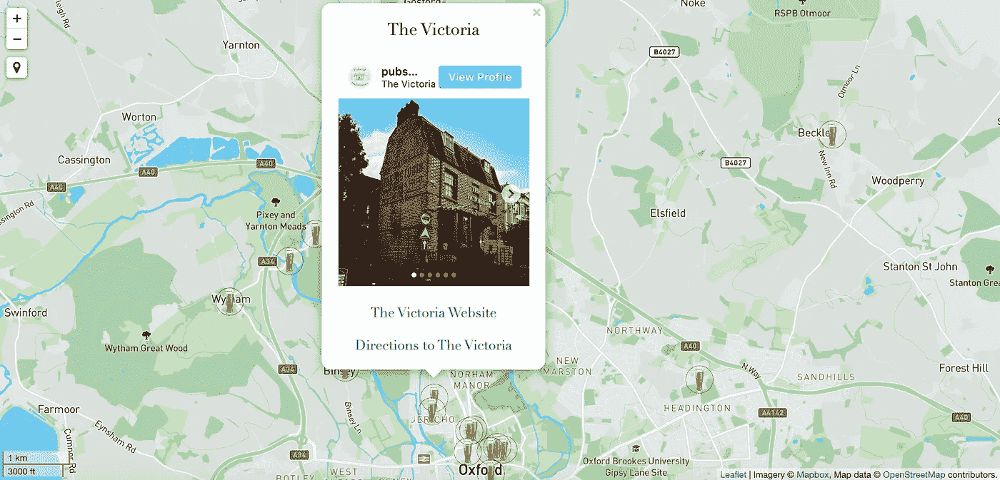

# 用 Python 和 Folium 为 Instagram 创建交互式地图

> 原文：<https://towardsdatascience.com/creating-interactive-maps-for-instagram-with-python-and-folium-68bc4691d075?source=collection_archive---------25----------------------->

## 学习使用 Python 的叶库制作漂亮的、定制的和交互式的地图，甚至合并您的 Instagram 帖子。

根据您的喜好创建交互式地图|作者图片

我周末的一个追求就是逛遍我所在的英国牛津郡地区的所有酒吧。随着时间的推移，这些大量的酒吧访问已经变成了一个受欢迎的“牛津郡酒吧”Instagram 页面。因此，当 Instagram 在 2016 年决定移除其“照片地图”功能时，这真是一个耻辱。原因是大多数用户实际上并没有使用它。但是，如果您的帐户可以很好地利用这样一个功能，那会怎么样呢？任何旅游、观光或本地博客页面肯定会从中受益。我花了很多时间摸索谷歌定制的、相当笨拙的“我的地图”功能，但结果从来都不太好，也不可能以任何方式整合 Instagram 帖子。嗯…，对于许多其他数据和 web 相关的任务，Python 有一个答案。

## 你需要什么

Python 有大量用于不同任务的库，当涉及到快速制作漂亮的交互式地图时，[leav](https://python-visualization.github.io/folium/)库做得非常好。好消息是，您不需要了解太多 Python 就能完成这项工作，因为我将一步一步地带您完成它。

让我们继续导入 Let 和我们将需要的其他依赖项(这些将在我们遇到它们时解释)。

现在，让我们创建一个地图-一个简单明了的底图:

`location=[]`参数设置地图中心的坐标(在这里是英国牛津附近)。`tiles=`参数告诉叶使用来自 [OpenStreetMap](https://www.openstreetmap.org/#map=9/51.7831/-1.3046) (OSM)的免费可用的开源地图切片。有几个缩放设置，最后，`control_scale=`增加了一个比例尺。leav 以 HTML 格式保存所有与地图相关的内容。这意味着您可以通过在浏览器中打开`.html`文件来快速查看您的地图:

树叶地图的默认 OSM 底图-由一行 Python 生成！|作者图片

就是这样！一行 Python 代码，我们就已经有了一个明亮、多彩的底图。但地图从何而来？Folium 附带了一些内置的地图 tilesets，您可以使用`tiles=`参数轻松地指定它们。默认情况下是 OSM tileset，但是 leav 也支持使用来自供应商的公开可用的地图切片，例如 [*【雄蕊】*](http://maps.stamen.com/#terrain/12/37.7706/-122.3782)[*雷森林*](https://www.thunderforest.com/maps/)[*Stadia*](https://stadiamaps.com/)*[*Carto*](https://carto.com/basemaps/)等。这个链接提供了一些地图块之间的快速比较。如果您只是为了个人、非商业用途进行制图，地图切片应该可以免费使用。*

*对于我自己的“牛津郡的酒吧”地图，我希望对底图有更多的控制。我希望它看起来更环保，并包括所有可用的小径和人行道数据(这样人们就可以在他们选择的酒吧附近找到一个不错的散步场所)。 [Mapbox](https://www.mapbox.com/maps/) 允许您定制自己的地图，然后通过您的个人 API 和访问令牌访问它，您可以将这些信息传递到 lets:*

*如果您使用的是第三方图块提供商，请始终记得添加一个`attr=`参数，这样他们的工作就能得到适当的认可(这显示在地图的右下角)。*

## *添加地图元素*

*现在让我们开始添加一些元素到地图上。我想添加的第一件事是显示牛津郡边界的覆盖图。我在 GeoJSON 文件中有这方面的数据。*

*保存地图，并在浏览器中打开。这是目前为止的情况:*

**

*Mapbox 为 Strava 和脸书等公司提供地图切片，现在您也可以使用它们了！|作者图片*

*现在我们开始更多的定制。首先，我们将加载一个图像，用作地图上标记的自定义图标。然后我们将加载另一个地理边界——这次是牛津城边界。你可以想象，与牛津郡的其他地方相比，牛津市中心的酒吧密度更高。为了避免大量的标记被一个接一个的绘制出来，以及一个看起来混乱的地图，我们将使用 leav 的`MarkerCluster`插件(这是在第一步中导入的)。在低缩放级别下，标记聚类将位于牛津市边界内的所有标记组合在一起。只有放大时，各个标记才会分开。为此，我们将利用 Python 的 [json](https://docs.python.org/3/library/json.html) 和 [Shapely](https://shapely.readthedocs.io/en/stable/manual.html) 库(也是上面导入的)，它们对于任何类型的空间操作都非常有用。在下面的代码中，我们使用`json`库读取文件，然后使用`json`文件的`geometry`属性定义一个形状:`oxford_boundary`。最后，我们创建了`MarkerCluster`，它也有许多自定义其行为的选项。*

## *让我们添加一些标记*

*在一个单独的 Python 字典中，我已经存储了与我想要添加到地图中的每个酒馆相关联的所有数据。对于每个酒吧，都有一对坐标，一个 Instagram 帖子的链接，酒吧的网站和谷歌地图方向。我们将使用这些细节将 Instagram 帖子和网站链接合并到每个标记的弹出窗口中。字典是这样的:*

*现在是主要的跑腿工作。这里我们使用一个简单的`for`循环来遍历我们想要创建标记的所有酒馆。*

*需要注意的一点是，每个标记都需要自己的`CustomIcon`实例，因此我们在循环的每次迭代中都创建一个。标记弹出窗口使用 HTML 来设置样式。HTML 通常用于设计网站，但在这种情况下，它允许我们使用`<iframe src={insta_post}`将 Instagram 帖子嵌入到弹出窗口中。同样，我们可以向弹出窗口添加文本，并按照我们想要的方式设置样式。每个标记都是用自己的`CustomIcon`、`Popup`、`coordinates`和`tooltip`(悬停)文本实例逐个创建的。`for`循环的最后一部分使用`oxford_boundary`形状来测试标记是否位于牛津城边界内。如果是，则添加到`oxford_cluster`中，如果不是，则单独添加到地图中。最后，使用导入的`LocateControl`插件添加一个地理位置按钮，并在 HTML 中设置浏览器标签标题。*

## *最终的交互式地图*

*下面是它的预览图:*

**

*点击此处查看全互动地图|作者图片*

*牛津上空可以看到`MarkerCluster`。如果单击，地图会放大以显示牛津聚类中包含的所有 11 个标记。每个标记都可以点击，以显示一个弹出窗口，并带有嵌入式 Instagram 帖子和网站链接。让我们来看看:*

**

*你几乎可以添加任何你想标记的弹出窗口！|作者图片*

*全功能互动地图可在此查看:[***https://pubs-of-oxfordshire-map.github.io/***](https://pubs-of-oxfordshire-map.github.io/)。*

*虽然在浏览器中打开本地的`.html`文件可以很容易地查看地图，但是如果您想要在线获取它，您需要将它托管在某个地方。 [Github Pages](https://pages.github.com/) 提供了一个非常快速简单的托管服务，可以从你的`.html`文件中创建一个网页，这就是我在酒吧地图中使用的。而且是免费的！*

***希望这能给你提供一些提示和灵感，让你尝试 Python 和 follow 的定制地图。鉴于 well 与各种第三方地图图块提供商集成得如此之好，其支持 HTML 的大量选项*和*使其足够强大，几乎可以实现*任何您想要的外观。****

*如果你对所有代码感兴趣，这里有一个链接，链接到牛津郡 Github Repo 的[酒馆，地图就在那里。](https://github.com/Pubs-of-Oxfordshire-Map/Pubs-of-Oxfordshire-Map.github.io)*

> *如果你对牛津郡周围的酒吧感兴趣，一定要看看牛津郡 Instagram 页面 **的 [**酒吧！🍺**](https://www.instagram.com/pubsofoxfordshire/)***

## *附录-(图标)*

*我们可以在这里停下来，但是如果你想更进一步，可以通过编辑保存地图的`.html`文件来添加 Favicons——也称为 tab——或网站图标。像 [RealFaviconGenerator](https://realfavicongenerator.net/) 这样的网站让你上传一张图片或标志，网站会生成一系列大小完全合适的图片，供各种操作系统和浏览器渲染。这些图像需要放在网站所在的根文件夹中。生成器还为您提供了一些 HTML 文本，您需要将这些文本插入到`.html`文件的`<head>`部分。这个文本将不同的浏览器指向正确的图像，这样你就可以在你的标签上看到一个漂亮的网站图标。*

*我们将利用 Python 的[美汤](https://www.crummy.com/software/BeautifulSoup/)库(开头导入)来读取`.html`文件并找到`<head>`部分。这使得为收藏夹图标添加`tab_icon` HTML 文本变得很容易。*

## *真的是这样！*

*我就说到这里，但是如果你有任何想法或问题，请留下你的评论🙂*

*感谢阅读！🍻*