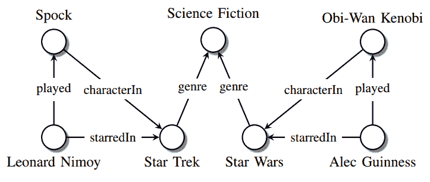
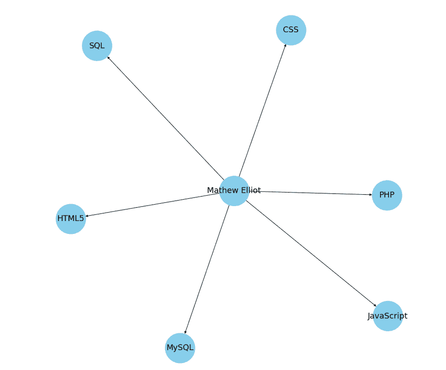
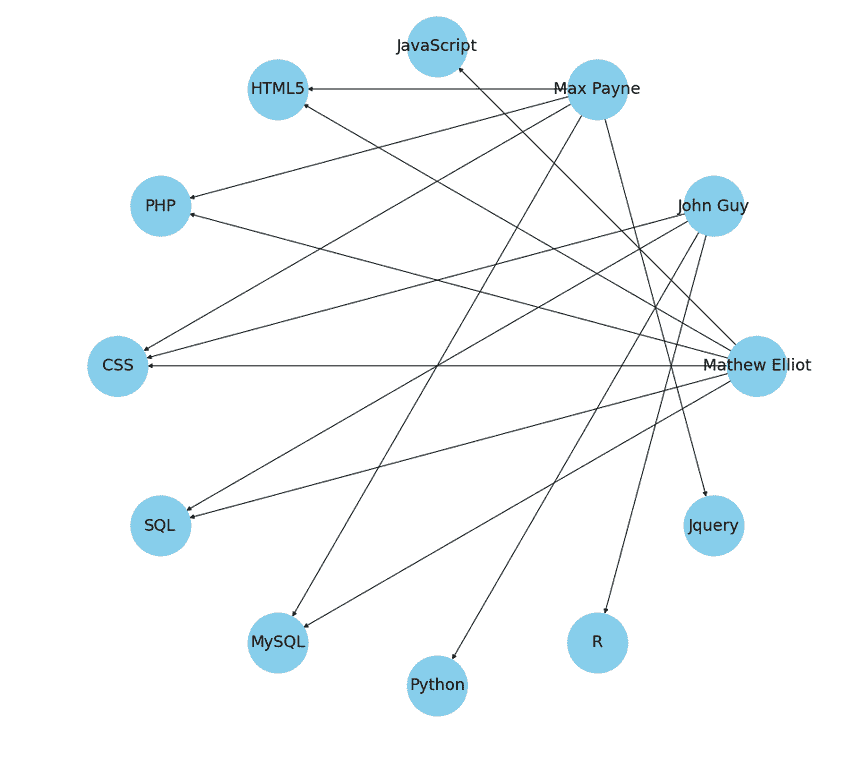

# 从简历中创建知识图并遍历它们

> 原文：<https://towardsdatascience.com/creating-knowledge-graphs-from-resumes-and-traver-56016426f4fb?source=collection_archive---------27----------------------->

## 用数据做很酷的事情！


来源:[克林特·王茂林](https://unsplash.com/@clintadair)在 Unsplash 上

# 介绍

知识图作为存储非结构化数据的数据结构越来越受欢迎。在这篇博客中，我们展示了简历中的关键元素是如何被存储和可视化为知识图表的。然后我们通过简历的知识图表来回答问题。我们的代码可以在这个 [Github 链接](https://github.com/priya-dwivedi/Deep-Learning/tree/master/Knowledge-Graph-Resumes)上找到。

知识图是一种通过数据链接将特定领域的知识组织在本体中，从而使我们能够对其进行建模的图。然后，机器学习可以应用于知识图上，以获得洞察力。知识图具有图的所有主要组成部分——节点、边和它们各自的属性。

让我们先看看节点和边的定义:

***节点*** 是图中线条相交或分叉的点。

***边*** 是连接图中两个节点的线。

如下面的知识图所示，斯波克、星际迷航、星球大战、伦纳德·尼莫伊、科幻小说、欧比万·克诺比、亚历克·伊兹高尼是节点，角色、主演和流派是图的边。



图 1:知识图的一个例子。(来源:Maximilian Nickel 等《知识图的关系机器学习综述:从多关系链接预测到自动化知识图构建》)

上面的表示是一个知识图的例子，它存储了电影及其角色以及扮演这些角色的演员的信息。以这种形式存储信息使我们能够对特定领域的复杂知识进行建模，这样我们就可以在需要时通过结构化遍历给定的图来访问特定的信息。

要在知识图中结构化的信息以三元组的形式建模。在三元组中，通常有两个实体和实体之间的关系。例如，在上面的图表中，played(斯波克，伦纳德·尼莫伊)是一个三联体，其中实体是斯波克和伦纳德·尼莫伊，关系是 played。

# **创建简历技能知识图**

在这个博客中，我们将为人们和他们在简历中提到的编程技能创建一个知识图表。这个想法是从简历中提取技能，并以图表格式建模，这样就更容易导航和提取具体信息。

出于这个博客的目的，我们将使用 3 份虚拟简历。

所以，现在让我们开始研究代码吧！完整的代码和简历分享在我的 [Github repo 这里](https://github.com/priya-dwivedi/Deep-Learning/tree/master/Knowledge-Graph-Resumes)。

出于简化的目的，我们将只关注不同候选人知道的编程语言。

## 从简历中解析数据

首先，我们使用 regex 提取简历中提到的编程语言。下面分享了这方面的代码。

这里的输出是来自 3 个程序员的语言:

```
**Output:**['JavaScript', 'HTML5', 'PHP OOP', 'CSS', 'SQL', 'MySQL']['Python,R,CSS,PHP,Machine Learning']['HTML5', 'CSS', 'SQL', 'Jquery’, ‘PHP']
```

这里，为了简化起见，我们假设文件名是候选名，并且编程语言行具有相同的格式。

## 使用 Networkx 库创建知识图

现在，一旦我们有了这些，我们将使用 [networkx 库](https://networkx.github.io/)从这些信息中构建一个知识图。 [*NetworkX*](https://networkx.github.io/) 是一个 Python 包，用于创建、操作和研究复杂网络的结构、动态和功能。这个库包含了一系列的函数来创建不同类型的图形，遍历它们，并在它们的基础上执行一系列的操作和计算。

在我们的例子中，我们将使用 from_dict_of_lists()函数，使用它我们将从一个字典中创建一个有向图，该字典包含作为关键字的名称，以及作为值的相应编程语言。

首先，为了便于理解，让我们为每个候选人创建单独的图表:

这里，在第四行中，我们从前面创建的字典中创建一个 networkx 对象。这里的 create_using 参数指定了我们需要创建的图形类型。

不同类型的图形及其各自的 networkx 类在 networkx 文档中指定如下:


图 2:图形类型—来源:Networkx 文档

我们将使用多点图，因为我们需要在单个图中表示多个简历，并且需要显示有向边以便更清晰地表示。

## 可视化单个候选人的知识图表

接下来，我们将使用 matplotlib 创建一个图，并使用 networkx 绘制图形。在绘制知识图之前，我们必须首先指定图的布局。networkx 库提供了大约 7 种布局，您可以根据自己的使用情况使用这些布局来绘制图形。你可以在这里探索这些布局[。](https://networkx.github.io/documentation/networkx-2.1/reference/drawing.html#module-networkx.drawing.layout)

上述代码将为 Mathew 及其技能创建一个图表，如下所示:



图 3:候选人技能的知识图表。来源:在我的 [Github](https://github.com/priya-dwivedi/Deep-Learning/tree/master/Knowledge-Graph-Resumes) 上分享的代码

同样，我们可以为其他两个候选人创建知识图表。

现在，让我们试着把这些图想象成一个连通图:

这里，我们使用 draw()函数通过指定的参数来绘制图形:

*   With_labels —使用此标志，可以指定是否在图形中显示标签。
*   Node _ color 使用此参数，可以指定节点的颜色。
*   edge _ cmap——使用这个参数，可以指定图形的颜色映射。
*   位置-使用该参数，可以指定图形的布局。
*   Node _ size 使用此参数，可以指定节点的大小。
*   Font_size —使用该参数，我们定义了节点上使用的文本的字体大小。

结果图将如下所示:



图 4:简历中个人及其技能的关联知识图。来源:在我的 [Github](https://github.com/priya-dwivedi/Deep-Learning/tree/master/Knowledge-Graph-Resumes) 上分享的代码

正如你在上面的图表中所看到的，我们现在已经创建了一个知识图表，包括每个候选人和他们知道的编程语言。

# **穿越我们的知识图谱**

现在我们已经准备好了知识图，我们可以使用这个图通过基于图的操作来提取信息。有许多数学图形操作可用于从知识图中提取数据。

如果从头开始编写代码，遍历知识图可能会很乏味。为了简化这一点，最佳实践是将图形存储在 Neo4j 之类的图形数据库中，并在 SPARQL 中编写查询。出于这个博客的目的，我们将使用我们在上面的图 4 中创建的 networkx 图展示一些简单的提取技术。

假设你是一家公司的招聘人员，你收到了这些简历，并创建了上面的知识图。现在，你想知道候选人拥有的最流行的编程语言。

我们来试试吧！

用图的术语来说，我们可以将获取最流行的编程语言的问题转化为最多边指向的节点。想想看，一个节点连接的边数越多，知道该技能的候选人就越多。因此，我们只需提取连接边数最多的技能节点。那就简单了！

让我们看看如何使用 networkx 库来实现这一点:

```
**Output:**'CSS'3
```

这里，我们只是使用了 networkx 库中的一个名为 degree()的函数。该函数返回连接到特定节点的边的数量。在上面定义的函数 get_max_degree_node()中，我们遍历所有的技能节点(除了 name 节点之外的所有节点)并获取技能节点中的最大度数。

类似地，我们可以使用相同的函数来获得知道最多编程语言的候选人，而不是传递名称列表，我们传递技能列表，该列表必须从所有节点中删除。

```
skill_list = languages_mathew+languages_john+languages_maxmax_languages_degree, max_languages_node = get_max_degree_node(skill_list,G)print(max_languages_node)print(max_languages_degree)**Output:**Mathew Elliot6
```

这些是我们如何使用基本代码遍历知识图并从中提取信息的几个例子。如前所述，对于更高级的查询，建议将知识图存储在图数据库中，然后使用 SPARQL 等查询语言进行查询。

# **结论**

在博客中，我们解释了什么是知识图，如何构建和遍历知识图。知识图有着广泛的应用，从对话代理，搜索引擎，问答系统等等。它们是需要存储大量互连数据的系统的理想选择。谷歌、IBM、脸书和其他技术公司在他们的系统中大量使用知识图表来将信息联系在一起，并非常有效地进行遍历。

在[深度学习分析](https://deeplearninganalytics.org/)，我们非常热衷于使用机器学习来解决现实世界的问题。我们已经帮助许多企业部署了创新的基于人工智能的解决方案。如果你看到合作的机会，请通过我们的网站[这里](https://deeplearninganalytics.org/contact-us/)联系我们。这篇博客是由 Priya Dwivedi 和 Faizan Khan 写的。

# 参考

*   网络 x 库—[https://networkx.github.io/](https://networkx.github.io/)
*   知识图表介绍—[https://towardsdatascience.com/knowledge-graph-bb78055a7884](/knowledge-graph-bb78055a7884)