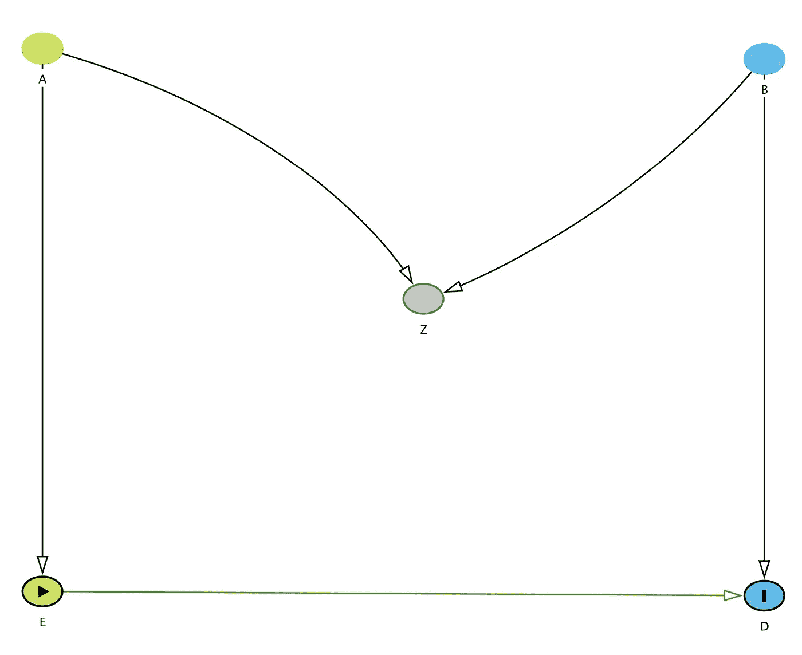

# 逐步创建最小的 Dag

> 原文：<https://towardsdatascience.com/creating-minimal-dags-step-by-step-d604cb05e59a?source=collection_archive---------37----------------------->

## 开始使用 DAG 的第一个版本的四个建议

dagitty.net 的经典之作

*免责声明——这篇文章假设你熟悉因果推理的语言，并且对使用 Dag 来描述因果模型和因果关系没有根本的本体论反对。*

如果你在实证/定量领域工作，你可能会发现自己每天都在努力写下**因果推理问题**。如果你在你的因果冒险中也使用**有向无环图**(简而言之，**Dag**)(为了清晰、识别、去偏置或任何其他原因)，那么你可能会认识到 Dag 可能会遭受一点**“冷启动”问题**。

事实上，直接从因果问题或变量列表开始**很难**画出最小的 DAG**——或者，至少，我一直在与这种因果推理版本的文思枯竭作斗争。**

在讲授辅助因果推理课程时，我与同样在**绘制和连接大量给定变量**时遇到困难的学生分享了一些提示和技巧，所有这些都与同一个因果问题有关。然后，我想我可以把这些分享给更广泛的、可能感兴趣的(也同样在挣扎的)观众。

因此，这里有一些**实用的建议**，可以帮助你开始使用**最小 DAG，**并更进一步识别和估计你感兴趣的因果效应。

## **定义因果量**

定义**因果问题**将已经给出了因果效应中涉及的数量的意义。从因果问题开始，为了开始一个最小的 DAG，你需要定义**至少三个关键变量**:

1.  经历某种状态变化的**代理、单位或个人**。
    如果该单位是综合的(例如，平均销售额、平均价格变化)，至少在编写 DAG 的第一个版本时，它可能有助于在单个规模上重新定义该单位(例如，不是平均销售额，而是一个客户的销售水平)。
2.  一个**结果变量**。
3.  一个**状态、干预或治疗变量**，当其发生变化时，被认为会导致单元结果的变化。

Pearl (2009)还建议在开始定义我们的因果模型时考虑其他量。这些量被称为因果亲本(PA)，是结果变量的所有**相关和直接(可观察)原因。如果因果父 PA 还影响系统中建模的其他变量，则它必须包含在变量列表中。如果你排除这样的变量，将会有未被观察到的干扰同时影响几个变量，这将导致许多随后的假设被违反。**

## **写一个最小的 DAG**

一旦你有了(1)谁/什么是分析单位，(2)结果，(3)治疗，(4)结果的直接因果父母的列表，你可以开始用几个步骤画 DAG:

1.  写下结果变量
2.  写下治疗变量，并将其与结果变量联系起来
3.  写下结果的原因父母:结果的直接和相关的原因。使用箭头将它们与结果联系起来。
4.  确保**影响系统中不止一个变量**(即不仅仅是结果)的结果的**因果父项被明确定义，并且它们与其他变量的联系也被明确定义。**
5.  (摘自 Pearl，2009)思考并列出结果变量的因果双亲的**因果双亲(即因果祖父母)。
    如果您认为它们与您的因果问题不直接相关，我们可以将它们保存在一个单独的、更广泛的列表中，或者保存在一个单独的、更广泛的 DAG 中，以供将来参考。**

## **检查隐藏的假设**

这些步骤将给出代表相关因果问题的第一个**最小 DAG** 。之后，您可能需要检查更多的东西:

1.  **缺失箭头**:DAG 中缺失的箭头代表您的**假设**。您隐含地假设了没有用箭头连接的变量之间的独立性。这些假设可信吗？合理吗？它们是否被先前的研究或现有的理论所证明？
2.  **不可观测的干扰或误差**:到目前为止，DAG 只包含可观测的量。每个数量也有一个未观察到的组成部分。例如，变量 X 有一个不可观测的分量 Ux，表示为:Ux → X
    每个变量的不可观测分量是如何连接到 DAG 中的变量的？任何变量的 U 与任何其他可观察变量有联系吗？例如，如果我的 DAG 包含 X、Y 和 Z，根据我的直觉、经验或参考理论，Ux 可能会影响 X 和 Z:
    X < — Ux → Z

## **检查偏差的直接来源**

最后，通过检查 DAG 中的这些量，您可以初步推断出**治疗分配机制**(尽管它们应该得到一篇完全独立的文章):

1.  有没有什么**观察变量**直接**导致我的治疗变量**？
2.  是否有任何**未观察到的变量**影响我的治疗和结果？例如，如果我的处理是 T，结果是 Y，我可能会有这样的情况:
    Y < — Ut → T
    直觉上，这违反了**可忽略性假设**
3.  是否有任何**未观察到的变量**影响我的治疗原因和结果？例如，如果我的处理是 T，结果是 Y，我处理的原因是 Z，我可能会有这样的情况:
    Y < — Uz → Z
    同样，这违反了**排他性假设**

您可以在 DAG 的不同版本和更新上重复这些步骤。最终，当您对最小版本满意时，您可以继续为您的模型使用更复杂的图形诊断工具，如 **d 分离**标准或**后门**标准。但是我会把那些有趣的事情留给下一篇因果导向的文章。

**快乐的 minimal-DAG 图！**

## 参考

本帖中使用的唯一参考文献是:
Pearl，J. (2009)。*因果关系*。剑桥大学出版社。

但是其他非常有用的参考文献还有:
Heckman，J. J. (2008)。计量经济学因果关系。*国际统计评论*， *76* (1)，1–27。
Imbens，g . w .&Rubin，D. B. (2015)。*统计、社会和生物医学科学中的因果推理*。剑桥大学出版社。珀尔，J. (2009 年)。统计学中的因果推断:概述。*统计调查*， *3* ，96–146。
珀尔，j .，格里穆尔，m .&新罕布什尔州朱厄尔(2016)。统计中的因果推断:初级读本。约翰威利&的儿子们。
珀尔 j .&麦肯齐 D. (2018)。*原因之书:因果的新科学*。基础书籍。