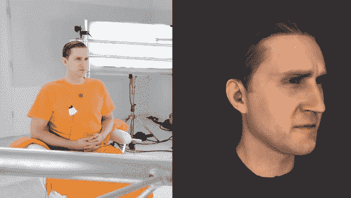
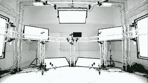
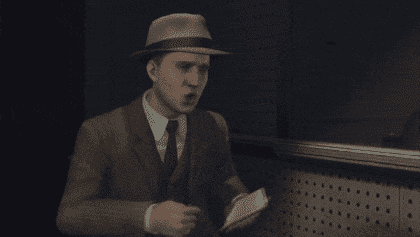
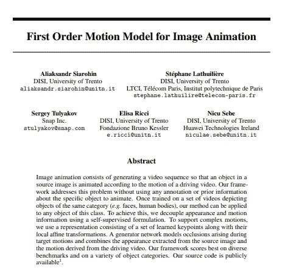
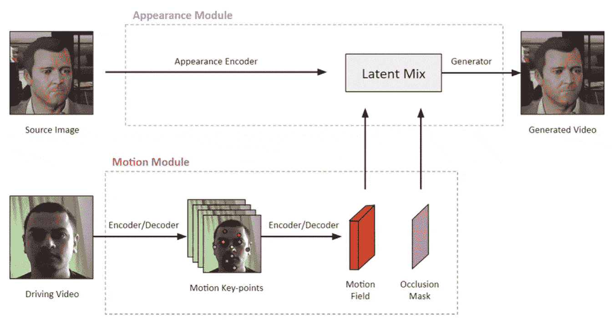
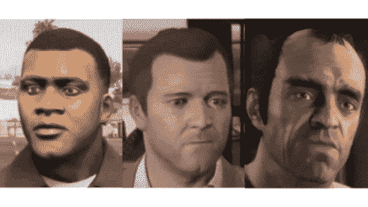

# 利用深度学习创建虚拟角色的 Mo-Cap 面部动画

> 原文：<https://towardsdatascience.com/creating-mo-cap-facial-animations-of-virtual-characters-with-deep-learning-dc1d394caac8?source=collection_archive---------49----------------------->

## 综述论文“图像动画的一阶运动模型”并探讨其在游戏动画产业中的应用。

[运动捕捉](https://en.wikipedia.org/wiki/Motion_capture)(简称 Mo-Cap)是用摄像机记录人的真实运动的过程，目的是在计算机生成的场景中再现那些精确的运动。作为一个着迷于在游戏开发中使用这项技术来创建动画的人，我很高兴看到在深度学习的帮助下这项技术得到了巨大的改进。

在这篇文章中，我想分享一个由 A. Siarohin 等人最近发表的 NeurIPS 论文“ [*用于图像动画的一阶运动模型*](https://arxiv.org/pdf/2003.00196.pdf) ”的快速概述。艾尔。并展示其在游戏动画行业的应用将如何“改变游戏规则”。

# 运动扫描技术

早在 2011 年，游戏《黑色洛杉矶》就推出了绝对令人惊叹的栩栩如生的面部动画，看起来领先于其他所有游戏。现在，将近十年过去了，我们仍然没有看到许多其他游戏在提供逼真的面部表情方面接近它的水平。

RockStar 工作室在 2011 年游戏《黑色洛杉矶》中使用的 MotionScan 技术，用于创建逼真的面部动画。[ [来源](https://www.youtube.com/watch?v=q2EG5J05048) ]

这是因为在开发这款名为 [MotionScan](https://electronics.howstuffworks.com/motionscan-technology.htm) 的游戏时使用的面部扫描技术极其昂贵，而且捕捉到的动画文件太大，这就是为什么大多数发行商在游戏中采用这项技术不切实际。

然而，由于深度学习驱动的动作捕捉的最新进展，这种情况可能很快就会改变。

# 图像动画的一阶运动模型

全文 PDF:[https://arxiv.org/pdf/2003.00196.pdf](https://arxiv.org/pdf/2003.00196.pdf)

在这项研究工作中，作者提出了一种深度学习框架，通过跟踪驾驶视频中另一张脸的运动，从人脸的源图像创建动画，类似于 MotionScan 技术。他们提出了一种自我监督的训练方法，可以使用特定类别的未标记视频数据集来学习定义运动的重要动力学。然后，展示如何将这些动态运动与静态图像相结合，生成动态视频。

## 框架(模型架构)

让我们看看下图中这个深度学习框架的架构。它由**运动模块**和**外观模块**组成。驾驶视频是运动模块的输入，源图像是我们的目标对象，它是外观模块的输入。

一阶模型模型框架

## 运动模块

运动模块由编码器组成，该编码器学习包含相对于对象运动高度重要的稀疏关键点的潜在表示，该对象在该场景中是人脸。这些关键点在驾驶视频的不同帧之间的移动生成了一个[运动场](https://en.wikipedia.org/wiki/Motion_field)，它由一个我们希望模型学习的函数驱动。作者使用[泰勒展开](https://www.youtube.com/watch?v=3d6DsjIBzJ4)到*来近似*这个函数到*一阶*来创建这个运动场。根据作者，这是第一次一阶近似被用于模拟运动。此外，这些关键点的学习仿射变换被组合以产生 D*sense 运动场*。密集运动场预测帧的每个单独像素的运动，而不是只关注稀疏运动场中的关键点。接下来，运动模块还会生成一个*遮挡图*，它会突出显示需要内画的帧像素，这些像素是由头部相对于背景的运动产生的。

## **外观模块**

外观模块使用编码器对源图像进行编码，然后将其与运动场和遮挡图相结合，以对源图像进行动画处理。发电机模型用于此目的。在自我监督训练过程中，来自驾驶视频的静止帧被用作源图像，并且所学习的运动场被用于使该源图像动画化。视频的实际帧充当生成的运动的基础事实，因此它是自我监督的训练。在测试/推断阶段，该源图像可以被来自相同对象类别的任何其他图像替换，并且不必来自驾驶视频。

## 在游戏角色上运行训练好的模型

我想探索这个模型在一些虚拟设计的游戏角色脸上的效果如何。作者分享了它的[代码](https://github.com/AliaksandrSiarohin/first-order-model)和一个易于使用的[谷歌 Colab 笔记本](https://github.com/AliaksandrSiarohin/first-order-model/blob/master/demo.ipynb)来测试这一点。这是他们训练的模型在游戏《侠盗猎车手》中不同角色身上测试时的样子。

使用一阶运动模型生成的面部动画。(游戏中的虚拟人物 GTA V. **左:** Franklin **中:** Michael **右:** Trevor)

正如你所看到的，使用这个 AI 创建逼真的动画是极其容易的，我认为它将被几乎每个游戏艺术家用于创建游戏中的面部动画。此外，为了用这种技术执行 Mo-Cap，我们现在需要的只是一台相机和任何带 GPU 的普通计算机，这个人工智能将负责剩下的工作，这使得游戏动画师大规模使用这种技术变得非常便宜和可行。这就是为什么我对这个人工智能在未来游戏开发中可能带来的巨大改进感到兴奋。

## 有用的链接:-

1.  [GitHub 代码](https://github.com/AliaksandrSiarohin/first-order-model)
2.  [研究论文(PDF](https://arxiv.org/pdf/2003.00196.pdf)
3.  [作者的博客文章](https://aliaksandrsiarohin.github.io/first-order-model-website/)
4.  [不同数据集的更多结果](https://www.youtube.com/watch?v=u-0cQ-grXBQ&feature=emb_title)

感谢您的阅读。如果你喜欢这篇文章，你可以关注我在[媒体](https://medium.com/@chintan.t93)、 [GitHub](https://github.com/ChintanTrivedi) 上的更多作品，或者订阅我的 [YouTube 频道](http://youtube.com/c/DeepGamingAI)。