# 创建我的第一个深度学习+数据科学工作站

> 原文：<https://towardsdatascience.com/creating-my-first-deep-learning-data-science-workstation-bd39c2f687e2?source=collection_archive---------2----------------------->

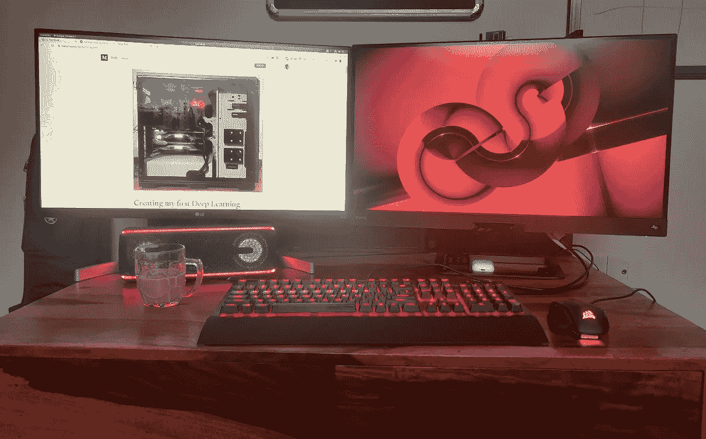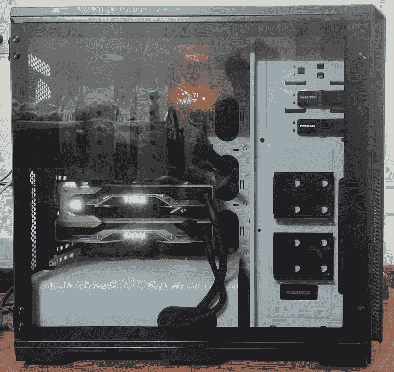

我的家庭设置

## 它很贵💰💰但是，它是一个怪物😈😈

Lambda 和其他供应商提供预建的[深度学习工作站](https://lambdalabs.com/gpu-workstations/vector?utm_source=medium-rahul-agarwal&utm_medium=blog-shout-out&utm_campaign=blogin)，配备新的安培 RTX 3090、3080 和 3070 GPUs

Exxact 还拥有一系列[深度学习工作站](https://www.exxactcorp.com/Deep-Learning-NVIDIA-GPU-Workstations?utm_source=web%20referral&utm_medium=backlink&utm_campaign=Rahul%20Agarwal)和服务器，起价为**3700 美元**，配有几个英伟达 RTX 30 系列 GPU、英特尔酷睿 i9、3 年保修和深度学习软件堆栈。

创建我的工作站对我来说是一个梦想。

我知道这个过程，但不知何故，我从来没有去过。可能是时间或金钱。主要是钱。

但这次我不得不这么做。我只是厌倦了在 AWS 上为任何小型个人项目设置服务器，并摆弄所有的安装。或者我不得不在谷歌 Collab 笔记本上工作，这些笔记本在运行时间和网络连接上有很多限制。所以，我找了些时间，在 NVIDIA 的帮助下，创建了一个深度学习平台。

整个过程包括大量阅读和观看来自 Linus Tech Tips 的 Youtube 视频。因为这是我第一次从零开始组装电脑，所以也有点特别。

按照你的要求建造 DL 钻机需要大量的研究。我研究了各个部分，它们的性能，评论，甚至美学。

***现在，我研究的大多数工作站版本都专注于游戏，所以我也想制定一个深度学习装备规范。***

***我会试着把我用过的所有部件以及我使用这些特殊部件的原因放在一起。***

***还有，如果你想看我在设置系统使用 Ubuntu 18.04 后是如何设置深度学习库的，可以查看*** 这个[设置深度学习工作站](/a-definitive-guide-for-setting-up-a-deep-learning-workstation-with-ubuntu-18-04-5459d70e19c3)的权威指南。

# 那么，为什么需要工作站呢？

我想到的第一个答案是，为什么不呢？

我在深度学习和机器学习应用程序方面做了很多工作，每次开始新项目时，制造新服务器并安装所有依赖项总是非常令人头疼。

此外，它看起来很棒，放在你的桌子上，随时可用，并且可以根据你的要求进行重大定制。

除此之外，使用 GCP 或 AWS 的财务方面，我很喜欢建造我的钻机的想法。

# 我的身材

我花了几个星期才完成最终版本。

我从一开始就知道，我希望拥有强大的计算能力，并且在未来几年内可以升级。目前，我的主要优先事项是获得一个系统，可以支持两个 NVIDIA RTX 泰坦卡与 NVLink。这将允许我拥有 48GB 的 GPU 内存。简直牛逼。

下面的建筑可能不是最好的，也许有更便宜的选择，但是我可以肯定的是，它是未来最不头疼的建筑。所以我顺其自然。我也联系了 Nvidia，得到了很多关于这个特别版本的建议，只有在他们同意后我才继续。

## 1.[英特尔 i9 9920x 3.5 GHz 12 核处理器](https://amzn.to/2KQuoev)

[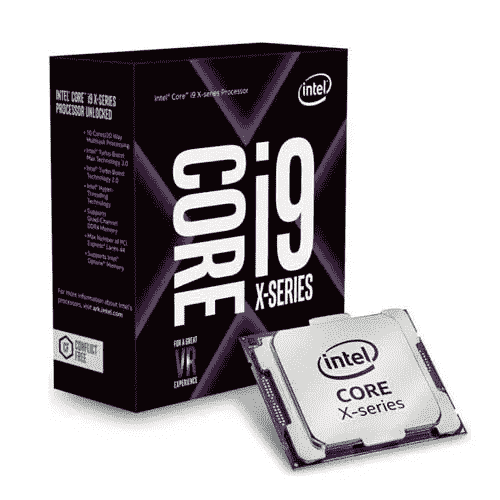](https://amzn.to/2KQuoev)

英特尔还是 AMD？

是的，我用的是英特尔处理器，不是 AMD 处理器。我这样做的原因(虽然人们可能不同意我的观点)是因为英特尔有更兼容和相关的软件，如英特尔的 MKL，这有利于我使用的大多数 Python 库。

另一个可能是更重要的原因，至少对我来说，是 NVIDIA 的人建议如果我想要双 RTX 泰坦配置，就选择 i9。未来再一次零头痛。

那么，为什么是英特尔系列中的这一款呢？

我从十核的 [9820X](https://amzn.to/2OJs4XK) 和 18 核的 [9980XE](https://amzn.to/2ODrueh) 开始，但后者让我的预算捉襟见肘。我发现*[***i9–9920 x***](https://amzn.to/2KQuoev)***，*** 的 12 核和 3.5 GHz 处理器正好符合我的预算，因为它总是更适合中端解决方案，所以我选择了它。*

*现在，CPU 是决定你最终将使用的许多其他组件的组件。*

*例如，如果您选择 i9 9900X 系列的 CPU，您将不得不选择 X299 主板，或者如果您打算使用 [AMD Threadripper CPU](https://amzn.to/2XJZdIm) ，您将需要 X399 主板。所以要注意选择正确的 CPU 和主板。*

## *[2。微星 X299 SLI 加 ATX LGA2066 主板](https://amzn.to/2KPakJg)*

*[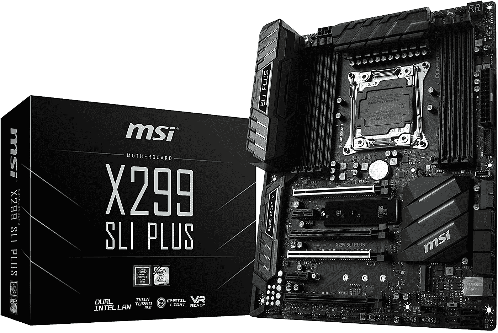](https://amzn.to/2KPakJg)

这一个符合要求* 

*这是一个特别困难的选择。这里有太多的选择。我想要一个至少支持 96GB RAM 的主板(同样是按照英伟达支持 2 个泰坦 RTX GPU 的规格)。这意味着，如果我使用 16GB RAM 模块作为 16x6=96，我必须至少有六个插槽。我有 8 个，所以它可以扩展到 128 GB 内存。*

*我还希望能够在我的系统中安装 2 TB NVMe 固态硬盘(未来)，这意味着我需要 2 个 M.2 端口，这正是该主板所具备的。否则，我将不得不去买一个昂贵的 2TB 单 NVMe 固态硬盘。*

*我研究了许多选项，基于 ATX 外形、4 个 PCI-E x16 插槽和主板的合理定价，我最终选择了这个 [one](https://amzn.to/2KPakJg) 。*

## *[3。Noctua NH-D15 chromax。黑色 82.52 CFM CPU 冷却器](https://amzn.to/2KSCweC)*

*[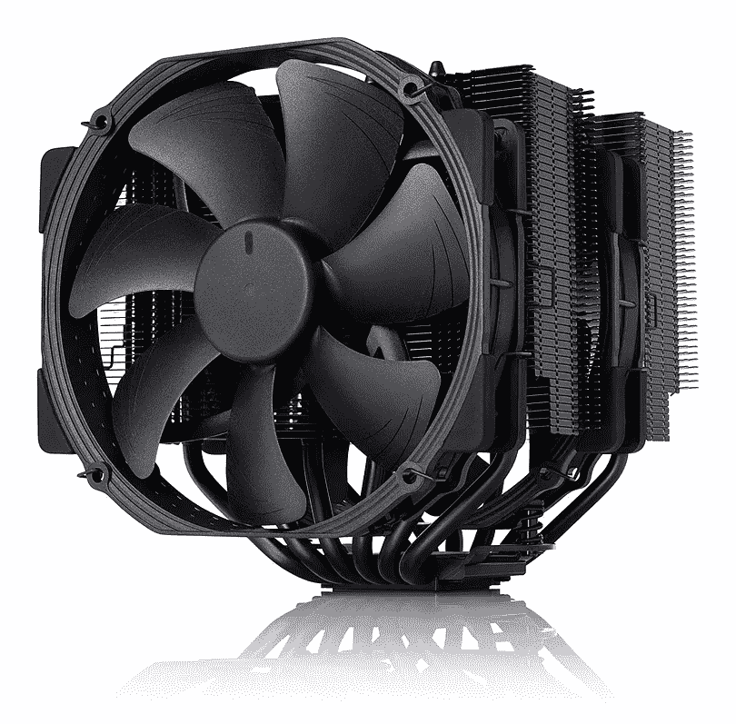](https://amzn.to/2KSCweC)**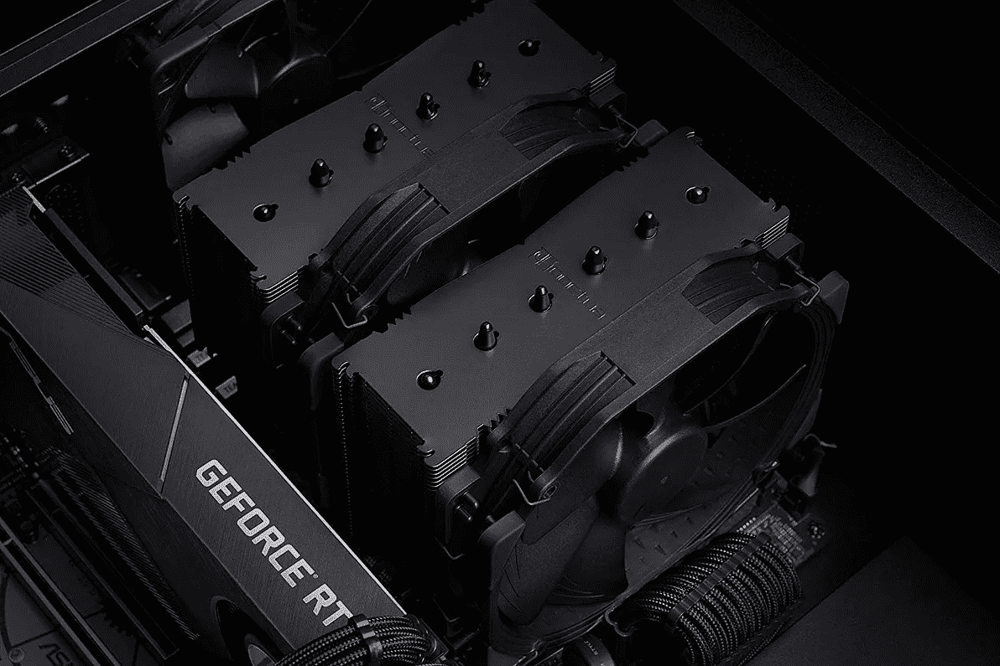*

*气流怪物*

*液体冷却现在很流行。最初，我还想使用 AIO 冷却器，即液体冷却。*

*但在与 NVIDIA 的几个人交谈以及在互联网论坛上搜索这两种选择的利弊后，我意识到空气冷却更适合我的需要。所以我选择了 [**Noctua NH-D15**](https://amzn.to/2KSCweC) **，**这是市场上最好的空气冷却器之一。所以，我选择了最好的空气冷却系统，而不是普通的水冷系统。这个冷却器是无声的。稍后将详细介绍。*

## *4.Phanteks Enthoo Pro 钢化玻璃盒*

*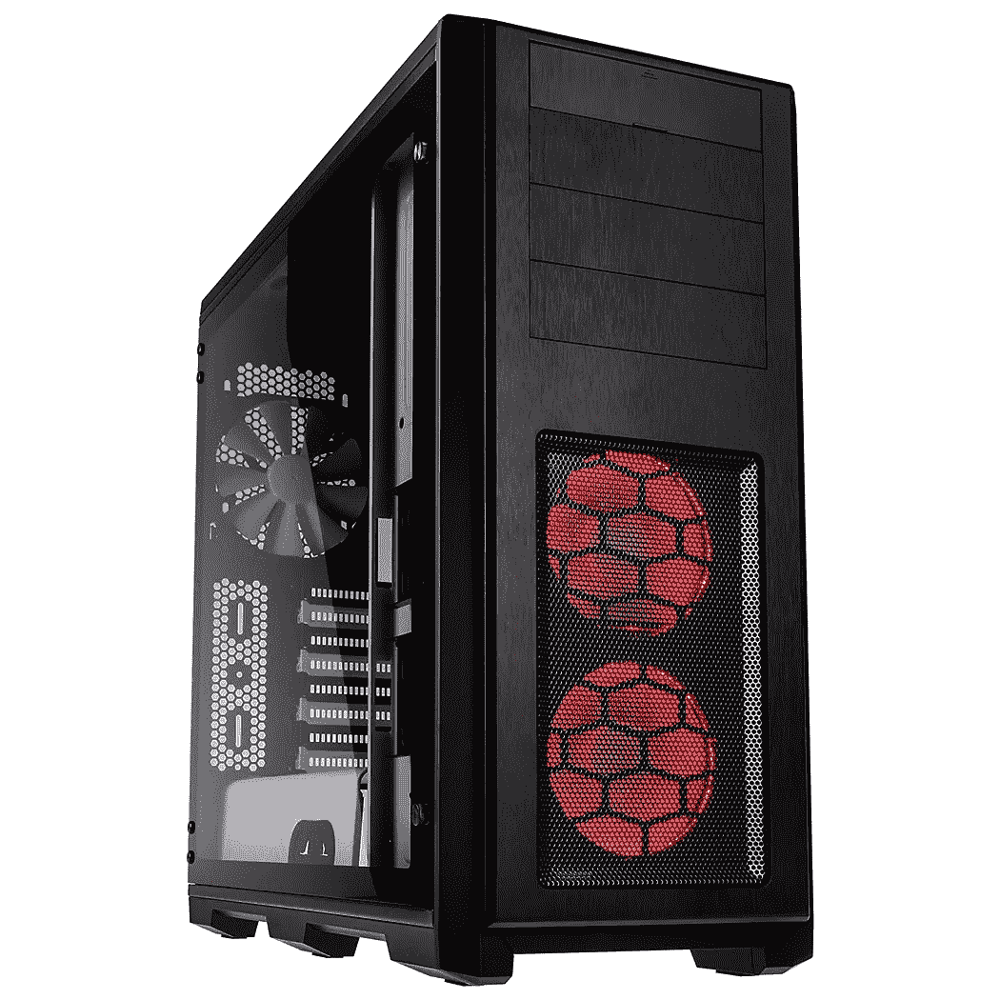**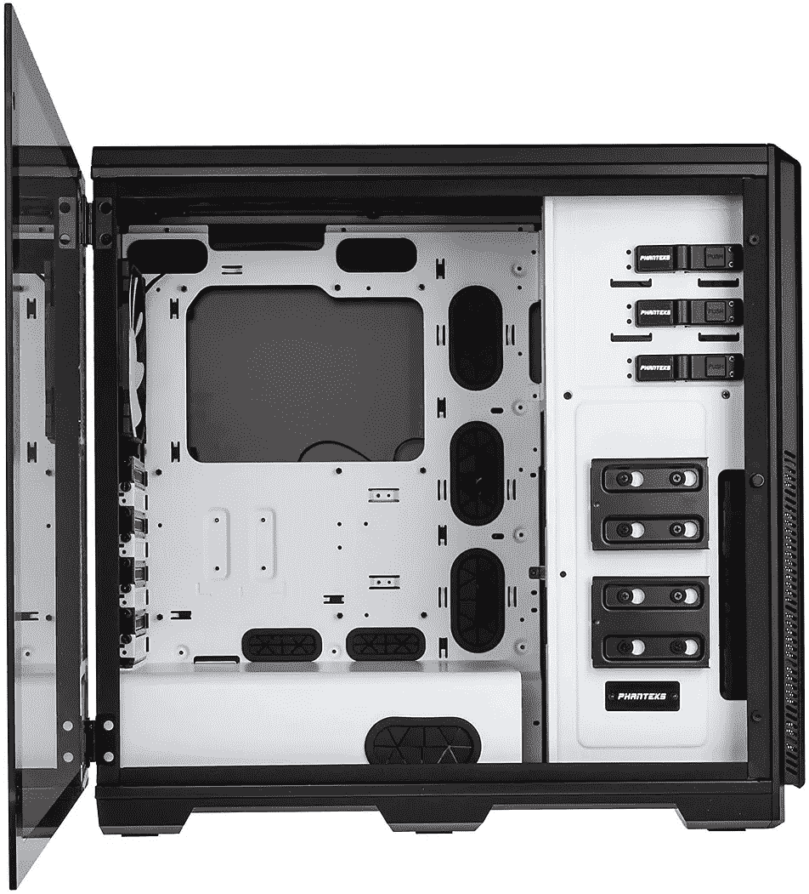*

*一个容纳所有部件的极好的大房子*

*接下来要考虑的是一个足够大的箱子，能够处理所有这些组件，并且能够提供所需的冷却。这是我花了大部分时间研究的地方。*

*我的意思是，我们将保留 2 个泰坦 RTX，9920x CPU，128 GB 内存。那里会非常热。*

*再加上 Noctua 空气冷却器的空间要求和添加大量风扇的能力，我只有两个选择，这是基于我糟糕的审美观和我所在国家的可用性。选项分别是— [***海盗船 Air 540 ATX***](https://amzn.to/2KMxXSL)*和[***Phanteks Enthoo Pro 钢化玻璃 PH-es 614 ptg _ SWT***](https://amzn.to/34DRTzd)***。*****

**这两个都是例外情况，但我使用了 Enthoo Pro，因为它是最近推出的产品，具有更大的外形尺寸(全塔式),提供了未来更可定制的构建选项。**

## **5.双[泰坦 RTX](https://amzn.to/2QLP7E0) 带 3 插槽 NVLink**

**[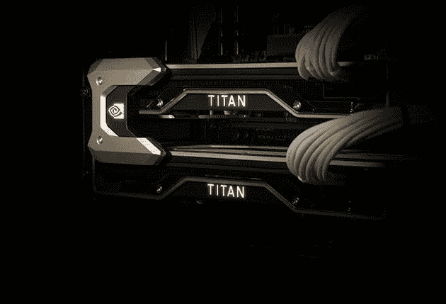](https://amzn.to/2QLP7E0)

食谱的主要成分** 

**这两个 [***泰坦 RTX***](https://amzn.to/2QLP7E0)*是目前为止整个建造中最重要也是最昂贵的部分。光是这些就占了 80%的成本，但是他们不牛逼吗？***

***我想在我的构建中有一个高性能的 GPU，NVIDIA 的好伙计们足够慷慨地给我送来两个这样的测试。***

***我就是喜欢它们。设计。它们在构建中的外观以及它们可以使用 3 插槽 [NVLink](https://amzn.to/3insaBD) 进行组合以有效提供 48gb GPU RAM 的事实。太棒了。如果钱是一个问题，2 个 NVIDIA GeForce[RTX 2080 Ti](https://amzn.to/2Dxgopy)也可以。唯一的问题是，您可能需要在 RTX2080Ti 上进行较小批量的训练，在某些情况下，您可能无法训练大型模型，因为 RTX 2080 Ti 只有 11GB RAM。还有，你将无法使用 NVLink，它结合了 TITANs 中多个 GPU 的 VRAM。***

*****更新**:对于新发布的 RTX30 系列，我会选择 RTX3090 GPU，它提供 24GB 内存，价格大约是 RTX 的一半。其他选项 RTX3080(10GB)和 RTX3070(8GB)的 RAM 较低，适合大多数 DL 用途。***

## ***[6。三星 970 Evo Plus 1 TB NVME 固态硬盘](https://amzn.to/2KLW0Bq)***

***[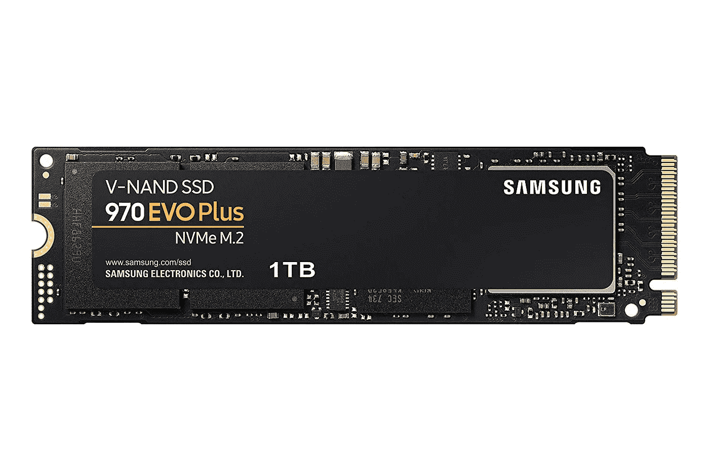](https://amzn.to/2QKNhmU)

最快的？存储选项*** 

***储物呢？当然是 NVMe 的固态硬盘，而[三星 Evo Plus](https://amzn.to/2QKNhmU) 是这场固态硬盘竞赛中最受欢迎的赢家。***

***到目前为止，我买了 1 个，但由于我的主板上有 2 个 M.2 端口，我将在未来获得 2TB 固态硬盘的总存储空间。***

***您还可以获得几块 2.5 英寸固态硬盘，以获得更多存储空间。***

## ***7.海盗船复仇 LPX 128GB (8x16GB) DDR4 3200 MHz***

***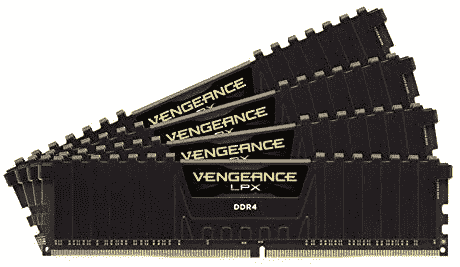******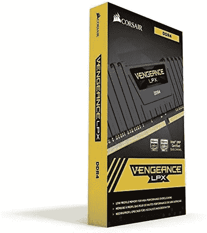***

***我的第一台电脑有 4 MB 内存。从没想过我会造一台 128 GB 内存的电脑。***

***正如 NVIDIA 团队所建议的那样，我想要最少 96GB 的内存。所以我说，管他呢，还是用 128 GB 的内存吧，不要掉价。***

***正如你所看到的，这些 RAM 棒不是 RGB 照明的，这是一个有意识的决定，因为 Noctua 空气冷却器没有为 RAM 插槽提供很多间隙，RGB 的高度略高。所以请记住这一点。此外，我从来没有试图去为一个 RGB 建设反正，因为我想把重点放在那些点燃了我的建设中的巨人。***

## ***8.[海盗船 1200W 电源](https://amzn.to/3imEYbA)***

***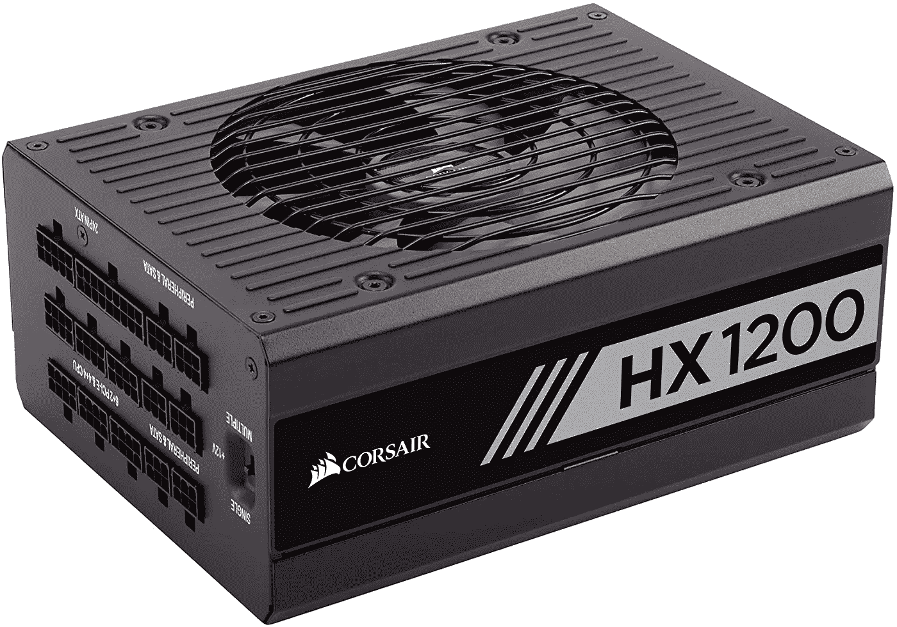***

***发电站***

***1200 瓦的电源是一个相当大的电源，但我们需要意识到，我们的组件在全瓦数下的估计瓦数约为 965 瓦。***

***我有几个其他制造商的电源选项，但由于海盗船的名字，我选择了这个。我本来要带 [HX1200i](https://amzn.to/3kqcsrj) 的，但是没有，而且 [AX1200i](https://amzn.to/2DxTKxk) 在我那里比这个贵多了。但是除了这个，这两个都是很好的选择。***

## ***9.更多粉丝***

***[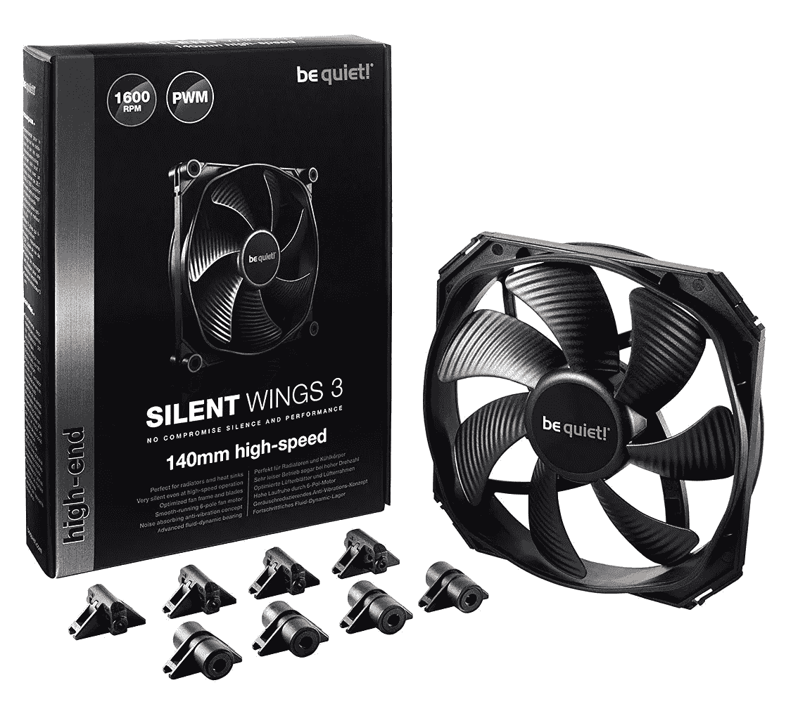](https://amzn.to/2XGkfX7)******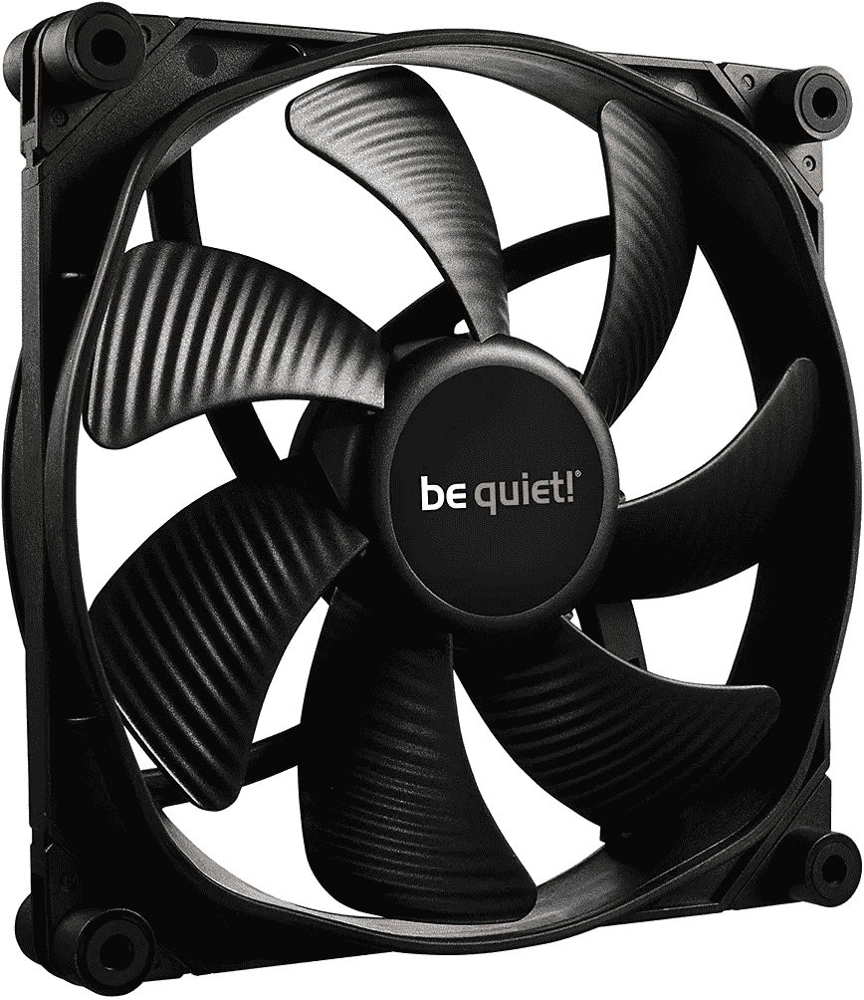***

***静音散热器***

***Phanteks 机箱配备了三个风扇，但我被建议将机箱的进气和排气风扇升级为 [BeQuiet BL071](https://amzn.to/2XGkfX7) PWM 风扇，因为双泰坦可以释放大量热量。我注意到我房间的温度几乎比室外温度高 2-3 度，因为我通常开着机器。***

***为了获得最好的气流，我买了 5 个。我把两个放在箱子的顶部，还有一个风扇，两个放在前面，一个放在后面。***

## ***10.外围设备***

***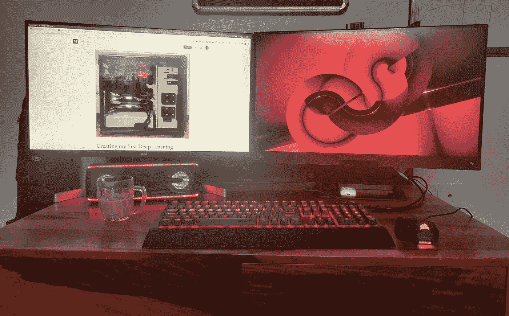***

***必需品——一杯茶和那些扬声器***

***这一部分是不必要的，但想把它完成。***

***考虑到我们拥有的所有能力，我不想在外围设备上省钱。所以我给自己买了一台 [LG 27UK650](https://amzn.to/2QIqd8p) 4k 显示器用于内容创作，[明基 EX2780Q](https://amzn.to/2XCHiDe) 1440p 144hz 游戏显示器用于一点点游戏，一个机械樱桃 MX 红色 [Corsair K68 键盘](https://amzn.to/2ODuXJG)和一个 [Corsair M65](https://amzn.to/2QNK85U) Pro 鼠标。***

***我的建造完成了。***

# ***定价💰💰💰***

***我将按照 PCPartPicker 网站的价格，因为我已经从不同的国家和来源获得了我的组件。您也可以在 PCPartPicker 网站查看零件列表:[https://pcpartpicker.com/list/zLVjZf](https://pcpartpicker.com/list/48kQmg)***

******

***这太贵了***

***正如你所看到的，这无论如何都是相当昂贵的(甚至在从 NVIDIA 获得 GPU 之后)，但我猜这是你为某些痛苦付出的代价。***

# ***最后***

***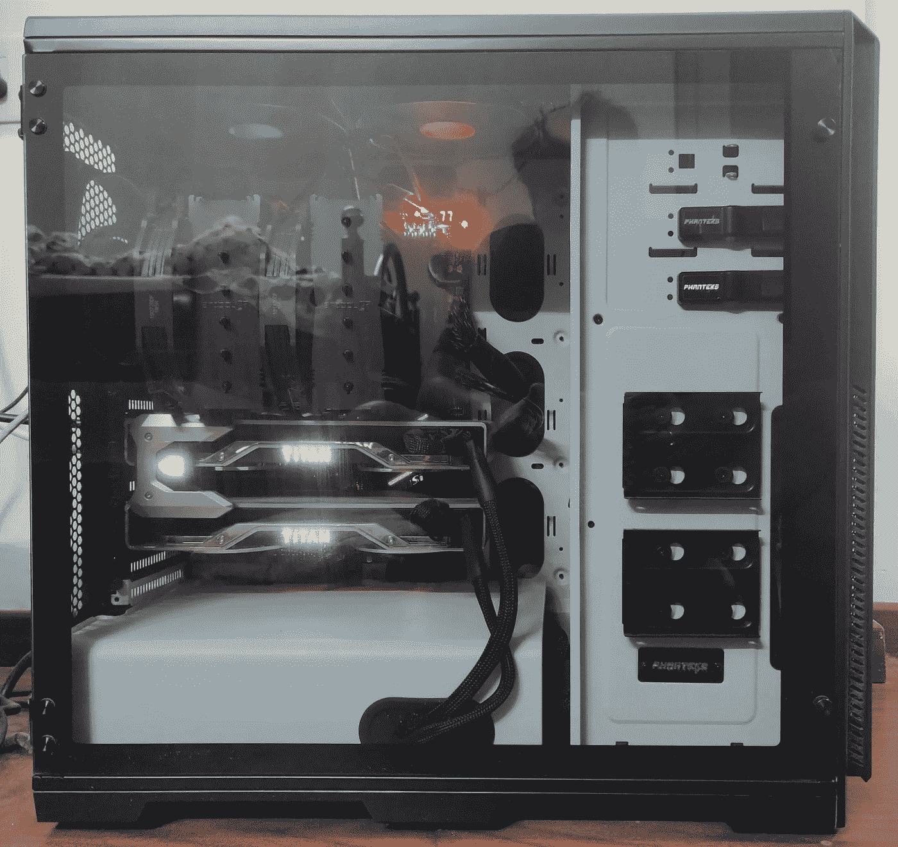***

***最终结果证明努力是正确的***

******在这篇文章中，我谈到了组装深度学习装备所需的所有零件，以及我购买这些零件的原因。******

**你可能会尝试寻找更好的组件或不同的设计，但这个对我来说已经很好地工作了一段时间，它很快吗？**

*****如果你想看看我在用这些组件设置系统之后是如何设置深度学习库的，你可以查看*** 这本权威指南，为[用 Ubuntu 18.04 设置深度学习工作站](/a-definitive-guide-for-setting-up-a-deep-learning-workstation-with-ubuntu-18-04-5459d70e19c3)**

**请在评论中告诉我你的想法。**

**谢谢你的阅读。将来我也会写更多初学者友好的帖子。在 [**中**](https://medium.com/@rahul_agarwal?source=post_page---------------------------) 关注我或者订阅我的 [**博客**](https://mlwhiz.ck.page/a9b8bda70c) 了解他们。一如既往，我欢迎反馈和建设性的批评，可以通过 Twitter [@mlwhiz](https://twitter.com/MLWhiz?source=post_page---------------------------) 联系到我**