# 创建我的第一个 Julia 可执行文件

> 原文：<https://towardsdatascience.com/creating-my-first-julia-executable-53e0f6bd0db5?source=collection_archive---------8----------------------->

## 用 C 编译 Julia！(这一点也不好玩。)

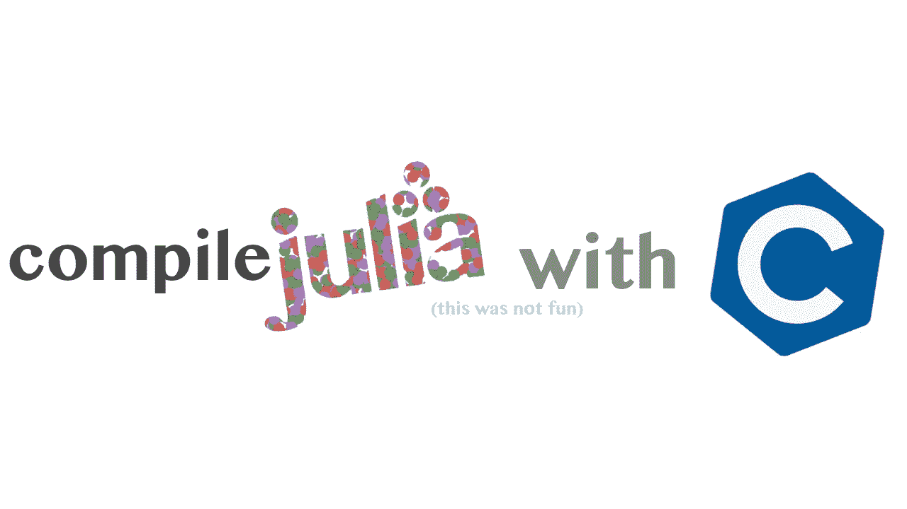

(茱莉亚标志 src =[http://julialang.org](http://julialang.org))

在我过去的经历中，我抱怨了很多关于 Julia 编程语言目前存在的一些问题。Julia 是一种伟大的语言，但没有一种语言没有它的问题，而且 Julia 的缺点令人印象深刻地罕见，当然不会破坏使用该语言的体验。我抱怨过的其中一个问题是，Julia 对编译后的可执行文件的支持目前肯定不是最佳的。

虽然这并不是说在 Julia 中创建可执行文件是不可能的，但是要从 Julia 中获得一个合适的可执行文件，肯定需要做更多的工作。我在今年早些时候(或去年年底，我不记得了)接触过这个问题，记得花了很多时间努力想得到任何结果。最终，我屈服了，放下了键盘，这对我来说是一次非常沮丧的失败。从那以后，Julia 的编译器有了许多更新，我非常乐观地认为现在可能有一种方法可以获得编译后的可执行文件。据我所知，它仍然肯定不是最佳的，但现在它是可能的。

# 我们的应用

对于我们的应用程序，我想做一个非常基本的 GUI，它既能让我们知道我们的可执行文件是否与视觉反馈一起工作，又能测试 Julia 编译的可执行文件将如何处理系统范围的依赖性。为此，我选择了 GTK 3+。我选择 GTK 是因为

*   我熟悉 Python、Vala 和 c 语言的 GTK
*   我用 Gnome。
*   朱莉娅有一个固定的 GTK 港。
*   GTK 应用程序构建起来相当简单快捷。
*   GTK 在 Linux 上使用了一个系统范围的依赖项 gtklib3，这意味着测试依赖项打包非常容易。

所有这些都有很大的好处，会让实际的写作过程变得相当简单。虽然我熟悉 Gtk，以及它的类和函数，但是将库转移到 Julia 中肯定是一件有趣的事情。

用 GTK 制作图形用户界面的第一步是制作一个窗口。

> (可预见)

我们可以像在 Python 或 Vala 中那样做。虽然在 Python 中，类当然不会被导出，所以你必须调用 Gtk，例如:

```
# Python 
import Gtk
win = Gtk.GtkWindow(title, width, height)
---------
# Julia
using Gtk
win = GtkWindow(title, width, height)
---------
# Valausing Gtk
var window = new Gtk.ApplicationWindow (title, width, height);
```

显然，它们都有语法上的差异，但是代码真正变得 julianization 的地方是删除了 add()这样的函数，并用我们都知道和喜欢的经典 Julia 基本函数替换了这些函数。

```
win = GtkWindow("this program is literally just an audio icon", 1280, 720)b = GtkVolumeButton()
push!(win,b)
```

此外，我们可以使用通常的 showall()方法来展示我们的创作！：

```
showall(win)
```

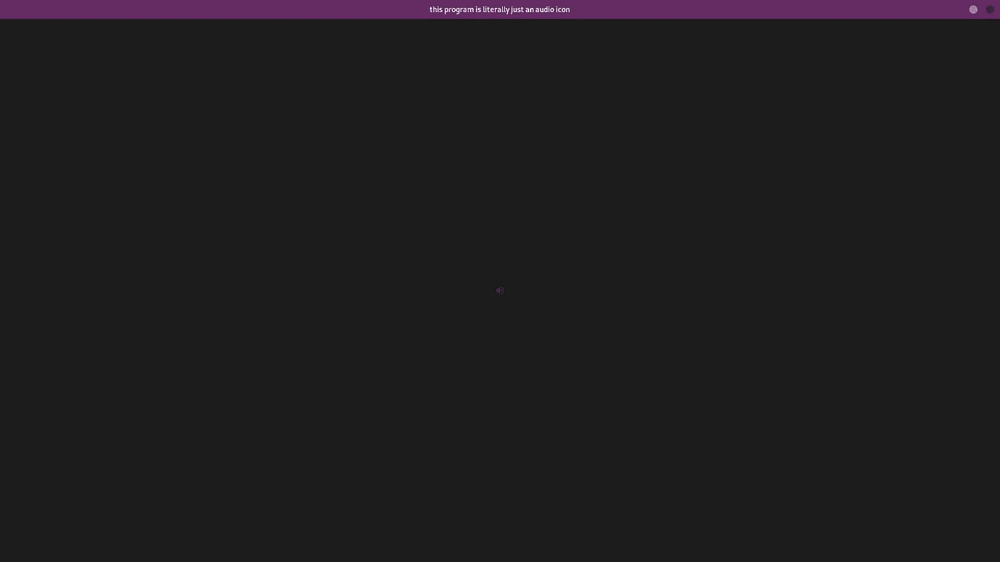

> 我从来没有见过更好的用户界面/UX 设计。

# 收集

为了编译我们的代码，我们必须将它保存为一个. jl 文件。我打开 G-edit 并记下刚才演示的代码，但是现在通过 bash 运行该文件会产生以下结果:


> 没有任何东西

也许我们什么也没看到，但也许我们应该问问朱莉娅本人，她对这种情况是否有任何意见？

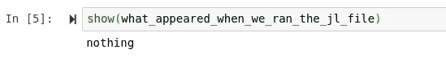

看来我们已经达成共识，什么都没发生。当然，我不知道实际上该怎么做，但幸运的是我们可以咨询我的好朋友和犯罪伙伴:

> 谷歌。

在谷歌搜索了一会儿后，我遇到了一个堆栈溢出的帖子，最初的发帖人声称他需要一个 Pkg 更新才能工作。

[](https://stackoverflow.com/questions/24086363/julia-gtk-windows-do-not-display) [## 朱莉娅:Gtk 窗口不显示

### 我一直在用朱莉娅的 Gtk 包工作。昨天一切都很好。今天，Gtk 窗口不会出现在…

stackoverflow.com](https://stackoverflow.com/questions/24086363/julia-gtk-windows-do-not-display) 

考虑到这一点，我意识到无论如何是时候创建一个虚拟环境了。

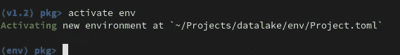

现在我将把 Gtk 添加到这个新环境中:

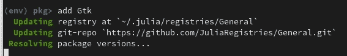

这一次，我还决定尝试从 REPL 运行代码。

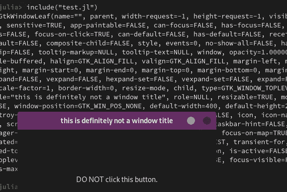

所以这肯定是可行的，但是我们如何将这个应用程序打包到它自己的可执行文件中呢？

# 实际编译

就用 Julia 打包和编译二进制文件而言，我们有两种主要的方法来处理依赖关系。我们的第一个选项包括将加载的包和编译的函数保存到一个文件中，我们可以让 Julia 在启动时执行这个文件。对于这个用例选项，第二个也是更可行的方法是将整个项目编译成一个可重定位的编译应用程序。这会生成一组其他文件以及一个可执行文件，该文件可以在一台可能没有安装 Julia 的计算机上运行(我们将对此进行测试。)

为了让包编译实际工作，我们首先需要重构这些文件“Julia style”，这涉及到创建一个 src 目录，以及一个 Project.toml。

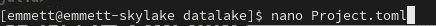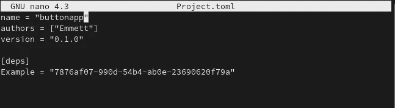

现在我们需要创建一个名为 src 的新目录，并将我们的源文件移到那里。

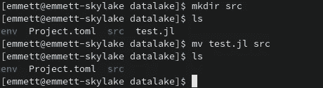

现在，当然，我们要去获取 Julia Gtk 的 UUID，并将其添加到我们项目文件的[deps]部分(是的，我差点忘了我们有一个依赖项。)之后，我们还需要在 Julia 文件中添加一个“main”函数，最终结果如下所示:

```
using Gtk
function julia_main()
 win = GtkWindow("this is definitely not a window title", 400, 200)
 b = GtkButton("DO NOT click this button.")
 push!(win,b)
 showall(win)
end
```

下一步，我们将重新激活我们的 Pkg 环境，并向其中添加 Julia 的包编译器。

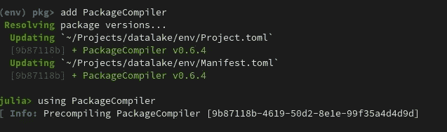

现在，我们将使用以下命令创建一个系统映像:

```
julia --startup-file=no --trace-compile=app_precompile.jl src/test.jl
```

这将在我们的工作目录中创建一个名为 app_precompile.jl 的预编译文件:

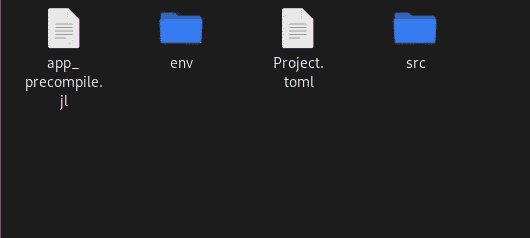

我们可能不应该直接编辑它，但是让我们看看文件内部是什么样子的。

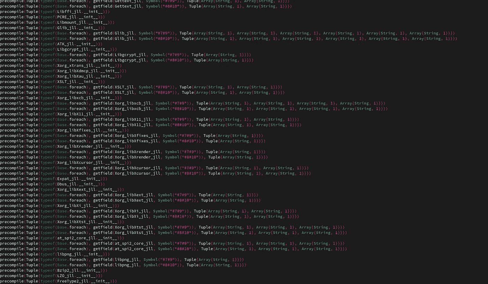

这个 Julia 代码正在预编译我们的系统映像，以便创建一个可执行文件。需要注意的是，需要添加一些参数来编译 Windows。当然，我用的是 GNU+Linux，所以我只是设置它为 X11 编译。以下是您可以为 Windows 添加的参数:

```
-Wl,--export-all-symbols
```

最后，我们需要写一些 C 语言来为我们特定的 Julia 包构建一个小的“编译器”。所以让我们快速接触一个 C 文件:

```
touch compile.c
```

现在让我们在我们选择的文本编辑器中打开该文件，我喜欢 Nano。

```
nano compile.c
```

我们要做的第一件事是包含一些 Julia 编译器需要的标准 C 头文件，它们是 string 和 stdin。

```
#include <string.h>
#include <stdint.h>
```

接下来我们还将包括 Julia 需要的标题。对于使用 Julia 来说，有两个头是至关重要的，但是如果您使用的是 C-ported 包，您可能还想包含它的头。因为 GTK 就是这种情况，所以我把它也包括在 Julia.h 和 uv.h 中:

```
#include "uv.h"
#include "julia.h"
#include <gtk/gtk.h>
```

最终结果看起来有点像这样:

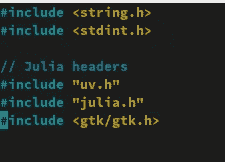

接下来，我们将从 Julia 头运行这个:

```
JULIA_DEFINE_FAST_TLS()
```

然后在我们的应用程序中声明 C 入口点的原型:

```
**int** **julia_main**();
```

接下来，我们将创建一个名为 main 的新类，它将接受由 Julia main 操作提供的两个参数。我们还将调用 uv_setup_args()，它将告诉 UV Julia 提供的参数:

```
**int** **main**(**int** argc, **char** *argv[]) {
uv_setup_args(argc, argv);
```

接下来，我们将初始化 libsupport。这是重要的一步，因为我们希望能够在可执行文件中使用动态链接。

```
libsupport_init();
```

然后我们将调整由 Julia.h 头文件提供的 Julia 选项:

```
jl_options.image_file = JULIAC_PROGRAM_LIBNAME;     julia_init(JL_IMAGE_JULIA_HOME);
```

请注意，JULIAC_PROGRAM_LIBNAME 将是一个参数，我们可以在创建完这个文件后将它添加到 C 编译器中。接下来，我们将使用与 uv 相同的方式设置 Julia 参数:

```
jl_set_ARGS(argc, argv);
```

现在我们需要将 PROGRAM_FILE 参数设置为 argv[0]。当然，这也是一个参数，所以我们可以在任何 Julia 文件中重用这个编译器。

```
jl_set_global(jl_base_module,         jl_symbol("PROGRAM_FILE"), (**jl_value_t***)jl_cstr_to_string(argv[0]));
```

现在我们要设定朱莉娅的基本论点。

```
**jl_array_t** *ARGS = (**jl_array_t***)jl_get_global(jl_base_module, jl_symbol("ARGS"));     jl_array_grow_end(ARGS, argc - 1);     
**for** (**int** i = 1; i < argc; i++) {         
**jl_value_t** *s = (**jl_value_t***)jl_cstr_to_string(argv[i]);         jl_arrayset(ARGS, s, i - 1);     
}
```

这样我们就可以关闭这个类，调用 work 函数:

```
**int** ret = julia_main();
```

然后，我们将添加一个带有 Julia 头的退出挂钩:

```
jl_atexit_hook(ret);     
**return** ret;
```

这是我最后的文件:

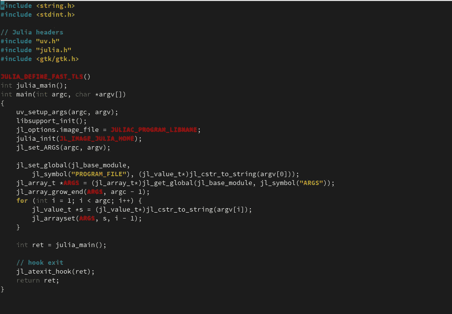

> (所以不要太 C)

下面是我最后的编译命令:

```
gcc -DJULIAC_PROGRAM_LIBNAME=\"sys.so\" -o MyApp compile.c sys.so -O2 -fPIE     -I'/home/kc/julia/include/julia'     -L'/home/kc/julia/lib'     -ljulia     -Wl,-rpath,'/home/kc/julia/lib:$ORIGIN'
```

> 现在我们做到了！

我们有一个编译好的二进制文件，点击它，我们会得到:

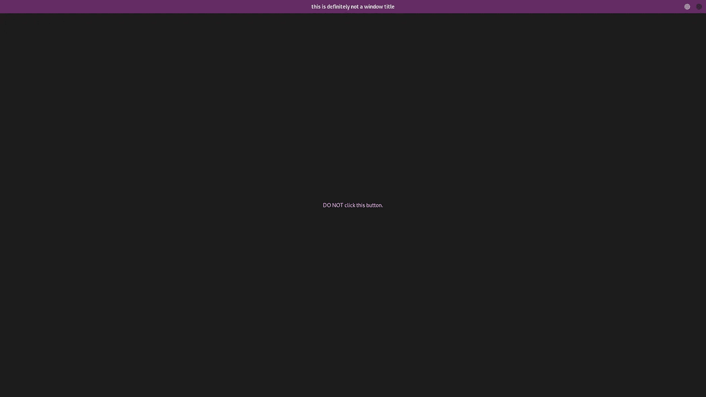

# 结论

我甚至不能对你撒谎，

> 那是一种痛苦。

朱莉娅编译肯定还没有完全到位。弄清楚这一点肯定不好玩，而且由于缺乏关于如何做到这一点的文档，这种斗争变得更加复杂，但就我所见，它真的没有那么远。我对编译 Julia 文件的潜在未来感到兴奋！我认为 Julia 作为一种通用高级编程语言有很多用途，但由于缺乏易于访问的编译，这些用途还有待探索。当然，这样的事情为什么会如此复杂是有道理的，但是我希望在我完美的未来，我们可以有一种更类似于从不同语言编译可执行文件的体验。