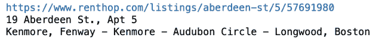

# 使用 BeautifulSoup 创建我自己的数据集

> 原文：<https://towardsdatascience.com/creating-my-own-dataset-using-beautifulsoup-43c4284210d4?source=collection_archive---------65----------------------->

## 如何使用 BeautifulSoup 库应用 Web 报废来构建自定义数据集以供将来分析。


由 [Pixabay](https://pixabay.com/service/terms/#license) 授权

这个项目的目标是使用网络抓取创建我自己的数据集，从 [RentHop 网站](http://www.renthop.com/)提取波士顿公寓租赁数据，并将其保存到 CSV 文件中。

我将遵循 4 个简单的步骤:

1.  访问网页
2.  查找特定信息
3.  检索数据
4.  保存数据

# 加载库

```
import pandas as pd
import requests
from bs4 import BeautifulSoup
```

验证*请求*和 *BeautifulSoup* 库是否已经安装。如果没有，则需要接下来的步骤来运行项目代码。

```
pip install beautifulsoup4
pip install requests
```

# 访问网页

我将使用库*请求*来访问 RentHop 站点。

```
r = requests.get('https://www.renthop.com/boston-ma/apartments-for-rent')
r.content
```


我将使用 *BeautifulSoup* 来进行 HTML 解析。我将创建一个 *BeautifulSoup* 对象，并应用一个过滤器来获取代码中的< div >标签。

```
# Creating an instance of BeautifulSoup
soup = BeautifulSoup(r.content, "html5lib")listing_divs = soup.select('div[class*=search-info]')
print(listing_divs)
```


# 查找特定信息

之所以把所有的< **div >** 标签都放到我的 list *listing_divs* 中，是因为包含了 20 套公寓的房源数据。现在我应该找出每个公寓的单独数据点。

这些是我想要锁定的信息:

*   列表的 URL
*   公寓的地址
*   附近
*   卧室数量
*   浴室数量

```
# Retrieving data from one recordurl = listing_divs[0].select('a[id*=title]')[0]['href']
address = listing_divs[0].select('a[id*=title]')[0].string
neighborhood = listing_divs[0].select('div[id*=hood]')[0].string.replace('\n','')print(url)
print(address)
print(neighborhood)
```



# 检索数据

要获得超过 20 条记录的数据，需要在几个页面上迭代。使用网站上的*搜索*选项，我得到了下面的 URL，它将有助于通过最后一个参数*页面*在不同的页面导航。

https://www.renthop.com/search/boston-ma?min _ price = 0 & max _ price = 50000 & q = & sort = hop score & search = 0 &**page = 0**

让我们创建一个简单的代码来生成第 1 页到第 4 页的 URL:

```
url_prefix = "https://www.renthop.com/search/boston-ma?min_price=0&max_price=50000&q=&sort=hopscore&search=0&page="
page_number = 0for url in *range*(4):
    target_page = url_prefix + *str*(page_number)
    print(target_page + '\n')
    page_number += 1
```


```
# Creating a function to retrieve data from a list of <div>s*def* retrieve_data(listing_divs):    
    listing_list = []
    for index in *range*(*len*(listing_divs)):
        each_listing = []
        current_listing = listing_divs[index] url = current_listing.select('a[id*=title]')[0]['href']
        address = current_listing.select('a[id*=title]')[0].string
        neighborhood = current_listing.select('div[id*=hood]')[0].string.replace('\n','') each_listing.append(url)
        each_listing.append(address)
        each_listing.append(neighborhood) listing_specs = current_listing.select('table[id*=info] tr')        for spec in listing_specs:
            try:
                each_listing.extend(spec.text.strip().replace(' ','_').split())
            except:
                each_listing.extend(np.nan)
        listing_list.append(each_listing) return listing_list# Looping and getting data from 350 pages (part of the result of searching)url_prefix = "https://www.renthop.com/search/boston-ma?min_price=0&max_price=50000&q=&sort=hopscore&search=0&page="
page_number = 1all_pages_parsed = []
pages = 350for url in *range*(pages):
    target_page = url_prefix + *str*(page_number)
    page_number += 1 r = requests.get(target_page)

    # Getting a BeautifulSoup instance to be able to retrieve data
    soup = BeautifulSoup(r.content, "html5lib") listing_divs = soup.select('div[class*=search-info]')

    one_page_parsed = retrieve_data(listing_divs)
    all_pages_parsed.extend(one_page_parsed)
```

# 将数据保存在 CSV 文件中

```
df = pd.DataFrame(all_pages_parsed, columns=['url','address','neighborhood','price','rooms','baths','none'])
df.head()
```


现在，最后一步！

```
# Writing a comma-separated values (CSV) filedf.to_csv('apartments_leasing.csv', index=False)
```

# 结论:

*   应用网络抓取允许我们为将来的分析创建我们自己的数据集。这只是一个例子，但是互联网上有很多网页
*   为了方便提取和定位我们需要的数据，了解要废弃的网页代码是至关重要的
*   *BeautifulSoup* 是一个有用且强大的网页抓取工具，它很容易学习，并且有非常好的文档，你可以在这个[链接](https://www.crummy.com/software/BeautifulSoup/bs4/doc/#quick-start)上查看
*   *BeautifulSoup* 需要一个外部库向网站发出请求，在这种情况下，我使用了 *Requests* ，这种依赖对于这个特定的项目来说并不代表任何缺点
*   我邀请你在我的 [GitHub 库](https://github.com/mwpnava/Data-Science-Projects/tree/master/Apartments_Leasing)上查看这个项目的完整代码