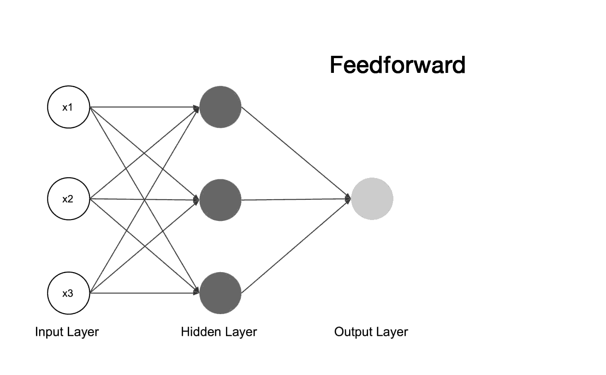
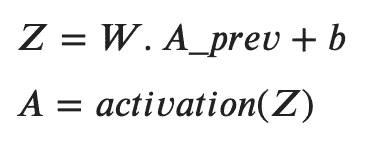
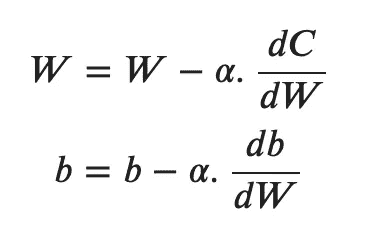
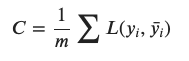
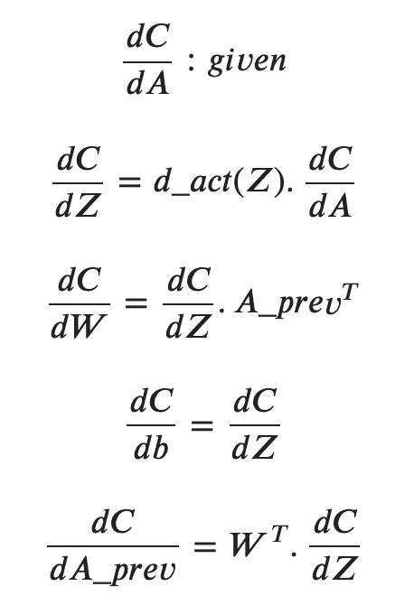
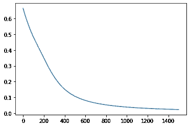

# Python 中从头开始的神经网络

> 原文：<https://towardsdatascience.com/creating-neural-networks-from-scratch-in-python-6f02b5dd911?source=collection_archive---------20----------------------->

## 初学者理解和实现神经网络的实用指南。

神经网络已经接管了世界，正在你能想到的任何地方被使用。有很多帖子描述了神经网络是如何工作的，以及如何从零开始实现一个神经网络，但我觉得大多数帖子更面向数学，更复杂，而不太重视实现。我今天的重点将是从头开始实现一个网络，并在这个过程中，了解其内部工作原理。

这篇文章的目标是引导你将神经网络中的数学方程转换成 python 代码。如果你对方程式和数学细节感兴趣，我已经创建了一个 3 部分的系列，详细描述了一切:

# 神经网络的学习过程

让我们快速回顾一下神经网络是如何从训练样本中“学习”并用于预测的。

神经网络主要由三种类型的层组成——输入层、隐藏层和输出层。

一层中的每个神经元接受输入，乘以一些权重，加上偏置，应用激活函数，并将其传递给下一层。



学习过程

学习过程可以总结如下:

1.  **前馈:**输入被送入网络。它们穿过隐藏层并到达输出层以产生输出。这个过程叫做前馈。它在训练时使用，也用于在网络完成训练后进行预测。
2.  **计算成本:**前馈后产生的输出与期望输出进行比较，我们计算它与原始值的差异。成本基本上告诉我们我们的产出与原始价值有多大的不同。换句话说，它是对我们网络中错误的一种度量。理想情况下，我们希望成本为 0，或者非常接近于 0 的值。
3.  **反向传播:**在这一步，我们回到我们的网络，我们更新每一层的权重和偏差的值。成本值告诉我们要更新多少权重和偏差(这里我们使用梯度下降)。这次更新基本上是调整权重和偏差，以使我们网络的输出变得更接近期望的输出，最终，成本下降到 0。
4.  对于固定数量的循环或迭代或时期，重复上述步骤。我们通过查看成本来决定纪元的数量——我们寻找最低的成本值。

当我们到达一个阶段，我们的成本接近于 0，我们的网络正在进行准确的预测，我们可以说我们的网络已经“学习”了。简而言之，学习就是更新权重和偏差的过程，直到网络产生一些期望的输出。

在接下来的几节中，我们将使用 Python 实现上述步骤。

# 创建图层类并初始化它

首先，我们创建一个层类来表示网络中的每一层。这只是让事情变得更整洁，更容易封装与层相关的数据和功能。

我们引入 numpy——使我们的数学计算更容易。我们还定义了将在网络中使用的激活函数和损失函数(用于计算成本)。

在 layer 类中，我们定义了字典 activationFunctions，它保存了我们所有的激活函数及其派生函数。这只是为了使事情更整洁，避免大量的 if 语句。我们还定义了学习率。如果你愿意，你可以尝试不同的学习速率值。

在 __init__ 函数中，我们将三个参数作为输入:

*   输入:该层的输入数量
*   神经元:这一层中神经元的数量
*   激活:要使用的激活函数

现在我们可以初始化我们的权重和偏差。需要注意的一点是，我们将使用矩阵乘法来执行所有的计算。因此我们所有的变量都是矩阵。

我们的权重是一个矩阵，其行数等于该层中神经元的数量，列数等于该层的输入数。我们使用 np.random.randn 函数创建一个带有随机值的形状(神经元，输入)矩阵。用随机值初始化权重矩阵对于我们的网络正确学习是很重要的。

我们的偏差是一个列向量，包含网络中每个神经元的偏差值。使用 np.zeros 函数将其初始化为 0。

## 形状参考

这里有一个快速形状参考，以免以后与形状混淆。形状是我们将使用的矩阵的维度。这一点非常重要，因为大多数错误都是由于形状不匹配造成的，这将有助于您进行调试。

神经元数=给定层中的神经元数
输入数=该层的输入数
样本数(或 m) =训练样本数

*   网络的输入，X _ train . shape =(X 的维数，样本)
*   W.shape =(神经元，输入)
*   b.shape =(神经元，1)
*   Z.shape =(神经元，样本)
*   形状= Z 形
*   dZ.shape = Z.shape
*   宽形状=宽形状
*   形状=形状
*   形状=形状

# 前馈功能

[前馈功能](https://www.youtube.com/watch?v=dgGyGY0p9jM)通过网络的每一层传播输入，直到它到达输出层并产生一些输出。正如我上面提到的，每个神经元接受输入，乘以权重，加上一个偏差，并应用一个激活函数来生成输出。

前馈方程可以总结如下:



这里需要注意的几件事是:

*   𝐴_prev 项是前一层的输出。对于我们的输入层，这将等于我们的输入值 *X.*
*   W 和 A_prev 之间的运算是点运算。因为两者都是矩阵，所以它们的形状匹配很重要(W 中的列数应该等于 A_prev 中的行数)。这是矩阵乘法的一个基本性质。
*   这一层的输出是 A_prev。对于输出图层，这将等于预测输出 Y_bar。

在代码中，我们在 layer 类中编写了这个前馈函数，它只计算当前层的输出。稍后，我们将使用一个循环来迭代层对象，并按顺序生成每个输出。

我们将 A_prev、Z 和 A 的值保存在我们的类中，以便以后在反向传播时使用。

# 梯度下降

梯度下降使我们的网络学习。我不会在这篇文章中详细讨论梯度下降，因为我已经就此发表了一篇详细的文章。

基本上，梯度下降计算我们的权重和偏差应该更新多少，以使我们的成本达到 0。这是用偏导数来完成的。

梯度下降是基于这样一个事实，在一个函数的最小值，它的偏导数将等于零。这里我们感兴趣的是最小化成本函数。

成本取决于层中的权重和偏差值。所以对于每一层，我们找到该层的成本相对于权重和偏差的导数。这个导数值是我们对权重和偏差的当前值的更新。用于进行这种更新的等式被称为学习等式。



学习方程式

这里的**α是我们之前定义的学习率**。

# 反向传播算法

[反向传播算法](https://www.youtube.com/watch?v=jVXJnN-kIqU)基本上是在我们的网络中往回走，计算每一层中偏导数值的值，并应用学习方程。

在我们得到产出后，我们将计算成本。



成本等式

这里 m 是我们训练集中的样本数。l 是计算单个样本的实际值和预测值之间的误差的任何损失函数。这基本上给出了所有样本的平均误差。

接下来，让我们看看求偏导数的方程。我们只对成本相对于 W 和 b 的偏导数感兴趣。但是为了有效地得到这些值，我们需要计算 C 对 A 和 Z 的偏导数。



反向传播方程

这些等式中需要注意的事项:

*   dC/dA 的值是给定的，即在代码中，从上一层返回。在*输出层*的情况下，这是直接计算，因为成本是 A 的函数，并且输出 Ybar = A。
*   *d_act* 是在该特定层中使用的激活函数的导数。
*   A_prev 与我们在前馈部分讨论的 A_prev 相同。我们找到它的转置来匹配 dC/dZ 的形状。还要记住一个变量的导数，比如 Z 和 Z 有相同的形状。
*   最后我们计算 dC/dA_prev 返回到下一层。
*   在代码中，我们忽略 dC 项，只使用分母来表示变量，因为所有变量都有分子 dC。例如，在代码中，变量 dA 实际上表示值 dC/dA。

请注意，在代码中，我们使用了上面讨论的精确等式，但做了一些修改:

*   为了找到 dZ 的值，我们使用了 np.multiply 进行逐元素乘法。这是因为 dZ、d_act(Z)和 dA 的维数是相同的。因此，如果我们使用点积，就会出现形状不匹配，数学上就不正确了。
*   dW 是 dZ 和 A_prev 的转置之间的点积，使用 np.dot .但是我们也用 dZ.shape[1]除它，它等于 dZ 中的列数。记住 dZ 中的列数等于样本数(行数等于神经元数)。
    在寻找点积时，我们将元素相乘并相加。自从 A_prev。t 有 m 行，在求点积时，W 的每个值是我们数据中所有样本的和。为了标准化，除以样本数，dW 的每个值都是所有样本的平均值。
*   db 和 dZ 的尺寸不同。因此，为了匹配维数，我们找到 dZ 的所有列的总和，即所有样本的总和，除以样本数，以进行归一化，就像我们对 dW 所做的那样。
*   最后，我们使用学习方程来更新权重和偏差，并返回 dA_prev 的值，该值作为 dA 传递给下一层。

# 训练网络

现在我们可以把所有东西放在一起[实现网络](https://www.youtube.com/watch?v=HNwcN3RHcNI)。我们将建立一个简单的 2 层网络来学习异或函数。

```
[[0.00435616 0.97579848 0.97488253 0.03362983]]
```

需要注意的事项:

*   m 是样本的数量。epochs 是我们将运行的迭代次数。
*   层列表包含层类的对象。第一层包含 2 个输入和 3 个神经元。这两个输入是我们正在执行 XOR 运算的两个二进制值。第二层由 3 个输入组成，因为前一层具有来自 3 个神经元的 3 个输出。它还包括一个单一的输出，异或的答案。
*   我们通过遍历每一层并将前一层的值作为输入传递给下一层来执行前馈。
*   计算成本是可选的，这里我们这样做只是为了绘制图表。
*   对于反向传播，我们在 For 循环中使用 reversed()函数向后遍历各层。dA 的值被计算并传递到下一层。
*   最后，在所有时期的循环运行之后，我们的网络应该被训练，也就是说，所有的权重和偏差应该被调整。现在，我们可以使用训练时使用的前馈逻辑进行预测。
*   可以看到输出看起来不错。如果您愿意，可以将这些值四舍五入为 0 和 1。

最后，让我们看看我们的损失是如何随着时间的推移而减少的。



这个网络显然不能用来解决现实世界的问题，但我认为它给了我们一个关于神经网络如何准确工作的好主意。从头开始实现一些东西是深入理解它的一个很好的练习。

你可以在这个 Google Colab 笔记本里找到所有的代码。
我还在 YouTube 上做了一个 [3 部分系列](https://www.youtube.com/playlist?list=PLP3ANEJKF1TwHRDS9sPANOzYaAIfJIuam)详细描述了每个方程是如何推导出来的。

参考资料:
https://www . coursera . org/learn/neural-networks-deep-learning/
https://towards data science . com/math-neural-network-from-scratch-in-python-d6da 9 f 29 ce 65
https://towards data science . com/how-to-build-your-own-neural-network-from-scratch-in-python-68998 a08 E4 f 6
https://towards data science。

***联系我！*** *邮箱:adarsh1021@gmail.com
推特:@adarsh_menon_*