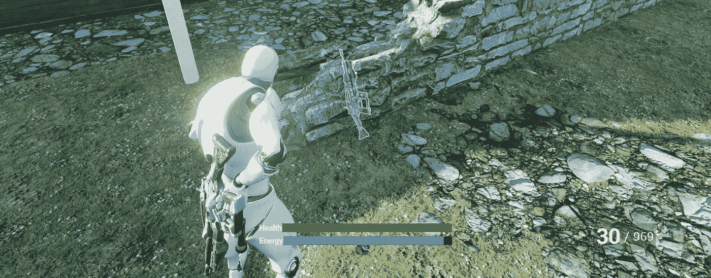

# 用强化学习创造下一代视频游戏人工智能

> 原文：<https://towardsdatascience.com/creating-next-gen-video-game-ai-with-reinforcement-learning-3a3ab5595d01?source=collection_archive---------21----------------------->

## 探索强化学习如何被用来颠覆创建视频游戏人工智能的传统方法

在维基共享空间。检索到 2020 年 10 月 16 日[wiki.unrealengine.com](https://michaeljcole.github.io/wiki.unrealengine.com/)

强化学习将成为创造智能视频游戏人工智能的新黄金标准。强化学习(RL)相对于传统游戏人工智能方法的主要优势在于，强化学习不是使用复杂的行为树手工制作人工智能的逻辑，而是简单地奖励他们希望人工智能表现的行为，并且代理通过自身学习来执行必要的动作序列以实现期望的行为。本质上，这就是人们如何用食物奖励来教狗表演戏法。

游戏人工智能的 RL 方法可用于训练各种战略行为，包括路径寻找、NPC 攻击和防御，以及人类在玩视频游戏时能够表现的几乎每一种行为。最先进的实现包括那些用于在国际象棋、围棋和多人战略视频游戏中击败一流人类玩家的实现。对于 RL 算法在理论上可以发现什么样的策略行为几乎没有限制，然而在实践中，计算费用和环境复杂性限制了人们想要使用 RL 实现的行为类型。因此，在开始之前，理解强化学习的基础以及它对你想要训练的行为的适用性是很重要的。

强化学习是基于一个代理在他们环境中发生的事情之间建立联系的能力。然而，与经典条件反射等其他形式的学习不同，强化学习更进了一步，它不仅解释了关联是如何形成的，还考察了人们如何根据这些关联的质量和强度来修改行为，以实现某种期望的奖励(或避免惩罚)。换句话说，它涉及一个随着时间优化的战略目标。

以下是在强化学习算法中发挥作用的元素的目录，无论是在人类还是视频游戏代理中。

首先，必须有一个环境——那是学习展开的环境。我们可以将其进一步分解为所谓的“全局环境状态”,它包含关于特定设置和代理的个人环境状态的所有可能的已知信息，这是代理可以访问的全局环境的子集。扑克游戏的环境有助于说明这一点。

扑克游戏的全局环境包括所有的牌，既包括牌面朝上放在桌上供玩家看到的牌，也包括牌面朝下对玩家隐藏的牌。每张卡的每个位置都包含在全局环境中。同时，代理人的环境的特征是通过他们的感官向他们展示的牌，即已经出现在桌子上的牌和他们手中的牌。这是全局环境状态的一个较小的子集。我们每个人只看到地球和宇宙以外的一小部分全球环境状况。在关于强化学习的文献中，这样的环境属于所谓的*部分可观测马尔可夫决策过程。*“部分可观察”是因为代理可以访问包含在全局环境中的一些但不是全部信息，而“马尔可夫”是因为它满足包含行动者成功学习所需目标行为的所有必要信息的属性。如果我让你和一个住在陶星球上的外星人打扑克，而不看你的牌，也不知道你是赢了还是输了，这显然是一个没有希望的任务，而且完全是“无价值的”。

经常在强化学习中使用的全局环境的另一个子集是所谓的马尔可夫环境状态，它包含关于环境的所有相关信息，这些信息对于针对某个特定目标做出关于未来的最佳决策是必要的。实质上，马尔可夫环境状态总结了环境的所有先前状态，使得不再需要进一步的信息来从该点向前优化决策。

如果你正试图做出如何避开迎面而来的棒球的决定，但无法以任何方式看到或检测到棒球，马尔可夫环境状态将是不完整的。然而，如果你用眼角瞥见了棒球，并能从那个位置计算出它的轨迹，你就不需要知道更多关于球被扔出之前发生了什么来成功躲避它。因此，它将满足马尔可夫状态的定义。在跳棋游戏中，如果你进入游戏的中点，看一眼棋盘，你不需要知道棋子在那个时候是如何到达特定位置的，就可以制定出一个最佳的前进策略。仅仅看到董事会目前的状态就足够了。马尔可夫环境经常出现在强化学习的更正式的数学处理中，但是因为我们在这里关注的是主题的直觉而不是它的数学，所以我们不会详细讨论马尔可夫环境。

在我们的强化传奇中，下一个演员是代理人自己。这是能够通过强化学习的“大脑”。在计算机科学中，这将是包含强化学习算法的机器人或合成角色。在生物学中，人类是强化学习代理的例子。我们必须有一些方法，让代理人在其环境中采取行动，以影响其获得的回报。实验室烧杯中的大脑无法进行强化学习，因为它无法以任何方式影响其环境。因此，必须有某种方法来与环境谈判，使我们的代理人的行动影响环境的状态。

除了媒介本身，在我们采取行动注意到它们的影响之后，我们还必须有一种方法来观察我们的环境。如果你将手臂连接到我们假设的烧杯中的大脑，但手臂没有任何感觉，那么这些手臂可能会假设能够做很多好事，特别是如果它可以构建身体的其余部分供大脑骑行。然而，如果没有任何方法来观察用这些武器采取的行动并衡量其效果，这些武器将仍然是无用的。因此，对环境进行观察的能力是强化学习的另一个关键组成部分。要记住的重要一点是，代理人的观察空间必须包括它需要知道的一切，以创建一个策略来实现它所寻求的回报。 例如，一个必须以特定顺序采取若干行动以获得奖励的人工智能代理必须以某种变量数组的形式访问这些过去行动的记忆。一个只知道自己当前行为的主体，将无法围绕一个需要记住一系列行为的目标进行优化。以同样的方式，在特定环境情况下因采取行动而获得奖励的代理必须有权观察这些相关环境对象中的每一个。 ***一个很好的经验法则是，无论游戏环境中的什么变量都是代理人奖励功能的一部分，接下来讨论的，也必须是代理人的观察空间的一部分，以便它能学会接收奖励。***

这就把我们带到了奖励的话题上。如果没有奖励，或者相反的惩罚，就没有动力去学习一种行为。在任何形式的学习之前，必须有一个大棒或胡萝卜，一些东西来*激励*行为的改变。如果事情没有任何积极或消极的联系，就没有什么可以推动行为的改变，没有什么可以追逐和避免。这些都包含在代理的奖励函数中，并且是强化学习的基础。如果你在视频游戏中训练 NPC，你的奖励可以是在游戏环境中以特定方式组合的变量的任意组合。我们可以总结这些组件的整个模式，以及它们如何在一个简单的模型中相互关联，如图 1 所示。

作者图片

**图 1——强化学习组件和交互的流程图:**学习者采取行动，观察环境，接受奖励与否，然后相应地更新策略。这一过程重复进行，随着时间的推移，通过连续的动作逐渐改进代理的策略。

既然我们已经将强化学习的所有组成部分都放在了一起，那么让我们来看看它们是如何相互作用来创造一种战略行为的。总而言之，我们有一个可以采取行动的代理，根据环境的状态和它过去的行动，代理要么得到奖励，要么没有。但是，为了让强化学习的魔力发生，当代理人被奖励时，它必须将这种奖励传播回导致它获得奖励的行为和环境状态。这可以通过多种方式来实现，在状态行动对之间反向传播奖励的公式可能会有点麻烦。为了使用 RL 来创建视频游戏 AI，人们可以理解，最初代理必须采取随机行动，一旦它“偶然”通过机会获得奖励，该奖励可以与将它带到奖励处的行动和观察相关联。当这个过程重复很多次时，代理人会逐渐发现一个模型，这个模型显示哪些行为会带来回报，哪些不会。因此，随机试错训练始终是强化学习的一个关键组成部分，也是代理人学习获得奖励的方法。

人们在编程视频游戏 AI 时会遇到的大多数形式的强化学习将如上所述的传统 RL 与另一类称为神经网络的机器学习相结合。这就是深度强化学习中“深度”的来源，因为深度神经网络与 RL 模型一起烘焙，使其更具可扩展性和鲁棒性。

为视频游戏 AI 实现强化学习的早期问题之一是所谓的组合爆炸。如果一个智能体需要观察它的环境并与之互动来学习获得奖励，那么我们需要多大的表格来跟踪它的环境中可能影响其奖励的所有对象？例如，一个环境中的四个可移动对象可以以至少 24 种不同的方式组合，假设它们能够以不同的顺序排列。8 个物体可以有 40，320 种组合方式！除此之外，我们进入了从人类的角度来看几乎毫无意义的数字——12 个物体可以以 4.79 亿种独特的方式组合。即使对计算机来说，那也是一张相当大的桌子。但是人类经常在涉及这种组合爆炸的任务中取得成功。例如，在玩 Atari 视频游戏的任何给定时间，人类都在从总数为 33，600 个像素的物体中抽象出 4 或 5 个我们正在跟踪的不同物体。

那么，我们如何从所有这些像素组合中提取出少量有意义的特征呢？对人类来说，进化为我们做了所有艰苦的工作。虽然根据计算机的处理能力，可以想象计算机可以比人处理更多的功能，但组合爆炸甚至会加重现代超级计算机的负担。对强化学习来说幸运的是，在一个被称为神经网络的人工智能领域发生的平行发展给出了答案。

深度神经网络最常与称为“监督学习”的人工智能领域相关联，这需要有人为算法提供标记的训练数据，以从中学习模式。深度神经网络的惊人之处在于，它们可以像猫的照片一样获取嘈杂、非线性、非均匀的数据，并将其抽象为对其进行分类至关重要的几个特征。这就是垃圾邮件分类器如何在你的电子邮件收件箱中工作，以及网飞如何根据你喜欢或不喜欢的电影为你创建推荐。这种分类器在软件中越来越常见，并由于深度神经网络而受到了鼓舞。神经网络比早期的统计方法(如逻辑回归和贝叶斯分类器)更强大，因为它们擅长发现隐藏在多层复杂性下的模式。他们就像分类器的大力士，在最大最复杂的训练数据中寻找模式。这种分类器确实是强大的工具，但与强化学习不同，它们需要某种标记数据来进行训练，并且创建这些训练集的过程通常是一个费力和艰苦的过程。

正是使用深度神经网络从雅达利屏幕呈现的大量组合中抽象出少数关键特征的想法，证明了强化学习的革命性。深度神经网络有能力获取非常嘈杂的大型数据集，并检测其中的模式。Atari 视频游戏的屏幕可以被认为是这样一个大而嘈杂的数据集。通过使用 Atari 的屏幕作为 RL 算法与神经网络相结合的观察空间，他们可以将所有像素组合的复杂性降低到与玩家可能做出的不同移动相关的数量，通常只有 4 或 5 (Volodymyr Mnih，2015)。他们只是幸运地认为这是可能的吗？一点也不，相反，因为这些游戏是为人类设计的，而人类只有有限的能力来跟踪他们视野中的多种特征，所以这些游戏在设计时就考虑到了这些限制。为外星人设计的 Atari 视频游戏能够从 10，000 种不同的重要特征组合中学习，这完全是另一回事。然而，在大多数游戏功能只是装饰，对输赢没有任何意义的情况下，深度神经网络可以将复杂性降低到强化学习算法可以管理的程度。

雅达利的情况同样适用于围棋这样的棋类游戏。由于游戏固有的复杂性，这种古老的中国娱乐方式被认为是计算机无法掌握的。正如围棋专家喜欢提醒我们的那样，在一场围棋比赛中，可能的棋盘组合比宇宙有史以来存在的夸克数量还要多。但就像在雅达利电子游戏中一样，围棋游戏中的许多棋盘位置与游戏的任何给定回合都不相关。它们就像屏幕远处角落里的像素，在它表明敌人正向你走来之前并不重要。“深度强化学习”，即深度神经网络和强化学习的结合，被证明在掌握围棋方面与在 Attari 视频游戏中一样有效。2017 年，由 DeepMind 开发的围棋深度强化学习算法 AlphaZero 击败了几位世界领先的人类围棋选手以及最佳围棋人工智能。

当想到像围棋这样的游戏时，一个关键的谬误是假设复杂的游戏需要复杂类型的学习。在分形几何中，看似无限复杂的令人困惑的图案可以从简单的公式中推导出来。进化产生了无数的生命形式，它被一个同样简单的学习规则所指导——错误。事实上，同样的学习方程式可以让你掌握井字游戏，也可以让你掌握像围棋这样的游戏。在这两个游戏中，强化学习可以发现与获胜相关的关键关联。这并不是说没有更复杂的方法来教电脑掌握游戏。1997 年在国际象棋比赛中击败加里·卡斯帕罗夫的 IBM 超级计算机 DeepBlue 是一个庞大的程序，其中内置了数千个由国际象棋专家和程序员编写的场景。但是，这样复杂的程序，最终远不如强化学习这样的简单算法健壮和强大。首先，他们编织了编码他们的人类的经验偏见。当雅达利深度强化学习算法在 Deepmind 开发出来时，它发现了一种在乒乓游戏中增加分数的方法，这种方法使用了一种人类玩家以前不知道的技巧。如果它完全是根据人类的经验编写的，它很可能永远不会做出这种“外星人”的动作。强化学习的优势在于，在与自己对抗的过程中，它可以尝试数百万种游戏历史上从未有人想过要尝试的动作。这也会使校准变得困难。如果一个人的目标是创造一个具有人类专业水平的视频游戏人工智能，这可能涉及到在代理达到超人类水平之前停止训练。

许多所谓的“专家”在研究国际象棋强化学习算法 AlphaZero 时，看到了更高级版本的 DeepBlue，因此未能意识到他们正在研究一种完全不同的人工智能，一种具有完全不同含义的人工智能。因为强化学习模仿了人类学习的方式之一，所以可以用于掌握围棋的相同算法可以用于掌握煎蛋卷或叠衣服。当你第一次开始学习叠衣服时，你会犯错误，袖子不整齐，折痕不精确。通过重复，或者用计算机科学的话说，迭代，你慢慢地学会了让你达到目标状态，完美折叠衬衫所必需的正确动作。以这种方式，许多人类活动可以被“游戏化”并变成强化学习问题。这既是强化学习的希望，也是它的危险。国际象棋超级计算机 DeepBlue 只能在国际象棋上取得成功，而强化学习算法可以很容易地适应任何可以游戏化的任务。

在下一篇文章中，我们将演示如何使用现代游戏开发软件[创建你自己的定制 RL 环境](/create-a-custom-deep-reinforcement-learning-environment-in-ue4-cf7055aebb3e)。