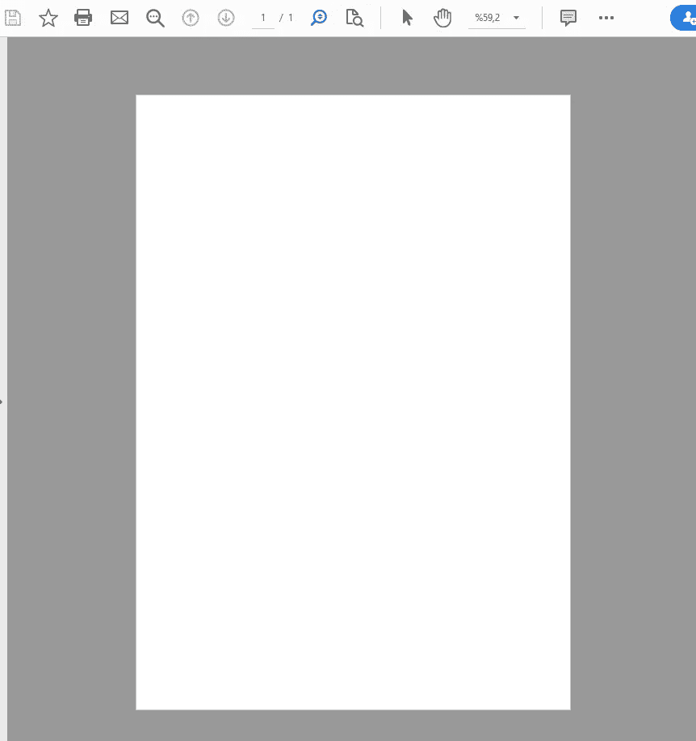
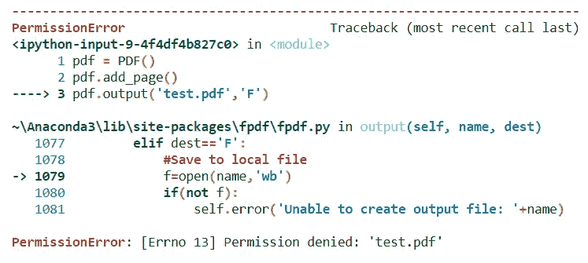
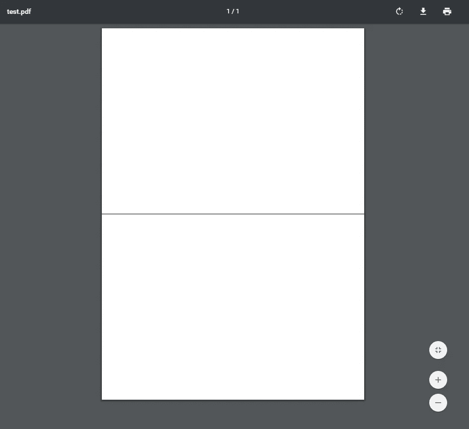
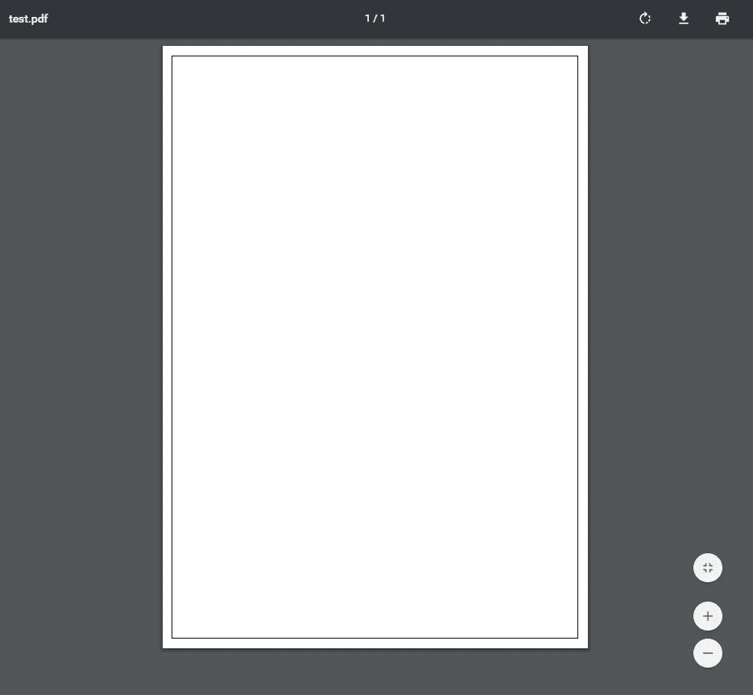
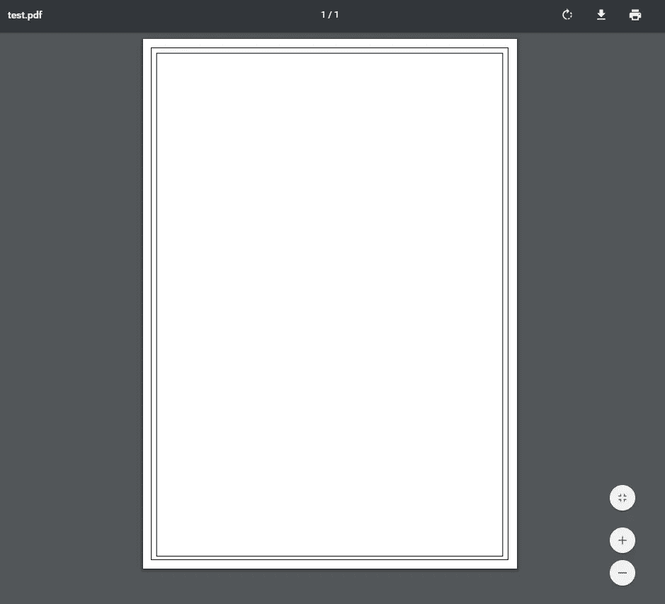
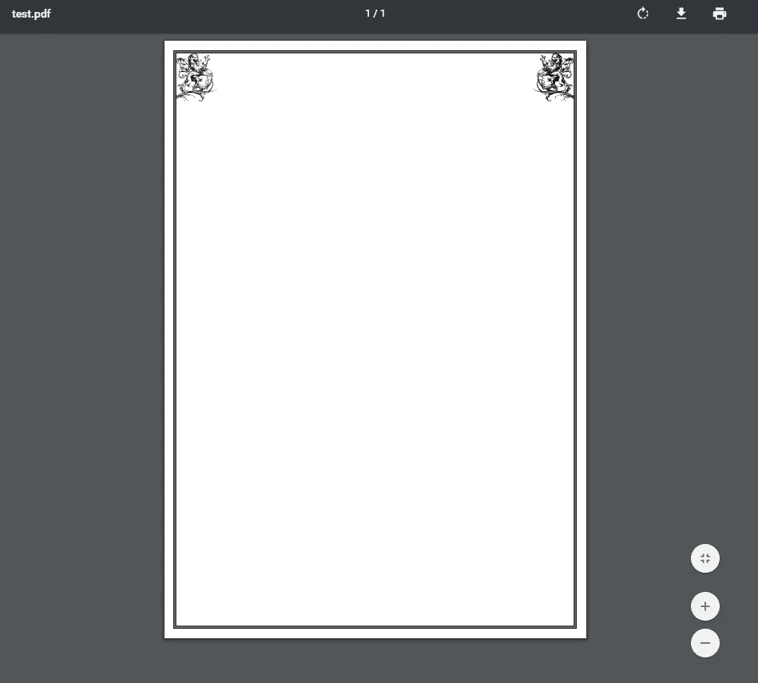
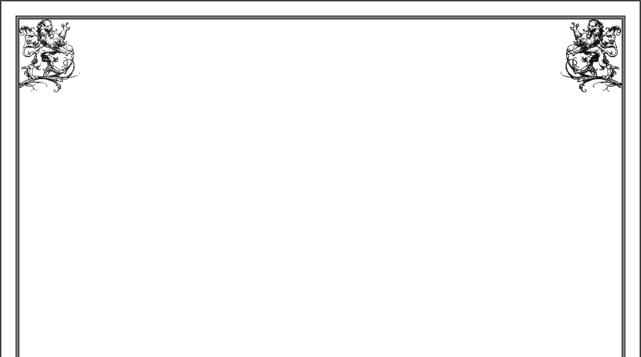
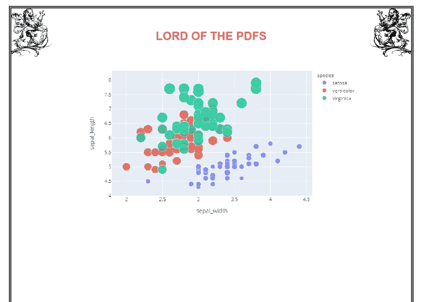
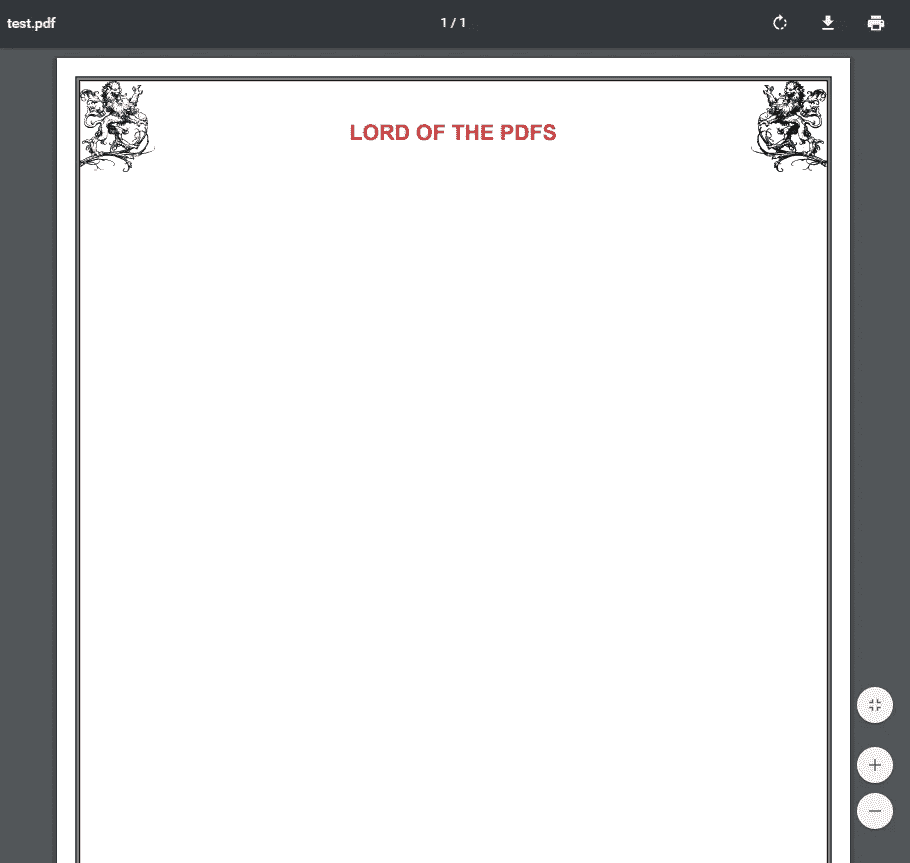
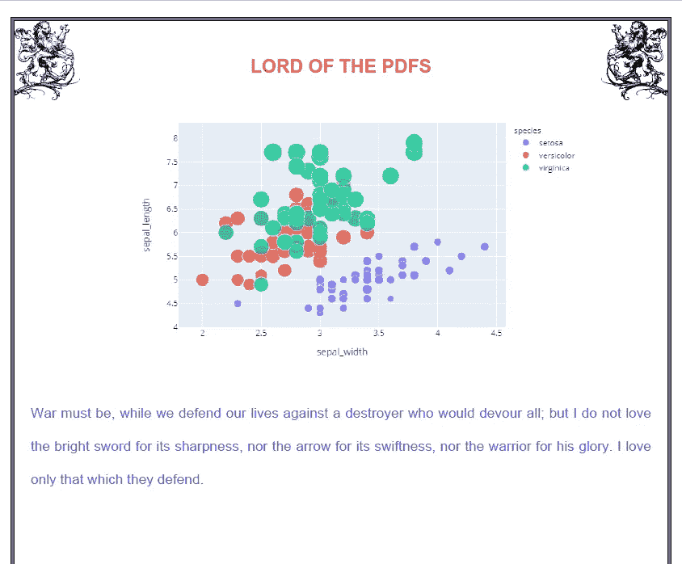

# 使用 Python 创建 PDF 文件

> 原文：<https://towardsdatascience.com/creating-pdf-files-with-python-ad3ccadfae0f?source=collection_archive---------0----------------------->

## 如何使用 PyFPDF 和 Python 创建 pdf 文件


威廉·艾文在 [Unsplash](https://unsplash.com/s/photos/report?utm_source=unsplash&utm_medium=referral&utm_content=creditCopyText) 上的照片

你可能不明白为什么我们应该使用 PDF 格式作为报告工具，而有更先进的方法，如动态仪表板。你的态度是可以理解的，但这里有一些想法可能会改变你的想法:

*   ***PDF 文件格式是全局的。*** 它是当今最常用的文件格式之一，广泛应用于各个领域。
*   ***它是便携式的。*** 是的！PDF 代表可移植文档格式。你可以移动你的文件而不必担心任何限制。
*   ***它是一个平台无关的工具。*** 它独立于硬件和操作系统。您可以在 Windows 中创建 pdf 文件，并在 Macintosh 或 Unix 中查看它们。
*   ***可以离线使用。你甚至不需要网络连接。***
*   ***安逸之辈。*** 创建 PDF 文件有许多不同的方法。我们的目的是学习如何用 Python 来做这件事。

## 使用 PyFPDF

***PyFPDF*** 是 Python 下的一个小巧紧凑的 PDF 文档生成库。不可否认，用 Python 创建 pdf 有很多选择，但是我更喜欢使用 PyFPDF，因为它很简单。

让我们从导入“***【FPDF】***包开始。如果你还没有，请检查 [***这个***](https://pyfpdf.readthedocs.io/en/latest/index.html#installation)*链接来安装它。*

```
*python -m pip install fpdf # installationfrom fpdf import FPDF  # fpdf class*
```

*我们从“fpdf”包中导入 FPDF 类。*[***FPDF***](http://www.fpdf.org/)*是一个 PHP 类，允许用纯 PHP 生成 PDF 文件。***

***最初，我们创建一个类来使用 FPDF 库。目前，我们使用 pass 语句，这是一个空操作。***

```
***class PDF(FPDF):
     pass # nothing happens when it is executed.***
```

***创建一个类之后，是时候创建我们的第一个 pdf 页面了。首先，我们需要创建一个 PDF 类的对象。***

```
***pdf = PDF()#pdf object***
```

***FPDF 构造函数有几个影响结果的参数。其中第一个是 ***页面方向*** 。可以使用不同的方向，如“ ***【风景】******【人像】*** 默认的方向是纵向。如果想改成横向，用“**L”**作为方向值。(*不区分大小写。*)***

```
**pdf=PDF(orientation='L') # landscape**
```

**其次，如果您喜欢“厘米”、“点”或“英寸”的单位，您可以更改度量单位默认值为“毫米:毫米”**

```
**pdf=PDF(unit='mm') #unit of measurement**
```

**最后，最后一个参数是页面格式。正如你注意到的，默认值是“***”A4***”。其他值有"***【A3】******【A5】******信、******合法。"*****

```
**pdf=PDF(format='A4') #page format. A4 is the default value of the format, you don't have to specify it.# full syntax
PDF(orientation={'P'(def.) or 'L'}, measure{'mm'(def.),'cm','pt','in'}, format{'A4'(def.),'A3','A5','Letter','Legal')#defaultpdf = PDF(orientation='P', unit='mm', format='A4')**
```

**要了解更多信息，您可以查看原始文档[这里](https://pyfpdf.readthedocs.io/en/latest/reference/FPDF/index.html)。**

**因为我们有了自己的类，所以我们可以添加一个页面并保存输出。**

```
**pdf.add_page()
pdf.output('test.pdf','F')**
```

*****add.page*** 功能向文档中添加新的页面。我上面提到的 PDF 参数也适用于这个特性。顺便说一句，如果你不添加一个页面，类方法就不起作用。**

**这是我们的第一个空白 PDF 页面。**

****

**第一个 PDF 页面**

**让我给你一个提示。如果你想检查你的 pdf 文件，现在不要使用 PDF 阅读器。因为当你试图改变 python 代码时，它会给出如下错误:**

****

**我们有这个问题的一个原因是你的 PDF 文件正在被另一个程序使用。要补救这种情况，只需使用 chrome 或 firefox 作为 PDF 浏览器。**

## **坐标空间和画线**

**PyFPDF 是建立在坐标空间(x，y)上的，因此，我们需要了解必要的数学技巧，比如加、减:)**

**我之前说过，orientation 的默认值是' **A4** '。所以我们需要知道 A4 的尺寸(w:210 mm，h:297 mm)。让我们将这些维度分配给变量以备后用。**

```
**pdf_w=210
pdf_h=297**
```

**我们准备做一些不同的事情。让我们在这一页的中间画一条线。但是首先，我们需要在我们的类中创建一个方法。**

```
**class PDF(FPDF):
    def lines(self):
        self.set_line_width(0.0)
        self.line(0,pdf_h/2,210,pdf_h/2)**
```

**lines 方法有两行代码。在第一行代码中，我们将线条宽度设置为 0.0 毫米。在另一行代码中，我们通过“***line”***函数绘制了一条简单的线条。这个函数有四个参数。**

```
**line(x1,y1,x2,y2)**
```

**`x1`和`y1`是原点。您可能已经猜到，`x2`和`y2`是我们需要指定的端点。在我们的例子中，`x1`等于零，这意味着我们要从纸的最左边开始。**

****

**很简单，对吧？让我们用这些线画一个长方形。这次我们需要四种不同的线函数。**

```
**class PDF(FPDF):
    def lines(self):
        self.set_line_width(0.0)
        self.line(5.0,5.0,205.0,5.0) # top one
        self.line(5.0,292.0,205.0,292.0) # bottom one
        self.line(5.0,5.0,5.0,292.0) # left one
        self.line(205.0,5.0,205.0,292.0) # right one**
```

****

**尽管 line 函数可用于绘制矩形，但还有另一个函数可用于绘制矩形。**

```
**class PDF(FPDF):
    def lines(self):
        self.rect(5.0, 5.0, 200.0,287.0)**
```

**“***【rect】***函数有四个不同的变量。但这和 line 函数不一样。**

```
**rect( x: float, y:float, w:float, h:float, style='')**
```

**x 是左上角的横坐标，y 是左上角的纵坐标，' **w'** 是矩形的宽度，' **h'** 是矩形的高度。如果要填充矩形，样式参数是必不可少的。 **D** '是默认的样式值。 **F** 代表填充， **FD** 或 **DF** 代表填充和绘制。**

```
**class PDF(FPDF):
    def lines(self):
        self.rect(5.0, 5.0, 200.0,287.0)
        self.rect(8.0, 8.0, 194.0,282.0)**
```

****

**好了，现在你已经学会了如何画一条直线和一个矩形。让我们用 RGB 值填充最外面的矩形。(不要忘记' **FD** 或' **DF** '参数的填写。)**

```
**class PDF(FPDF):
    def lines(self):
        self.set_fill_color(32.0, 47.0, 250.0) # color for outer rectangle
        self.rect(5.0, 5.0, 200.0,287.0,**'DF'**)
        self.set_fill_color(255, 255, 255) # color for inner rectangle
        self.rect(8.0, 8.0, 194.0,282.0,**'FD'**)**
```

**现在我们已经创建了模板。**

****

## **添加图像**

**这一次我们将学习如何添加图像到我们的 PDF 页面。让我们从在类中创建另一个函数开始。**

```
**def imagex(self):
        self.set_xy(6.0,6.0)
        self.image(sctplt,  link='', type='', w=1586/80, h=1920/80)
        self.set_xy(183.0,6.0)
        self.image(sctplt2,  link='', type='', w=1586/80, h=1920/80)**
```

**有两种不同的代码行。首先是 ***set_xy*** 函数，定义了当前位置的横坐标和纵坐标。这些是图像的起点。另一个是在页面上放置图像的图像函数。如果您对参数有疑问，请查看本 文档 [**。**](https://pyfpdf.readthedocs.io/en/latest/reference/image/index.html)**

****

**狮子图片由[openclipbart-Vectors](https://pixabay.com/users/OpenClipart-Vectors-30363/?utm_source=link-attribution&utm_medium=referral&utm_campaign=image&utm_content=1296694)来自 [Pixabay](https://pixabay.com/?utm_source=link-attribution&utm_medium=referral&utm_campaign=image&utm_content=1296694)**

****

**狮子图片来自 [Pixabay](https://pixabay.com/?utm_source=link-attribution&utm_medium=referral&utm_campaign=image&utm_content=1296694)**

**我们也可以添加一个情节。**

```
**import plotly.express as px
import plotly
import os
df = px.data.iris()
pltx= px.scatter(df, x="sepal_width", y="sepal_length", color="species",
                 size='petal_length', hover_data=['petal_width'])plotly.io.write_image(pltx,file='pltx.png',format='png',width=700, height=450)
pltx=(os.getcwd()+'/'+"pltx.png")### define a methoddef charts(self):
        self.set_xy(40.0,25.0)
        self.image(plt,  link='', type='', w=700/5, h=450/5)**
```

****

## **使用文本**

**添加图片后，让我们创建一个标题。顺便说一下，不要忘记用另一个 set_xy 函数重置索引。定义位置时，它保持不变，直到用另一个 set_xy 函数改变它。**

```
**def titles(self):
        self.set_xy(0.0,0.0)
        self.set_font('Arial', 'B', 16)
        self.set_text_color(220, 50, 50)
        self.cell(w=210.0, h=40.0, align='C', txt="LORD OF THE PDFS", border=0)**
```

**我们需要在创建文本之前使用 set_font 来定义字体。这次我们只有三个参数；家庭，“风格”和“大小”默认情况下，标准字体使用 Latin-1 编码。所以你可能会遇到编码错误之类的问题。如果问题仍然存在，请考虑使用 [DejaVu](https://pyfpdf.readthedocs.io/en/latest/Unicode/index.html) 字体系列。**

****

**我们可以使用文本文件来代替文本。为此，我们需要使用下面提到的 ***和*** 语句。**

```
**def texts(self,name):
        with open(name,'rb') as xy:
            txt=xy.read().decode('latin-1')
        self.set_xy(10.0,80.0)    
        self.set_text_color(76.0, 32.0, 250.0)
        self.set_font('Arial', '', 12)
        self.multi_cell(0,10,txt)**
```

****

**哦，不要忘记设置作者:)**

```
**pdf.set_author('Eser SAYGIN')**
```

## **概述**

**PDF 似乎有点老派，但它仍然是最广泛使用的报告工具，它仍然是商业世界中许多公司的有用工具。在本文中，我们学习了如何在 Python 中使用 PyFPDF 创建一个基本的 pdf 文件。如果您需要生成有用的基本 PDF，那么这个库可能正合您的胃口。**

**[](https://www.linkedin.com/in/esersaygin/) [## eser saygı客户细分主管—图尔基耶 i̇ş银行| LinkedIn

### 经验丰富的项目主管，有银行业工作经验。英语熟练…

www.linkedin.com](https://www.linkedin.com/in/esersaygin/) 

**有用链接**

*   [https://pyfpdf.readthedocs.io/en/latest/index.html](https://pyfpdf.readthedocs.io/en/latest/index.html)
*   [http://www.fpdf.org/](http://www.fpdf.org/)
*   [https://github.com/reingart/pyfpdf](https://github.com/reingart/pyfpdf)**