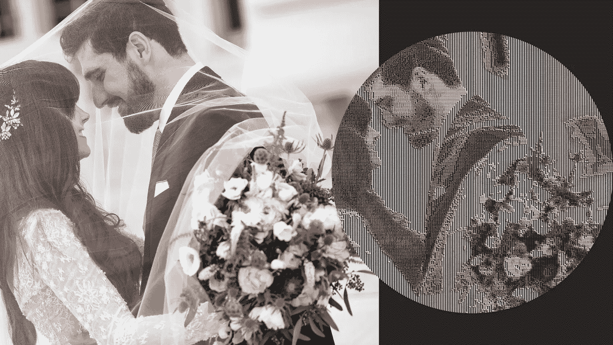
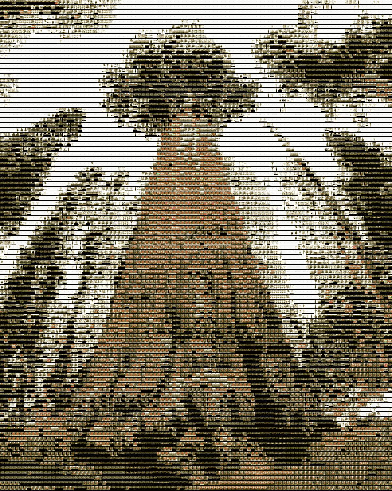

# 使用 Python 创建照片镶嵌

> 原文：<https://towardsdatascience.com/creating-photo-mosaics-using-python-49100e87efc?source=collection_archive---------17----------------------->

## 一步一步的教程，让你自己的美丽的图像


由 [AmaltasCoder](https://photo.stackexchange.com/users/54129/amaltascoder) 使用 Tubromosaic.com 创建的图像

代码更新于 2021 年 12 月 8 日

*   不再需要 Image_Tester.py
*   感谢丹·布莱克、约翰内斯·拉·波特和乔丹·莫里斯的编辑和评论

照片马赛克是由许多较小的图像组成的图像。较小的图像拥有与原始图像中的位置相似的颜色和亮度，使得原始图像从远处看是可见的，类似于[克洛德·莫内的画](https://upload.wikimedia.org/wikipedia/commons/d/d6/Claude_Monet_-_Graystaks_I.JPG)。有许多在线工具(付费软件)可以创建照片马赛克，然而，我决定在 python3 中实现一个照片马赛克创建器，并与社区共享。我的妻子正在创建一个新的生活方式博客[，我想还有什么比从我们一年多前的婚礼中创造一幅美丽的图像更好的方式来帮助她的项目呢。源代码可以在](https://www.shanabryn.com/)[**Data Dolittle GitHub**](https://github.com/Datadolittle/Photo_Mosaic)上免费获得。让我们从设置运行脚本所需的环境开始。

## **工具**

照片拼接程序需要[](https://pillow.readthedocs.io/en/stable/installation.html)**和 [**numpy**](https://numpy.org/install/) 分别处理图像和矩阵操作。按照上面文本超链接中的说明安装这两个软件包。**

## **图像**

**你心中有想制作照片马赛克的图像吗？太好了！图像组成更小的图像怎么样？背景图像越多，镶嵌效果就越好。如果你想快速下载大量图片，我建议你使用 chrome 扩展插件直接从 google images 下载图片。火狐中还有其他批量图片[下载程序。**把所有的背景图片放在同一个文件夹里。**将您的前景图像保存在该文件夹之外。你所有的照片应该是 3 通道图像，如 jpeg 或 jpg。确保运行 Image_Tester.py 脚本来检查背景图像文件夹中的 3 通道图像。移除任何。png，。口角或者。创建照片马赛克之前的 gif。该脚本会将图像移动到名为“不可用的图像”的文件夹中。](https://addons.mozilla.org/en-US/firefox/addon/save-all-images-webextension/)**

```
python Image_Tester.py --images [Background_Images_Folder]
```

## **马赛克创造者**

**现在，您已经安装了必要的工具并拥有了照片，您已经准备好创建您的照片镶嵌。必需的输入包括目标前景图像、背景图像文件夹和网格的大小，两个整数之间用空格隔开。一个可选参数是输出标志，用于将镶嵌图像保存为您想要的任何名称。**

```
python Mosaic_Creator.py --target [Input_Image] --images [Background_Images_Folder] --grid 50 50 --output [Output_Name]
```

## **代码**

**这一节包含了创建引擎的细节，所以对于那些无聊的伪代码滚动到底部，看看我的演示的最终产品。完整代码可在 [GitHub](https://github.com/Datadolittle/Photo_Mosaic) 上获得。**

****图像目录:**背景图像被加载到内存中，进行整形和处理。该处理包括获取图像中的平均红色、蓝色和绿色通道。这个平均值用于将背景图像放入网格中。**

****目标图像:**目标图像被分成由用户输入定义的网格。单元尺寸是原始图像尺寸和由于网格尺寸导致的分割数量的乘积。计算每个像元的红色、绿色和蓝色平均值。单元平均值和背景图像平均值之间的最佳匹配用于将背景图像放入单元中。所有单元格都填充有背景图像，生成的镶嵌图保存到文件中。**

## **输出**

**使用我们的结婚照运行脚本后，创建了以下马赛克。**

****

**照片马赛克脚本的产品在右边，原始图像在左边。**

**这幅镶嵌画看起来像原作，只是颜色更深。我们的婚礼在日落时举行，所以许多照片的背景都很暗，导致马赛克图像变暗。增加照片的数量将提供更多的细节，增亮的照片将增加整体亮度。本文详细介绍了使用 [GitHub](https://github.com/Datadolittle/Photo_Mosaic) 上可用的脚本在 python 中创建照片马赛克的工具和过程。你可以使用任何东西来创建你自己的照片马赛克！我的名字是[科迪·格利克曼](https://codyglickman.com/)，可以在 [LinkedIn](https://www.linkedin.com/in/codyglickman/) 上找到我。请务必查看下面的一些其他文章。**

**[](/time-to-make-the-switch-9eb719d434de) [## 是时候做出改变了

### 将 MacOS 默认值从 Python 2 升级到 Python 3

towardsdatascience.com](/time-to-make-the-switch-9eb719d434de) [](/building-a-beautiful-static-webpage-using-github-f0f92c6e1f02) [## 使用 GitHub 创建漂亮的静态网页

### 查找模板和为静态网页创建表单的位置

towardsdatascience.com](/building-a-beautiful-static-webpage-using-github-f0f92c6e1f02) [](/dashing-through-christmas-songs-using-dash-and-sql-34ef2eb4d0cb) [## 使用 Dash 和 SQL 快速浏览圣诞歌曲

### 使用 SQL 数据库创建 Dash 仪表板的简单项目

towardsdatascience.com](/dashing-through-christmas-songs-using-dash-and-sql-34ef2eb4d0cb) 

## 这是一幅树木镶嵌画



由维基百科上的树木图片制成的树木马赛克**