# 使用 Python 创建演示文稿

> 原文：<https://towardsdatascience.com/creating-presentations-with-python-3f5737824f61?source=collection_archive---------2----------------------->

## 创建和更新 Powerpoint(。pptx)文件


亚历克斯·利特温在 [Unsplash](https://unsplash.com/s/photos/projector?utm_source=unsplash&utm_medium=referral&utm_content=creditCopyText) 上的照片

时间是科学家拥有的最宝贵的数据，必须有效利用。如果你经常准备一个演示文稿，那就意味着你在忙着浪费时间。但是如果你可以自动化的话，为什么你要做一些像繁重的工作呢？

这是我关于耗时工作自动化的第二篇文章。你可以点击 [**这里**](/creating-pdf-files-with-python-ad3ccadfae0f) 找到另一个关于**用 python** 创建 pdf 文件的。

本文由五部分组成。

*1-入门*

*2-添加图像*

*3-添加图表*

*4-实施*

现在我将向您展示用 Python 创建 PowerPoint 幻灯片的基础。

## **入门**

`**python-pptx**`是一个用于创建和更新 PowerPoint 文件的 Python 库。这篇文章将是对这个包的基本介绍。如果你想了解更多，这个是你应该查看的官方文档页面。现在让我们安装软件包，如果你没有。

```
**pip install python-pptx**
```

我建议你使用 pip 安装代码行，因为这个包依赖于`Ixml`、`Pillow` 和`XlsxWriter`包。如果您使用 setup.py 安装方法，您将需要自己安装这些依赖项。

用例子来解释一件事总是很容易的。为此，我将首先使用官方的例子。在文章的最后，我将逐页构建一个基本的 PowerPoint 演示文稿。让我们从添加幻灯片开始。为此，我们首先需要导入 pptx 包。

```
**from pptx import Presentation**
```

我们将使用`**Presentation()**`打开或创建一个演示文稿。让我们把它赋给一个变量。

```
**prs=Presentation()**
```

现在我们已经准备好制作我们的第一张幻灯片。这张幻灯片将包含一个标题和一个副标题。

```
**lyt=prs.slide_layouts[0] # choosing a slide layout**
**slide=prs.slides.add_slide(lyt) # adding a slide**
**title=slide.shapes.title # assigning a title**
**subtitle=slide.placeholders[1] # placeholder for subtitle****title.text="Hey,This is a Slide! How exciting!" # title****subtitle.text="Really?" # subtitle****prs.save("slide1.pptx") # saving file**
```

好了，我们刚刚制作了第一张幻灯片。让我们逐行解释这个代码块。你可以把幻灯片布局想象成一个模板。共有九种幻灯片布局，我们在本例中使用了第一种。`**prs.slide_layouts[0]**`这意味着‘我将使用*标题布局’*。那么我们怎么知道应该选择哪一个呢？这都是关于 PowerPoint 中的幻灯片母版。如下图所示，幻灯片母版上的第一项是“*标题幻灯片布局*”。这就是为什么`**slide_layouts[0]**`给了我们标题对象。顺便说一下，你可以使用空白布局，而不是标题布局。

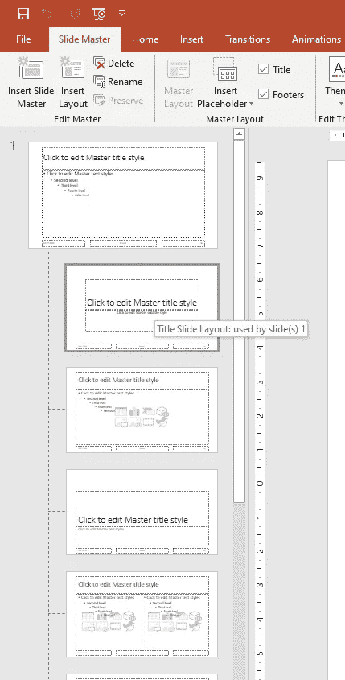

其次，我们使用了 *add_slide* 函数来添加一个继承布局的新幻灯片。`**slide=prs.slides.add_slide(lyt)**`通过做这个作业，我们刚刚添加了一个包含标题对象的幻灯片布局(很大的一个！).

在这一步之后，我们已经创建了一个标题变量。`**title=slide.shapes.title**`

下一排是`**subtitle=slide.placeholders[1]**`。这意味着如果你想添加一个副标题，那么你必须添加一个占位符。使用`**.text**`属性，我们可以在一个形状上分配一个字符串。

代码块的最后一步是导出 pptx 文件。`**prs.save(“slide1.pptx”)**`在我们的路径中将幻灯片保存为 pptx。这就是结果。

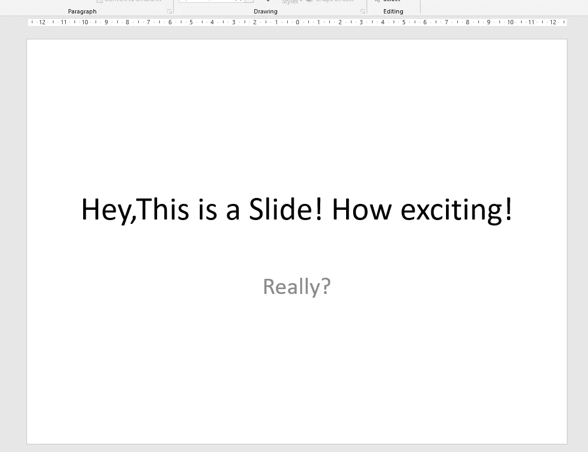

## **添加图像**

好了，我们刚刚学习了如何添加幻灯片、标题和副标题。现在是添加图表和图像的时候了。

在添加新元素之前，我应该提到一些重要的东西。长度等级。pptx 包有一个 util 模块，包含实用函数和类，如长度，英寸等。

```
**from pptx.util import Inches**
```

[在这里](https://python-pptx.readthedocs.io/en/latest/_modules/pptx/util.html)你可以找到 ***pptx.util*** 的源代码。你可能会想，“为什么它如此重要？”。首先，如你所知，有两种默认的幻灯片大小。标准和宽屏。

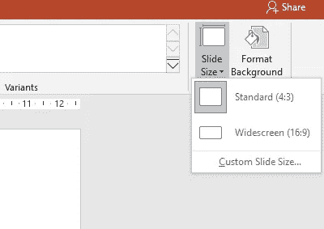

如果您想使用宽屏演示，您应该在开始时定义幻灯片大小。

```
**prs.slide_width = Inches(16)
prs.slide_height = Inches(9)**
```

除此之外，正如您将在下面看到的，我们需要调整对象以适应我们的工作空间。好吧，我们继续。现在我们需要定义一个图像路径，以便以后使用。

```
**img_path = '/your-img-path/{your-image}.png'**
```

好的，进行到一半。在我们的第一个例子中，我们使用了`**slide_layout[0]**`。这次我们将选择第六个布局，它是空白的。

```
**prs = Presentation()
blank_slide_layout = prs.slide_layouts[6]
slide = prs.slides.add_slide(blank_slide_layout)**
```

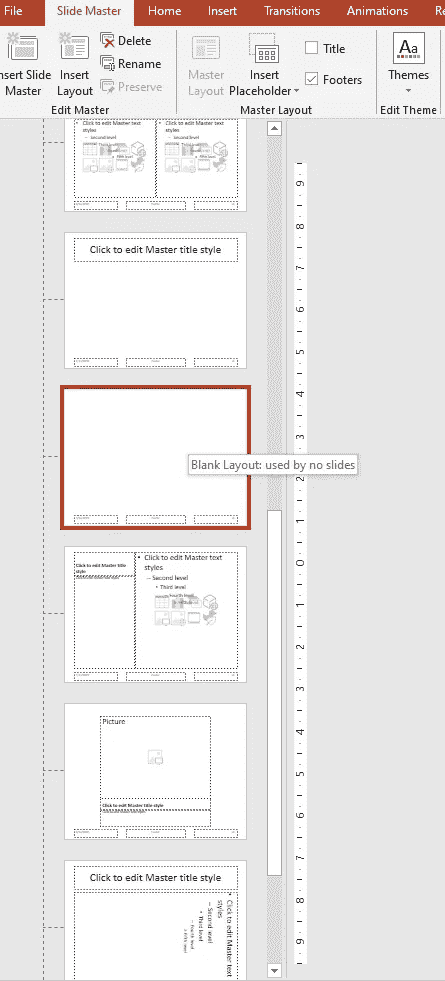

嗯，我们得到了我们需要的一切。让我们添加一个图像。

```
**path='stick2.png'** **prs = Presentation()
blank_slide_layout = prs.slide_layouts[6]
slide = prs.slides.add_slide(blank_slide_layout)**
```

我们现在要定义两个变量。这些变量允许您根据需要调整位置或移动。

```
**left=Inches(1)
top=Inches(0.5)**
```

如果您检查这些值，您会看到 914400。这是动车组，每英寸有 914400 个动车组。 ***(1 寸= 914400 动车组)***

好了，我们准备好添加图像了。

```
**img=slide.shapes.add_picture(path,left,top)**
```

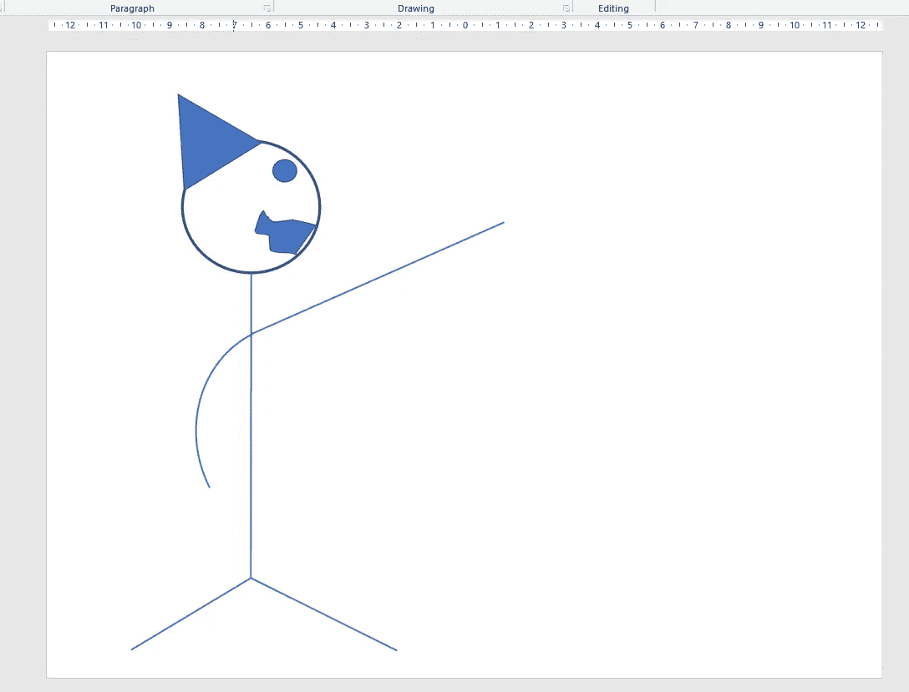

他在指出什么。

## **添加图表**

pptx 包支持添加或修改图表。为此，我们将使用`**pptx.chart.data**`和`**pptx.enum.chart**`。

首先，我们需要定义图表数据。

```
**chart_data=ChartData()**
```

我们再补充一些类别和系列。

```
**chart_data.categories = ['Column 1', 'Column 2', 'Column 3']
chart_data.add_series('Hey',    (10.5, 5.5, 17.5))
chart_data.add_series('there',    (25.5, 40.3, 30.7))
chart_data.add_series('reader', (5.2, 10.3, 8.4))**
```

现在我们需要定义一些度量。 ***(左、上、宽、高)***

```
**x,y,cx,cy=Inches(1),Inches(2),Inches(5),Inches(7)**
```

我们现在准备添加一个图表。

```
**chart=slide.shape.add_chart(XL_CHART_TYPE.LINE_MARKERS_STACKED,x,y,cx,cy,chart_data).chart****prs.save('chart-02.pptx')**
```

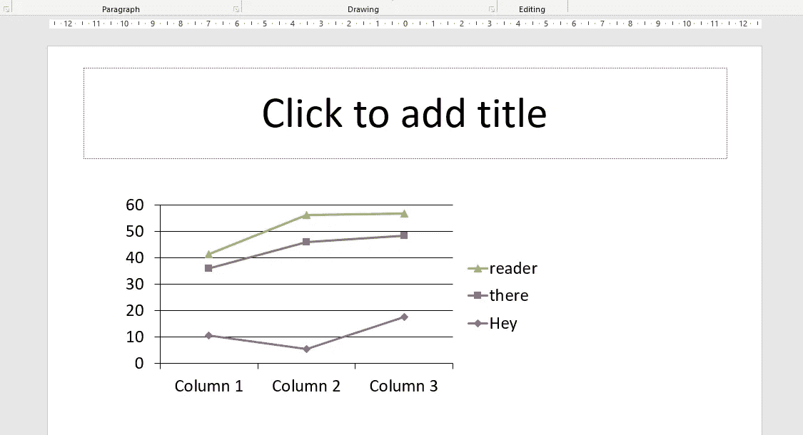

刚开始就够了。让我们构建一个端到端的 PowerPoint 演示文稿。

## **实施**

好的，我们是白领，我们的经理想要一个明天的快速演示。是的，如果你愿意，你可以一个一个地建立一个演示文稿。

让我们建立一个自动化的演示程序。

***第 1 页:***

首先，让我们导入必需的包。

```
**from pptx import Presentation
from pptx.enum.shapes import MSO_SHAPE
from pptx.dml.color import RGBColor
from pptx.util import Inches, Pt
from pptx.enum.dml import MSO_THEME_COLOR****title='Automated Presentation Creating Process\n\
How to Create PowerPoint Presentations with Python '
pylogo='pylogo.png'
pptlogo='pptlogo.png'
prs = Presentation()**
```

导入包后，我定义了一些变量。(标题和徽标)。现在我们可以创建我们的第一页。我将使用宽屏布局。

```
**slide = prs.slides.add_slide(prs.slide_layouts[6])
prs.slide_width = Inches(16)
prs.slide_height = Inches(9)****shape = slide.shapes.add_shape(
    MSO_SHAPE.RECTANGLE, 0, Inches(9/1.5),Inches(16),Inches(9/8.5)
)**
**shape.shadow.inherit = False**
**fill=shape.fill
fill.solid()
fill.fore_color.rgb=RGBColor(255,0,0)
shape.text= title
line=shape.line
line.color.rgb=RGBColor(255,0,0)
logo1=slide.shapes.add_picture(pylogo,Inches(13.8),Inches(6.0),height=Inches(1.0),width=Inches(1.0))
logo2=slide.shapes.add_picture(pptlogo,Inches(14.5),Inches(5.8),height=Inches(1.5),width=Inches(1.5))**
```

我刚刚添加了一个矩形和两个图像。`**slide.shapes.add_shape({type of shape},{left spacing},{top spacing},{width},{height})**`。

我已经用`**shape.shadow.inherit = False**`去掉了阴影效果。形状对象也有一个`**.fill**`属性。这是形状的颜色。`**.line**`是一个形状周围的边框，可以有不同的颜色。因此，我为它们分配了相同的 RGB 代码。结果如下:

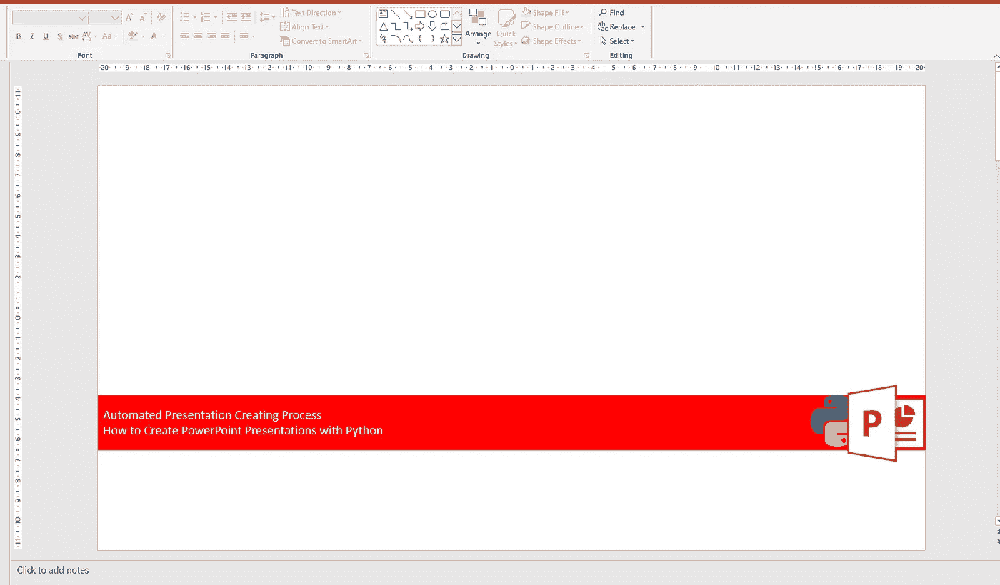

***第 2 页:***

让我们添加一个图表。

```
slide = prs.slides.add_slide(prs.slide_layouts[6])shape = slide.shapes.add_shape(
    MSO_SHAPE.RECTANGLE, 0, Inches(0.5),Inches(16),Inches(0.3))
shape.shadow.inherit = False
fill=shape.fill
fill.solid()
fill.fore_color.rgb=RGBColor(255,0,0)
shape.text= "How to Add a Chart"
line=shape.line
line.color.rgb=RGBColor(255,0,0)
logo1=slide.shapes.add_picture(pylogo,Inches(14.5),Inches(0.4),height=Inches(0.5),width=Inches(0.5))
logo2=slide.shapes.add_picture(pptlogo,Inches(15.0),Inches(0.4),height=Inches(0.5),width=Inches(0.5))**from pptx.chart.data import CategoryChartData
from pptx.enum.chart import XL_CHART_TYPE
from pptx.chart.data import ChartData
import numpy as np 
import datetime****N = 100****random_x = np.random.randn(N) + 10
random_y = np.random.randn(N)+5
random_z = np.random.randn(N) +20****dte=datetime.datetime.today()
dt_lst=[dte-datetime.timedelta(days=i) for i in range(N)]****chart_data = ChartData()
chart_data.categories = dt_lst
chart_data.add_series('Data 1',    random_x)
chart_data.add_series('Data 2',    random_y)
chart_data.add_series('Data 3',    random_z)****x, y, cx, cy = Inches(1), Inches(2), Inches(14), Inches(6)
chart = slide.shapes.add_chart(
    XL_CHART_TYPE.LINE, x, y, cx, cy, chart_data
).chart
chart.has_legend = True
chart.legend.include_in_layout = False
chart.series[2].smooth = True**
```

我刚刚在空白幻灯片上添加了一个随机变量的折线图。你可以在这里找到图表类型。

`**slide.shapes.add_chart({type of chart},{left spacing},{top spacing},{width},{height}, {chart data})**`。

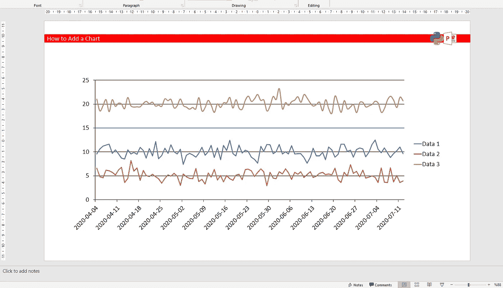

***第 3 页:***

如果您愿意，您可以添加一个 plotly 图表作为图像。让我们看看如何做到这一点。

```
slide = prs.slides.add_slide(prs.slide_layouts[6])shape = slide.shapes.add_shape(
    MSO_SHAPE.RECTANGLE, 0, Inches(0.5),Inches(16),Inches(0.3))
shape.shadow.inherit = False
fill=shape.fill
fill.solid()
fill.fore_color.rgb=RGBColor(255,0,0)
shape.text= "How to Add an Image"
line=shape.line
line.color.rgb=RGBColor(255,0,0)
logo1=slide.shapes.add_picture(pylogo,Inches(14.5),Inches(0.4),height=Inches(0.5),width=Inches(0.5))
logo2=slide.shapes.add_picture(pptlogo,Inches(15.0),Inches(0.4),height=Inches(0.5),width=Inches(0.5))**import plotly.graph_objects as go
import pandas as pd****df = pd.read_csv('**[**https://raw.githubusercontent.com/plotly/datasets/718417069ead87650b90472464c7565dc8c2cb1c/sunburst-coffee-flavors-complete.csv'**](https://raw.githubusercontent.com/plotly/datasets/718417069ead87650b90472464c7565dc8c2cb1c/sunburst-coffee-flavors-complete.csv')**)****fig = go.Figure(go.Sunburst(
        ids = df.ids,
        labels = df.labels,
        parents = df.parents))
fig.update_layout(uniformtext=dict(minsize=10, mode='hide'))****fig.write_image("img.png")****imgpth='img.png'****left = top = Inches(1)
pic = slide.shapes.add_picture(imgpth, left, top)**
```

我们使用了一个巧妙的旭日东升[例子](https://plotly.com/python/sunburst-charts/)。

`**slide.shapes.add_picture({image path},{left spacing},{top spacing})**`。

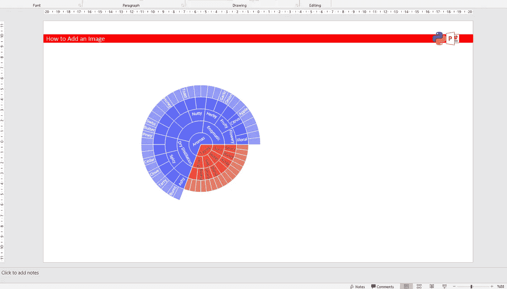

***第 4 页:***

最后，让我们添加一个文本框。

```
slide = prs.slides.add_slide(prs.slide_layouts[6])shape = slide.shapes.add_shape(
    MSO_SHAPE.RECTANGLE, 0, Inches(0.5),Inches(16),Inches(0.3))
shape.shadow.inherit = False
fill=shape.fill
fill.solid()
fill.fore_color.rgb=RGBColor(255,0,0)
shape.text= "How to Add an Image"
line=shape.line
line.color.rgb=RGBColor(255,0,0)
logo1=slide.shapes.add_picture(pylogo,Inches(14.5),Inches(0.4),height=Inches(0.5),width=Inches(0.5))
logo2=slide.shapes.add_picture(pptlogo,Inches(15.0),Inches(0.4),height=Inches(0.5),width=Inches(0.5))left = Inches(1)
top = Inches(2)
width = Inches(12)
height = Inches(5)**text_box=slide.shapes.add_textbox(left, top, width, height)****tb=text_box.text_frame
tb.text='Do you know how the Orcs first came into being? They were elves once,\n\
taken by the dark powers, tortured and mutilated. A ruined and terrible form of life.\n\
Now... perfected. My fighting Uruk-Hai. Whom do you serve?'****prg=tb.add_paragraph()
prg.text=" "****prg=tb.add_paragraph()
prg.text="They will find the Ring, and kill the one who carries it."**
```

有两种不同的文本代码块。第一个是关于文本框的。`**slide.shapes.add_textbox(left, top, width, height)**` 用`***tb.text***`可以在文本框内添加文字。如果你想添加另一个段落，那么你应该使用`***tb.add_paragraph()***`。

结果如下:

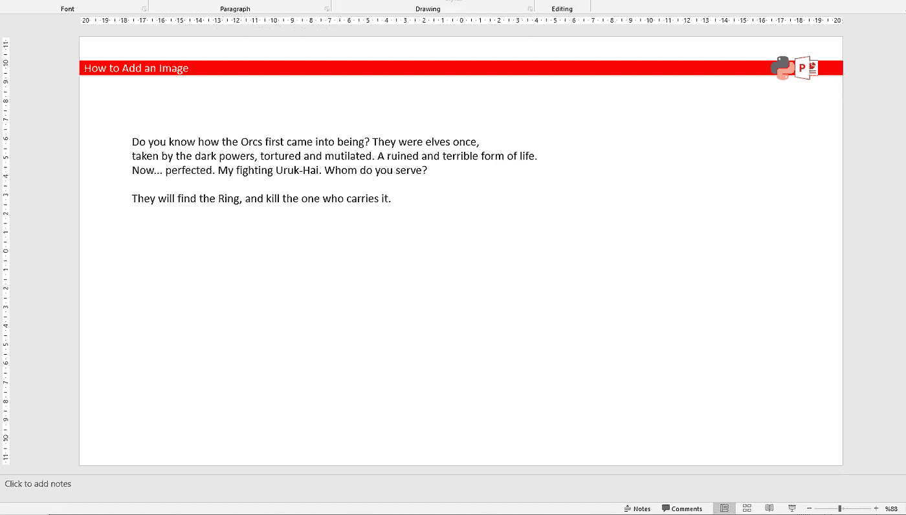

***第 5 页:***

最后，我们已经完成了基本的演示。也许你只是想加一个感谢页:)

```
slide = prs.slides.add_slide(prs.slide_layouts[6])shape = slide.shapes.add_shape(
    MSO_SHAPE.RECTANGLE, 0, Inches(4.0),Inches(16),Inches(1.0))
shape.shadow.inherit = False
fill=shape.fill
fill.solid()
fill.fore_color.rgb=RGBColor(255,0,0)
shape.text= "Thank You"
line=shape.line
line.color.rgb=RGBColor(255,0,0)
logo1=slide.shapes.add_picture(pylogo,Inches(14.5),Inches(4.0),height=Inches(1.0),width=Inches(1.0))
logo2=slide.shapes.add_picture(pptlogo,Inches(15.0),Inches(4.0),height=Inches(1.0),width=Inches(1.0))
```

不要忘记保存:)

```
**prs.save('basic_presentation.pptx')**
```

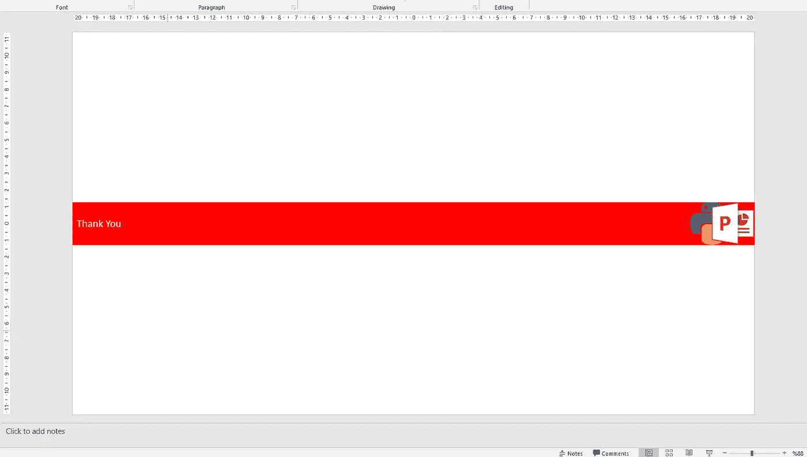

**结论**

正如我在本文开头所说，设计一个演示文稿是一个耗时的过程。就像一个妖精说的， ***“时间就是金钱，朋友！”*** 。

这是用 Python 创建 PowerPoint 演示文稿的基本示例。您可以定义函数，并在需要时运行它们。欲了解更多信息，请访问[**pptx**](https://python-pptx.readthedocs.io/en/latest/index.html)**文档页面。**

**感谢阅读！**

****代码****

****参考文献**:**

*   **[https://python-pptx.readthedocs.io/en/latest/index.html](https://python-pptx.readthedocs.io/en/latest/index.html)**