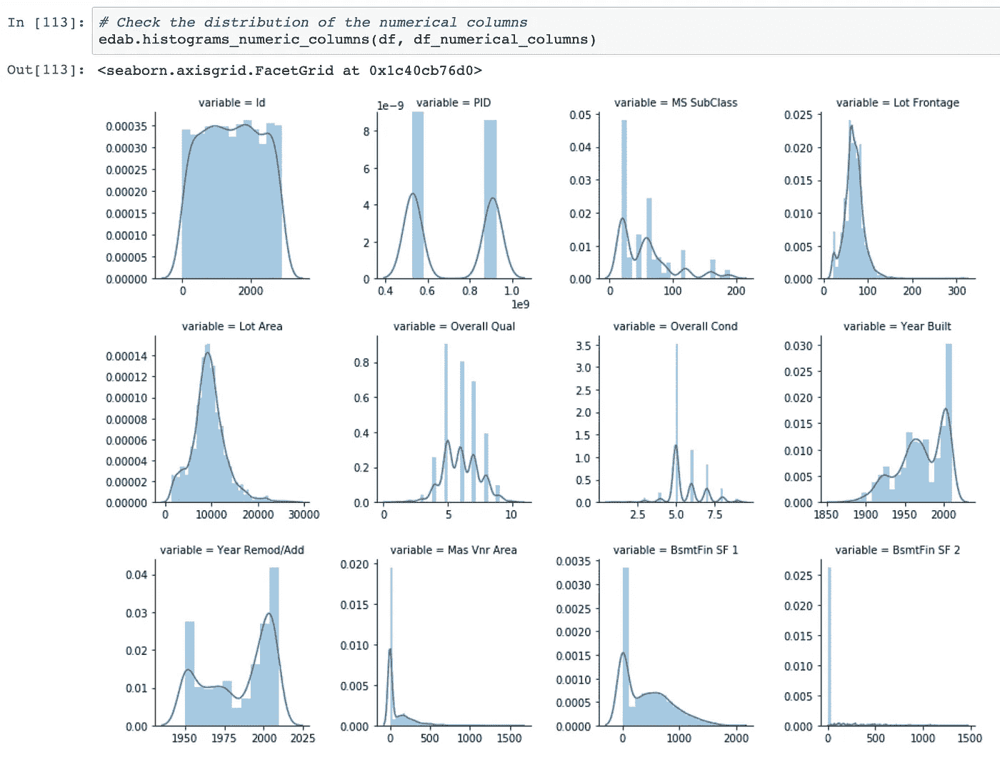
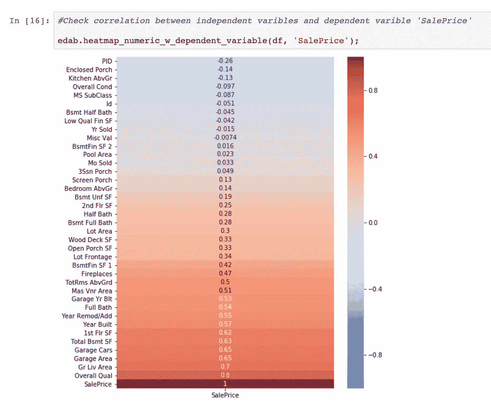

# 创建用于探索性数据分析和数据清理的 Python 函数

> 原文：<https://towardsdatascience.com/creating-python-functions-for-exploratory-data-analysis-and-data-cleaning-2c462961bd71?source=collection_archive---------5----------------------->

## 自动化数据科学家的枯燥工作

**更新**(2021–02–05):这篇博文中使用的 Python 库现在发布在 [PyPi](https://pypi.org/project/eda-and-beyond/0.0.1/) 上。这个包还包含了[新特性](https://github.com/FredaXin/eda_and_beyond/blob/master/eda_and_beyond/modeling_tools.py):它提供了一个类，这个类包含了简化 Scikit-Learn 模型建模过程的方法。这篇博客文章的第二部分即将发表，将介绍如何在 Python 中利用 OOP 来自动化建模过程。

探索性的数据分析和数据清洗是我们开始开发机器学习模型之前的两个必不可少的步骤，它们可能非常耗时，尤其是对于仍然在熟悉这整个过程的人来说。

EDA 和数据清理很少是一次性的、线性的过程:您可能会发现自己经常回到前面的章节并修改处理数据集的方式。加快这个过程的一个方法是回收一些你发现自己反复使用的代码。这就是为什么我们应该创建函数来自动化 EDA 和数据清理的重复部分。在 EDA 和数据清理中使用函数的另一个好处是消除由代码中的意外差异导致的结果不一致。

在这篇博文中，我将带您浏览几个我为 EDA 和数据清理创建的有用的 python 函数。包含所有这些函数的库可以从我的库`[eda_and_beyond](https://github.com/FredaXin/eda_and_beyond/blob/master/eda_and_beyond.py)`中克隆。特别感谢所有为这个小(但正在增长的)图书馆做出贡献的人。

# 处理缺失值的函数

EDA 中的一个重要步骤是检查缺失值，研究缺失值中是否有任何模式，并相应地决定如何处理它们。

这里的第一个函数是让您大致了解每一列中缺失数据的总数和百分比:

```
def intitial_eda_checks(df):
    '''
    Takes df
    Checks nulls
    '''
    if df.isnull().sum().sum() > 0:
        mask_total = df.isnull().sum().sort_values(ascending=False) 
        total = mask_total[mask_total > 0]

        mask_percent = df.isnull().mean().sort_values(ascending=False) 
        percent = mask_percent[mask_percent > 0] 

        missing_data = pd.concat([total, percent], axis=1, keys=['Total', 'Percent'])

        print(f'Total and Percentage of NaN:\n {missing_data}')
    else: 
        print('No NaN found.')
```

在初始检查之后，您可以决定是否要对那些缺失值过多的列进行更仔细的检查。通过指定缺失值百分比的阈值，以下函数将给出缺失值超过该阈值的列的列表:

```
def view_columns_w_many_nans(df, missing_percent):
    '''
    Checks which columns have over specified percentage of missing values
    Takes df, missing percentage
    Returns columns as a list
    '''
    mask_percent = df.isnull().mean()
    series = mask_percent[mask_percent > missing_percent]
    columns = series.index.to_list()
    print(columns) 
    return columns
```

处理缺失值的方法有很多。如果您决定删除缺少太多值的列(超过您指定的某个阈值)，您可以使用此函数来完成任务:

```
def drop_columns_w_many_nans(df, missing_percent):
    '''
    Takes df, missing percentage
    Drops the columns whose missing value is bigger than missing percentage
    Returns df
    '''
    series = view_columns_w_many_nans(df, missing_percent=missing_percent)
    list_of_cols = series.index.to_list()
    df.drop(columns=list_of_cols)
    print(list_of_cols)
    return df
```

但是，从数据集中删除缺失值有许多不利之处，例如降低了统计能力。如果你决定估算缺失值，检查一下 Sklearn 的`[SimpleImputer](https://scikit-learn.org/stable/modules/generated/sklearn.impute.SimpleImputer.html)`模块，这是一个简单易用的工具，可以根据你的喜好估算缺失值。

此外，如果你想了解更多关于如何处理缺失值的信息，可以看看这张由人口研究中心的梅丽莎·汉弗莱斯制作的幻灯片。

# 数据可视化功能

人脑非常善于识别模式，这就是为什么在 EDA 过程中可视化数据集并识别模式会非常有益。例如，直方图使得分析数据的分布变得更容易；箱线图非常适合识别异常值；在检查两个变量之间的相关性时，散点图非常有用。谈到数据可视化，Matplotlib 和 [Seaborn](https://seaborn.pydata.org/) 是你最好的朋友。但是，如果有大量要素，为每个要素创建单独的地块会变得很乏味。在这一节，我将带你通过几个函数来创建团体图，可以帮助你一箭多雕。

我们经常想看看有数值的列的分布。以下函数将为数据集中的所有数字列创建一组绘图。(这个函数改编自张秀坤·高伟凯的[博文](https://www.kaggle.com/dgawlik/house-prices-eda#Categorical-data)，是一篇用真实数据集看完整个 EDA 过程的好读物):

```
def histograms_numeric_columns(df, numerical_columns):
    '''
    Takes df, numerical columns as list
    Returns a group of histagrams
    '''
    f = pd.melt(df, value_vars=numerical_columns) 
    g = sns.FacetGrid(f, col='variable',  col_wrap=4, sharex=False, sharey=False)
    g = g.map(sns.distplot, 'value')
    return g
```

下面是输出的样子:



另一个有用的可视化工具是热图。当你想检查因变量和自变量之间的相关性时，热图非常方便。如果要素过多，热图通常会显得杂乱无章。避免这种情况的一种方法是只为因变量(目标)和自变量(特征)创建热图。以下功能将帮助您完成这项任务:

```
def heatmap_numeric_w_dependent_variable(df, dependent_variable):
    '''
    Takes df, a dependant variable as str
    Returns a heatmap of all independent variables' correlations with dependent variable 
    '''
    plt.figure(figsize=(8, 10))
    g = sns.heatmap(df.corr()[[dependent_variable]].sort_values(by=dependent_variable), 
                    annot=True, 
                    cmap='coolwarm', 
                    vmin=-1,
                    vmax=1) 
    return g
```



正如您在输出中看到的，因为值是排序的，所以相关性变得更容易阅读。

# 用于更改数据类型的函数

确保要素具有正确的数据类型是 EDA 和数据清理过程中的另一个重要步骤。Pandas 的`.read_csv()`方法解释的数据类型与原始数据文件不同，这种情况经常发生。在这一步中，阅读数据字典很有启发性。此外，如果您计划进行一些功能工程，那么就需要更改数据类型。以下两个函数协同工作，将分类特征转换为数字(序数)特征:

第一个函数是输出一个函数，即转换器，它将把列表中的每个`str`转换成一个`int`，其中`int`是列表中该元素的索引。

```
def categorical_to_ordinal_transformer(categories):
    '''
    Returns a function that will map categories to ordinal values based on the
    order of the list of `categories` given. Ex.

    If categories is ['A', 'B', 'C'] then the transformer will map 
    'A' -> 0, 'B' -> 1, 'C' -> 2.
    '''
    return lambda categorical_value: categories.index(categorical_value)
```

第二个函数有两个部分:首先，它采用以下形式的字典:

```
categorical_numerical_mapping = {
    'Utilities': ['ELO', 'NoSeWa', 'NoSewr', 'AllPub'],
    'Exter Qual': ['Po', 'Fa', 'TA', 'Gd', 'Ex'],
    'Exter Cond': ['Po', 'Fa', 'TA', 'Gd', 'Ex']
}
```

使用我们之前定义的函数，它将字典变成这样:

```
transformers = {'Utilities': <utilties_transformer>,
                'Exter Qual': <exter_qual_transformer>,
                'Exter Cond': <exter_cond_transfomer>}
```

函数的第二部分使用`.map()`方法将每个转换器函数映射到数据帧上。请注意，在此功能期间，将创建原始数据帧的副本。

```
def transform_categorical_to_numercial(df, categorical_numerical_mapping):
    '''
    Transforms categorical columns to numerical columns
    Takes a df, a dictionary 
    Returns df
    '''
    transformers = {k: categorical_to_ordinal_transformer(v) 
                    for k, v in categorical_numerical_mapping.items()}
    new_df = df.copy()
    for col, transformer in transformers.items():
        new_df[col] = new_df[col].map(transformer).astype('int64')
    return new_df
```

我的博文到此结束。我的目标是创建一个开源库，使 EDA 和数据清理过程更加简化。一如既往，我希望听到您的反馈。如果您有任何更正或希望为这个小型开源项目做出贡献，请提出请求。感谢您的阅读！

资源:看看这个很棒的(而且是免费的！)Python 编程教科书:[用 Python 自动化枯燥的东西](https://automatetheboringstuff.com/)作者:Al Sweigart。

*最初发表于*[*https://github.com*](https://github.com/FredaXin/blog_posts/blob/master/creating_functions_for_EDA.md)*。*