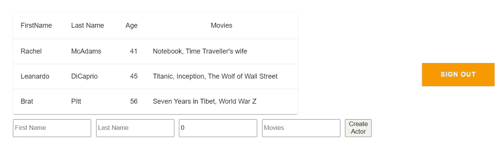

# 使用 AWS Amplify 创建 React + GraphQL 无服务器 Web 应用程序

> 原文：<https://towardsdatascience.com/creating-react-graphql-serverless-web-application-using-aws-amplify-40e56f25796b?source=collection_archive---------4----------------------->


诺德伍德主题公司在 [Unsplash](https://unsplash.com/s/photos/computer?utm_source=unsplash&utm_medium=referral&utm_content=creditCopyText) 上拍摄的照片

# AWS 放大器

AWS Amplify 是由 Amazon Web Services 提供的一项服务，它提供了使用 AWS 服务以更安全和可扩展的方式为移动和 Web 平台创建端到端解决方案的能力。AWS Amplify 最初于 2018 年 11 月推出，从那时起，许多开发人员都创建并部署了他们的新应用程序，因为 Amplify 提供了简单性和可靠性。

Amplify 提供了易于配置的功能，称为模块，名为认证，存储，后端 API，托管和部署等。你可以从[这里](https://aws.amazon.com/amplify/features/?nc=sn&loc=2)获得更多关于 Amplify 提供的模块的信息。在本文中，我们将使用 3 个模块，身份验证、后端 api 以及托管和部署。

在本文中，让我们尝试使用 GraphQL api 构建和部署 react 应用程序。下面是为了实现我们的目标，我们将在本文中执行的任务。

*   安装和配置 Amplify CLI
*   创建 react 应用程序
*   添加身份验证
*   添加 GraphQL api
*   在 Amplify 上部署和托管

我在本文中使用的完整 react 应用程序代码可以在这里找到。

## 安装和配置 Amplify CLI

在创建 react 应用程序之前，我们需要做的第一步是在系统中全局安装 Amplify CLI 工具。为此，我们需要在终端中运行以下命令。(我们需要在系统中安装 node.js 才能使用 npm)

```
npm install -g @aws-amplify/cli
```

现在，为了用我们的 AWS 帐户配置已安装的 Amplify，发出下面的命令。

```
amplify configure
```


这将提示我们需要回答的一系列问题。首先，它会要求我们使用 web 控制台登录我们的 AWS 帐户。下一个重要问题是它将为我们的 Amplify CLI 工具创建的 IAM 用户。在为用户指定一个名称之后，它将再次把我们重定向到 IAM 控制台，在这里我们需要为我们的用户提供必要的权限策略。


在这里确保为用户添加**管理员访问**策略。然后转到**安全凭证**选项卡，为该用户创建一个访问密钥，并记住下载和存储凭证细节。回到控制台，作为下一步，它将要求这个 **accessKeyId** 和 **secretAccessKey。现在，我们已经完成了对 Amplify CLI 的配置。**

## 创建 react 应用程序

现在让我们开始创建 react 应用程序。为了创建新的 react 应用程序，发出以下命令。

```
npx create-react-app amplify-react-sample
cd amplify-react-sample
npm start
```

如果在 localhost:3000 中一切顺利，它应该显示新创建的 react 应用程序。


下一步是将 **aws-amplify** 作为依赖项添加到 react 应用程序中。这个包将具有从我们的 react 代码中对 Amplify 进行所有配置的功能。

```
npm install aws-amplify @aws-amplify/ui-react
```

接下来，让我们为 react 应用程序初始化一个 Amplify 项目。

```
amplify init
```

我们将再次被提示回答一系列问题。对于项目名称，您可以随意命名。对于应用类型，选择 **javascript** ，对于框架，选择 **react** 。对于其他问题，我们可以保留默认值，因为我们不会更改应用程序内部的 react 构建和运行脚本。


我们项目中的以下修改将在此步骤中完成。

*   一个名为 **amplify** 的新文件夹将在项目的根级别创建。它存储了与我们后端相关的所有配置(AWS 资源)。(在本文中，我们将添加身份验证和 GraphQL API)。随着我们添加更多的 amplify 功能，与这些功能相关的配置将作为基础架构代码存储在该文件夹中。
*   将在`src`目录中创建一个名为`aws-exports.js`的文件，该文件包含我们将使用 Amplify 创建的服务的所有配置。目前，它只包含地区信息，因为我们还没有使用任何 Amplify 服务。


同时，在 AWS 上将创建一个云项目，我们可以通过 Amplify 控制台访问该项目。控制台还为我们的应用程序提供了一些其他的配置选项。


现在我们的 react 应用程序已经用 Amplify 初始化了，让我们进入下一个任务，添加身份验证。

## 添加身份验证

对于认证，Amplify 使用 **AWS Cognito** 作为主要的认证提供者。AWS Cognito 提供了许多功能，如身份验证、用户注册、帐户恢复等等。你可以从[点击](https://aws.amazon.com/cognito/details/)查看更多可用功能或认知。要在我们的应用程序上添加 Cognito 身份验证，请在终端中发出以下命令。

```
amplify add auth
```


我们将再次被提示有关身份验证配置的问题。对于本文，我们将选择**默认配置**进行安全配置。(如果需要，我们可以稍后通过运行 amplify update auth 来更新它)。对于登录选项，您可以选择**用户名**或**电子邮件**。

就这样，现在我们已经为自己创建了身份验证模块。但在我们的应用中测试之前，我们需要将这种配置放大。为此，只需在终端中发出以下命令。

```
amplify push
```


该命令将在 AWS 上的 Amplify 和 Cognito 上创建所需的配置，还将使用 Cognito auth 配置编辑我们的`aws-exports.js`文件。

下一步是在我们的 react 应用程序中使用这种认知身份验证。首先，我们需要为我们应用程序导入放大器模块。编辑`index.js`文件以导入放大器，并使用`aws-exports.js`文件中的配置配置放大器模块。

```
import Amplify from 'aws-amplify';
import awsconfig from './aws-exports'; 
Amplify.configure(awsconfig);
```

现在我们可以在应用程序中使用 auth 模块了。转到`app.js`，首先导入以下模块。

```
import { withAuthenticator, AmplifySignOut } from "@aws-amplify/ui-react";
```

接下来，用带身份验证器的**包装我们的**应用**组件。这里 **AmplifySignOut** 是 amplify-react 提供的一个组件，它充当一个 SignOut 按钮。关于 Amplify 提供的更多预建 UI 组件，你可以在这里查看。**

现在我们已经在 react 应用程序中添加了 Amplify 身份验证，让我们启动服务器并测试它是否工作。运行`npm start`，进入浏览器。


现在，当我们尝试访问 localhost:3000 时，它应该会显示一个登录页面。如果你能看到上面的页面，这意味着我们的身份验证设置正确。下一步是在我们的 Cognito 用户池中创建一个用户。您可以通过 IAM 控制台或点击**创建账户**来创建用户。用户也可以通过 Cognito 控制台进行管理。


现在尝试使用我们创建的用户登录，现在应该可以转到我们的主页了。如果一切正常，让我们进入下一个任务。

## 添加 GraphQL API

Amplify 支持使用 **AWS AppSync** 创建无服务器后端 API。AppSync 支持 REST 和 GraphQL API 框架。对于本文，我们将使用 AppSync GraphQL api。要了解什么是 GraphQL 以及如何使用 AWS AppSync 创建无服务器的 GraphQL，您可以查看我写的这篇文章。

在添加后端 GraphQL api 之前，让我们对 react 应用程序做一些修改，以便在表格中显示数据。在本文中，让我们假设我们的应用程序将显示与演员相关的数据。

在上面的代码中，我使用 material-ui 来创建表格，您可以使用`npm install @material-ui/core`来安装它。代码只显示了一个表，在这个表中，我们已经在 **getActors()** 方法中定义了一组数据。(确保也在 App.js 中导入 Home 组件)


现在，让我们尝试创建自己的 GraphQL API 来从 API 中检索参与者信息，而不是在代码中获取硬编码的值。要将 GraphQL api 添加到我们的应用程序中，只需在终端中发出以下命令。

```
amplify add api
```


对于问题，您将被要求提供选择服务作为 GraphQL 和授权选择**亚马逊认知用户池**。接下来，为模式模板选择带有字段的**单个对象。这将为我们自动创建一个简单的 GraphQL 模式。接下来，当您要求编辑模式时，按下 **Y** 。**

这将打开我们自动创建的 schema.graphql。在这里，我们可以看到已经创建了带有模型 Todo 的模式。

```
type Todo [@model](http://twitter.com/model) {
  id: ID!
  name: String!
  description: String
}
```

让我们为我们的用例编辑这个模式，我们的模型将是 **Actors。**

在这里，如果需要，我们还可以指定模式中允许的**查询**和**变异**。在 GraphQL 中，Query 类似于 GET 调用，我们不对数据做任何修改，而 Mutation 类似于 PUT、POST、DELETE 调用，我们对数据做修改。但是如果我们想要的话，这也可以在 AppSync 中自动生成。

下一步是推动这个 GraphQL api 来扩展它在 AppSync 上的创建位置。发出下面的命令来推送 API。

```
amplify push
```

这里再次向我们询问一组配置。选择语言目标为 **javascript，并**将文件模式设为默认**。稍后，它将要求为我们的模式生成所有 GraphQL 操作。确保为此输入 **Yes** ，因为这将为我们的演员模型自动生成查询和变异。**

****

**这将在 AppSync 上创建我们的 GraphQL API。我们的数据库也将在 **AWS DynamoDB** 上自动创建。此外，它在 amplify 文件夹中创建一个名为`backend`的新文件夹。我们的 Actor 模式和其他 AppSync 相关配置可以在这个后端文件夹中找到。**

****

**在配置的最后，我们将获得使用 actors 模式配置的 GraphQL 端点。现在，如果我们转到 AppSync 控制台，我们可以看到新创建的 Actors api。**

****

**现在您可以看到我们的模式已经用查询和变异更新了，因为 AppSync 为我们生成了这些。这里，让我们试着创建一些数据，这样我们就可以从 API 进行查询。转到查询选项卡。在那里，从下拉菜单中选择突变并点击 **+** 按钮。**

****

**突变是我们更新数据库的方式。因为我们需要创建演员，所以单击 **createActor** 并填写演员的详细信息。现在，让我们添加两个演员。**

********

**现在让我们测试我们的 GraphQL。为此，我们需要使用一个查询。点击 **+** 按钮，删除突变并添加查询**

****

**让我们使用 **listActors** 进行查询，只返回 id、firstName、lastName、age 和 movies 字段。**

****

**如果我们的查询返回了正确的结果，这意味着我们的 GraphQL api 现在已经正确配置了。现在让我们开始将 GraphQL API 添加到 react 应用程序中。**

**首先，我们需要在我们的 Home 组件中导入 **Amplify** 、 **API** 、 **graphqlOperation** 模块。**

```
import Amplify, { API, graphqlOperation } from 'aws-amplify'
```

**接下来，我们需要导入将要在应用程序中执行的查询和变异。在我们的例子中，查询是 **listActors** ，变异是 **createActor** 。我们可以从 AppSync 控制台或后端/api 文件夹中的`aws-schema.graphql`文件中获得这些查询或变异**

```
import { createActor} from './graphql/mutations' 
import { listActors} from './graphql/queries'
```

**此外，确保使用正确的配置来配置导入的放大器。**

```
import awsExports from "./aws-exports"; Amplify.configure(awsExports);
```

**下面是我们将用于获取演员的函数。**

**现在，我们需要做的最后一件事是从 UseEffect 调用这个 **fetchActors()** 函数。移除之前调用的 **getActors()** 方法，替换为 **fetchActors()** 。**

**现在，如果一切正常，它应该只显示 2 个演员，现在来自我们的 GraphQL api。**

****

**接下来，让我们尝试使用 react 应用程序添加参与者。为此，我们将使用已经导入的 **addActor** 突变。**

**除了创建 addActor()函数，我们还需要输入字段。下面是 Home 组件的完整代码。**

**现在让我们试着添加一个 actor，在它出现在桌面上之后。**

****

**现在已经完成了，让我们进入最后一项任务，部署和托管**

## **部署和托管**

**现在，对于最后一部分，让我们通过发出以下命令为我们的应用程序添加托管模块。**

```
amplify add hosting
```

**我们将再次被提示几个问题。对于插件选择带放大控制的**主机，对于类型选择**手动部署**。****

****

**现在唯一剩下的事情就是发布这个模块来放大。对于以下问题命令。**

```
amplify publish
```

**这将生成一个 **cloudFormation** 堆栈，并将在 AWS 上创建必要的基础设施。**

****

**过一会儿，所有的基础设施将被创建，我们将有部署的 URL。你可以继续下去，检查网址，以确保每件事的工作，因为它应该是。**

****

**此外，除了手动部署，我们还可以从 Amplify 选择连续部署。**

**好了，这是如何使用无服务器 GraphQL api 和使用 Cognito 认证部署 react 应用程序的简单指南。如果你想了解更多关于 AWS Amplify 和它的更多特性，请遵循官方文档。谢谢:)**

 **[## 放大框架文档

### 编辑描述

docs.amplify.aws](https://docs.amplify.aws/start)**