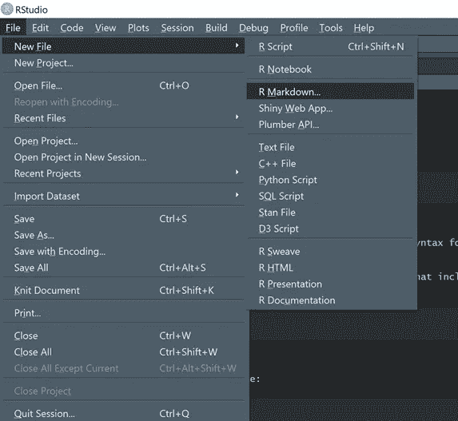
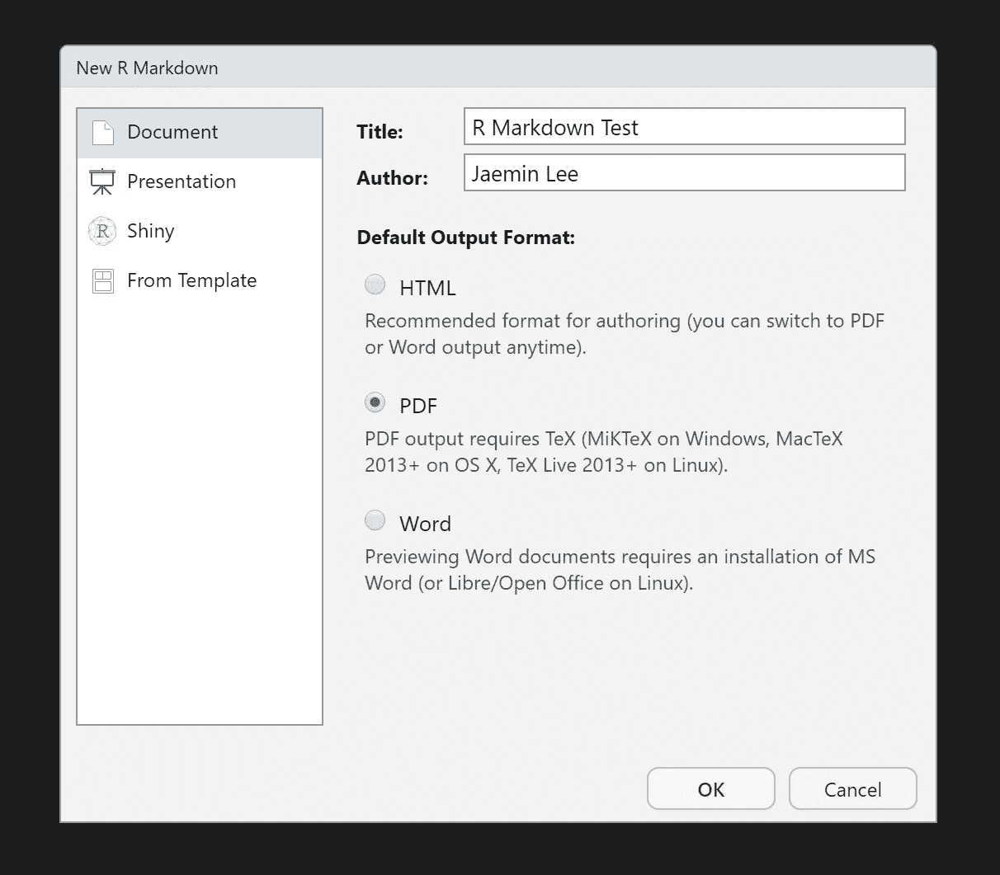
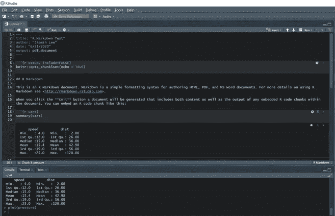
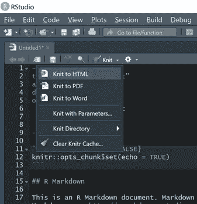
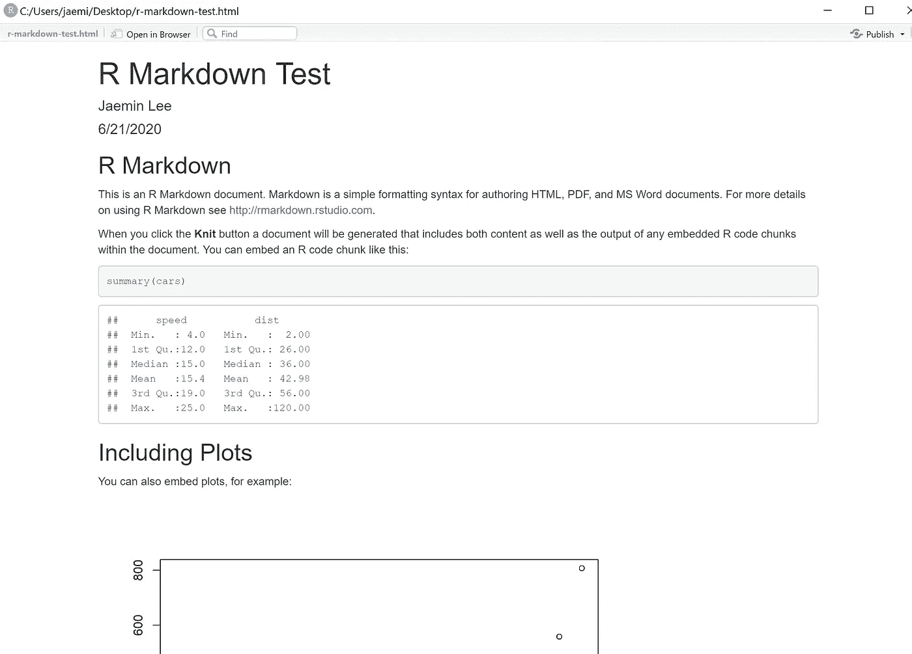
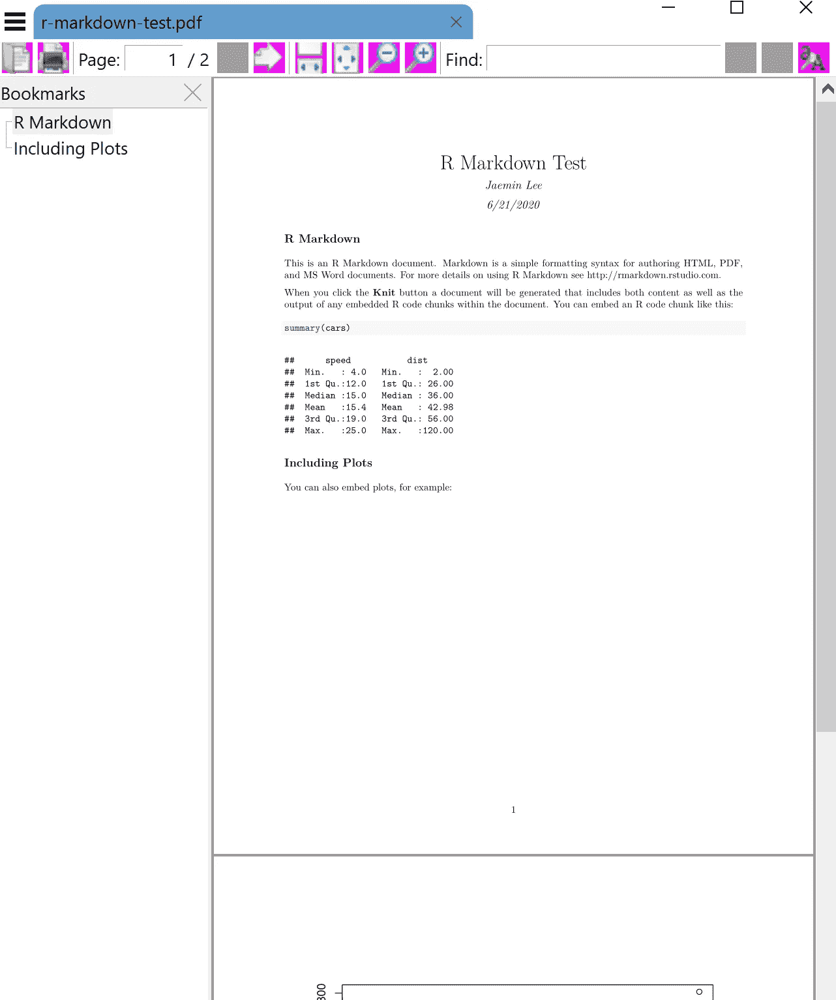
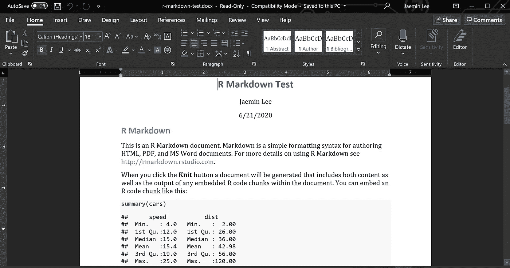

# 使用 R Markdown 创建报告

> 原文：<https://towardsdatascience.com/creating-reports-with-r-markdown-c6031ecdd65c?source=collection_archive---------17----------------------->

## 使用 R Studio 和 R Markdown 编写报告的说明


图片由 [Mediamodifier](https://pixabay.com/users/Mediamodifier-1567646/?utm_source=link-attribution&utm_medium=referral&utm_campaign=image&utm_content=3033204) 来自 [Pixabay](https://pixabay.com/?utm_source=link-attribution&utm_medium=referral&utm_campaign=image&utm_content=3033204)

视频版本

# 介绍

使用 Jupyter notebook 或 Google Colab 很容易将 python 脚本转换成报告。你知道你也可以对 R 脚本做同样的事情吗？

在本教程中，我将演示如何将您的 R 脚本转换为报表。

# 先决条件

我们需要安装两个软件。

1.  [R](https://cran.r-project.org/bin/windows/base/)
2.  [R Studio —免费版](https://rstudio.com/products/rstudio/download/)

# **下载编织机包**

请务必下载可以将 R Markdown 文件转换成报告的软件包。

您可以在控制台中运行命令(如下所示)来下载该包。

```
install.packages("knitr")
```

# 在 R Studio 中使用 R Markdown 进行编码

在“文件”标签下，点击“新建文件”和“R Markdown”。



命名文件并选择默认输出格式。您随时可以在以后更改输出格式。



一旦你点击了“Ok”，你现在就可以在 R Markdown 上编码和写报告了。

# 了解如何使用 R Markdown

**突出显示的部分(或单元格)**是您可以编写**代码**的地方。

```
```{r cars}
YOU CAN WRITE YOUR CODE HERE
```
```

并且**非突出显示的**部分是你可以写你的**报告**的地方。



R 降价示例

您可以通过单击单元格右上角的绿色运行按钮来运行整个单元格中的代码。

或者，您可以按 Ctrl + Enter 键只运行选定的代码。

# 针织 R 减价检索报告

为了编织 R Markdown 文件，您可能需要安装几个软件包。R studio 会自动检测到您缺少必要的包，并要求您下载它们。

有三种方法可以输出您的报告。

1.  超文本标记语言
2.  便携文档格式
3.  MS Word



输出选项

**HTML 输出**



HTML 输出

**PDF 输出**



PDF 输出

**MS 字输出**



MS Word 输出

我希望这篇文章对你有用。感谢您的阅读！