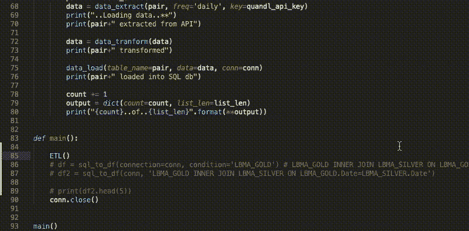
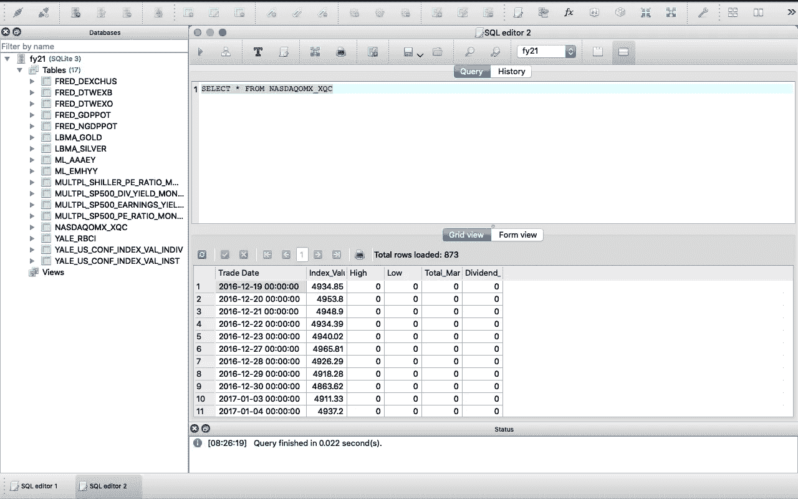
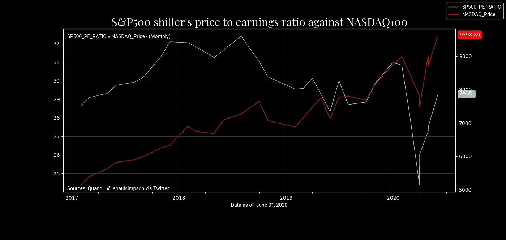
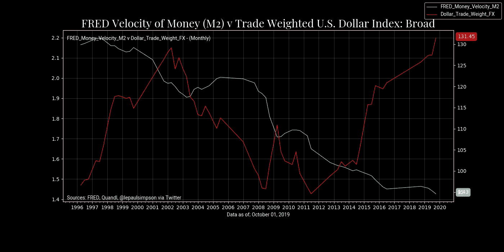
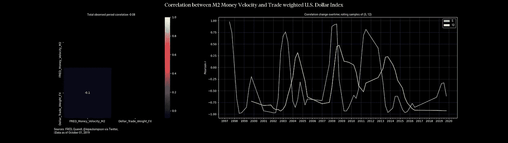

# 金融和经济数据的数据管道

> 原文：<https://towardsdatascience.com/creating-smart-etl-data-pipelines-in-python-for-financial-and-economic-data-ad852e8daca7?source=collection_archive---------31----------------------->

## 从 Quandl API 中提取数据，转换并加载到 SQLite DB 中。用 python 动态编程，用 Matplotlib 和 Seaborn 动态加载图表。



构建 ETL 的输出日志

***前置要求*** : Python 3、SQLite、SQLiteStudio(可选)、Quandl 账号

***所需 Python 模块*** : Quandl、pandas、sqlite3、matplotlib、seaborn、numpy

这是一个相当直接的解决方案，只是说明了如何使用 python 和各种可用的模块来实现简单的 ETL。我已经包含了一些代码片段，来说明我是如何把它们拼凑在一起的。

这当然可以通过云平台来实现。然而，对于这个项目，我选择在本地保存和管理我的数据。这也是为云计算资源付费的一种替代方式。即使您可以设法获得免费的计算和存储，也肯定是在有限的时间或有限的能力范围内。在本地运行这将有助于我保持项目的活力。

我将从圣路易斯联邦储备银行的美联储经济数据中寻找一系列数据进行经济研究。包括来自耶鲁大学经济系的数据。所有这些都源自 Quandl 的 API。

我的方法项目的结构如下:通过创建用户定义的函数来处理每个阶段；提取，转换，加载，数据库查询和图表。

第一步是[下载](https://www.sqlite.org/index.html)并在本地机器上安装 SQLite。下一步是创建一个数据库。或者，您可以从命令行使用 SQLite 命令或通过 [SQLiteStudio](https://sqlitestudio.pl/) 创建一个数据库。这将作为数据库管理。



SQLStudioLite

## 构建基块—项目导入

```
import pandas as pd
import sqlite, quandl
import seaborn as sns
import matplotlib.pyplot as plt
import matplotlib.dates
from datetime import date, datetime, timezone
import matplotlib.ticker as ticker
import matplotlib.patches as patches
from matplotlib import gridspec
import matplotlib.font_manager as fm
import matplotlib.gridspec as gridspec
import matplotlib.patches as mpatches
```

## 提取

创建连接到 API 的函数需要两个部分。首先，需要一个 Quandl 帐户。创建一个帐户后，就像收集一个 API 令牌一样简单，可以用它来访问数据。

```
def data_extract(pair: str, freq: str, key: str):
 quandl.ApiConfig.api_key = key
 return quandl.get(pair, collapse=freq)
```

## 改变

转换函数相当简单，因为在这个例子中，数据不需要提炼或清理。从 Quandl 的 API 返回的对象被转换成熊猫数据帧。出于健康原因，在将数据加载到 SQLite 数据库之前，列标题空格被替换为下划线。

```
def data_tranform(data) -> pd.DataFrame:
 df = pd.DataFrame(data)
 df.rename(columns=lambda x: x.replace(" ", "_"), inplace=True) 
 return df
```

## 负荷

这个阶段非常简单，模块 pandas 提供了到 SQL 数据库的基本连接。commit()函数将提交对数据库的更改。

```
def data_load(table_name: str, data: pd.DataFrame, conn):
 data.to_sql(name=table_name.replace("/", "_"), con=conn, if_exists='replace') # update, append new values only, not full overwrite
 conn.commit()
```

## 将 ETL 部分放在一个函数中

这个函数背后的想法是允许迭代不同表的列表，以提取、转换和加载到数据库中。

```
def ETL(table_collection: list):
 global count
 list_len=len(table_collection)
 for pair in table_collection:
  data = data_extract(pair, freq='daily', key=quandl_api_key)
  print("..Loading data..**")
  print(pair+" extracted from API")data = data_tranform(data)
  print(pair+" transformed")data_load(table_name=pair, data=data, conn=conn)
  print(pair+" loaded into SQL db")count += 1
  output = dict(count=count, list_len=list_len)
  print("{count}..of..{list_len}".format(**output))
```

## 主要功能

使用 main 函数执行 ETL，然后从 Quandl 中选择仪器进行分析。在主函数中，我通常只包含我想要执行的行为方面，例如，加载/刷新数据库中的数据集。或者在下一节中选择从我的数据库中提取数据到一个数据框架中，并通过一个函数绘制出来。

```
df = sql_to_df(conn, 'select MULTPL_SHILLER_PE_RATIO_MONTH.Date, MULTPL_SHILLER_PE_RATIO_MONTH.Value as SP500_PE_RATIO, NASDAQOMX_XQC.Index_Value as NASDAQ_Price from MULTPL_SHILLER_PE_RATIO_MONTH INNER JOIN NASDAQOMX_XQC ON MULTPL_SHILLER_PE_RATIO_MONTH.Date=NASDAQOMX_XQC."Trade Date"')
```

为了说明我迄今为止的解决方案，您必须知道或在 Quandl 的数据库中搜索指标的名称。此外，熟悉数据代表的内容和实际数据本身也将是一个优势。

## 制图

这是这个过程中更细致的部分，这里花了更多的时间来整合视觉效果。我已经创建了接受多个时间序列数据的函数。不管怎样，这是一个临时的解决办法；制作 Matplotlib 时间序列图，以及 Seaborn 进行相关分析。它被设计得看起来简单而专业，而且不太科学。下图显示了加载到数据库中的几个数据集的最终输出。



图 2—S&P500 市盈率和 Nasdaq100 的自定义时间序列图

上面的图 2 是对数据库的查询结果，该查询返回了一个新的数据帧，该数据帧可以传递给图表功能。用 NASDAQ100 得出 S&P500 的市盈率的时间序列图



图 3-M2V v 贸易加权美元

图 3 只是另一个将数据拉入数据库，然后用与上述相同的函数再次绘制的例子。

货币流通速度 M2 *-货币流通速度是在给定的时间内，一个货币单位被用来购买国内生产的商品和服务的频率。换句话说，就是单位时间内，一美元被用来购买商品和服务的次数。**【1】*

贸易加权美元指数代表许多对美元的外汇对，以表明美元的强势。

**注**:标注与轴标签重叠，需要修改。



图 M2V 和贸易加权美元之间的相关性

图 4 加载了与图 3 中相同的数据摘录。这里的想法是突出特征之间的任何相关性。应用 2 个不同样本大小的滚动相关性，右边的图显示了相关性随时间的变化。左边是 seaborn 图，显示了总的观察周期相关性。

## 然后

该项目的未来迭代计划。

*   我想过集成 python [Dash 库](https://plotly.com/dash/)的可能性。为这些图表创建基于 web 的仪表板。
*   我的目标是寻找更有用的抽象数据源，这些数据源可能与具体的金融资产直接或间接相关。我会在字里行间寻找来创建我自己的数据集。
*   将预测模型作为函数加载。(可能是 ARIMA 或 fbProphet)
*   项目自动化和内务管理正在进行中。

如果有任何问题或建议，请随时联系我。

*【1】。圣路易斯美联储银行，M2 货币存量速度[M2V]，检索自圣路易斯美联储银行弗雷德；*[](https://fred.stlouisfed.org/series/M2V,)**2020 年 6 月 30 日。**