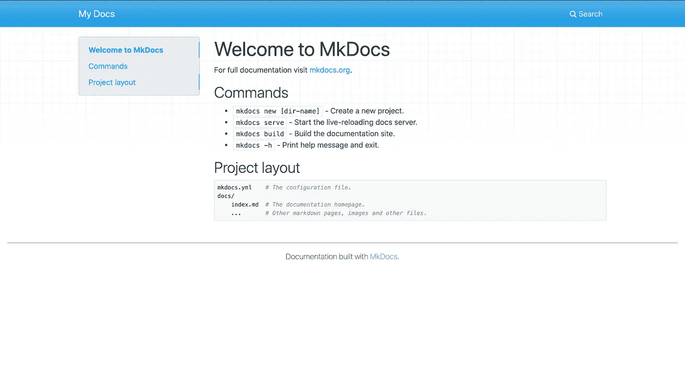
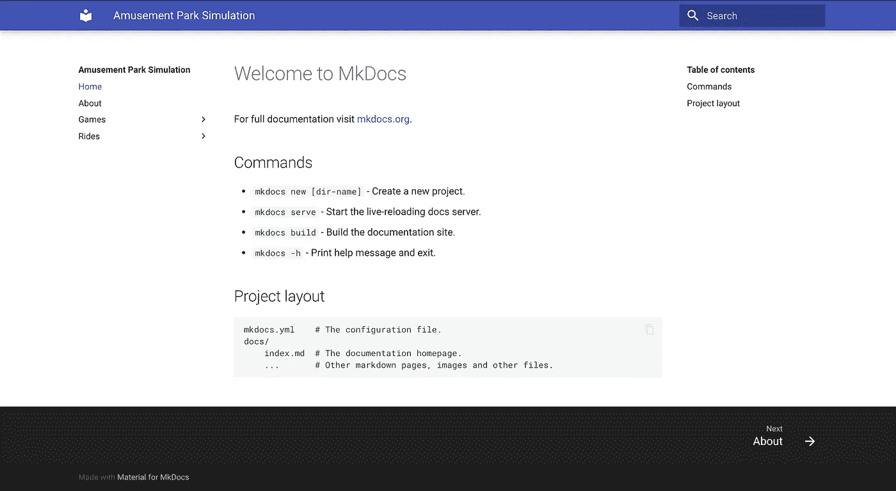

# 使用 mkDocs 在 10 分钟内创建软件文档

> 原文：<https://towardsdatascience.com/creating-software-documentation-in-under-10-minutes-with-mkdocs-b11f52f0fb10?source=collection_archive---------46----------------------->

## 为什么以及如何为您的项目快速创建专业文档

当你从事任何项目时，文档都是非常有用的，甚至是至关重要的。幸运的是，mkDocs 创建了一个很好的、高效的方法来创建看起来既专业又易于使用的文档。

# 首先，什么是文档，为什么它很重要？

软件文档是关于你的代码和项目的书写，解释它是关于什么和它是如何工作的。这对开源项目、团队项目，甚至个人项目都很重要。

通过记录您的代码，您可以:

1.  让你的代码对你合作的其他人来说是可解释的(当你回头看你的代码时，对你自己来说也是)。
2.  跟踪软件的所有方面。
3.  使以后的调试更容易。
4.  可以有一个通用的空间来保存你的文件。

用 mkDocs 创建文档的框架最多只需要 10 分钟。现在花 10 分钟编写文档，值得花无数分钟努力调试代码，并在以后向同事和自己解释代码。

# mkDocs 设置

要使用 mkDocs，您需要 pip。你可以在这里找到如何安装 pip [的说明。如果您有 pip，请确保更新它，然后安装 mkDocs。当你安装 mkDocs 的时候，你也应该选择一个主题(查看选项](https://pip.pypa.io/en/stable/installing/)[这里](https://github.com/mkdocs/mkdocs/wiki/MkDocs-Themes))。在这个例子中，我们选择了材质主题。

```
pip install --upgrade pip
pip install mkdocs
pip install mkdocs-material
```

现在您已经准备好创建您的文档了。运行下面的命令，但是将 PROJECT_NAME 替换为您的项目名称。

```
mkdocs new PROJECT_NAME
cd PROJECT_NAME
```

您应该会看到一个名为`mkdocs.yaml`的文件和一个名为`docs`的文件夹。该文件夹将有一个单一的降价文件，`index.md`。

要运行文档，使用`mkdocs serve`，然后在浏览器中转至`[http://127.0.0.1:8000/](http://127.0.0.1:8000/)`。



运行 mkdocs serve 后，在 https://127.0.0.1:8000/会看到类似这样的东西。

打开`mkdocs.yaml`，您应该会看到以下内容:

```
site_name: My Docs
```

我们将编辑这个文档。首先，我们将创建一个通用的大纲；随意填写占位符变量。主题是我们过去安装的 pip。

```
site_name: NAME
nav:
  - Home: index.md
  - Page2: page2.md
  - Section1:
    - Subpage1: subpage1.md
    - Subpage2: subpage2.md
theme:
  name: THEME_DOWNLOADED
```

例如，假设我想为一个游乐园模拟创建文档。这是我将在`mkdocs.yaml`中写的内容:

```
site_name: Amusement Park Simulation
nav:
  - Home: index.md
  - About: about.md
  - Games:
    - "Ping Pong": games/ping.md
    - Balloon: games/balloon.md
  - Rides:
    - "Scary Coaster": rides/scary.md
    - "Drop of Doom": rides/drop.md
theme:
  name: material
```

注意，`mkdocs.yaml`中提到的所有文件夹和目录都在`docs`目录中。这是我的结构看起来的样子:

```
PROJECT_NAME/
    docs/
        index.md
        about.md
        games/
             ping.md
             balloon.md
        rides/
             scary.md
             drop.md
    mkdocs.yaml
    **Add the rest of your code here**
```

如果你不想要几个文档，也可以用 markdown 头语法创建类别。如果你不熟悉。md 文件，你可以在这里了解更多的语法[。](https://www.markdownguide.org/basic-syntax/)



只有大纲的最终版本。我的下一步是用内容填充我的减价文件！

# 最后，部署。

最后，我们将在 GitHub 页面上托管我们的文档。只需运行`mkdocs gh-deploy`。它应该在您的存储库中创建一个新的分支，在`USERNAME.github.io/REPOSITORY_NAME`托管您的站点。

就是这样！您已经成功地为项目创建了文档。如果您想了解如何进一步定制您的文档或其他 mkDocs 选项，请访问他们的网站[此处](https://www.mkdocs.org/)。点击这里查看我的 GitHub 资源库中的教程[，点击这里](https://github.com/GenericP3rson/mkDocs)查看已部署的网站[。](https://genericp3rson.github.io/mkDocs/)

# 调试需要注意的事项

*   确保您选择使用制表符或空格。mkDocs 不允许两者的组合。
*   如果名称中有空格，请添加引号。
*   如果你得到一个 404 错误，这意味着你可能丢失了一个文件。检查`docs`以确保你的文件存在。
*   请注意，组织不支持 GitHub 页面。