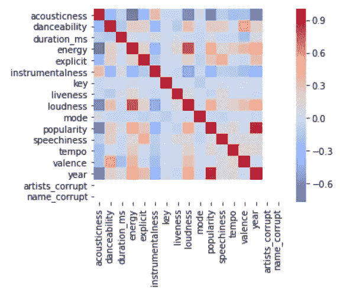

# 使用无监督学习创建 Spotify 播放列表

> 原文：<https://towardsdatascience.com/creating-spotify-playlists-with-unsupervised-learning-9391835fbc7f?source=collection_archive---------36----------------------->

## 聚类在创建推荐中的实际应用


由[马尔特·温根](https://unsplash.com/@maltewingen?utm_source=medium&utm_medium=referral)在 [Unsplash](https://unsplash.com?utm_source=medium&utm_medium=referral) 上拍摄的照片

Spotify 提供的播放列表并不短缺。现在在我的主页上，我看到的播放列表有:Rap Caviar，Hot Country，Pump Pop，以及其他各种音乐类型。

虽然许多用户喜欢浏览歌曲，并根据自己的口味创建自己的播放列表，但我想做一些不同的事情。我使用了一种无监督学习技术来寻找密切相关的音乐，并创建自己的播放列表。

该算法不需要对每首歌曲进行分类，也不需要每个播放列表都完美无缺。相反，它只需要产生我可以审查和创造性命名的建议，节省了我研究不同流派歌曲的时间。

# 数据集

Spotify 的 Web API 允许开发者访问他们庞大的音乐库。因此，从 1921 年到 2020 年的近 170，000 首歌曲的数据被收集并在 [Kaggle](https://www.kaggle.com/yamaerenay/spotify-dataset-19212020-160k-tracks) 上发布。这些数据涵盖了几乎所有的音乐类型，包括晦涩和流行的歌曲。

数据集中的每首歌曲都被几个关键的音乐指标所分解。 [Spotify](https://developer.spotify.com/documentation/web-api/reference/tracks/get-audio-features/) 自己定义了每一项措施，但简单来说:

*   声学:一首歌的声学程度。带有柔和钢琴和小提琴的歌曲得分较高，而带有扭曲吉他和尖叫的歌曲得分较低。
*   可舞性:一首歌对舞池的适合程度，基于速度、节奏稳定性、节拍强度和整体规律性。有感染力的流行歌曲得分较高，而呆板的古典音乐得分较低。
*   能量:一首歌给人的感觉有多强烈和活跃。硬摇滚和朋克得分较高，而钢琴民谣得分较低。
*   工具性:一首曲目的工具性如何。纯器乐歌曲得分较高，而口语和说唱歌曲得分较低。
*   活跃度:这首歌在观众面前录制的可能性有多大。
*   响度:音轨的音量。
*   声音:一首歌的声音有多大。没有音乐和只有口语的歌曲得分较高，而器乐歌曲得分较低。
*   效价:一首歌听起来有多积极或快乐。欢快的歌曲得分较高，而悲伤或愤怒的歌曲得分较低。
*   节奏:一首歌曲的速度，单位为每分钟节拍数(bpm)。

# 清理数据

虽然深入分析很有吸引力，但是需要进行一些数据清理。所有工作都将在 python 中完成。

```
import pandas as pd
import numpy as np# read the data
df = pd.read_csv("Spotify_Data.csv")
```

在做任何事情之前，熊猫和 NumPy 库被导入。最后一行只是将之前保存的 CSV 文件转换为 DataFrame。

```
from re import search# Writes function to tell if string is degraded beyond recognition
def is_data_corrupt(string):

    # Search for a name with letters and numbers. If no numbers or letters are found, returns None object
    found = search("[0-9A-Za-z]", string)

    # Return 1 if corrupt, 0 if not
    return 1 if found == None else 0
```

在数据收集过程中的某个时刻，大量文本被破坏。因此，一些艺术家和歌曲名称被列为不可理解的文本字符串，例如“‘a’和‘e’”。尽管我很想知道‘a’的最热门歌曲，但我无法搜索和编译这些值。

为了过滤损坏，编写了一个名为 is_data_corrupt()的函数，它使用正则表达式来检查字符串是否包含数字、大写字母或小写字母。它会将任何只包含标点符号或特殊字符的字符串标记为损坏，这应该可以找到有问题的条目，同时保留合法的歌曲和艺术家姓名。

```
# Create a helper column for artist corruption
df["artists_corrupt"] = df["artists"].apply(lambda x: is_data_corrupt(x))# Create helper column for name corruption
df["name_corrupt"] = df["name"].apply(lambda x: is_data_corrupt(x))# Filter out corrupt artists names
df = df[df["artists_corrupt"] == 0]# Filter out corrupt song names
df = df[df["name_corrupt"] == 0]
```

在将函数 is_data_corrupt()应用于 artists 和 name 列以创建两个新的辅助列之后，任何标记为损坏的文本字符串都会被过滤掉。

值得注意的是，这只标记了被降级到无法识别的文本。一些文本仍然包含部分降级。比如著名作曲家弗雷德里克·肖邦就被改成了“弗雷德里克·肖邦”。更广泛的数据清理纠正了这些条目，但是这些方法超出了本文的范围。

```
# Gets rid of rows with unspecified artists
df = df[df["artists"] != "['Unspecified']"]
```

很大一部分艺术家没有被列出，而是被赋予占位符值“未指定”。由于未列出的艺术家给查找歌曲带来了不必要的困难(毕竟歌曲名称不是唯一的)，这些也将被过滤掉。

```
# Filter out speeches, comedy routines, poems, etc.
df = df[df["speechiness"] < 0.66]
```

最后，纯声乐曲目，如演讲，喜剧特辑，诗歌朗诵，提出了一个问题。因为分类是基于声音特征的，所以它们会聚集在一起。

不幸的是，由罗斯福总统的炉边谈话和有线电视员拉里的例行公事组成的播放列表是一种非常糟糕但有趣的收听体验。声道必须根据内容进行分类，这超出了本数据的范围。

因此，我简单地过滤了所有“speechiness”值超过 0.66 的音轨。虽然我可能过滤了一些歌曲，但移除这些曲目的回报是值得的。

# 数据探索

即使在运行无监督模型之前，在数据中寻找有趣的模式也能为如何继续提供见解。所有的可视化都是用 seaborn 完成的。

```
sns.heatmap(df.corr(), cmap = "coolwarm")
```



数据中所有相关系数的热图。图由作者制作。

上面的热图显示了不同的数字数据之间的紧密联系。深红色显示强烈的积极关系，深蓝色显示强烈的消极关系。一些有趣的相关性值得一提。

不出所料，流行度和年份之间存在着密切的关系，这意味着越近的音乐越受欢迎。在喜欢流媒体的年轻观众和积极推广新音乐的 Spotify 之间，这种洞察力证实了领域知识。

另一个不足为奇的趋势是，响度与能量相关。直觉上，高能歌曲辐射强度，往往伴随响度而来。

声学有一些有趣的负面关系。它与能量和响度的反比关系抓住了大多数人对民谣的印象。然而，原声歌曲往往不太受欢迎，其数量也随着时间的推移而减少。

虽然令人惊讶的是钢琴和原声吉他曲目顽固地保留在公众意识中，但这一见解更多地说明了失真吉他和合成器在音乐制作中的受欢迎程度。在它们出现之前，每首歌都被认为是原声的，它们的市场份额被现代音乐夺走了。

# 光学聚类

为了创建播放列表，我使用了 Scikit-Learn 的 OPTICS clustering 实现，它本质上是通过数据找到高密度的区域，并将它们分配到一个簇中。低密度区域的观察是不分配的，所以不是每首歌曲都会出现在播放列表中。

```
df_features = df.filter([
    "accousticness",
    "danceability",
    "energy",
    "instramentalness",
    "loudness",
    "mode",
    "tempo",
    "popularity",
    "valence"
])
```

在运行算法之前，我提取了想要分析的列。大多数功能都是纯粹基于音乐的，除了流行，流行是为了帮助像艺术家一样的群体在一起。

请注意，光学聚类使用基于欧几里得距离来确定密度，没有添加太多列，因为高维数据会扭曲基于距离的度量。

```
from sklearn.preprocessing import StandardScaler# initialize scaler
scaler = StandardScaler()# Scaled features
scaler.fit(df_features)
df_scaled_features = scaler.transform(df_features)
```

接下来，数据被转换为标准比例。虽然其余的功能已经在 0 和 1 之间标准化，但速度和响度使用不同的标度，这在计算距离时会扭曲结果。使用标准定标器，一切都达到相同的比例。

```
# Initialize and run OPTICS
ops_cluster = OPTICS(min_samples = 10)
ops_cluster.fit(df_scaled_features)# Add labels to dataframe
df_sample["clusters"] = ops_cluster.labels_
```

最后，在数据集上运行光学。请注意参数 min_samples，它表示创建一个聚类所需的最小观察次数。在这种情况下，它规定了制作播放列表所需的最少歌曲数量。

将 min_samples 设置得太小会创建许多只有几首歌曲的播放列表，但将其设置得太高会创建几个有很多歌曲的播放列表。选择 10 个是为了达到合理的平衡。

还要注意，数据集仍然相当大，因此运行算法需要时间。在我的情况下，我的计算机在返回结果之前工作了几个小时。

# 结果

如前所述，我想要一个系统来推荐播放列表，我可以手动检查，以节省自己搜索不同流派艺术家的时间。不是每首歌都需要分类，播放列表也不需要完美。

虽然还有很大的改进空间，但光学满足了我的期望。按照一个总的主题将歌曲分组，我发现了一组有趣的播放列表，涵盖了我一无所知的流派。

不幸的是，大多数歌曲没有聚集在一起，这意味着该算法失去了大量的音乐多样性。我尝试了不同的聚类方法(DBSCAN 和 K-Means)，但是我得到了相似的结果。很简单，数据不是很密集，所以基于密度的方法从一开始就是有缺陷的。

然而，播放列表本身通常会提出有趣的建议。虽然偶尔会提出一些奇怪的组合(例如，流行的电子舞曲艺术家蠢朋克发现自己也是古典作曲家)，但他们仍然很中肯。因此，通过这个项目，我发现了新的艺术家，也学到了很多关于音乐的知识。

这就是无监督学习的神奇之处。

# 播放列表

虽然我可以写不同的指标来评估播放列表的有效性，但我认为没有比互联网的严峻考验更好的评判标准了。我稍微编辑了一些我最喜欢的，并鼓励任何人听并做出自己的判断。请注意，有些歌曲可能包含明确的歌词。

*   [重击节拍](https://open.spotify.com/playlist/0Yk0yqeagGmuFRiRKFLZ1t?si=jwYiWkQ_TrWGepiQO9hkSg):嘻哈音乐中紧凑的歌词和砰砰的基线
*   [合成糖](https://open.spotify.com/playlist/1WTPROLNJn5rHoMDyL1jSn?si=r0pd8kKrQP2-WjDDm-oRSQ):一碗五颜六色的流行歌曲
*   [快节奏硬摇滚](https://open.spotify.com/playlist/34dMKv4kMMwKPxKNtE9thK?si=xCZc5mooTX24GYj8IfkIyA):当朋克和硬摇滚打在你的脸上
*   弦乐组:小提琴和大提琴之夜

# 结论

虽然还有改进的空间，但 OPTICS 集群满足了要求，并创建了一组多样化的有趣播放列表。考虑到基于密度的方法的问题，我会用层次聚类、余弦相似性或其他方法来克服数据的稀疏性。

然而，更广泛地说，这展示了无监督学习在发现甚至人类都难以量化的模式方面的力量。虽然因为需要审查而不是完全自动化，但使用这种算法展示了人类和机器如何合作创造更令人愉快的最终产品。