# 在 python 中创建利益相关者友好的点状图

> 原文：<https://towardsdatascience.com/creating-stakeholder-friendly-dot-plots-e9e9daae9124?source=collection_archive---------45----------------------->

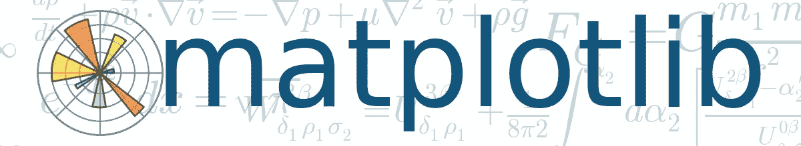

图片来源:[quantlabs.net](https://quantlabs.net/blog/2017/04/intro-to-scientific-python-with-math-behind-it-matplotlib/)

一个美丽的数据可视化胜过千言万语。受我去年看到的[大卫·斯皮格哈尔特](https://en.wikipedia.org/wiki/David_Spiegelhalter)的演讲的启发，我创建了一个易于使用的 python 包来创建视觉上令人惊叹的点状图。

***编者按:*** [*走向数据科学*](http://towardsdatascience.com/) *是一份以数据科学和机器学习研究为主的中型刊物。我们不是健康专家或流行病学家，本文的观点不应被解释为专业建议。想了解更多关于疫情冠状病毒的信息，可以点击* [*这里*](https://www.who.int/emergencies/diseases/novel-coronavirus-2019/situation-reports) *。*

# 可视化新冠肺炎症状

由于全球疫情目前影响着世界的每一个部分，我认为使用新冠肺炎相关数据集是及时的，也是有益的。Kaggle 有这样一个数据集，名为“[新型冠状病毒 2019 数据集](https://www.kaggle.com/sudalairajkumar/novel-corona-virus-2019-dataset)”，其中有许多关于冠状病毒患者的不同信息，包括他们表现出的症状。

你可能听说过很多冠状病毒的主要症状是发烧和干咳，但在这个数据集中它们有多普遍呢？下面是我试图用一种非常容易理解的方式来形象化症状频率。

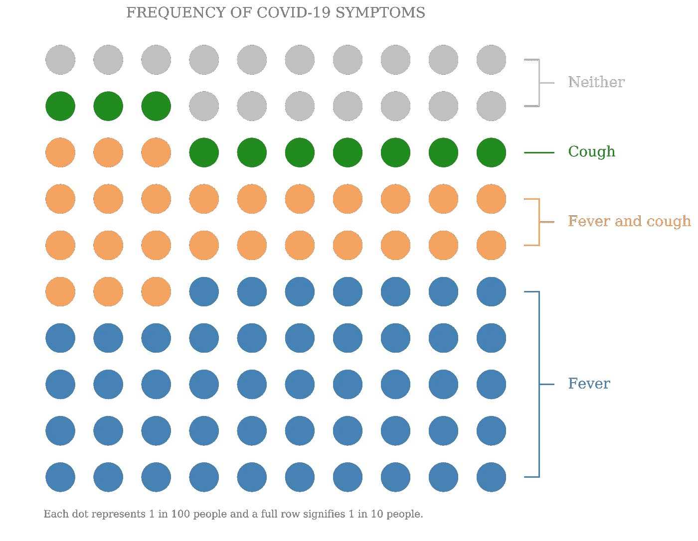

## 解释点状图

可视化是一个 10×10 的点网格，每个点都有颜色，代表 100 个人中的一个。整整一排代表十分之一的人。与条形图相比，这种可视化人群的方法的好处在于，你不需要担心百分比，也不需要担心非技术型观众一提到它就会走神。我们可以说 10 个人中有 1 个，或者 100 个人中有 1 个，这样更直观。

右手边的标签(由于选择了点的布局)有助于传递顶级信息，因为一行代表十分之一的人。例如，可以清楚地看到*发烧*标签横跨 5 行，表明 10 个人中有 5 个人的唯一症状是发烧。更简单的方法是将发烧和咳嗽这两行加在一起，得出 10 个人中有 7 个人发烧，而不必将 47%和 26%的真实百分比加在一起。

## 顶级带回家

1.  十分之八的人患有 T4，要么是咳嗽，要么是发烧
2.  十分之二的人既不咳嗽也不发烧
3.  1/10 的人会咳嗽**但** **不会发烧**
4.  十分之七的人会发烧
5.  100 个人中有 26 个人既咳嗽又发烧

# 自己生成一个图很简单

我在 matplotlib 中创建了这个可视化，并在这个 [GitHub repo](https://github.com/mattcrooksphd/Medium-Dot-Plot) 中将代码包装成一个易于使用的 python 包。在这篇文章中，我将介绍如何生成图的基础知识，但是有一个 jupyter 笔记本会介绍更多的细节。还有从完整的 [Kaggle 数据集](https://www.kaggle.com/sudalairajkumar/novel-corona-virus-2019-dataset)中提取的特定数据集，用于上述可视化。

## 导入包

我们可以使用下面的代码行导入这个包。注意，如果代码不在您的工作目录中，您将需要使用相对路径。

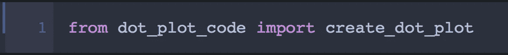

## 基本情节

我们可视化所需的数据集以字典的形式提供。字典的关键字是每个类的标签，值是该类的人数。百分比是自动计算的。

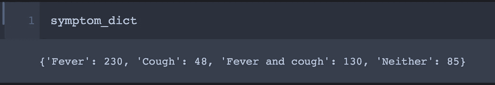

这个包还需要一个类标签列表，这样它就知道绘制类的顺序。这是以列表的形式提供的，第一项在图的底部，最后一项在顶部。

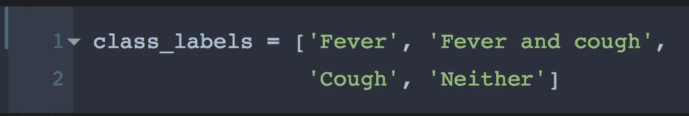

该包的最基本实现只需要以下内容

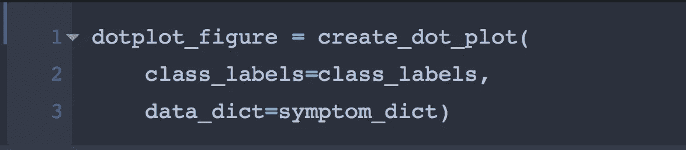

这产生了下面的图

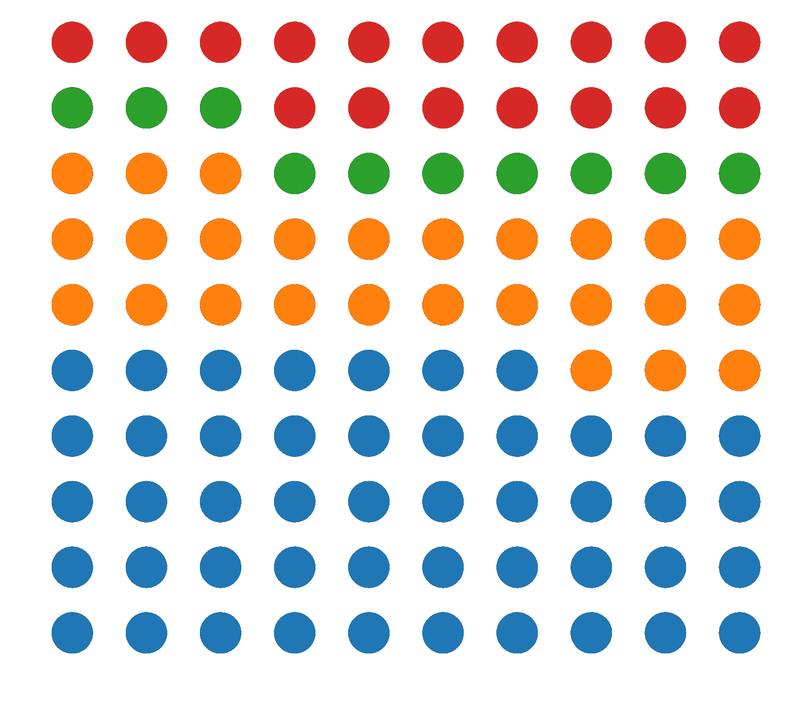

## 选择颜色

您可以通过将颜色选择字典传递给关键字参数`color_dict`来指定您自己的颜色。这些可以被命名为颜色或 rgb 颜色。

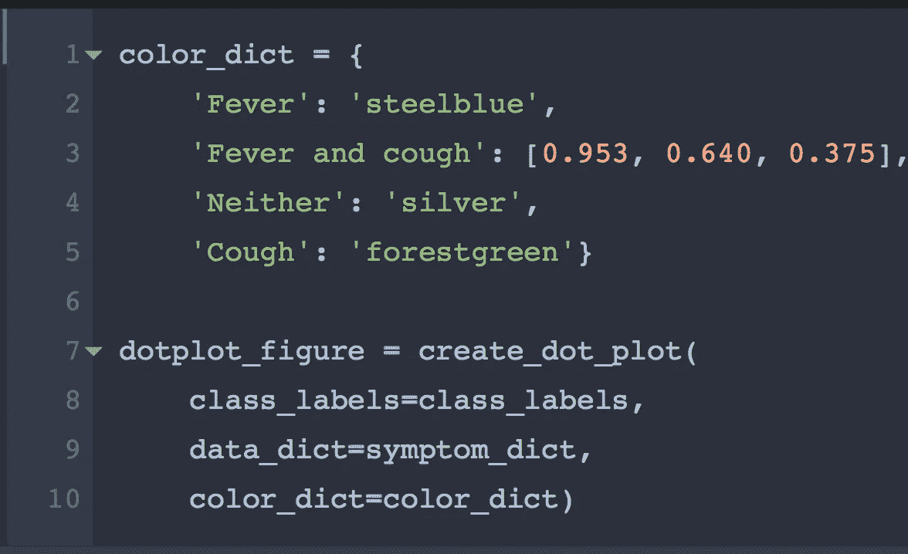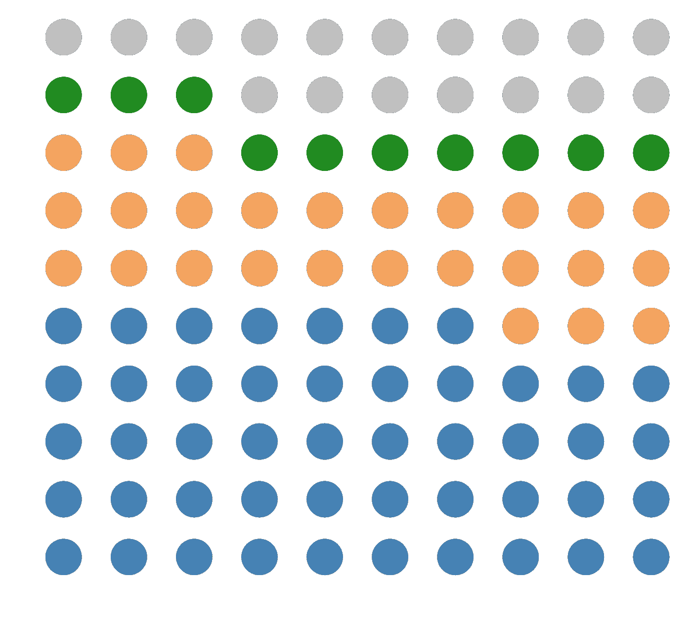

## 添加标签

默认情况下，标签是关闭的。这允许您在布局上工作，而不必担心如果布局不适合包可能会抛出的一些错误。我将在后面讨论这些错误。为了打开标签，我们可以进入`ignore_labels=False.`

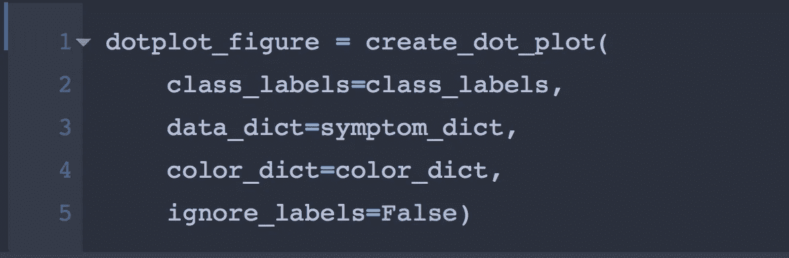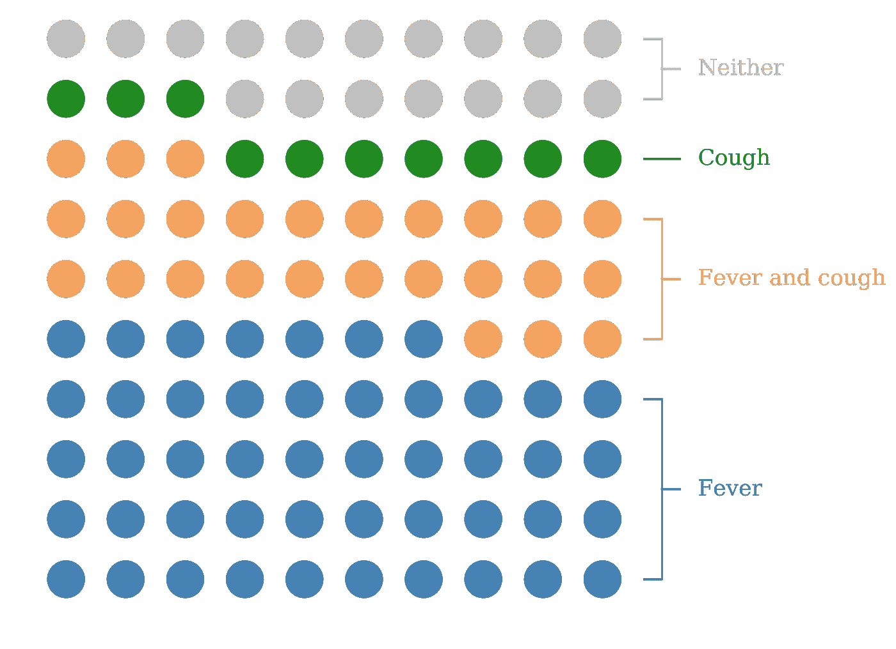

这里使用的标签与`class_labels`中使用的标签和`colour_dict`中的按键相同。

## 标题和题注

同样，标题和题注可以通过将它们的文本作为两个额外的关键字参数传入来添加。

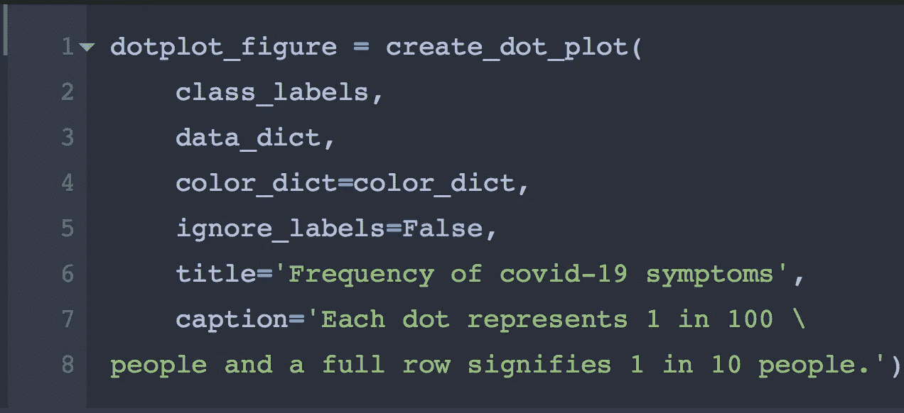

## 修改布局

为了给图形加标签，你需要在右栏下面每种颜色至少有一个点。尽管在本例中这是默认情况，但并不总是这样。您可以做一些修改来改变每一行的顺序。这些被传递到关键字参数`*reversed_rows.*`

> D **默认:** `*reversed_rows=None*` *(或左空)*为所有行从左到右
> 
> **Snake:** 传入`reversed_rows='snake'`将每行的顺序与第一行左右、第二行左右、第三行左右等互换
> 
> **反转行:**传入一个列表，比如`*reversed_rows=[1, 3]*` *，只交换第二行和第四行从右向左运行，其他行从左向右运行。并不是说这些是从 0 开始的 python 索引。*

交换行也是有用的，这样标签就代表了每一个类中 10 个人的数量。

尝试传入`*reversed_rows=[7]*`来获取错误

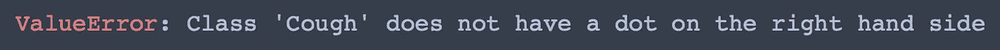

## 保存数字

该类具有属性`f`和`axis`，它们是标准的`matplotlib`图形和轴句柄。您可以使用这些选项随意修改图，但尤其可以使用以下选项保存图形

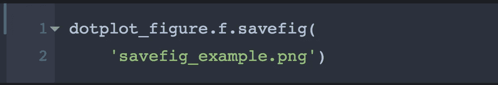

## 更改布局

不是每个数据集都最适合 10x10 的网格。关键字参数`gridsize`可以用来告诉代码使用多少个点。它应该是一个元组，第一个元素是水平点数，第二个元素是垂直点数。例如:

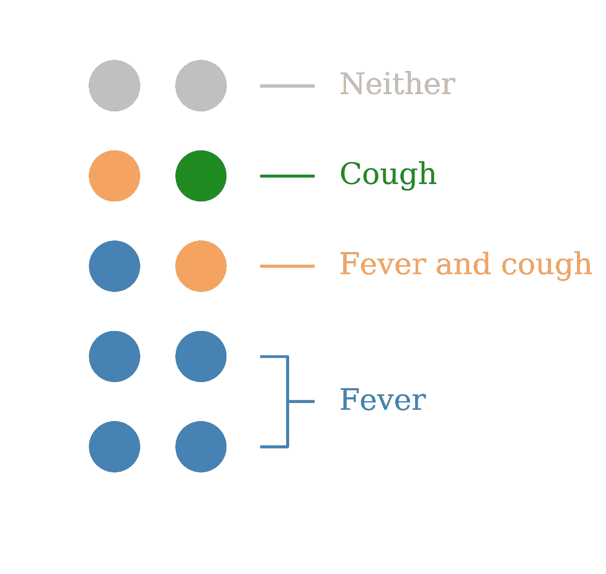

在较小的图中，您可能会得到以下错误

这意味着当把每一类的百分比四舍五入到最接近的点数时，你得到的点数太多了。例如，如果我们尝试生成一个 2 x 5 的图，每个点将值 10%，我们的类将四舍五入到最接近的 10%:

*发热* : 47%到 50%

*发烧和咳嗽* : 26%到 30%

*咳嗽* : 10%到 10%

*都不是* : 17%到 20%

这些加起来是 110%，这是误差的基础。如果需要，您可以通过自己提供所需的类百分比来克服这个问题。

## 最佳实践布局

为了获得最大的视觉效果，有一些关于安排点的布局的最佳实践。以下是我在制作上图时所做的选择:

1.  按大小降序排列类别
2.  重点关注发烧和咳嗽症状，其中*和*这两个类别都不代表不属于其他三个类别的人。该类别出现在顶部，并以中性灰色显示
3.  将*发烧和咳嗽*放在*发烧*和*咳嗽*之间，很像维恩图
4.  将标签上的*发烧*四舍五入至 5/10，将*发烧和咳嗽*四舍五入至 2/10。我希望 100 个人中总共有 73 个人用 7 行来表示。47 比 26 比 30 更接近 50。

# 结论

我已经提供了一个演练和代码，让你用 python 制作出你自己的漂亮的点状图。这里又是 GitHub 回购的链接。尽情享受吧！