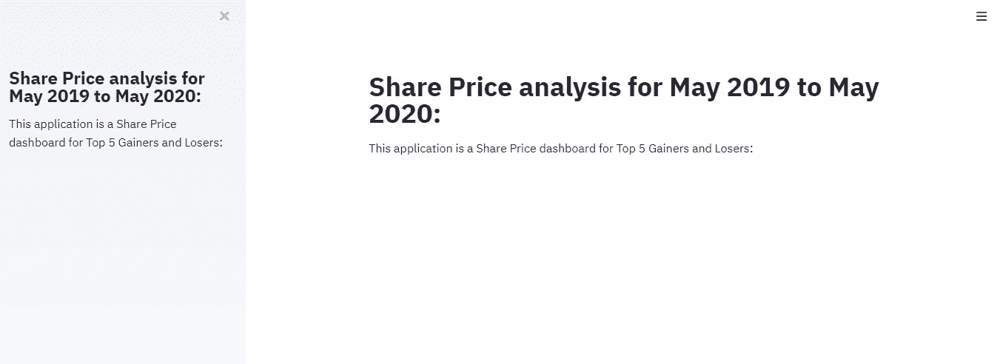
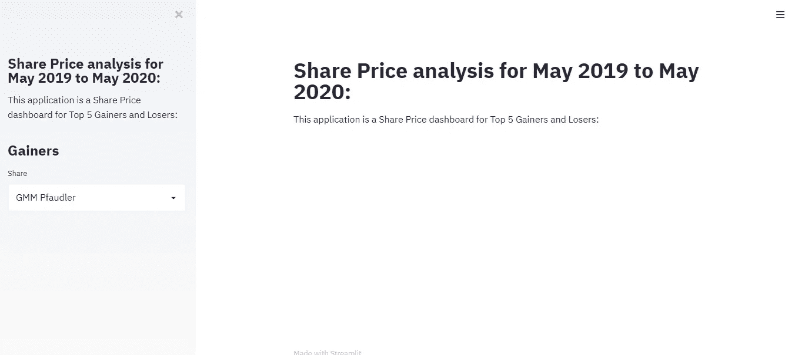
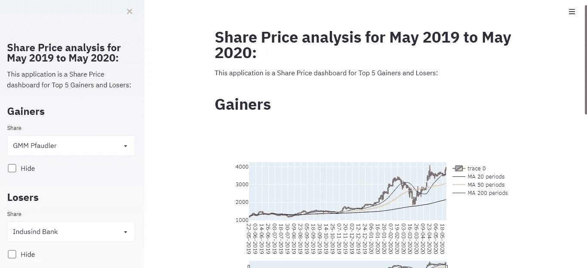

# 从头开始创建 Streamlit 仪表板。

> 原文：<https://towardsdatascience.com/creating-streamlit-dashboard-from-scratch-59316a74fa1?source=collection_archive---------22----------------------->

## Streamlit 是一个很棒的工具，可以轻松构建视觉上吸引人的仪表板。


马库斯·温克勒在 [Unsplash](https://unsplash.com?utm_source=medium&utm_medium=referral) 上的照片

构建仪表板从来都不容易，创建仪表板需要 bootstrap、HTML、CSS 等知识和大量的时间。但是通过使用 streamlit，我们只需几行代码就可以创建高度交互式和视觉上吸引人的仪表板。让我们开始构建我们的控制面板，但首先让我们了解一下 streamlit。

# 什么是 Streamlit？

**Streamlit** 是一个开源的 Python 库，其速度快得惊人，可以轻松地为机器学习和数据科学构建漂亮的定制网络应用。这是一个非常棒的工具，只需要一些 python 知识就可以创建高度交互式的仪表板。我们将从安装 streamlit 开始，看看它是如何工作的。

**安装 Streamlit**

```
pip install streamlit
```

查看 streamlit 上的一些演示。为此，我们需要在命令提示符下运行下面给出的命令。此命令允许您浏览预加载的 Streamlit 演示。你一定要看看这些，因为它们真的很有趣。

```
streamlit hello
```

现在让我们创建自己的仪表板。在这里，我将创建一个仪表板，用于分析 2019 年 5 月至 2020 年 5 月印度股市的 5 大赢家和输家。为了构建它，让我们导入一些我们需要的库。请注意，您需要为 streamlit 创建一个脚本并运行它，因此我们将使用任何代码编辑器，如 Atom 或 Notepad++并使用。py 格式。

```
import streamlit as st
import pandas as pd
import numpy as np
import plotly.express as px
from plotly.subplots import make_subplots
import plotly.graph_objects as go
import matplotlib.pyplot as plt
```

所有这些库将用于股票数据的数学计算和可视化。现在让我们使用 pandas 导入我们的数据，这里我为赢家和输家创建了单独的文件，所以我们将导入这两个文件。

```
DATA_URL = ("C:/Users/Divya/gainers.csv")
DATA_UR= ("C:/Users/Divya/losers.csv")
df=pd.read_csv(DATA_URL)
df1=pd.read_csv(DATA_UR)
```

导入数据文件后，让我们开始设置仪表板的标题。为此，我们将使用 **st.title** 作为主标题，使用 **st.sidebar.title** 作为侧栏标题，如下所示。

```
st.title("Share Price analysis for May 2019 to May 2020:")
st.sidebar.title("Share Price analysis for May 2019 to May 2020:")
st.markdown("This application is a Share Price dashboard for Top 5 Gainers and Losers:")
st.sidebar.markdown("This application is a Share Price dashboard for Top 5 Gainers and Losers:")
```

您可以保存此文件并在 streamlit 中运行它来查看更改。您将看到带有您提到的标题的仪表板。我将我的文件存储为 share_new.py，因此我将通过键入下面给出的命令来运行。

```
streamlit run share_new.py
```



这是您的仪表板最初的外观。

streamlit 最好的一点是它非常快，也就是说，你可以保存脚本中的更改，应用程序会立即反映这些更改，你不需要一次又一次地刷新应用程序。

在这个仪表板中，我们将为数据集中的所有股票创建蜡烛图。此外，我们将绘制这些股票的移动平均线。首先创建收益者的标题，并创建一个选择框来选择要分析的股票。

```
st.sidebar.title("Gainers")
select = st.sidebar.selectbox('Share', ['Adani Green Energy', 'GMM Pfaudler', 'AGC Networks', 'Alkyl Amines Chem', 'IOL Chem & Pharma'], key='1')
```

一旦保存文件，更改将会反映在您的应用程序中。



在这里，您可以看到选择框显示了标题增益。

现在，我们将编写代码来创建一个复选框，以启用或禁用蜡烛图的可视化，并为所有股票创建一个蜡烛图。下面给出的代码将创建“阿达尼绿色能源”的蜡烛图，还将计算和显示该份额的移动平均线。

```
if not st.sidebar.checkbox("Hide", True, key='1'):
    st.title("Gainers")
    if select == 'Adani Green Energy':
        for i in ['AdaLow', 'AdaHigh', 'AdaClose', 'AdaOpen']:
            df[i] = df[i].astype('float64')
avg_20 = df.AdaClose.rolling(window=20, min_periods=1).mean()
avg_50 = df.AdaClose.rolling(window=50, min_periods=1).mean()
avg_200 = df.AdaClose.rolling(window=200, min_periods=1).mean()
set1 = { 'x': df.AdaDate, 'open': df.AdaOpen, 'close': df.AdaClose, 'high': df.AdaHigh, 'low': df.AdaLow, 'type': 'candlestick',}
 set2 = { 'x': df.AdaDate, 'y': avg_20, 'type': 'scatter', 'mode': 'lines', 'line': { 'width': 1, 'color': 'blue' },'name': 'MA 20 periods'}
set3 = { 'x': df.AdaDate, 'y': avg_50, 'type': 'scatter', 'mode': 'lines', 'line': { 'width': 1, 'color': 'yellow' },'name': 'MA 50 periods'}
        set4 = { 'x': df.AdaDate, 'y': avg_200, 'type': 'scatter', 'mode': 'lines', 'line': { 'width': 1, 'color': 'black' },'name': 'MA 200 periods'}
        data = [set1, set2, set3, set4]
        fig = go.Figure(data=data)
        st.plotly_chart(fig)
```

类似地，我们可以为数据集中列出的所有份额创建烛台图表，但是重复上面提到的代码，最终的仪表板将显示数据集中提到的所有份额。



显示所有功能和共享的最终仪表板。

视频显示了最终创建的仪表板，烛台图表是使用 Plotly 创建的，因此它们是交互式的，移动平均线可以相应地启用或禁用。这个仪表板在不到两个小时的时间内就创建好了，具有高度的交互性和视觉吸引力。

这只是 streamlit 所能做的一个例子。您可以探索更多信息，了解 streamlit 为创建网络应用和仪表盘提供的无限功能。如果您在创建自己的仪表板时遇到任何困难，请回信并与我分享您的经验。

[](/creating-dataset-using-faker-and-use-it-for-pandas-profiling-6fe26e1b9557) [## 使用 Faker 创建数据集并将其用于熊猫概况分析

### 创建您自己的数据并对其执行操作。

towardsdatascience.com](/creating-dataset-using-faker-and-use-it-for-pandas-profiling-6fe26e1b9557) 

# 在你走之前

***感谢*** *的阅读！如果你想与我取得联系，请随时通过 hmix13@gmail.com 联系我或我的* [***LinkedIn 个人资料***](http://www.linkedin.com/in/himanshusharmads) *。也可以在我的*[***Github***](https://github.com/hmix13/streamlit_candlestick)*中查看我在这里使用过的代码和数据集。另外，请随意浏览* [***我的简介***](https://medium.com/@hmix13) *并阅读我写的与数据科学相关的不同文章。*