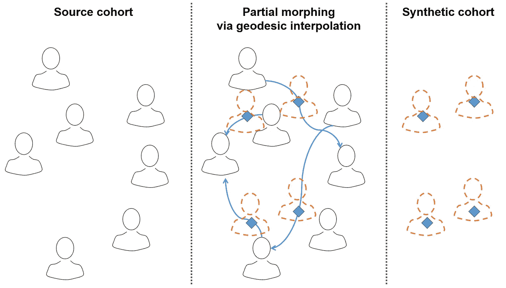
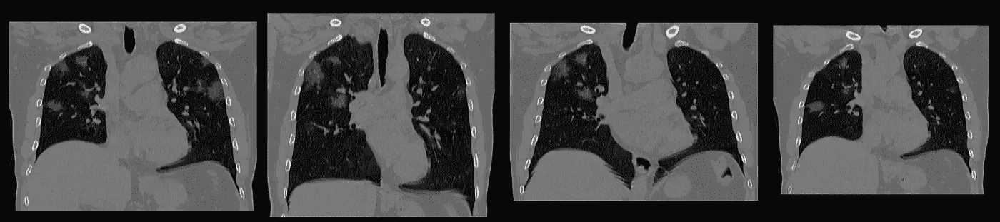
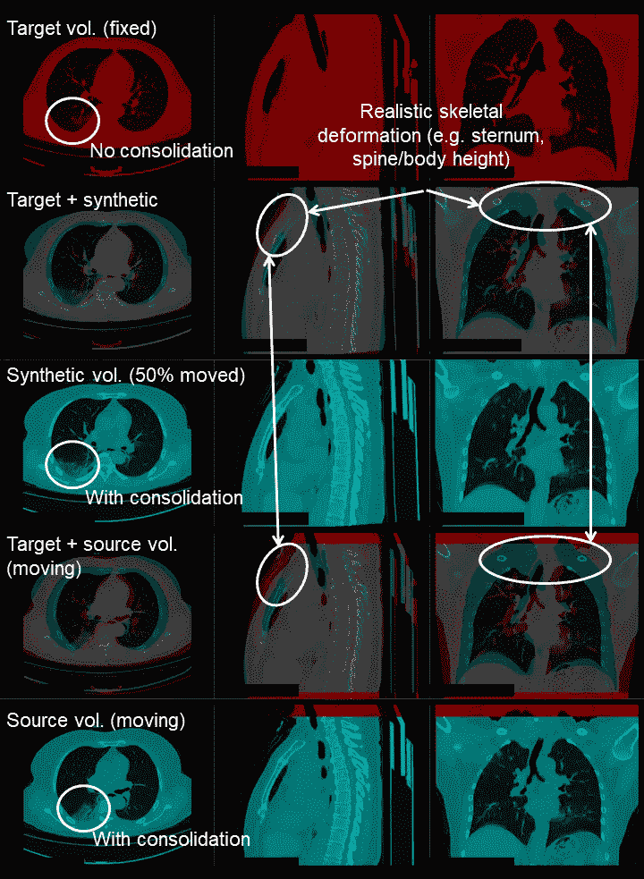

# 为深度学习创建合成 CT 数据

> 原文：<https://towardsdatascience.com/creating-synthetic-ct-data-for-deep-learning-2dca1e43c4f0?source=collection_archive---------61----------------------->

## 当数据太少而无法训练 GAN 时，如何生成逼真的体积图像

# TL；速度三角形定位法(dead reckoning)

我们描述了一种从一小组样本中创建合成体积医学图像的方法。我们的方法基于随机部分变形，因此无需深度学习(不需要 GANs)。创建的卷看起来非常真实，并且适合于创建用于深度学习的训练数据集。在我们的 [Covid19 胸部 CT 挑战赛](https://www.covid19challenge.eu/)中，我们应用这种方法为开发者创建了一个合成玩具数据集。

**数据隐私是公众质疑医学影像数据的一个重要方面。**患者相关信息的匿名化需要两个主要步骤。第一步是从可识别信息中剥离患者数据。这包括患者的姓名、出生日期、出生地或现居住地。在第二步中，可能需要对图像数据本身进行匿名化。一个突出的例子是从脑 CT/MRI 图像重建人脸的可能性。作为进一步的匿名化步骤，这通常需要去面。

在我们的[**covid 19 挑战赛**](https://www.covid19challenge.eu/) 中，我们处理胸部的放射影像数据。幸运的是，这个数据不像脑成像数据那样敏感，因为病人的头和脸都被裁剪了。剩余的图像数据本身不包含与人相关的信息，因为胸部成像是现实的抽象表示。如果没有公共数据库，去识别信息只有主要护理人员知道。

在我们的[covid 19 挑战](https://www.covid19challenge.eu/)中，我们采取了**多种措施来确保完全匿名化**。我们从合作的放射部门和私人诊所接收预先匿名的数据。在数据传输之后，任何剩余的元数据都将被剥离到最少的一组挑战相关信息。其余的临床元数据不是特定于患者的(年龄、性别、PCR 结果、入院后天数、结果类别、临床事件)。事实上，它可能与许多潜在的医院和患者有关。接下来，受过医学教育的训练团队将图像分割成肺叶和 Covid19 相关的病变。根据预定义的分段协议，这种注释集中发生，并具有后续的质量保证步骤，以确保数据的一致和高质量标记。

由此产生的数据是高度匿名的，但仍然没有向公众公布。由于道德和法律要求，**参赛团队在挑战的任何时候都不能直接访问未经更改的成像数据**。相反，开发者可以通过 [Eisen.ai](https://eisen.ai/) 接口[提交](https://medium.com/analytics-vidhya/deep-learning-on-covid-19-data-with-eisen-7ad5b5657ff9)处理作业，在非公开的图像数据上训练和验证方法。

然而，**作为数据科学家，我们更希望至少有一个最小的本地代表性数据集**可用。这有助于对数据外观和可变性、潜在挑战以及算法的快速原型化有所了解。为了弥合这一差距，我们需要设计一种方法来发布用于本地开发的图像子集，这种子集具有高质量和代表性，并且仍然不包含患者的未更改图像数据。实现这一点的一个非常有前途的研究方向是生成神经网络模型，特别是生成[对抗网络(GANs)](https://arxiv.org/abs/1809.07294) 。然而，这种方法需要来自图像域的非常大的数据集，以便学习数万或数十万幅图像的真实外观。这在医学成像中通常很难实现。此外，这些方法仅在 2D 显示出产生逼真的效果。图像尺寸大约为 512-1024 像素边长。此外，基于 GAN 的方法需要[巨大的计算资源](https://www.fastcompany.com/90244767/see-the-shockingly-realistic-images-made-by-googles-new-ai)用于训练。由于很少带注释的图像、高分辨率的 3D 体积(512 x512 x300–500 体素)以及准备阶段有限的计算能力，**基于 GAN 的方法在我们的挑战中不可行**。

相反，我们依赖于一种更传统的技术: [**测地线插值**](https://github.com/stnava/Morpheus) **经由可变形图像配准**。这个过程的一个更常见的表达是**“图像变形”**。基本想法很简单:我们使用一个强大的、现成的非线性图像配准工具包，用于医学图像，名为 [ANTs](http://stnava.github.io/ANTs/) 。将 ant 应用于我们的胸部 CT 图像，我们将“移动”体积配准到“固定”体积。一旦变形被计算出来，我们不会将“移动的”体积一直变形到“固定的”体积，而是只变形一定的百分比。变形因此没有完成，而只是*部分*。这个概念的一个例子如图 1 所示。

图一。通过部分图像变形生成合成胸部 CT 的概念。(*作者图片*)

由于对可变形配准进行了仔细的参数化，因此**生成的体积看起来非常逼真**，无论是在健康组织还是在病变区域。连同原始图像数据一起，所有黄金标准分割标签和患者元数据被变形(标签)和/或内插(年龄、入院后天数等。).**生成的体积具有完全合成的形态:合成体积中的解剖形状和尺寸与“固定”和“移动”体积非线性不同**。因此，胸部的生物标记(如果存在的话，例如椎骨形状或脊柱弯曲)也是非线性改变的和合成的。示例图像如图 2 所示。

图二。通过四个胸部 CT 体积的中心冠状切片。你可能猜到哪个卷是真实的，哪个是合成的。(*底部解决方案)(*作者图片*)

从这个玩具数据集中恢复原始卷应该是不可能的。为了确保这一点，**我们应用了三种形式的随机化**:首先，玩具数据集是从全部数据的*随机选择的子集*中生成的。第二，考虑到成对配准的全连通有向图，我们仅沿着边缘的随机子集执行可变形配准*。第三，从源到目标的部分变形也被设置为一个*随机百分比*。请记住，源数据本身在任何时候都是不可公开访问的，**开发者数据集中的合成卷不再与任何原始源数据相关联**。*

当然，这种方法有一定的局限性。其中包括:

*   **拓扑误配准:**微分同胚配准不能处理数据中的拓扑变化。例子可以是支气管路径的不同分支，或者具有不规则形状和位置的 Covid19 损伤。拓扑差异导致配准错误，这表现为合成体积中的拖尾或压缩伪影。
*   **插值伪影:**由于合成体积中的体素强度是通过插值计算的，因此与原始数据相比，图像看起来有些模糊。
*   **样本外内插:**用零值内插被共同配准到目标体积的体素网格之外的区域中的运动体积的体素。我们用空气等效体素强度来修补这些体素。

无论如何，所有这些伪像通常发生在神经网络训练的增强期间。考虑到参与团队的本地开发的便利性，这些工件是一个可以接受的折衷。

用合成数据创建一个可公开访问的玩具数据集是挑战准备阶段的一个重要里程碑。我们希望有了这些数据，开发者可以更容易地在本地构建他们方法的原型，同时了解 Eisen 接口。一个[艾森代码初学者工具包](https://gist.github.com/faustomilletari/1c1d9d671641e36e63199d26bb232d58)刚刚推出。试一试，并关注我们的团队成员 [Fausto Milletari](https://medium.com/u/a5d79f344c19?source=post_page-----2dca1e43c4f0--------------------------------) 的更新。

(*)解答:没有一个体积是真实的，所有四个体积都是合成的。事实上，所有四卷都是从相同的源主题合成的，共同注册到四个随机选择的目标主题，证明了可以实现的形态学可变性。

下面，图 3 示出了源和目标体以及合成体的另一个更详细的例子(在两者之间正好 50%的变形/变形)。

图 3。随机选择的源、目标和 50%变形合成体积的详细比较。(*图片作者*)