# 用 Matplotlib 创建 Synthwave

> 原文：<https://towardsdatascience.com/creating-synthwave-with-matplotlib-ea7c9be59760?source=collection_archive---------14----------------------->

## 正确使用 Matplotlib 创建动画复古 Synthwave 视觉效果

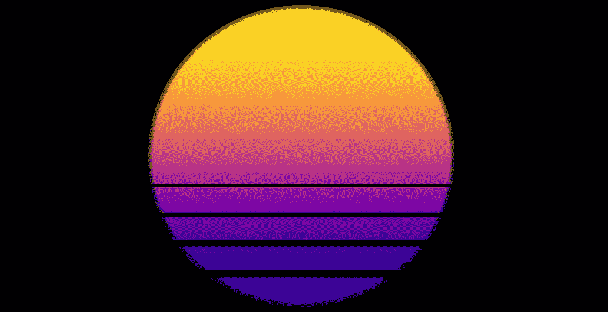

synthwave 是一种非常独特的音乐类型，灵感来自 20 世纪 80 年代的怀旧，是技术人员的共同最爱。我喜欢它，我发现它的艺术风格非常迷人。

在 YouTube[上快速搜索该类型可以让任何人欣赏该类型带来的复古科幻美学。](https://www.youtube.com/watch?v=wOMwO5T3yT4)

现在，我想创造这样的视觉效果。然而，我日复一日地与数据打交道，我不是动画师、平面设计师或艺术家。

然后我想，*“我确实创造了视觉效果，我在 Matplotlib 中可视化数据。在 Matplotlib 中创建 Synthwave 视觉效果不是很有趣吗？”*。

所以我们在这里。

# 远景

首先要创建的是透视样式的垂直网格线。为此，我们设置一个原点`(0, 5)`。这些线必须从这里延伸到框架底部的`y = -50`处。每一行唯一要更改的值是 Numpy linspace 函数中的最终 x 值。我们用一个从`x = -500`到`x = 500`的 for 循环来实现，步长为`50`。

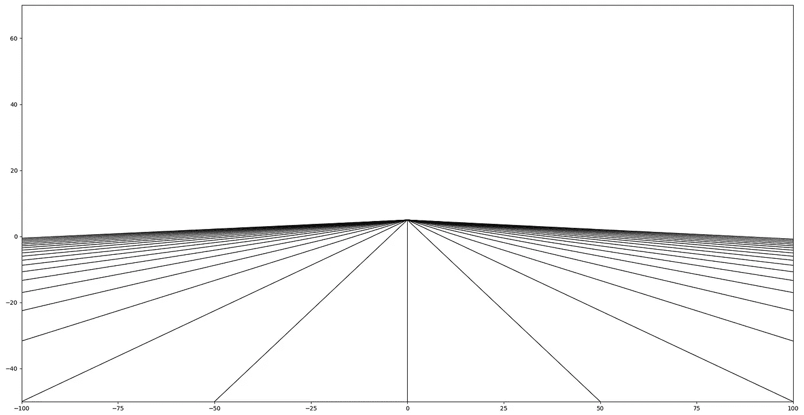

现在，没有地平线，没有地平线你不可能有一条无尽的 synthwave 路。所以我们简单地用`np.ma.masked_where(y > 0, y)`屏蔽掉`0`以上的所有 y 值。

最后，让我们来确定配色方案。我们将使用黑色背景，并使用多条半透明线来创建发光效果[1]。

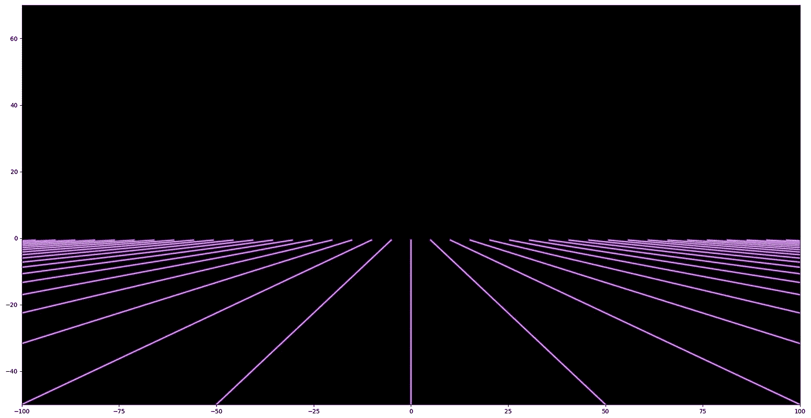

# 移动

这个有点棘手。为了创建看起来向我们走来的水平线，我们使用 Matplotlib 动画来不断更新水平线的 y 位置。我们创建了这些运动线的十个实例，每个实例都分配了一个修改后的指数函数，如下所示:

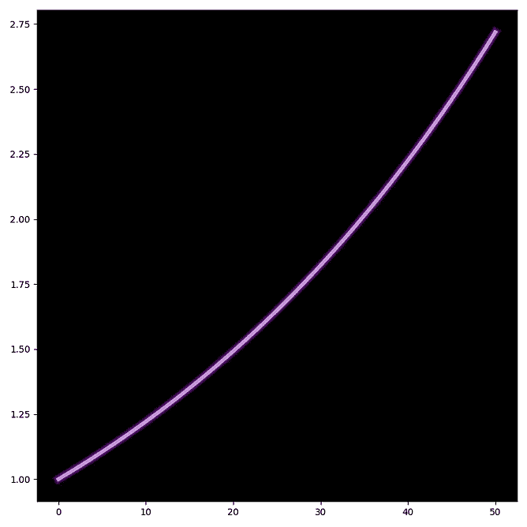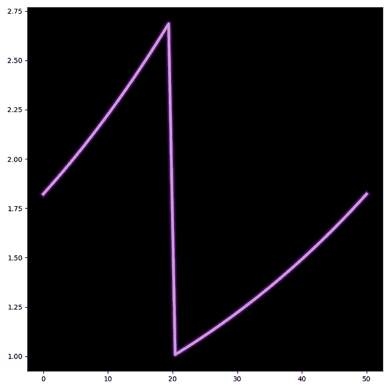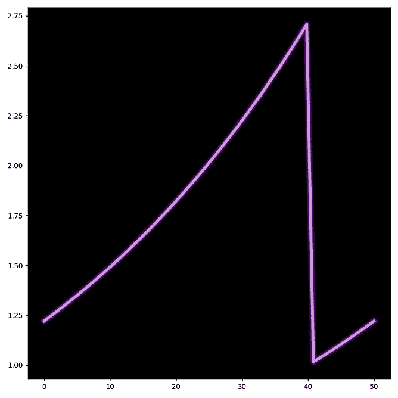

分别用于第 0、4 和 8 行的 y 位置函数。

对于每一帧，每条运动线被分配相同的 x 值。但是，当我们沿着 x 轴移动每个函数时，我们返回一个不同的 y 值。如果我们画出所有十条运动线，记住这个逻辑，我们可以通过时间(x 轴)可视化线的 y 位置(y 轴):

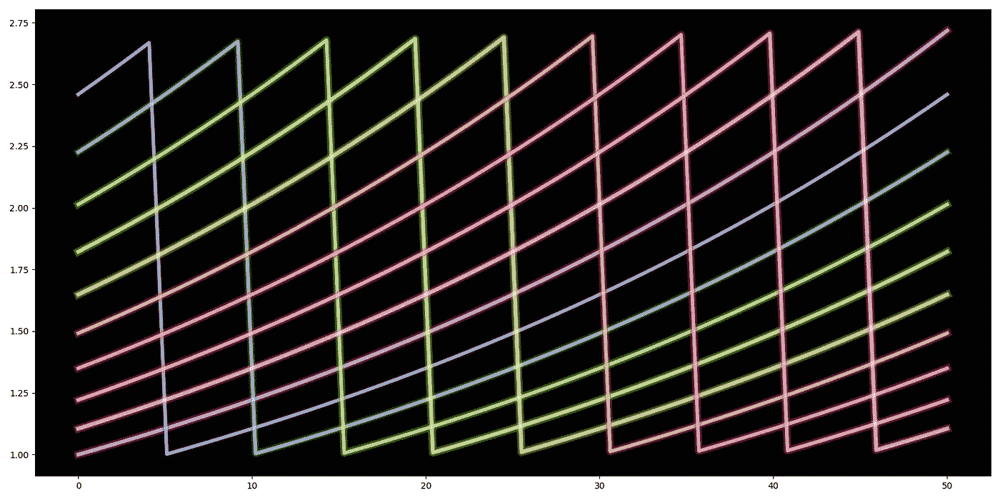

通过使用指数函数，我们将运动线和透视线合二为一。当运动线离我们越来越近时，通过增加向下的速度来创造三维运动的幻觉。这类似于动画中的缓和[2]。

将此应用于水平网格线的 y 位置，会给我们一种在霓虹紫色 tron 般的世界中不断前进的错觉。

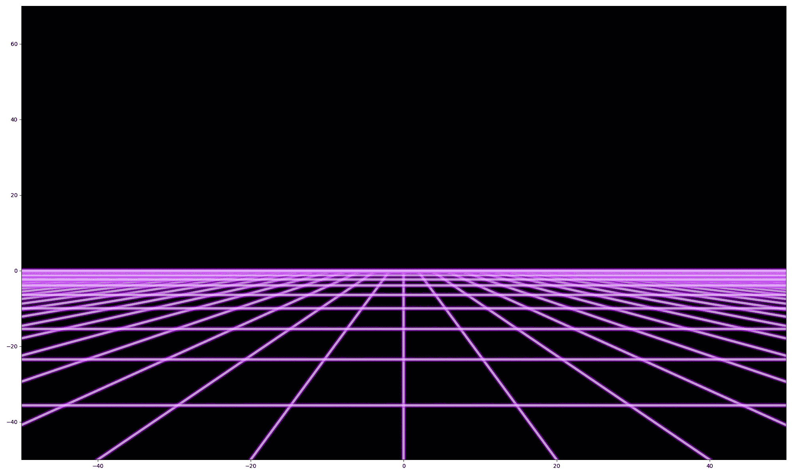

幸运的是，对于我们的输出文件的大小，我们的运动线运动每十分之一的总时间重复一次。这意味着我们可以在动画函数`animation.FuncAnimation(fig, animate, frames=int(frames/10))`中将动画帧减少 10 帧。

# 迈阿密太阳报

如果在我们无尽的霓虹紫色之路的尽头没有超大的复古日落，这就不是 Synthwave 了。

当涉及到渐变时，Matplotlib 可能有点困难。我们使用`imshow()`来创建一个图像，在我们的例子中是`plasma`渐变。然后，我们遮蔽该图像，使其超出中心点的指定半径，得到:

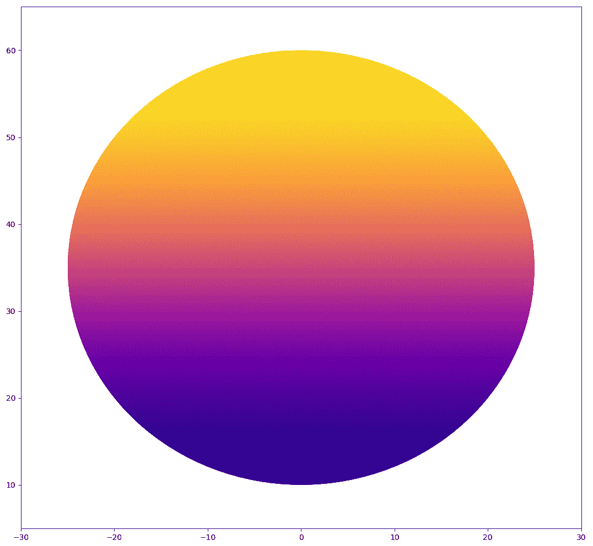

很好，但还没到那一步。迈阿密的太阳需要辉光和几条水平线。对于光晕，我们放置了几个半径稍大、alpha 值较低的圆。线条是在使用简单的黑线图后添加的。

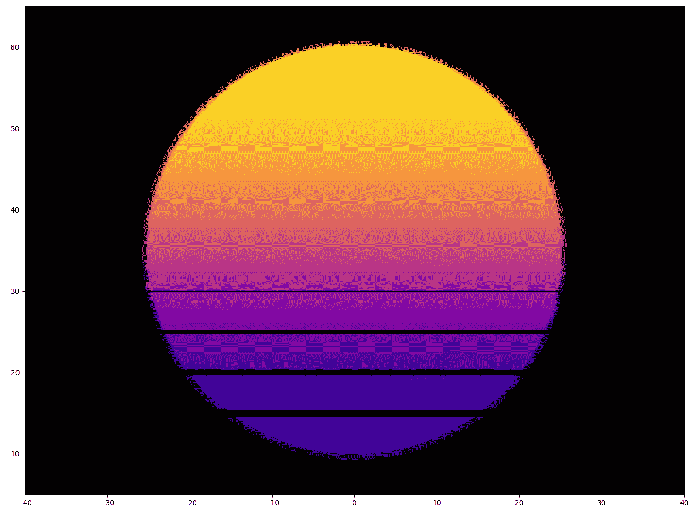

将迈阿密的太阳和霓虹网格放在一起，我们得到:

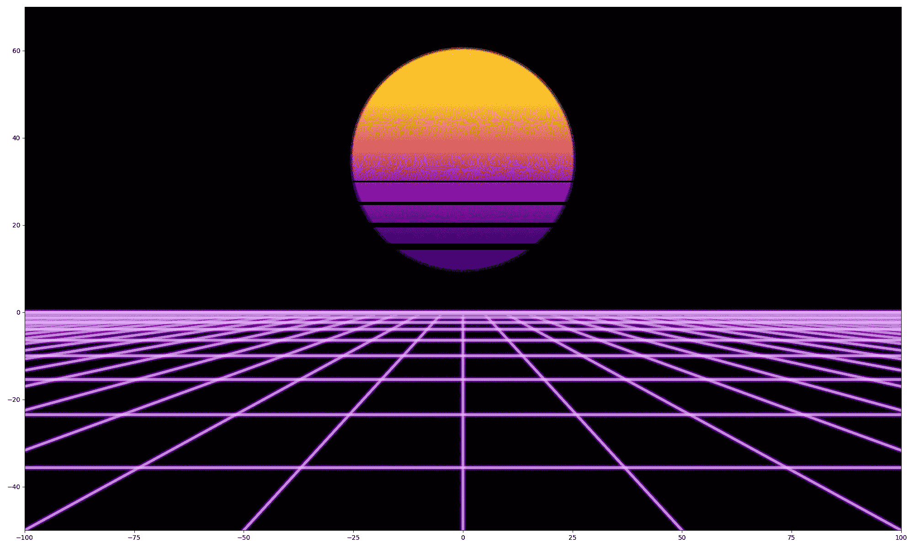

# 目的地

无尽霓虹紫路需要目的。一个遥远但不太遥远的目的地。想想——一个神秘的都市天堂。

幸运的是，Matplotlib 附带了一个专门构建的复古 skyline 生成器，名为`plt.bar()`！我们简单地使用`np.random.uniform(0, 10)`，通过一些计算来定义酒吧宽度，我们有自己美丽的，随机生成的天际线。

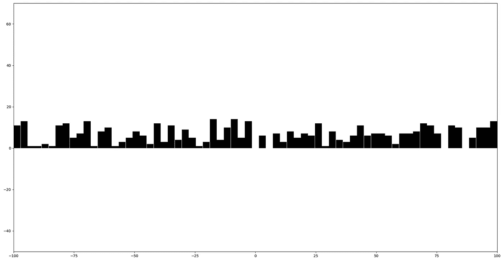

由于我们无法在无云的迈阿密夜空下看到我们的地平线轮廓，我们添加了一个从我们无尽的地平线发出的深紫色光芒。我们将再次使用`plt.imshow()`。我们需要的是初始的`gnuplot`渐变，所以让我们使用前 28 个颜色映射并用`[ListedColormap](https://matplotlib.org/3.1.0/tutorials/colors/colormap-manipulation.html)`创建一个新的渐变。

来自 Matplotlib 的 [**gnuplot** 颜色图参考](https://matplotlib.org/3.1.0/gallery/color/colormap_reference.html)

我还擅自减少了我们的霓虹网格线宽，我认为现在看起来好多了。让我们看看我们的无尽之路是什么样子的:

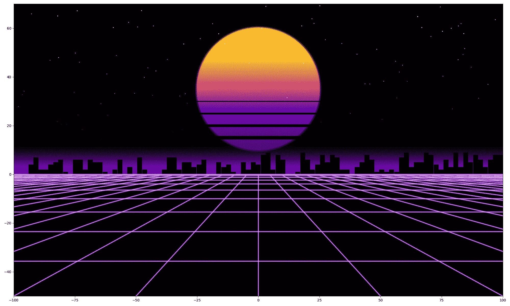

看起来不错，但现在我们过大的迈阿密日落可能太大了，挤压了我们对远处地平线的完美看法。另外，80 年代迈阿密的天空总是布满星星，而我一颗也没看到。

因此，让我们调整太阳的大小，用`plt.scatter()`和`np.random.uniform()`分别代表`x`和`y`来添加星星。我们还根据 y 位置(越靠近地平线越暗)和一点随机性来改变每颗星星的`alpha`参数。

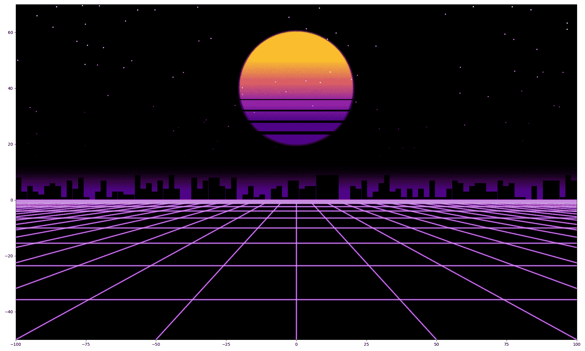

# 收尾

现在有一些小的调整，我认为将完成可视化。

首先，恒星出现在太阳前面。我们简单地调整恒星的`ax.scatter()`函数中的`zorder`参数。将它们移动到太阳下面——默认为`zorder = 1`【3】。

在这一点上，它看起来很好，但星星只是普通的白点，不是很有说服力。所以我们添加了一些随机生成的闪烁。

最后，就像地平线后面放射出的光芒一样。我们添加另一个紫黑色渐变。这一次沿着我们无尽的路。

就是它，Matplotlib 中的 Synthwave！

虽然这没有明显的用例，但我强烈推荐尝试创建类似的东西，因为在这个过程中你会学到很多东西。而且，说实话，很好玩！

我希望你和我一样喜欢阅读这篇文章。

如果您有任何问题或建议，请随时通过 [Twitter](https://twitter.com/jamescalam) 或在下面的评论中联系我们。

谢谢，

# 参考

[1]: **创建照明线**—[https://public wiki . delta RES . nl/display/~ baart _ f/2012/01/03/创建+照明+线](https://publicwiki.deltares.nl/display/~baart_f/2012/01/03/Creating+illuminated+lines)

[2]: **放松的基础**—[https://developers . Google . com/web/fundamentals/design-and-UX/animations/The-basics-of-easing](https://developers.google.com/web/fundamentals/design-and-ux/animations/the-basics-of-easing)

【3】:**佐德演示**——[https://matplotlib.org/3.1.1/gallery/misc/zorder_demo.html](https://matplotlib.org/3.1.1/gallery/misc/zorder_demo.html)

**项目回购**—[https://github.com/jamescalam/python_synthwave](https://github.com/jamescalam/python_synthwave)

**合成波**——[https://www.youtube.com/watch?v=wOMwO5T3yT4](https://www.youtube.com/watch?v=wOMwO5T3yT4)