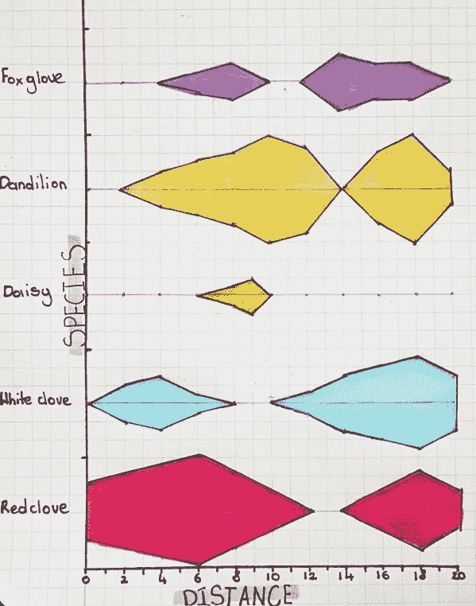
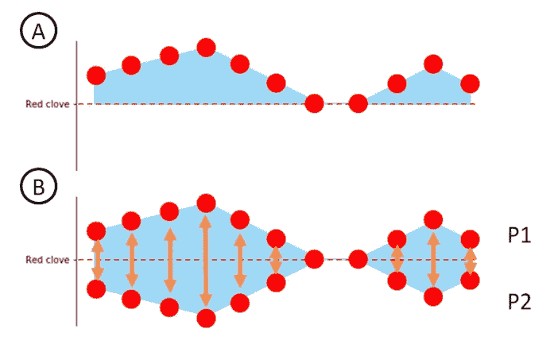

# 用 Python 制作生态学经典“风筝图”

> 原文：<https://towardsdatascience.com/creating-the-ecology-classic-kite-diagram-in-python-46989e1310ad?source=collection_archive---------41----------------------->

## 使用 Python 的 matplotlib 库



手绘风筝图(图片由作者提供)

风筝图是生态学和生物学研究中的经典用法，也是英国 A 级生物学课程教学大纲的一部分。尽管如此，在标准软件可视化软件包中创建这些图表的选项很少，大多数似乎仍然是手绘的。这篇短文将解释如何用 Python 3 和 matplotlib 库来自动化这个过程。

**那么什么是风筝图呢？**风筝图提供了沿横断面进行的不同观察的图形总结。横断面是横跨栖息地的一部分或整个栖息地的一条线。这通常是用绳子、绳索等手工完成的。各种物种的数量可以沿着样带定期计算。各种物种的分布会受到各种不同因素的影响，包括捕食者以及其他环境因素，如热、光和湿度。这些被称为非生物(非生命)因素。也可以使用样方收集数据，这涉及到使用沿样带移动的正方形(例如 1m2)框架。然后可以在每一点计算方块中的物种数量。

风筝图是一种观察不同物种在一个样带中数量变化的方式。

这使得研究人员可以在栖息地的不同地方，比如海边，看到某些物种的相对丰富度。例如，可能有许多种类的草、植物和昆虫分布在海岸的不同位置。


沿着海岸可以发现各种各样的物种

这些图表通常是手工制作的，在标准的可视化软件包中似乎很少有对它们的支持。我们在 Excel 中找到了一个例子(Luke，2019)和一个使用 R 产生的例子(Hood，2014)，但没有使用 Python 的例子。随着 Python 越来越多地被用于分析数据，我们认为应该尝试使用 Python 实现一个简单的风筝图。这是使用 Python 3 的交互式 Jupyter 笔记本完成的。我们在这里向其他领域的人展示这个过程，这些人可能会发现自动化这样的图是有用的。我们特意尝试保持初学者的基本实现。

例如，我们将使用 Python 的“pandas”库来表示我们将使用的数据集。该数据集被输入 Excel 并保存为逗号分隔值(CSV)文件。我们还将使用 numpy 库从数据集中提取列，并对它们应用操作。按照 Python 的惯例，我们可以使用简写引用来引用这些库(pd 代表 pandas，np 代表 numpy)。

```
import pandas as pd
import numpy as np
```

**导入数据**

接下来，我们使用 pandas read_csv()函数将数据集加载到 pandas dataframe 对象中，并提供 csv 文件的路径。我们将这些数据存储在一个名为 kite_data 的变量中，然后可以在笔记本(或其他 Python 环境)中查看该变量。

```
kite_data = pd.read_csv("./biology/kitedata.csv")
kite_data
```


数据集(作者提供的图片)

数据的第一列应该代表距离。这将用于水平轴。其余的列表示物种的频率，或者有时表示某些植物的覆盖百分比，它们将在 y 轴上以一定的间隔绘制。

**创建风筝绘图功能**

下一步是创建一个函数来生成风筝图。这建立在 matplotlib 库的基础上，matplotlib 库被广泛用于生成各种各样的可视化。你可以在 https://matplotlib.org/3.1.1/gallery/index.html[的画廊里看到一些例子。我们将导入该库，并将其称为 plt。我们还需要使用多边形函数在图上画出风筝的形状。](https://matplotlib.org/3.1.1/gallery/index.html)

```
import matplotlib.pyplot as plt
from matplotlib.patches import Polygon
```

导入库后，我们可以创建函数。数据框的第一列应该是区域分割的距离或其他度量(如样方)。这里我们使用 iloc 特性，它代表整数位置。这是一种通过数字(0 到列数)而不是通过列名来引用列的方式。我们可以提取并存储第一列距离，供以后在 x 轴上使用。我们还创建了一个空列表来存储起始点。这用于在 y 轴上定位单个风筝形状。我们还获取列名，并将其存储在 y_values 变量中，以便稍后在 y 轴上绘制物种名称。最后，我们获得数据帧中的列数，并将其存储在名为 num_cols 的变量中，这样我们就知道需要向图表中添加多少物种。

```
def kite_diagram(df, axis_labs):
    """Function to draw a kite diagram."""    
    plt.axes()
    start_points = []
    v1 = np.array(df.iloc[:, [0]])
    y_values = df.columns
    y_values = np.delete(y_values, 0)
    num_cols = len(df.columns) - 1
```

现在我们需要从数据集(不包括距离列)中获取最大值，这样我们就可以在图上以足够的垂直间距放置风筝形状。我们希望将不同的风筝图隔开最大的距离，这样它们就不会相互重叠，因为这会使它们不可读。为此，我们获取除第一列(距离)之外的所有列，然后使用 max()函数来确定列中的最大值。

```
 df_cols = df.iloc[:, 1:len(df.columns)]
    max_val = max(df_cols.max())
```

因为 Python 使用从 0 开始的索引系统，所以我们选择 1 作为列数(列的长度),以排除存储在位置 0 的第一个(距离)列。接下来，我们将数据中的最大值存储在名为 max_val 的变量中。除了第一列之外的每一列都应该代表不同的物种，所以我们需要循环遍历每一列，并为每一个物种制作一个风筝形状。由于 Python 从 0 开始索引，我们将从 1 开始跳过距离列。

```
 for j in range(1, num_cols + 1):
        p1 = []
        p2 = []
```

p1 和 p2 列表将存储每个物种的多边形(风筝形状)的坐标点。有两个列表，因为该图本质上显示了基线上方和下方相同形状的镜像，如下图所示。这是通过将每个值减半并投影一对点来实现的，其中一个值在水平基线之上，另一个值在水平基线之下，这样每对点之间的距离代表原始总值。例如，值 8 将比基线高 4 个单位，比基线低 4 个单位。



风筝多边形形状在基线的上方和下方(图片由作者提供)

为了对此进行编码，我们需要获得每个数据值的中点。这通过将每个值除以 2 来实现。我们可以用 numpy 轻松做到这一点。我们可以将每个列的值转换成 numpy 数组。然后，我们可以将数组中的每个值除以 2。

```
 v2 = np.array(df.iloc[:, [j]]) / 2
```

应该注意的是，使用标准 Python 列表，操作不能应用于整个列表。下图说明了这一点，显示了当我们试图将列表除以 2 时出现的错误。


尝试将 Python 列表除以 2 以将列表中的每个值减半时出错(图片由作者提供)

但是，如果我们使用 numpy 数组，该操作将应用于列表中的所有值:


使用 numpy 数组，我们可以成功地对数组的所有成员执行操作(图片由作者提供)

接下来，我们要确定这是否是我们添加到图表中的第一个风筝，如果是，我们要将垂直基线定位在数据集中找到的最大值的一半处，这样我们就有足够的空间在基线上方和下方绘制所需的图案。对于所有其他随后的风筝模式，我们将把数据集中的最大值添加到先前的起点，以使它们在垂直方向上均匀分布。

```
if j == 1:
    start_point = max_val / 2
else:
    start_point = start_point + max_val
```

我们还将每个物种基线的起点存储在一个列表中，以便以后标记该地块。此外，我们将多边形的第一个点(线的上方和下方)设置为零，这样当我们开始绘制形状时就不会有任何间隙。我们在整个形状的两端都这样做，以防止不必要的间隙。

```
start_points.append(start_point)
p1.append([0, start_point])
p2.append([0, start_point])
```

**生成风筝形状的点**

对于所有随后的点，我们将循环遍历所有的值，并对线以上和线以下的值加上或减去我们计算并存储在 v2 变量中的一半值。上面和下面的图案应该是相同的，所以我们将上面的线点和水平距离(v1)存储在一个名为 p1(多边形 1)的变量中，将线下的点和水平距离(v1)存储在一个名为 p2(多边形 2)的变量中。最后，在检查完所有的值后，我们给两个多边形添加一对额外的值，使线回到起点。同样，这避免了形状末端的图案中的任何间隙。

```
for i in range(0, len(v1)):
    p1.append([v1[i], start_point + v2[i]]) 
    p2.append([v1[i], start_point - v2[i]])p1.append([v1[i], start_point])
p2.append([v1[i], start_point])
```

我们最终得到的是一系列坐标点。每对中的第一个是 x 轴上的位置(水平位置),在我们的示例中从 0 到 20。p1 中的第二个数字是图上基线(垂直 y 轴)上方的位置，而在 p2 中是基线下方的位置:

p1 = [[0，0]，[2，0]，[4，0]，[6，0]，[8，1.5]，[10，2]，[12，4]，[14，4]，[16，3.5]，[18，2.5]，[20，2]，[20，0]]

p2 = [[0，0]，[2，0]，[4，0]，[6，0]，[8，-1.5]，[10，-2]，[12，-4]，[14，-4]，[16，-3.5]，[18，-2.5]，[20，-2]，[20，0]]

**将形状添加到绘图中**

我们现在可以使用 Polygon()函数使用这些点来创建多边形并将其添加到绘图中。

```
c = np.random.rand(3,)
l1 = plt.Polygon(p1, closed=None, fill=True, edgecolor=c, alpha=0.4, color=c)
l2 = plt.Polygon(p2, closed=None, fill=True, edgecolor=c, alpha=0.4, color=c)
```

我们为每个风筝形状分配一个随机颜色，并将该值存储在一个名为 c 的变量中。我们使用 matplotlibs 的 Polygon()函数创建了两个多边形，并将它们存储在变量 l1 和 l2 中。第一个参数是数据点(p1 或 p2)，接下来我们设置一些其他可选参数，我们希望形状被填充，所以我们设置为真，我们为边缘添加颜色。在这种情况下，我们使用与整个形状相同的颜色。可以调整 alpha 值来增加形状的透明度。如果形状中有任何重叠，或者只是为了使颜色不那么强烈，这将有所帮助。最后，我们添加填充颜色。

现在可以使用 add_line()函数将多边形添加到绘图中。函数的作用是:获取或者创建一个当前的坐标轴。

```
plt.gca().add_line(l1)
plt.gca().add_line(l2)
```

**收尾工作**

最后，在循环所有列并添加了物种风筝形状后，我们可以在主循环后为整个情节添加额外的功能。

```
plt.yticks(start_points, y_values)
plt.xlabel(axis_labs[0])
plt.ylabel(axis_labs[1])
plt.axis('scaled')
plt.show();
```

回想一下，我们将列名(物种)添加到一个名为 y_values 的变量中，我们可以使用 yticks()函数将这些名称添加到我们存储的 start_points 位置，以便将物种名称与基线对齐。接下来的两行添加了 x 轴和 y 轴的标签，我们将它们传递给一个列表中的函数。“轴缩放”选项改变绘图容器的尺寸，而不是数据限制。另一个可以使用的选项是“相等”,这样 x，y 点具有相等的增量。最后，show()函数将呈现绘图。

最后，为了绘制图表，我们需要调用在列表中提供数据集和 x/y 轴标签的函数。

```
kite_diagram(kite_data, ['Distance', 'Species']);
```

此输出可以在手绘版本旁边并排看到:


左，手绘的图；右，用 kite_diagram()函数生成的图(图片由作者提供)

完整功能的代码如下所示:

```
def kite_diagram(df, axis_labs):
    """Function to draw a kite diagram."""    
    plt.axes()
    start_points = []
    v1 = np.array(df.iloc[:, [0]])
    y_values = df.columns
    y_values = np.delete(y_values, 0)
    num_cols = len(df.columns) - 1

    df_cols = df.iloc[:, 1:len(df.columns)]
    max_val = max(df_cols.max())

    for j in range(1, num_cols + 1):
        p1 = []
        p2 = [] v2 = np.array(df.iloc[:, [j]]) / 2       
        if j == 1:
            start_point = max_val / 2
        else:
            start_point = start_point + max_val start_points.append(start_point)
        p1.append([0, start_point])
        p2.append([0, start_point])

        for i in range(0, len(v1)):
            p1.append([v1[i], start_point + v2[i]]) 
            p2.append([v1[i], start_point - v2[i]]) p1.append([v1[i], start_point])
        p2.append([v1[i], start_point]) c = np.random.rand(3,)
        l1 = plt.Polygon(p1, closed=None, fill=True, edgecolor=c, alpha=0.4, color=c)
        l2 = plt.Polygon(p2, closed=None, fill=True, edgecolor=c, alpha=0.4, color=c) plt.gca().add_line(l1)
        plt.gca().add_line(l2) plt.yticks(start_points, y_values)
    plt.xlabel(axis_labs[0])
    plt.ylabel(axis_labs[1])
    plt.axis('scaled')
    plt.show();
```

Python 通过 matplotlib、seaborn、ggplot 等库提供了各种各样的可视化。这些库也可以很容易地扩展，以添加额外的可视化类型，如这里所见。这为多个科学领域的科学可视化提供了丰富的基础。支持数据科学的现代语言，如 R 和 Python，鼓励了这种可视化的发展，提供了使这种绘图相对容易实现的工具。

**参考文献**

[1] Luke，K (2019)最佳 Excel 教程:风筝图[在线]。访问时间:2020 年 7 月 7 日【https://best-excel-tutorial.com/56-charts/267-kite-chart 

[2] Hood，D(2014)RPubs:R 中的风筝图[在线]。访问时间:2020 年 7 月 7 日【https://rpubs.com/thoughtfulbloke/kitegraph 

感谢维多利亚·戈拉斯，她为这篇文章的写作做出了贡献，并提供了图表的手绘版本。