# 在 python 中使用单词云创建排版

> 原文：<https://towardsdatascience.com/creating-typography-using-word-cloud-in-python-9652bd62fa69?source=collection_archive---------32----------------------->

***一图抵千言。***

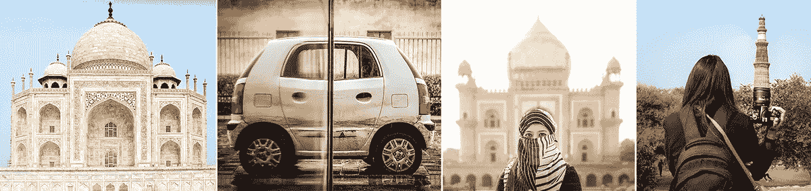

这是我系列的第一篇博客——使用计算机视觉和深度学习来增强摄影。

> 21 世纪创造价值的最佳方式是将创造力与技术相结合——史蒂夫·乔布斯

相机最近最大的进步来自人工智能，而不是传感器和镜头。在过去的几年里，技术使得摄影技术取得了惊人的进步。人工智能正在改变我们拍摄照片的方式和编辑照片的方式。

随着“计算机视觉”成为自动驾驶汽车等其他新技术的重要组成部分，人工智能在解释和理解我们图像的内容方面将变得越来越复杂。

作为一名热情的摄影师，我总是努力将手动任务自动化，以便我可以专注于创作创意内容。在这个项目中，我将讨论如何通过几个简单的步骤，使用您自己的图像创建和定制 word cloud。

**目标:使用 python 中的 word cloud 将照片转化为排版艺术。**

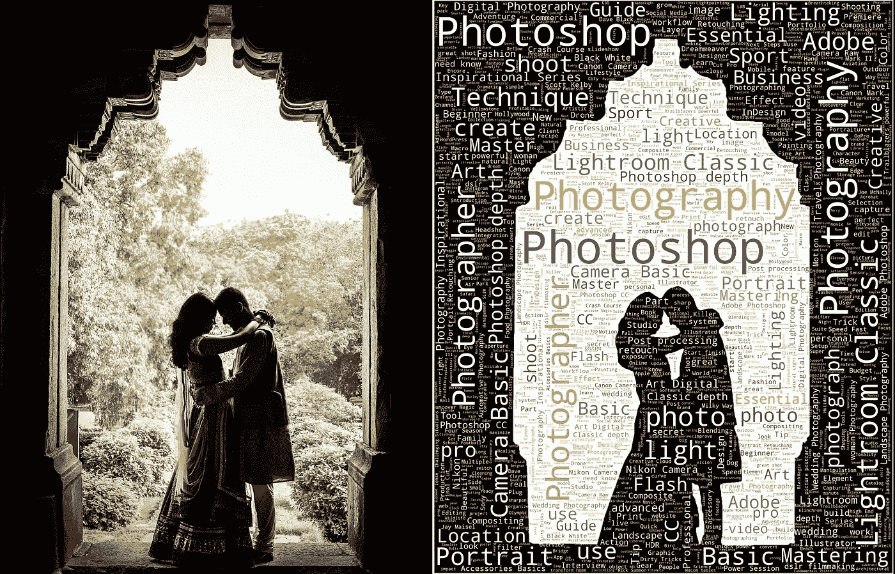

> 一张图胜过千言万语。字面意思！这张图有 2200+字。*😱*

字体设计:它是一种以视觉上吸引人的方式排列文字的艺术。它旨在引发特定的情感并传达特定的信息。

在某个时间点，人们实际上是把字母和字符放在物理空间中。在这个项目中，我将展示我们如何利用 python 中的 word cloud 的力量来使这种艺术形式可扩展，并在几分钟内创建它。

**单词云:**单词云是一种用于表示文本数据的数据可视化技术，其中每个单词的大小表示其频率或重要性。词云被广泛用于分析来自社交网络网站的数据以进行情感分析。

为了在 Python 中生成单词云，需要的模块有— matplotlib、OpenCV 和 word cloud。

以下是涉及的步骤:

1.相关数据收集(网络搜集)

2.数据清理和自然语言处理(NLP)

3.从图像创建遮罩并生成单词云

1.  **相关数据收集:**

在这个项目中，为了获得摄影领域最流行的单词列表，我从一个流行的摄影网站 KelbyOne 上删除了 836 个摄影课程标题(例如，高级人像编辑技术)。我使用 python 模块 Scrapy 从 70 页中删除了数据。这些课程从 2006 年开始上传。

**2。文本预处理:**

我使用 python 模块“Spacy”来执行自然语言处理(NLP)

*   ***标记化***

它是将字符串拆分成其组成标记的过程。这些标记可以是单词或标点符号。

课程名称:“什么是闪光？控制你的光线”

代币:["什么"，"那个"，"闪光"，"什么？"、“控制”、“你的”、“光”]

*   ***词汇化***

将 word 转换成其基本形式:

例如，像 reducing、reduces、reduced、reduction 这样的词将被转换为 reduce。

*   ***文字清理技巧:***

删除不必要的空格、标点符号、特殊字符(数字、表情符号等)。)和非字母符号(如 D750)

*   ***停用词***

出现频率极高且对句子没有多大意义的单词。

例如冠词(a，the 等)。)，be 动词(是，am 等。)、代词(他、她等。)

经过处理，我们在数据中总共有 3558 个单词和 1133 个唯一单词，数据中的所有单词都用于创建单词云。

在词云中，最频繁出现的词更突出(频率越高，字体越大)。

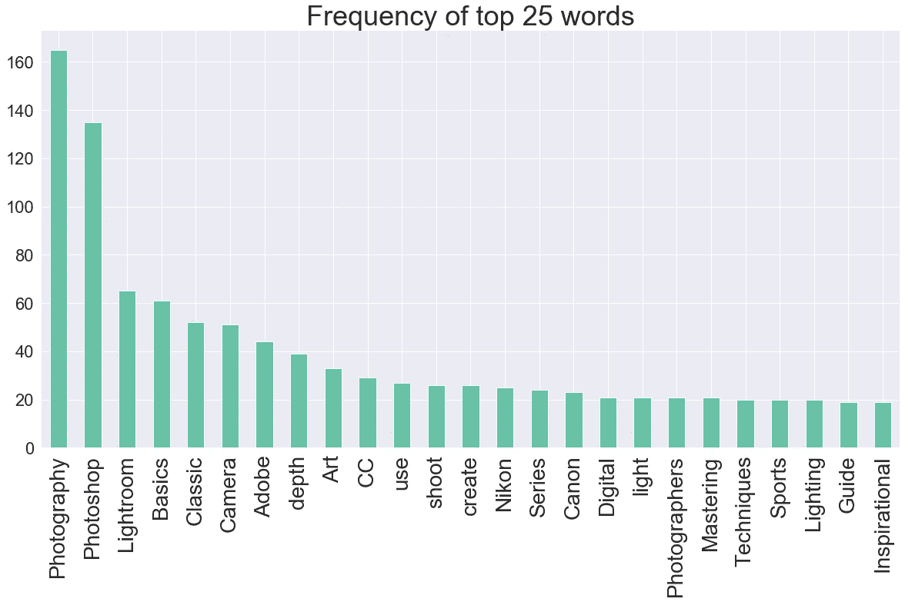

**3。从图像中创建遮罩并生成单词云**

我在 photoshop 中创建了两张图片的蒙版，并在每张蒙版中分别应用了文字云。文本填充蒙版的黑色部分。每个面具都充满了所有的 1100+独特的话。

**掩 1 字云:**

我让蒙版 1 的背景为黑色，文字为白色，以突出主体和纪念碑的拱门。

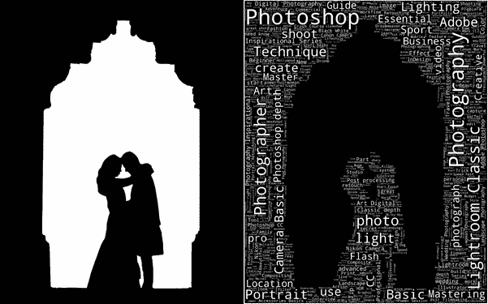

所有 3558 个单词的文本字符串(其中 1133 个单词是唯一的)在 wordcloud 函数中传递。

**代码片段:**

```
import cv2
from wordcloud import WordCloud 
import matplotlib.pyplot as plt**#White text Black Background**
image = cv2.imread("D:/Photography/Typography/mask1.jpg", 1)
wordcloud = WordCloud(background_color='**black**', mask=image,                    mode="RGB", color_func=lambda *args, **kwargs: "**white**", 
width=1000 , **max_words**=100, height=1000, **random_state**=1).generate(text)fig = plt.figure(figsize=(25,25))
plt.imshow(wordcloud, interpolation='**bilinear**')
plt.tight_layout(pad=0)
plt.axis("off")
plt.show()
```

我创建了多个单词云，并保存了最好的一个。更改参数' **random_state** '的值会生成不同的输出。

您还可以通过更改参数' **max_words** '的值来自定义单词云中的单词数。

参数'**插值=双线性**'用于使图像看起来更平滑。

**掩二字云:**

我为蒙版 2 保留了白色的背景和彩色的文字，以增加排版的细节和趣味。

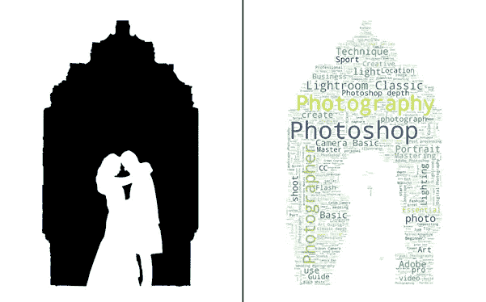

**代码片段:**

```
**#Colored text white Background**
image = cv2.imread("D:/Photography/Typography/mask2.jpg", 1)
wordcloud = WordCloud(background_color='**white**', mask=image, mode="RGB", **max_words**=1200, width=1000 , height=1000, random_state=2).generate(text)fig = plt.figure(figsize=(25,25))
plt.imshow(wordcloud, interpolation='**bilinear**')
plt.tight_layout(pad=0)
plt.axis("off")
plt.show()
```

我将每个单词云与掩码结合起来，得到了以下结果:

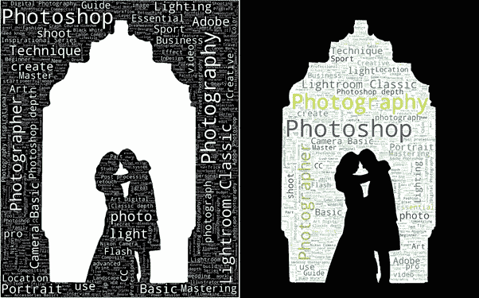

在 photoshop 中合并后的最终结果。

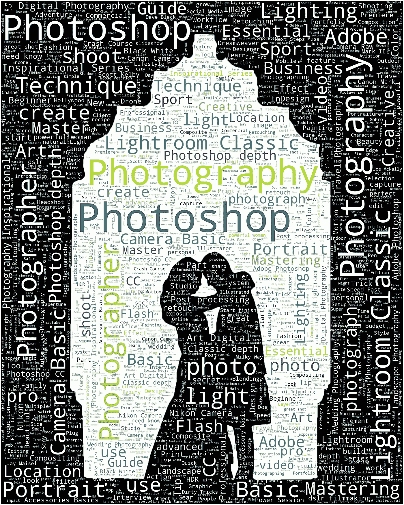

单词 cloud 可以以任何分辨率生成，这使得它非常适合在大尺寸上打印。我在探索如何将诗歌或故事中的词语按顺序插入，这样艺术会更有意义。在我随后的系列博客中，我将谈论艺术风格的转移，3D 图像修复，以及更多。

我在我的摄影作品中应用了这种技术，结果令人惊讶！

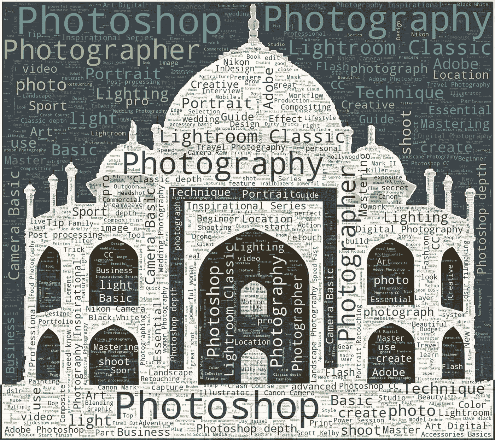

华泰！

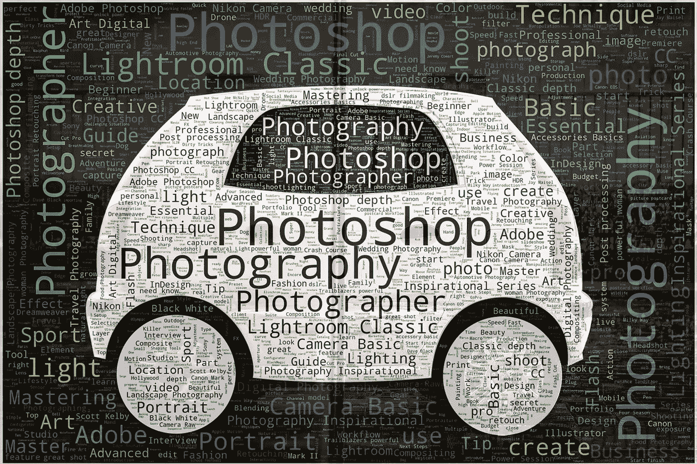

世界上最小的汽车😜

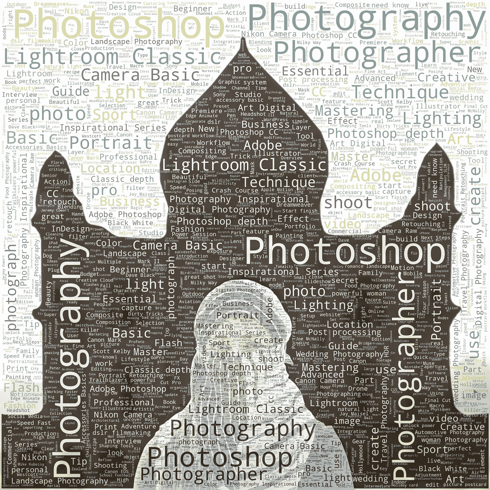

📸🧕🕌正确的视角让不可能成为可能✨

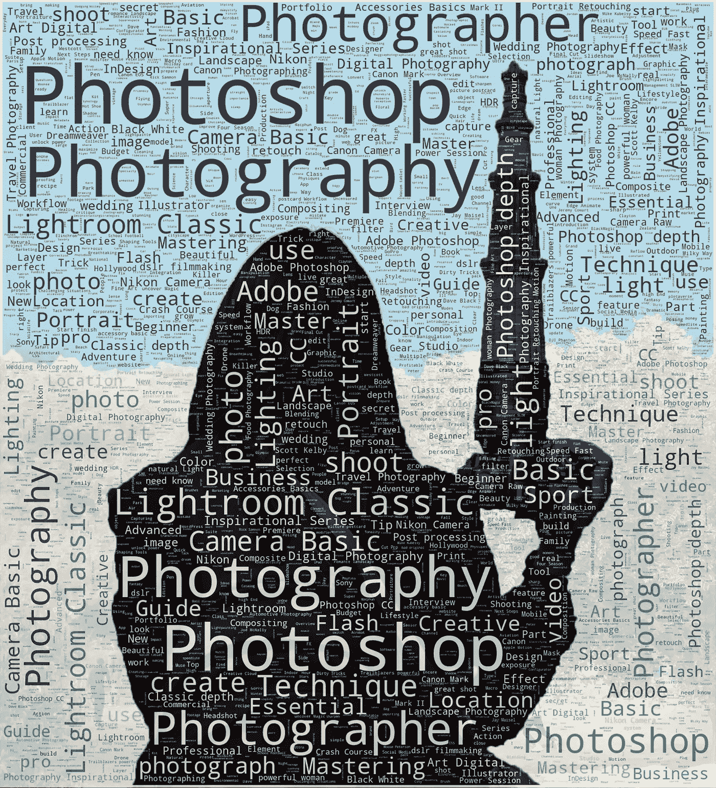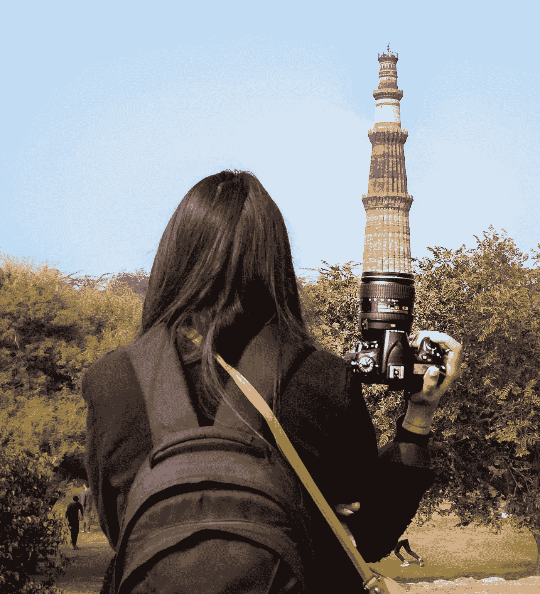

史上最长镜头！一个好的摄影师知道站在哪里——安塞尔·亚当斯

感谢您的阅读！我希望你喜欢这篇文章。如果你想了解我的文章，请跟我来。

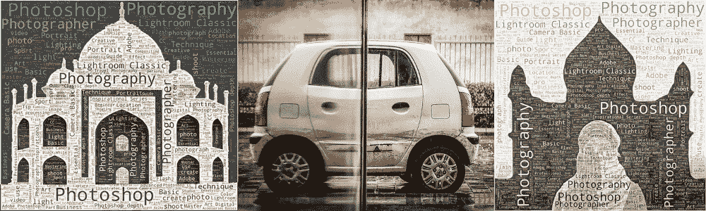

我已经分享了图片(我保留本文中使用的所有图片的权利，它们是由我拍摄的)和面具，以便您可以自己进行实验。

链接:[https://drive.google.com/open?id = 13 cf 8 vna 9 fc 0 vgeh 7h 9 zarxradgtjl 2 ou](https://drive.google.com/open?id=13cf8Vna9Fc0VgEh7H9ZarXRadgTJL2OU)

***阅读我的其他博客:***

[](/art-with-ai-turning-photographs-into-artwork-with-neural-style-transfer-8144ece44bed) [## 人工智能艺术:用神经风格转换将照片变成艺术品

### 有没有希望自己能像毕加索或梵高一样画画？

towardsdatascience.com](/art-with-ai-turning-photographs-into-artwork-with-neural-style-transfer-8144ece44bed) [](/country-wise-visual-analysis-of-music-taste-using-spotify-api-seaborn-in-python-77f5b749b421) [## 使用 Spotify API 和 Python 中的 Seaborn 对音乐品味进行国别可视化分析

### 你知道哪个国家喜欢欢快的音乐，哪个国家喜欢喧闹的音乐吗？

towardsdatascience.com](/country-wise-visual-analysis-of-music-taste-using-spotify-api-seaborn-in-python-77f5b749b421) 

参考资料:

[https://www . ka ggle . com/aa shita/word-clouds-of-variable-shapes](https://www.kaggle.com/aashita/word-clouds-of-various-shapes)

[https://www . data camp . com/community/tutorials/word cloud-python](https://www.datacamp.com/community/tutorials/wordcloud-python)

[https://www . plural sight . com/guides/natural-language-processing-visualizing-text-data-using-word-cloud](https://www.pluralsight.com/guides/natural-language-processing-visualizing-text-data-using-word-cloud)

[https://amueller.github.io/word_cloud/generated/wordcloud.WordCloud.html](https://amueller.github.io/word_cloud/generated/wordcloud.WordCloud.html)